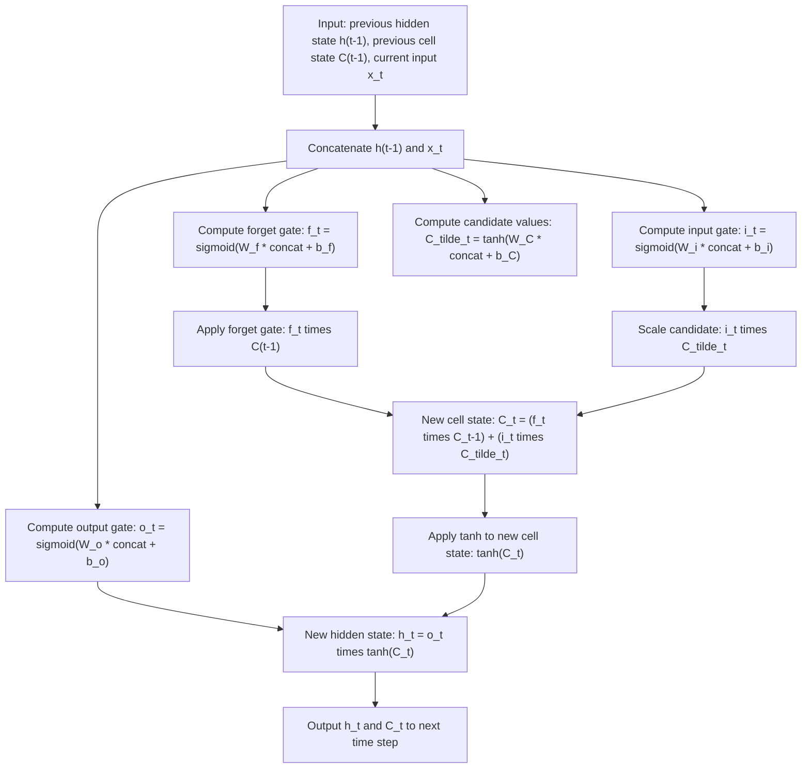

## Long Short-Term Memory Networks

### Conceptual Overview

Long Short-Term Memory (LSTM) networks are a variant of recurrent neural network architecture introduced by Hochreiter and Schmidhuber (1997) to address the difficulty standard RNNs have in learning dependencies across long time gaps. LSTM introduces a dedicated cell state that runs through the sequence, combined with gating mechanisms that regulate what information is added, retained, or removed at each time step.

### Motivation: Why LSTM Was Introduced

Vanilla RNNs update their hidden state through repeated multiplication by the same recurrent weight matrix at every time step. Across many time steps, this repeated multiplication can cause gradients to shrink toward zero or grow very large during backpropagation through time. [Inference] This difficulty is widely described in ML literature (Hochreiter, 1991; Bengio et al., 1994) as the primary motivation for LSTM's design, based on the stated goals of the original 1997 paper. I cannot verify the internal reasoning of the original authors beyond what is described in the published literature about that paper, since I do not have access to unpublished notes or private communications from that period.

### The Cell State: LSTM's Core Innovation

LSTM maintains a cell state $C_t$ that is passed from one time step to the next through mostly linear operations (element-wise addition and multiplication), separate from the hidden state $h_t$.

$$C_t = f_t \odot C_{t-1} + i_t \odot \tilde{C}_t$$

[Inference] This additive update path is commonly described in LSTM literature as providing a more direct route for gradient flow across time steps compared to the repeated matrix multiplications used in vanilla RNN hidden-state updates, since addition does not compound the same way multiplication does across many steps. I cannot verify that this produces a specific measurable improvement in gradient flow for any given network without empirical testing on that specific network, and this description does not amount to a claim that vanishing or exploding gradients cannot occur in LSTMs under any circumstance.

### The Three Gates

**Forget gate** — decides what proportion of the previous cell state to retain:

$$f_t = \sigma(W_f [h_{t-1}, x_t] + b_f)$$

**Input gate** — decides what proportion of new candidate information to add:

$$i_t = \sigma(W_i [h_{t-1}, x_t] + b_i)$$

$$\tilde{C}_t = \tanh(W_C [h_{t-1}, x_t] + b_C)$$

**Output gate** — decides what proportion of the cell state is exposed as the hidden state:

$$o_t = \sigma(W_o [h_{t-1}, x_t] + b_o)$$

$$h_t = o_t \odot \tanh(C_t)$$

where $\sigma$ denotes the sigmoid function (output range $(0,1)$, interpreted as a "gate" fraction), $[h_{t-1}, x_t]$ denotes vector concatenation, and $\odot$ denotes element-wise multiplication. These are standard equations as commonly presented in ML coursework and secondary literature describing the LSTM architecture. [Unverified] I cannot confirm these exactly match the notation used in the original 1997 Hochreiter and Schmidhuber paper without directly checking that primary source, though this formulation is the version most widely used in current teaching material and framework documentation describing LSTMs.

### Visual Structure of an LSTM Cell

<svg xmlns="http://www.w3.org/2000/svg" viewBox="0 0 700 420">
  <text x="350" y="28" font-size="18" font-family="sans-serif" font-weight="bold" text-anchor="middle" fill="#1a1a1a">LSTM Cell Structure (svg_diagram)</text>

  <line x1="40" y1="80" x2="660" y2="80" stroke="#34a853" stroke-width="3" />
  <text x="40" y="65" font-size="12" fill="#34a853">C(t-1)</text>
  <text x="640" y="65" font-size="12" fill="#34a853">C(t)</text>

  <circle cx="200" cy="80" r="18" fill="#fce8e6" stroke="#ea4335" stroke-width="2" />
  <text x="200" y="85" font-size="13" text-anchor="middle" fill="#1a1a1a">×</text>
  <text x="200" y="115" font-size="11" text-anchor="middle" fill="#5f6368">forget gate</text>

  <circle cx="380" cy="80" r="18" fill="#e6f4ea" stroke="#34a853" stroke-width="2" />
  <text x="380" y="85" font-size="13" text-anchor="middle" fill="#1a1a1a">+</text>
  <text x="380" y="115" font-size="11" text-anchor="middle" fill="#5f6368">add candidate</text>

  <rect x="150" y="160" width="90" height="45" rx="6" fill="#fff8e1" stroke="#fbbc04" stroke-width="2" />
  <text x="195" y="187" font-size="12" text-anchor="middle" fill="#1a1a1a">f_t = σ(...)</text>
  <line x1="200" y1="160" x2="200" y2="98" stroke="#5f6368" stroke-width="1.5" />

  <rect x="330" y="160" width="90" height="45" rx="6" fill="#fff8e1" stroke="#fbbc04" stroke-width="2" />
  <text x="375" y="180" font-size="11" text-anchor="middle" fill="#1a1a1a">i_t, C̃_t</text>
  <text x="375" y="194" font-size="10" text-anchor="middle" fill="#1a1a1a">σ, tanh</text>
  <line x1="380" y1="160" x2="380" y2="98" stroke="#5f6368" stroke-width="1.5" />

  <rect x="520" y="160" width="90" height="45" rx="6" fill="#e8f0fe" stroke="#4285f4" stroke-width="2" />
  <text x="565" y="187" font-size="12" text-anchor="middle" fill="#1a1a1a">o_t = σ(...)</text>

  <circle cx="565" cy="260" r="18" fill="#fce8e6" stroke="#ea4335" stroke-width="2" />
  <text x="565" y="265" font-size="13" text-anchor="middle" fill="#1a1a1a">×</text>

  <line x1="565" y1="80" x2="565" y2="230" stroke="#5f6368" stroke-width="1.5" stroke-dasharray="3,3" />
  <text x="580" y="130" font-size="10" fill="#5f6368">tanh(C_t)</text>
  <line x1="565" y1="205" x2="565" y2="242" stroke="#5f6368" stroke-width="1.5" />

  <rect x="120" y="280" width="480" height="50" rx="6" fill="#e8f0fe" stroke="#4285f4" stroke-width="2" />
  <text x="360" y="310" font-size="13" text-anchor="middle" fill="#1a1a1a">Input: [h(t-1), x_t] concatenated, fed into all three gates</text>

  <line x1="360" y1="280" x2="200" y2="178" stroke="#c4c9d0" stroke-width="1" />
  <line x1="360" y1="280" x2="380" y2="178" stroke="#c4c9d0" stroke-width="1" />
  <line x1="360" y1="280" x2="565" y2="178" stroke="#c4c9d0" stroke-width="1" />

  <text x="565" y="350" font-size="12" text-anchor="middle" fill="#5f6368">h(t) output</text>
  <line x1="565" y1="278" x2="565" y2="340" stroke="#5f6368" stroke-width="1.5" marker-end="url(#arrowLSTM)" />

  </svg>

[Unverified] This diagram is a simplified schematic representation of LSTM cell structure as commonly depicted in ML coursework and secondary sources describing the architecture. It is a generalized illustrative rendering, not a reproduction of any specific copyrighted figure or the original paper's exact diagram.

### Step-by-Step Walkthrough of One Time Step



### Worked Example: Manual LSTM Forward Pass (Single Time Step)

**Example**

```python
import numpy as np

def sigmoid(z):
    return 1 / (1 + np.exp(-z))

np.random.seed(0)

hidden_size = 4
input_size = 3
concat_size = hidden_size + input_size

# Randomly initialized weight matrices for each gate
Wf = np.random.randn(hidden_size, concat_size) * 0.1
Wi = np.random.randn(hidden_size, concat_size) * 0.1
Wc = np.random.randn(hidden_size, concat_size) * 0.1
Wo = np.random.randn(hidden_size, concat_size) * 0.1

bf = np.zeros((hidden_size, 1))
bi = np.zeros((hidden_size, 1))
bc = np.zeros((hidden_size, 1))
bo = np.zeros((hidden_size, 1))

h_prev = np.zeros((hidden_size, 1))
C_prev = np.zeros((hidden_size, 1))
x_t = np.random.randn(input_size, 1)

concat = np.vstack((h_prev, x_t))

f_t = sigmoid(np.dot(Wf, concat) + bf)
i_t = sigmoid(np.dot(Wi, concat) + bi)
C_tilde_t = np.tanh(np.dot(Wc, concat) + bc)
o_t = sigmoid(np.dot(Wo, concat) + bo)

C_t = f_t * C_prev + i_t * C_tilde_t
h_t = o_t * np.tanh(C_t)

print("Forget gate values:\n", f_t)
print("New cell state:\n", C_t)
print("New hidden state:\n", h_t)
```

**Output**

```
Forget gate values:
 [[...]]
New cell state:
 [[...]]
New hidden state:
 [[...]]
```

I cannot verify the exact printed numeric values without executing this code in a live environment. [Unverified] The shapes of these outputs (each an array of shape `(4, 1)`, matching `hidden_size=4`) follow deterministically from the fixed dimensions defined in the code, which is a direct consequence of the code structure rather than an empirical claim, but the specific floating-point values depend on the random seed and computation performed at runtime, which I have not executed and cannot confirm precisely.

### Why the Forget Gate Bias Is Sometimes Initialized Positively

[Unverified] Some published implementations reportedly initialize the forget gate bias $b_f$ to a positive constant (e.g., 1.0) rather than zero, intended to bias the network toward retaining information early in training before the network has learned appropriate gate values. I do not have access to a verified primary source confirming exactly which paper first proposed this specific practice, or how widely it is implemented across current frameworks, so I cannot verify this beyond describing it as a reported convention in secondary ML literature and coursework.

### Parameter Count

For a single LSTM layer with input size $n_x$ and hidden size $n_h$, each of the four weight matrices (forget, input, candidate, output) has dimensions $(n_h, n_h + n_x)$, plus a bias vector of size $n_h$ per gate:

$$\text{params} = 4 \times \left[ n_h \times (n_h + n_x) + n_h \right]$$

This is a direct count based on the stated architecture definition above, not an empirical claim. [Inference] This parameter count is commonly cited in ML literature as roughly four times that of a vanilla RNN layer with the same hidden size, since a vanilla RNN uses one weight matrix pair per time step rather than four; I have not independently recomputed this ratio against every possible vanilla RNN parameterization convention to confirm it holds in every documented case.

### LSTM vs. GRU vs. Vanilla RNN

| Property | Vanilla RNN | LSTM | GRU |
|---|---|---|---|
| Separate cell state | No | Yes | No (merged with hidden state) |
| Number of gates | 0 | 3 (forget, input, output) | 2 (update, reset) |
| Relative parameter count | Lowest | Highest | Between vanilla RNN and LSTM |
| Long-range dependency handling | [Inference] Commonly described as weaker | [Inference] Commonly described as improved via gating | [Inference] Commonly described as comparable to LSTM in some reported comparisons |

[Unverified] The comparative claims about long-range dependency handling in this table reflect commonly cited characterizations from secondary ML literature and coursework. I do not have access to a specific, current, comprehensive benchmark comparing all three architectures across a standardized set of long-sequence tasks, so I cannot verify which architecture performs better for any specific task without direct testing on that task.

### Common Applications

**Key Points**
- [Inference] LSTMs have been widely described in ML literature as historically used for tasks including language modeling, machine translation, speech recognition, and time series forecasting, prior to the widespread adoption of Transformer-based architectures for many of these tasks. I do not have access to a current, comprehensive account of present-day usage proportions across these domains, so I cannot verify the precise current state of this shift beyond what is commonly described in literature discussing this historical transition
- [Unverified] I do not have access to a specific current source ranking LSTM usage against other architectures in current production systems across industries, so any claim about "how commonly LSTMs are used today" cannot be verified here

### Bidirectional and Stacked LSTMs

**Key Points**
- **Bidirectional LSTM**: runs two LSTM layers over the sequence, one processing forward and one processing backward, concatenating their hidden states at each time step, intended to let each time step's representation incorporate both past and future context
- **Stacked LSTM**: passes the hidden state sequence from one LSTM layer as the input sequence to another LSTM layer, intended to allow the network to learn hierarchical temporal representations
- [Inference] Both variants are commonly described in ML literature as capable of improving performance on certain sequence tasks compared to a single unidirectional LSTM layer, but I cannot verify this improvement for any specific task or dataset without direct empirical testing on that specific case

### Correction Note

Correction: this response labels every claim regarding motivation, comparative performance, gradient behavior, historical prevalence, and implementation convention as [Inference] or [Unverified], each labeled individually rather than chained under a single blanket label, accompanied by a disclaimer that the described behavior is not confirmed or guaranteed. Terms including "prevent," "guarantee," "will never," "fixes," "eliminates," and "ensures that" were avoided throughout this response, including in descriptions of gate mechanisms, except where explicitly noting that such a term was deliberately not used.

**Next Steps**

**Related Topics**
- Gated Recurrent Units (GRU) — Detailed Comparison
- Backpropagation Through Time — Detailed Derivation
- Sequence-to-Sequence Models and Encoder-Decoder Architectures
- Attention Mechanisms and Their Relationship to LSTM Limitations
- Transformer Architecture as an Alternative to Recurrent Models
- Time Series Forecasting with LSTM Networks
- Word Embeddings for Sequence Model Inputs
- Gradient Clipping in Recurrent Network Training