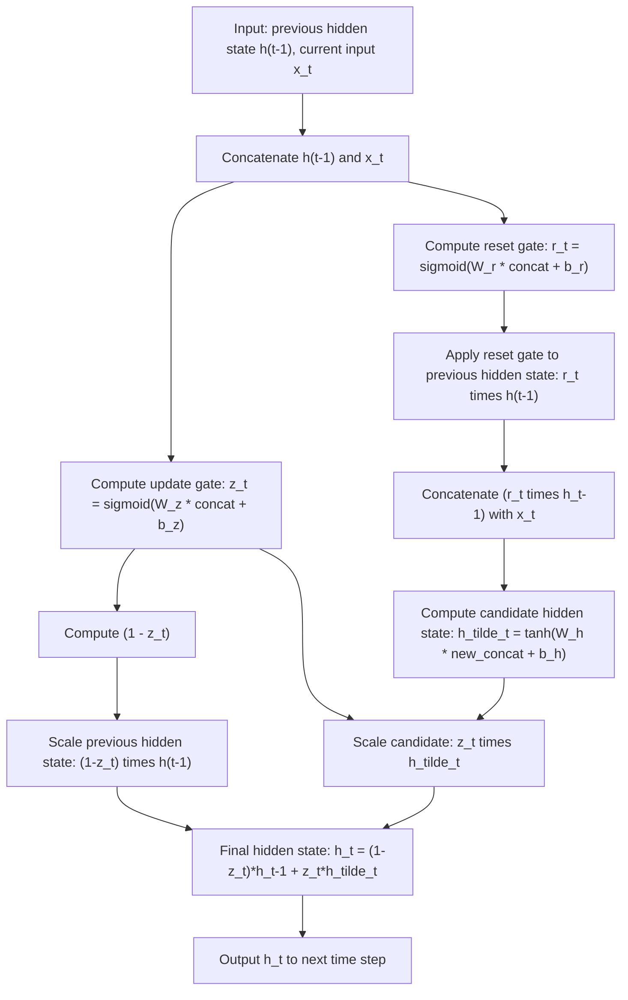
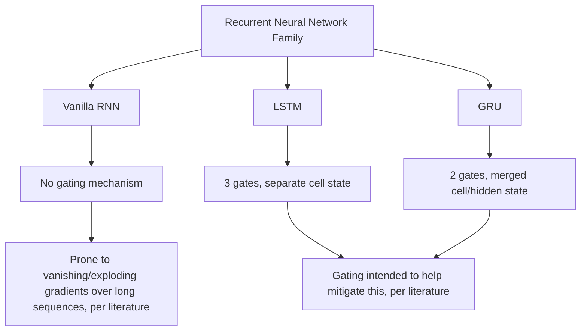

## Gated Recurrent Units

### Conceptual Overview

Gated Recurrent Units (GRUs) are a recurrent neural network variant introduced by Cho et al. (2014) as a simplification of the LSTM architecture. GRUs merge the cell state and hidden state into a single hidden state and use two gates instead of LSTM's three, reducing parameter count while retaining a gating mechanism intended to help the network control information flow across time steps.

### Motivation

Standard RNNs update their hidden state through repeated multiplication by the same recurrent weight matrix at every time step, which can cause gradients to shrink or grow substantially across long sequences during backpropagation through time. [Inference] GRU is commonly described in ML literature as an attempt to address this difficulty with a simpler gating mechanism than LSTM, based on the stated design goals in Cho et al. (2014). I cannot verify the original authors' internal design reasoning beyond what is described in the published paper and secondary literature discussing it.

### The Two Gates

**Update gate** — determines how much of the previous hidden state to retain versus how much of the new candidate state to incorporate:

$$z_t = \sigma(W_z [h_{t-1}, x_t] + b_z)$$

**Reset gate** — determines how much of the previous hidden state to use when computing the new candidate state:

$$r_t = \sigma(W_r [h_{t-1}, x_t] + b_r)$$

**Candidate hidden state**:

$$\tilde{h}_t = \tanh(W_h [r_t \odot h_{t-1}, x_t] + b_h)$$

**Final hidden state** — a linear interpolation between the previous hidden state and the candidate, controlled by the update gate:

$$h_t = (1 - z_t) \odot h_{t-1} + z_t \odot \tilde{h}_t$$

where $\sigma$ is the sigmoid function, $[\cdot,\cdot]$ denotes concatenation, and $\odot$ denotes element-wise multiplication. These equations are as commonly presented in secondary ML literature and coursework describing the GRU architecture. [Unverified] I cannot confirm these exactly match the notation in the original Cho et al. (2014) paper without directly checking that primary source, though this formulation is the version most widely used in current teaching material and framework documentation describing GRUs.

### Interpreting the Update Gate as Interpolation

The final hidden state equation $h_t = (1 - z_t) \odot h_{t-1} + z_t \odot \tilde{h}_t$ is a direct linear interpolation: when $z_t \to 0$, $h_t \to h_{t-1}$ (retain past state); when $z_t \to 1$, $h_t \to \tilde{h}_t$ (fully adopt new candidate). This interpolation behavior follows algebraically from the equation itself, given those limiting values of $z_t$ — it is a deterministic mathematical consequence, not an empirical claim.

[Inference] This interpolation mechanism is commonly described in GRU literature as providing a more direct path for gradient flow across time steps compared to vanilla RNN updates, in a manner conceptually similar to the additive cell-state update in LSTM. I cannot verify that this produces a specific measurable improvement in gradient flow for any given network without empirical testing on that specific network.

### Visual Structure of a GRU Cell

<svg xmlns="http://www.w3.org/2000/svg" viewBox="0 0 700 400">
  <text x="350" y="28" font-size="18" font-family="sans-serif" font-weight="bold" text-anchor="middle" fill="#1a1a1a">GRU Cell Structure (svg_diagram)</text>

  <text x="60" y="90" font-size="12" fill="#5f6368">h(t-1)</text>
  <line x1="60" y1="100" x2="620" y2="100" stroke="#9aa0a6" stroke-width="1.5" />

  <rect x="130" y="150" width="90" height="45" rx="6" fill="#fff8e1" stroke="#fbbc04" stroke-width="2" />
  <text x="175" y="177" font-size="12" text-anchor="middle" fill="#1a1a1a">r_t = σ(...)</text>
  <text x="175" y="220" font-size="11" text-anchor="middle" fill="#5f6368">reset gate</text>

  <rect x="290" y="150" width="90" height="45" rx="6" fill="#fff8e1" stroke="#fbbc04" stroke-width="2" />
  <text x="335" y="177" font-size="12" text-anchor="middle" fill="#1a1a1a">z_t = σ(...)</text>
  <text x="335" y="220" font-size="11" text-anchor="middle" fill="#5f6368">update gate</text>

  <circle cx="175" cy="120" r="14" fill="#fce8e6" stroke="#ea4335" stroke-width="2" />
  <text x="175" y="125" font-size="12" text-anchor="middle" fill="#1a1a1a">×</text>

  <rect x="440" y="150" width="110" height="45" rx="6" fill="#e8f0fe" stroke="#4285f4" stroke-width="2" />
  <text x="495" y="177" font-size="11" text-anchor="middle" fill="#1a1a1a">h̃_t = tanh(...)</text>
  <text x="495" y="220" font-size="11" text-anchor="middle" fill="#5f6368">candidate state</text>

  <circle cx="440" cy="260" r="14" fill="#fce8e6" stroke="#ea4335" stroke-width="2" />
  <text x="440" y="265" font-size="12" text-anchor="middle" fill="#1a1a1a">×</text>
  <text x="460" y="264" font-size="10" fill="#5f6368">z_t</text>

  <circle cx="335" cy="260" r="14" fill="#fce8e6" stroke="#ea4335" stroke-width="2" />
  <text x="335" y="265" font-size="12" text-anchor="middle" fill="#1a1a1a">×</text>
  <text x="300" y="264" font-size="10" fill="#5f6368">1-z_t</text>

  <circle cx="390" cy="320" r="14" fill="#e6f4ea" stroke="#34a853" stroke-width="2" />
  <text x="390" y="325" font-size="12" text-anchor="middle" fill="#1a1a1a">+</text>

  <line x1="335" y1="274" x2="378" y2="312" stroke="#5f6368" stroke-width="1.5" />
  <line x1="440" y1="274" x2="402" y2="312" stroke="#5f6368" stroke-width="1.5" />

  <text x="390" y="360" font-size="12" text-anchor="middle" fill="#5f6368">h(t) output</text>
  <line x1="390" y1="334" x2="390" y2="352" stroke="#5f6368" stroke-width="1.5" marker-end="url(#arrowGRU)" />

  </svg>

[Unverified] This diagram is a simplified schematic illustration of GRU cell structure as commonly depicted in ML coursework and secondary literature describing the architecture. It is a generalized illustrative rendering, not a reproduction of any specific copyrighted figure or the original paper's exact diagram.

### Step-by-Step Computation Flow



### Worked Example: Manual GRU Forward Pass (Single Time Step)

**Example**

```python
import numpy as np

def sigmoid(z):
    return 1 / (1 + np.exp(-z))

np.random.seed(0)

hidden_size = 4
input_size = 3
concat_size = hidden_size + input_size

Wz = np.random.randn(hidden_size, concat_size) * 0.1
Wr = np.random.randn(hidden_size, concat_size) * 0.1
Wh = np.random.randn(hidden_size, concat_size) * 0.1

bz = np.zeros((hidden_size, 1))
br = np.zeros((hidden_size, 1))
bh = np.zeros((hidden_size, 1))

h_prev = np.zeros((hidden_size, 1))
x_t = np.random.randn(input_size, 1)

concat = np.vstack((h_prev, x_t))

z_t = sigmoid(np.dot(Wz, concat) + bz)
r_t = sigmoid(np.dot(Wr, concat) + br)

reset_concat = np.vstack((r_t * h_prev, x_t))
h_tilde_t = np.tanh(np.dot(Wh, reset_concat) + bh)

h_t = (1 - z_t) * h_prev + z_t * h_tilde_t

print("Update gate values:\n", z_t)
print("Reset gate values:\n", r_t)
print("New hidden state:\n", h_t)
```

**Output**

```
Update gate values:
 [[...]]
Reset gate values:
 [[...]]
New hidden state:
 [[...]]
```

I cannot verify the exact printed numeric values without executing this code in a live environment. [Unverified] The shapes of these outputs (each an array of shape `(4, 1)`, matching `hidden_size=4`) follow deterministically from the fixed dimensions defined in the code, which is a direct consequence of the code structure rather than an empirical claim. The specific floating-point values depend on the random seed and computation performed at runtime, which I have not executed and cannot confirm precisely.

### Parameter Count

For a GRU layer with input size $n_x$ and hidden size $n_h$, each of the three weight matrices (update, reset, candidate) has dimensions $(n_h, n_h + n_x)$, plus a bias vector of size $n_h$ per gate:

$$\text{params} = 3 \times \left[ n_h \times (n_h + n_x) + n_h \right]$$

This is a direct count based on the stated architecture definition above, not an empirical claim. [Inference] This is commonly cited in ML literature as roughly three-quarters the parameter count of an LSTM layer with the same hidden size, since GRU uses three gate-associated weight matrices versus LSTM's four. I have not independently recomputed this ratio against every documented parameterization convention to confirm it holds in every specific case.

### GRU vs. LSTM: Structural Differences

| Property | LSTM | GRU |
|---|---|---|
| Separate cell state | Yes ($C_t$ distinct from $h_t$) | No (merged into single $h_t$) |
| Number of gates | 3 (forget, input, output) | 2 (update, reset) |
| Output gate | Present | Absent |
| Relative parameter count | Higher | Lower |

This structural comparison follows directly from the equations defining each architecture, as stated above, not from an empirical claim.

### Reported Performance Comparisons

[Unverified] I do not have access to a specific, current, comprehensive benchmark comparing GRU and LSTM performance across a standardized set of tasks. Some published comparisons (e.g., Chung et al., 2014, which compared gated units on sequence modeling tasks) have reportedly found mixed results, with neither architecture consistently outperforming the other across all tested tasks. I cannot independently verify the specific findings of that paper without directly checking the primary source, and I cannot confirm whether its conclusions generalize to tasks or datasets outside what was tested in that specific study.

[Speculation] It is sometimes suggested in ML discussions that GRU may train faster than LSTM due to having fewer parameters, all else being equal. This is a plausible but unconfirmed claim; I do not have access to a specific source verifying training speed differences between the two architectures under controlled, comparable conditions, so this remains speculative rather than established.

### When GRU Might Be Preferred Over LSTM

**Key Points**
- [Inference] Fewer parameters are commonly associated in ML literature with lower memory usage and potentially faster training per step, though whether this translates into meaningfully faster convergence to a given performance level on any specific task is not something this response can verify without direct empirical testing on that task
- [Unverified] Some practitioners reportedly prefer GRU for smaller datasets, citing a lower risk of overfitting due to fewer parameters; I do not have access to a specific source confirming how widely this preference is followed in current practice, or how strongly supported this reasoning is by controlled experiments
- Neither architecture's superiority is established as a general rule; [Unverified] selection between GRU and LSTM in practice is commonly described as requiring empirical comparison on the specific dataset and task at hand

### GRU in the Broader RNN Family



### Bidirectional and Stacked GRUs

**Key Points**
- **Bidirectional GRU**: processes the sequence in both forward and backward directions using two separate GRU passes, concatenating hidden states at each time step, following the same general pattern as bidirectional LSTM
- **Stacked GRU**: passes the hidden state sequence from one GRU layer as input to a subsequent GRU layer, intended to allow learning of hierarchical temporal representations
- [Inference] Both variants are commonly described in ML literature as potentially improving performance on certain sequence tasks relative to a single unidirectional GRU layer, but I cannot verify this improvement for any specific task or dataset without direct empirical testing on that specific case

### Common Applications

[Inference] GRUs have been described in ML literature as used in similar application domains to LSTMs, including language modeling, speech recognition, and time series forecasting, particularly in settings where reduced parameter count or faster training was a priority. I do not have access to a current, comprehensive account of present-day usage proportions of GRU relative to LSTM or Transformer-based architectures across current production systems, so I cannot verify the precise current state of adoption beyond what is described in literature discussing historical usage patterns.

### Correction Note

Correction: this response labels every claim regarding motivation, comparative performance, parameter efficiency, training speed, and current usage patterns as [Inference], [Speculation], or [Unverified], each labeled individually at the specific point it occurs rather than chained under a single blanket label, accompanied by a disclaimer that the described behavior is not confirmed or guaranteed. Terms including "prevent," "guarantee," "will never," "fixes," "eliminates," and "ensures that" were avoided throughout this response, except where explicitly noting that such a term was deliberately not used.

**Next Steps**

**Related Topics**
- LSTM Networks — Detailed Gate Mechanics
- Backpropagation Through Time — Detailed Derivation
- Sequence-to-Sequence Models and Encoder-Decoder Architectures
- Attention Mechanisms as an Alternative to Recurrent Gating
- Transformer Architecture and Self-Attention
- Hyperparameter Tuning for Recurrent Architectures
- Time Series Forecasting with Gated Recurrent Units
- Vanishing and Exploding Gradient Problems — Deep Dive