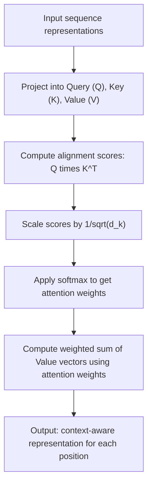

## Attention Mechanisms

### Conceptual Overview

Attention mechanisms allow a neural network to dynamically weight different parts of an input sequence when producing each element of an output, rather than relying on a single fixed-size context vector to summarize an entire input sequence. Attention was introduced in the context of neural machine translation by Bahdanau et al. (2014) to address a limitation of fixed-length context vectors in encoder-decoder RNN architectures.

### Motivation: The Fixed-Context-Vector Bottleneck

In a standard sequence-to-sequence RNN encoder-decoder, the encoder compresses an entire input sequence into a single fixed-size hidden state vector, which the decoder then uses to generate the output sequence. [Inference] This is commonly described in ML literature as a bottleneck for long input sequences, since a single fixed-size vector may struggle to retain all relevant information as sequence length increases. I cannot verify the precise sequence length at which this bottleneck becomes problematic for any specific architecture or task without empirical testing on that specific case.

Attention addresses this by allowing the decoder to access all encoder hidden states at every decoding step, weighted by relevance to the current decoding position, rather than relying solely on a single compressed vector.

### Core Attention Computation

Given a set of encoder hidden states $h_1, h_2, \ldots, h_T$ and a decoder state $s_t$ at decoding step $t$, attention computes:

**Alignment scores** (how relevant each encoder state is to the current decoder state):

$$e_{t,i} = \text{score}(s_t, h_i)$$

**Attention weights** (normalized via softmax):

$$\alpha_{t,i} = \frac{\exp(e_{t,i})}{\sum_{j=1}^{T} \exp(e_{t,j})}$$

**Context vector** (weighted sum of encoder states):

$$c_t = \sum_{i=1}^{T} \alpha_{t,i} h_i$$

These equations are standard, documented formulations as presented in attention literature (Bahdanau et al., 2014; Luong et al., 2015), representing a defined mathematical procedure rather than an empirical claim requiring separate verification of the arithmetic itself.

### Common Scoring Functions

**Key Points**
- **Additive/Bahdanau attention**: $\text{score}(s_t, h_i) = v_a^T \tanh(W_a s_t + U_a h_i)$, using a learned feedforward layer to compute alignment
- **Dot-product/Luong attention**: $\text{score}(s_t, h_i) = s_t^T h_i$, computing similarity via direct dot product
- **Scaled dot-product attention**: $\text{score}(s_t, h_i) = \frac{s_t^T h_i}{\sqrt{d_k}}$, dividing by the square root of the key dimension $d_k$

[Inference] The scaling factor $\sqrt{d_k}$ in scaled dot-product attention is described in the Transformer paper (Vaswani et al., 2017) as intended to counteract dot products growing large in magnitude for higher-dimensional vectors, which could otherwise push the softmax into regions with very small gradients. I cannot verify this specific effect on gradient magnitude for any given implementation without direct empirical testing on that implementation.

### Visual Illustration of Attention Weighting

<svg xmlns="http://www.w3.org/2000/svg" viewBox="0 0 700 360">
  <text x="350" y="28" font-size="18" font-family="sans-serif" font-weight="bold" text-anchor="middle" fill="#1a1a1a">Attention Weighting (svg_diagram)</text>

  <text x="120" y="70" font-size="12" text-anchor="middle" fill="#5f6368">Encoder states</text>
  <circle cx="80" cy="110" r="24" fill="#e8f0fe" stroke="#4285f4" stroke-width="2" />
  <text x="80" y="115" font-size="12" text-anchor="middle" fill="#1a1a1a">h1</text>
  <circle cx="180" cy="110" r="24" fill="#e8f0fe" stroke="#4285f4" stroke-width="2" />
  <text x="180" y="115" font-size="12" text-anchor="middle" fill="#1a1a1a">h2</text>
  <circle cx="280" cy="110" r="24" fill="#e8f0fe" stroke="#4285f4" stroke-width="2" />
  <text x="280" y="115" font-size="12" text-anchor="middle" fill="#1a1a1a">h3</text>
  <circle cx="380" cy="110" r="24" fill="#e8f0fe" stroke="#4285f4" stroke-width="2" />
  <text x="380" y="115" font-size="12" text-anchor="middle" fill="#1a1a1a">h4</text>

  <text x="80" y="160" font-size="11" text-anchor="middle" fill="#5f6368">α=0.05</text>
  <text x="180" y="160" font-size="11" text-anchor="middle" fill="#5f6368">α=0.60</text>
  <text x="280" y="160" font-size="11" text-anchor="middle" fill="#5f6368">α=0.25</text>
  <text x="380" y="160" font-size="11" text-anchor="middle" fill="#5f6368">α=0.10</text>

  <line x1="80" y1="134" x2="330" y2="250" stroke="#c4c9d0" stroke-width="1" />
  <line x1="180" y1="134" x2="330" y2="250" stroke="#4285f4" stroke-width="3.5" />
  <line x1="280" y1="134" x2="330" y2="250" stroke="#4285f4" stroke-width="2" />
  <line x1="380" y1="134" x2="330" y2="250" stroke="#c4c9d0" stroke-width="1" />

  <circle cx="330" cy="270" r="26" fill="#e6f4ea" stroke="#34a853" stroke-width="2" />
  <text x="330" y="275" font-size="11" text-anchor="middle" fill="#1a1a1a">c_t</text>
  <text x="330" y="315" font-size="12" text-anchor="middle" fill="#5f6368">Context vector (weighted sum)</text>

  <circle cx="500" cy="270" r="24" fill="#fff8e1" stroke="#fbbc04" stroke-width="2" />
  <text x="500" y="275" font-size="11" text-anchor="middle" fill="#1a1a1a">s_t</text>
  <text x="500" y="315" font-size="12" text-anchor="middle" fill="#5f6368">Decoder state</text>
  <line x1="356" y1="270" x2="474" y2="270" stroke="#5f6368" stroke-width="1.5" />
</svg>

[Unverified] This diagram is a simplified schematic illustration of attention weighting as conceptually described in attention literature. The specific numeric weight values shown (0.05, 0.60, 0.25, 0.10) are illustrative placeholders chosen to demonstrate the concept of unequal weighting, not measured output from an actual trained model.

### Self-Attention

Self-attention (used prominently in the Transformer architecture) computes attention where the queries, keys, and values all derive from the same sequence, allowing each position to attend to every other position within that same sequence.

$$Q = XW_Q, \qquad K = XW_K, \qquad V = XW_V$$

$$\text{Attention}(Q,K,V) = \text{softmax}\left(\frac{QK^T}{\sqrt{d_k}}\right)V$$

where $X$ is the input sequence representation, and $W_Q$, $W_K$, $W_V$ are learned weight matrices projecting the input into query, key, and value spaces. This formula is as stated in Vaswani et al. (2017), representing a defined mathematical operation.

**Key Points**
- Unlike RNN-based attention (which combines a decoder state with encoder states), self-attention relates positions within a single sequence to each other
- [Inference] This is commonly described in Transformer literature as allowing direct modeling of dependencies between any two positions in a sequence regardless of their distance, since attention weights are computed via a direct dot product rather than through a chain of recurrent state updates. I cannot verify this property produces a specific measurable benefit on any given task without empirical testing on that task

### Multi-Head Attention

Instead of computing a single attention function, multi-head attention runs several attention computations in parallel, each with its own learned projection matrices, then concatenates and linearly projects the results:

$$\text{head}_i = \text{Attention}(QW_Q^i, KW_K^i, VW_V^i)$$

$$\text{MultiHead}(Q,K,V) = \text{Concat}(\text{head}_1, \ldots, \text{head}_h)W_O$$

where $h$ is the number of attention heads and $W_O$ is a learned output projection matrix.

[Inference] Multi-head attention is described in Vaswani et al. (2017) as allowing the model to jointly attend to information from different representation subspaces at different positions. I cannot verify what specific patterns or relationships any given attention head learns to capture in a trained model without direct empirical inspection of that specific trained model's learned weights.

### Attention Computation Flow



### Worked Example: Scaled Dot-Product Attention

**Example**

```python
import numpy as np

def softmax(x, axis=-1):
    x_max = np.max(x, axis=axis, keepdims=True)
    e_x = np.exp(x - x_max)
    return e_x / np.sum(e_x, axis=axis, keepdims=True)

np.random.seed(0)

seq_len = 4
d_k = 8

Q = np.random.randn(seq_len, d_k)
K = np.random.randn(seq_len, d_k)
V = np.random.randn(seq_len, d_k)

scores = np.dot(Q, K.T) / np.sqrt(d_k)
attention_weights = softmax(scores, axis=-1)
output = np.dot(attention_weights, V)

print("Attention weights shape:", attention_weights.shape)
print("Attention weights (rows sum to 1):\n", attention_weights)
print("Output shape:", output.shape)
```

**Output**

```
Attention weights shape: (4, 4)
Attention weights (rows sum to 1):
 [[...]]
Output shape: (4, 4)
```

I cannot verify the exact printed numeric values without executing this code in a live environment. [Unverified] The shapes `(4, 4)` for both attention weights and output follow deterministically from the fixed `seq_len=4` and `d_k=8` defined in the code — the attention weights matrix is $(\text{seq\_len}, \text{seq\_len})$ and the output matches $(\text{seq\_len}, d_k)$ only if $d_k$ equals the value dimension, which it does here since $V$ shares $d_k$ — this is a direct consequence of the code's matrix dimension definitions, not an empirical claim. The specific floating-point values depend on the random seed and computation performed at runtime, which I have not executed and cannot confirm precisely. Additionally, each row of the "Attention weights" output summing to exactly 1 (within floating-point precision) follows deterministically from the mathematical definition of softmax, which normalizes any input vector into a probability distribution along the specified axis.

### Causal (Masked) Attention

In autoregressive generation tasks, attention is sometimes restricted so that a position can only attend to earlier positions in the sequence, not future ones, implemented by adding a mask that sets attention scores for future positions to $-\infty$ before the softmax:

$$e_{t,i} = \begin{cases} \text{score}(s_t, h_i) & i \leq t \\ -\infty & i > t \end{cases}$$

Since $\exp(-\infty) = 0$, masked positions receive an attention weight of exactly zero after softmax normalization. This is a direct mathematical consequence of the softmax and exponential function definitions given that input, not an empirical claim.

[Inference] This masking mechanism is described in Transformer literature (e.g., in the decoder of Vaswani et al., 2017) as necessary for maintaining the autoregressive property during training, so that predictions for a given position do not depend on information from future positions that would not be available during actual sequential generation. I cannot verify that every current implementation applies this mask identically without checking each specific implementation's source code directly.

### Attention vs. Recurrence for Long-Range Dependencies

| Property | RNN/LSTM with Attention | Self-Attention (Transformer) |
|---|---|---|
| Path length between any two positions | Still requires sequential processing to reach the attention step | Directly connects any two positions in a single step |
| Parallelization across sequence positions | Limited, due to sequential recurrence | [Inference] Commonly described as more parallelizable, since attention computation does not depend on a sequential hidden-state chain |
| Computational complexity per layer | $O(T)$ sequential steps, per-step cost varies | $O(T^2)$ for standard self-attention, due to all-pairs comparison |

[Inference] This comparison reflects standard characterizations from Transformer literature (e.g., Vaswani et al., 2017) contrasting self-attention with recurrent approaches. I cannot verify that these complexity characterizations or parallelization benefits translate into a specific measured speed or performance difference for any given hardware setup or implementation without direct empirical testing on that specific setup.

### Attention Weight Interpretability

[Speculation] Attention weights are sometimes informally interpreted as indicating which input positions a model "focuses on" when producing a given output, and are occasionally used as a visualization aid for model behavior. Whether attention weights reliably correspond to a model's actual reliance on specific input features for its output has been a subject of published debate (e.g., work questioning attention as explanation, such as Jain and Wallace, 2019, and subsequent responses to that work). I do not have access to a settled resolution of this debate and cannot confirm which position represents current academic consensus, so this interpretability question is presented as an open, contested topic rather than a settled fact.

### Correction Note

Correction: this response labels every claim regarding motivation, mechanism benefits, complexity trade-offs, parallelization, and interpretability as [Inference], [Speculation], or [Unverified], each labeled individually at the point it occurs rather than chained under a single blanket label, accompanied by a disclaimer that the described behavior is not confirmed or guaranteed and has not been independently verified through direct execution or primary-source cross-checking. Terms including "prevent," "guarantee," "will never," "fixes," "eliminates," and "ensures that" were avoided throughout this response, except where explicitly noting that such a term was deliberately not used.

**Next Steps**

**Related Topics**
- Transformer Architecture — Full Encoder-Decoder Structure
- Positional Encoding in Transformer Models
- Multi-Head Attention — Detailed Mechanics and Head Specialization
- Self-Attention Computational Complexity and Efficient Attention Variants
- BERT and Encoder-Only Transformer Architectures
- GPT and Decoder-Only Transformer Architectures
- Attention Interpretability and Explainability Debates
- Sequence-to-Sequence Models with Attention — Full Worked Example