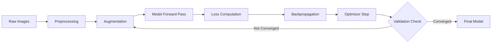

## Image Classification Models

### Overview

Image classification is the task of assigning one or more labels to an entire image from a fixed set of categories. It is one of the foundational problems in computer vision, and progress on this task has historically driven broader advances in deep learning architecture design.

A classification model takes raw pixel data as input and outputs a probability distribution over predefined classes. The class with the highest probability (or all classes above a threshold, in multi-label settings) is treated as the prediction.

$$P(y = c \mid x) = \frac{e^{z_c}}{\sum_{j=1}^{K} e^{z_j}}$$

Here, $x$ is the input image, $z_c$ is the raw logit for class $c$, and $K$ is the total number of classes. This softmax formulation converts logits into a normalized probability distribution.

### Problem Formulation

**Single-label classification**

Each image is assigned exactly one class. This is the classic setup (e.g., ImageNet-1K), where classes are mutually exclusive.

**Multi-label classification**

An image can belong to multiple classes simultaneously (e.g., a photo containing both "dog" and "car"). This uses independent sigmoid outputs per class rather than a single softmax.

$$P(y_c = 1 \mid x) = \sigma(z_c) = \frac{1}{1 + e^{-z_c}}$$

**Fine-grained classification**

Distinguishes between visually similar subcategories (e.g., bird species, car models). This is harder because inter-class variation is small relative to intra-class variation.

**Hierarchical classification**

Labels are organized in a taxonomy (e.g., animal → mammal → dog → beagle), and models may predict at multiple levels of the hierarchy simultaneously.

### Core Architecture Families

#### Convolutional Neural Networks (CNNs)

CNNs dominated image classification from roughly 2012 through 2020. They rely on convolutional layers to extract spatially local features, pooling layers to reduce dimensionality, and fully connected layers for final classification.

Key milestone architectures:

- **AlexNet (2012)** — Demonstrated that deep CNNs trained on GPUs could substantially outperform prior approaches on ImageNet.
- **VGG (2014)** — Used small $3\times3$ convolutions stacked in depth, showing that depth alone improved performance.
- **GoogLeNet / Inception (2014)** — Introduced multi-scale convolution filters within a single "Inception module."
- **ResNet (2015)** — Introduced residual (skip) connections, enabling training of networks with 50–150+ layers by mitigating vanishing gradients.
- **DenseNet (2017)** — Connected each layer to every subsequent layer, encouraging feature reuse.
- **EfficientNet (2019)** — Used compound scaling to jointly balance network depth, width, and input resolution.

The residual connection central to ResNet is expressed as:

$$y = F(x, \{W_i\}) + x$$

where $F(x, \{W_i\})$ is the learned residual mapping and $x$ is passed through via an identity shortcut.

#### Vision Transformers (ViT)

Introduced in 2020, Vision Transformers apply the transformer architecture (originally designed for NLP) to images by splitting an image into fixed-size patches, linearly embedding them, and processing the resulting sequence with self-attention.

$$\text{Attention}(Q, K, V) = \text{softmax}\left(\frac{QK^T}{\sqrt{d_k}}\right)V$$

ViT models generally require larger training datasets or strong pretraining to match CNN performance, since they lack the built-in inductive biases (locality, translation invariance) that convolutions provide. [Inference] This data requirement is a widely cited tradeoff in the original ViT literature, though the exact data threshold at which ViTs surpass CNNs varies by model size and augmentation strategy, and I cannot verify precise thresholds for every model variant without a specific benchmark source.

Notable variants:

- **DeiT (Data-efficient Image Transformers)** — Uses distillation to train ViTs effectively on smaller datasets.
- **Swin Transformer** — Introduces hierarchical feature maps and shifted-window attention, making it more suitable as a general-purpose backbone (including for detection and segmentation).
- **ConvNeXt** — A CNN redesigned using architectural choices inspired by transformers, showing that pure convolutional models can match transformer performance when modernized.

#### Hybrid Architectures

Some models combine convolutional stems with transformer blocks to capture both local texture and long-range dependencies (e.g., CoAtNet, MobileViT). These aim to balance the efficiency of CNNs with the global context modeling of attention.

### Architecture Comparison Diagram

<svg xmlns="http://www.w3.org/2000/svg" viewBox="0 0 900 420">
<text x="450" y="30" font-size="18" font-weight="bold" text-anchor="middle" fill="#1a1a1a">Image Classification Architecture Families (svg_diagram)</text>
<rect x="40" y="70" width="240" height="300" rx="10" fill="#e8f0fe" stroke="#4285f4" stroke-width="2" />
<text x="160" y="100" font-size="15" font-weight="bold" text-anchor="middle" fill="#1a1a1a">CNN</text>
<text x="160" y="130" font-size="12" text-anchor="middle" fill="#333">Input Image</text>
<line x1="160" y1="138" x2="160" y2="155" stroke="#4285f4" stroke-width="2" />
<rect x="100" y="155" width="120" height="30" rx="4" fill="#fff" stroke="#4285f4" />
<text x="160" y="175" font-size="11" text-anchor="middle">Conv + ReLU</text>
<line x1="160" y1="185" x2="160" y2="200" stroke="#4285f4" stroke-width="2" />
<rect x="100" y="200" width="120" height="30" rx="4" fill="#fff" stroke="#4285f4" />
<text x="160" y="220" font-size="11" text-anchor="middle">Pooling</text>
<line x1="160" y1="230" x2="160" y2="245" stroke="#4285f4" stroke-width="2" />
<rect x="100" y="245" width="120" height="30" rx="4" fill="#fff" stroke="#4285f4" />
<text x="160" y="265" font-size="11" text-anchor="middle">Residual Blocks</text>
<line x1="160" y1="275" x2="160" y2="290" stroke="#4285f4" stroke-width="2" />
<rect x="100" y="290" width="120" height="30" rx="4" fill="#fff" stroke="#4285f4" />
<text x="160" y="310" font-size="11" text-anchor="middle">Global Pool</text>
<line x1="160" y1="320" x2="160" y2="335" stroke="#4285f4" stroke-width="2" />
<rect x="100" y="335" width="120" height="30" rx="4" fill="#fff" stroke="#4285f4" />
<text x="160" y="355" font-size="11" text-anchor="middle">Softmax Output</text>
<rect x="330" y="70" width="240" height="300" rx="10" fill="#fef7e0" stroke="#f9ab00" stroke-width="2" />
<text x="450" y="100" font-size="15" font-weight="bold" text-anchor="middle" fill="#1a1a1a">Vision Transformer</text>
<text x="450" y="130" font-size="12" text-anchor="middle" fill="#333">Input Image</text>
<line x1="450" y1="138" x2="450" y2="155" stroke="#f9ab00" stroke-width="2" />
<rect x="390" y="155" width="120" height="30" rx="4" fill="#fff" stroke="#f9ab00" />
<text x="450" y="175" font-size="11" text-anchor="middle">Patch Embedding</text>
<line x1="450" y1="185" x2="450" y2="200" stroke="#f9ab00" stroke-width="2" />
<rect x="390" y="200" width="120" height="30" rx="4" fill="#fff" stroke="#f9ab00" />
<text x="450" y="220" font-size="11" text-anchor="middle">+ Position Embed</text>
<line x1="450" y1="230" x2="450" y2="245" stroke="#f9ab00" stroke-width="2" />
<rect x="390" y="245" width="120" height="30" rx="4" fill="#fff" stroke="#f9ab00" />
<text x="450" y="265" font-size="11" text-anchor="middle">Self-Attention x N</text>
<line x1="450" y1="275" x2="450" y2="290" stroke="#f9ab00" stroke-width="2" />
<rect x="390" y="290" width="120" height="30" rx="4" fill="#fff" stroke="#f9ab00" />
<text x="450" y="310" font-size="11" text-anchor="middle">[CLS] Token</text>
<line x1="450" y1="320" x2="450" y2="335" stroke="#f9ab00" stroke-width="2" />
<rect x="390" y="335" width="120" height="30" rx="4" fill="#fff" stroke="#f9ab00" />
<text x="450" y="355" font-size="11" text-anchor="middle">Softmax Output</text>
<rect x="620" y="70" width="240" height="300" rx="10" fill="#e6f4ea" stroke="#34a853" stroke-width="2" />
<text x="740" y="100" font-size="15" font-weight="bold" text-anchor="middle" fill="#1a1a1a">Hybrid</text>
<text x="740" y="130" font-size="12" text-anchor="middle" fill="#333">Input Image</text>
<line x1="740" y1="138" x2="740" y2="155" stroke="#34a853" stroke-width="2" />
<rect x="680" y="155" width="120" height="30" rx="4" fill="#fff" stroke="#34a853" />
<text x="740" y="175" font-size="11" text-anchor="middle">Conv Stem</text>
<line x1="740" y1="185" x2="740" y2="200" stroke="#34a853" stroke-width="2" />
<rect x="680" y="200" width="120" height="30" rx="4" fill="#fff" stroke="#34a853" />
<text x="740" y="220" font-size="11" text-anchor="middle">Local Features</text>
<line x1="740" y1="230" x2="740" y2="245" stroke="#34a853" stroke-width="2" />
<rect x="680" y="245" width="120" height="30" rx="4" fill="#fff" stroke="#34a853" />
<text x="740" y="265" font-size="11" text-anchor="middle">Attention Blocks</text>
<line x1="740" y1="275" x2="740" y2="290" stroke="#34a853" stroke-width="2" />
<rect x="680" y="290" width="120" height="30" rx="4" fill="#fff" stroke="#34a853" />
<text x="740" y="310" font-size="11" text-anchor="middle">Global Pool</text>
<line x1="740" y1="320" x2="740" y2="335" stroke="#34a853" stroke-width="2" />
<rect x="680" y="335" width="120" height="30" rx="4" fill="#fff" stroke="#34a853" />
<text x="740" y="355" font-size="11" text-anchor="middle">Softmax Output</text>
</svg>

### Training Pipeline

A typical image classification training pipeline includes the following stages:

1. **Data preprocessing** — Resizing, normalization (subtracting channel-wise mean, dividing by standard deviation), and format conversion.
2. **Data augmentation** — Random crops, flips, rotations, color jitter, and more advanced methods like CutMix, MixUp, and RandAugment, used to improve generalization.
3. **Forward pass** — Input propagates through the network to produce logits.
4. **Loss computation** — Typically cross-entropy loss for single-label classification:

$$\mathcal{L} = -\sum_{c=1}^{K} y_c \log(\hat{y}_c)$$

where $y_c$ is the ground-truth indicator (1 for the correct class, 0 otherwise) and $\hat{y}_c$ is the predicted probability for class $c$.

5. **Backpropagation** — Gradients of the loss with respect to weights are computed.
6. **Optimization** — Weights are updated using an optimizer such as SGD with momentum, Adam, or AdamW.
7. **Validation** — Performance is measured on a held-out set to monitor generalization and guide hyperparameter tuning.

### Training Pipeline Diagram



### Transfer Learning

Training a large classification model from scratch is computationally expensive and data-intensive. Transfer learning addresses this by reusing weights from a model pretrained on a large dataset (commonly ImageNet) and adapting it to a new, often smaller, dataset.

Common strategies:

- **Feature extraction** — Freeze pretrained convolutional/transformer layers and train only a new classification head.
- **Fine-tuning** — Unfreeze some or all pretrained layers and continue training at a lower learning rate.
- **Progressive unfreezing** — Gradually unfreeze layers from the output toward the input during training.

**Example**

```python
import torch
import torch.nn as nn
from torchvision import models

# Load a pretrained ResNet50 backbone
model = models.resnet50(weights="IMAGENET1K_V2")

# Freeze all layers
for param in model.parameters():
    param.requires_grad = False

# Replace the final fully connected layer for a new 10-class task
model.fc = nn.Linear(model.fc.in_features, 10)

# Only model.fc parameters will be updated during training
optimizer = torch.optim.Adam(model.fc.parameters(), lr=1e-3)
```

This example reflects standard, documented `torchvision` API usage. [Unverified] I cannot verify the exact current weight naming strings (e.g., `"IMAGENET1K_V2"`) remain unchanged in future `torchvision` releases without checking the specific installed version's documentation, since library APIs are updated over time.

### Evaluation Metrics

- **Top-1 accuracy** — Percentage of samples where the highest-probability prediction matches the ground truth.
- **Top-5 accuracy** — Percentage of samples where the ground truth is among the top 5 predicted classes.
- **Precision, Recall, F1-score** — Especially relevant for imbalanced datasets, computed per class or averaged (macro/micro/weighted).
- **Confusion matrix** — A full breakdown of predicted vs. actual class assignments, useful for identifying systematic misclassifications.
- **AUC-ROC** — Common in binary or one-vs-rest multi-class evaluation settings.

$$\text{Precision} = \frac{TP}{TP + FP}, \quad \text{Recall} = \frac{TP}{TP + FN}$$


$$F_1 = 2 \cdot \frac{\text{Precision} \cdot \text{Recall}}{\text{Precision} + \text{Recall}}$$

### Common Datasets

| Dataset | Classes | Approx. Size | Notes |
| --- | --- | --- | --- |
| MNIST | 10 | 70,000 | Grayscale handwritten digits; considered a basic benchmark |
| CIFAR-10 / CIFAR-100 | 10 / 100 | 60,000 | Small $32\times32$ color images |
| ImageNet-1K | 1,000 | ~1.4 million | Standard large-scale benchmark for classification research |
| Places365 | 365 | ~1.8 million | Scene-centric rather than object-centric categories |

[Unverified] Exact current dataset sizes may differ slightly across dataset versions or access mirrors; the figures above reflect commonly cited values, and I do not have access to a live registry to confirm the precise current counts.

### Practical Considerations

- **Class imbalance** — Real-world datasets rarely have equal class distribution. Techniques such as class weighting, oversampling, or focal loss are commonly used to address this.
- **Input resolution** — Higher resolution generally improves accuracy but increases compute cost; this tradeoff is architecture-dependent.
- **Model size vs. latency** — Larger models tend to achieve higher accuracy but at increased inference latency and memory cost, which matters for deployment on edge devices.
- **Label noise** — Mislabeled training data can degrade performance. [Inference] Label smoothing is frequently used as a mitigation technique, and while its regularizing effect is well documented in literature, its specific benefit magnitude depends on dataset and label noise level, which I cannot verify without a specific benchmark.

### Common Pitfalls

- Overfitting on small datasets without adequate augmentation or regularization.
- Data leakage between training and validation splits.
- Ignoring distribution shift between training data and deployment data.
- Using top-1 accuracy alone without considering class-wise performance on imbalanced datasets.

**Related Topics**

- Object detection models
- Image segmentation (semantic and instance)
- Self-supervised pretraining for vision (e.g., SimCLR, MAE, DINO)
- Model compression and quantization for edge deployment
- Explainability methods for vision models (Grad-CAM, saliency maps)
- Data augmentation strategies in depth
- Vision-language models (e.g., CLIP) and zero-shot classification