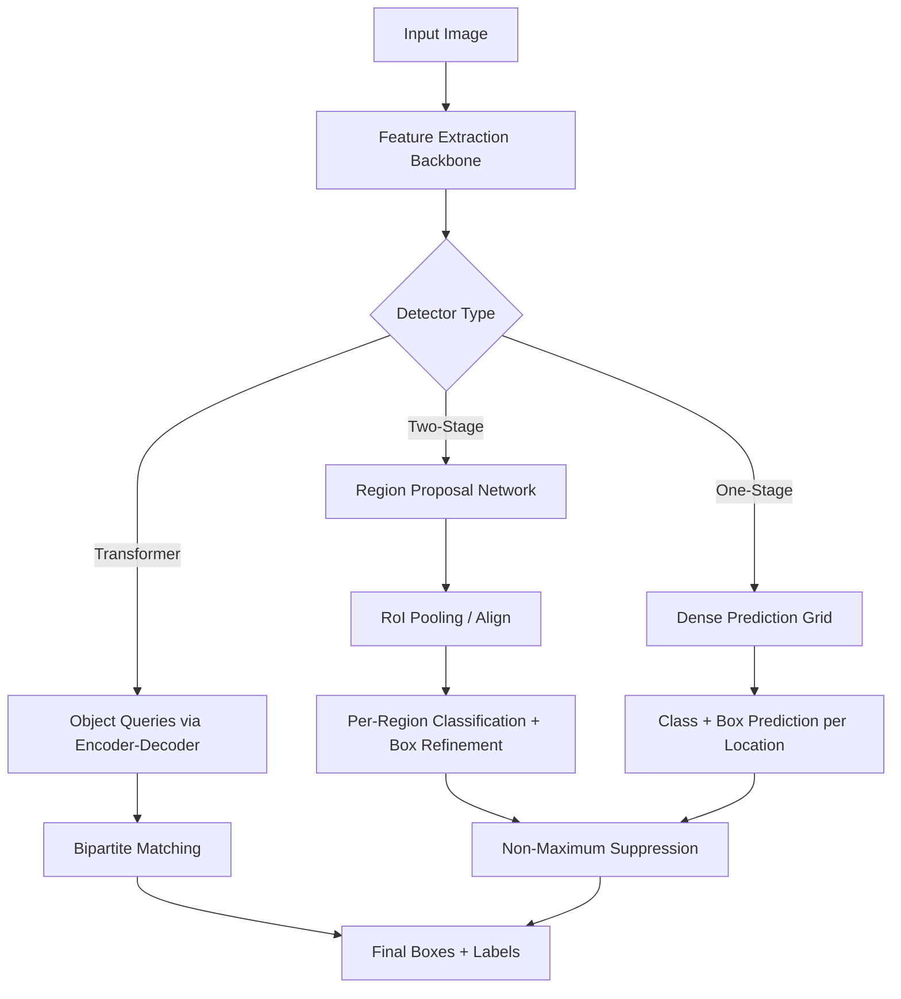

## Object Detection Methods

### Overview

Object detection extends image classification by requiring a model to both localize and classify multiple objects within a single image. The output is typically a set of bounding boxes, each paired with a class label and a confidence score.

$$\text{Detection Output} = \{(b_i, c_i, s_i)\}_{i=1}^{N}$$

where $b_i = (x, y, w, h)$ represents a bounding box, $c_i$ is the predicted class, $s_i$ is the confidence score, and $N$ is the number of detected objects in the image.

Object detection is generally harder than classification because the number of objects per image is variable and unknown in advance, and the model must solve localization and classification jointly.

### Problem Formulation

**Bounding box representation**A box is commonly parameterized either as corner coordinates $(x_{min}, y_{min}, x_{max}, y_{max})$ or as center-based coordinates $(x_{center}, y_{center}, w, h)$.

**Multi-object, variable-count output**Unlike classification, where output size is fixed at $K$ classes, detection must handle a variable number of objects per image, which shapes much of the architectural design (e.g., anchor boxes, region proposals, or set prediction).

**Intersection over Union (IoU)**

Used to measure overlap between a predicted box and a ground-truth box, and is central to both training loss design and evaluation.

$$\text{IoU}(A, B) = \frac{|A \cap B|}{|A \cup B|}$$

### Two-Stage Detectors

Two-stage detectors first propose candidate regions likely to contain objects, then classify and refine each region.

- **R-CNN (2014)** — Used selective search to generate region proposals, then ran a CNN independently on each cropped region. [Unverified] I do not have access to a live source confirming exact original runtime figures, but R-CNN is widely documented as computationally slow due to per-region CNN passes.
- **Fast R-CNN (2015)** — Shared convolutional feature computation across the whole image, then used RoI (Region of Interest) pooling to extract per-region features, reducing redundant computation.
- **Faster R-CNN (2015)** — Introduced the Region Proposal Network (RPN), a small network that generates proposals directly from shared feature maps, removing the dependency on external region-proposal algorithms.
- **Mask R-CNN (2017)** — Extended Faster R-CNN with an additional branch for pixel-level instance segmentation, alongside detection.

The RPN loss combines classification (objectness) and bounding box regression:

$$\mathcal{L}_{RPN} = \frac{1}{N_{cls}}\sum_i \mathcal{L}_{cls}(p_i, p_i^*) + \lambda \frac{1}{N_{reg}}\sum_i p_i^* \mathcal{L}_{reg}(t_i, t_i^*)$$

where $p_i$ is the predicted probability of an anchor being an object, $p_i^*$ is the ground-truth label, $t_i$ is the predicted box offset, and $t_i^*$ is the ground-truth offset.

### One-Stage Detectors

One-stage detectors predict class scores and box coordinates directly from feature maps in a single pass, without a separate proposal stage. They are generally faster but historically traded off some accuracy relative to two-stage methods. [Inference] This speed/accuracy tradeoff is a commonly cited characterization in detection literature; the precise magnitude of the gap depends on the specific model versions and benchmark compared, which I cannot verify without a specific citation.

- **YOLO (You Only Look Once, 2016)** — Divides the image into a grid; each grid cell directly predicts bounding boxes, objectness scores, and class probabilities.
- **SSD (Single Shot MultiBox Detector, 2016)** — Predicts detections from multiple feature map scales, allowing it to handle objects of varying sizes.
- **RetinaNet (2017)** — Introduced Focal Loss to address extreme class imbalance between foreground and background anchors during training.
- **YOLOv3–YOLOv8 and later iterations** — Successive versions have introduced architectural changes (e.g., different backbones, anchor-free heads, improved loss functions). [Unverified] I cannot verify the specific architectural details or benchmark claims of the most recent YOLO versions without checking current release documentation, as this is an actively evolving line of models.

Focal Loss, used in RetinaNet, down-weights well-classified examples:

$$\text{FL}(p_t) = -\alpha_t (1 - p_t)^\gamma \log(p_t)$$

where $p_t$ is the model's estimated probability for the ground-truth class, $\gamma$ is a focusing parameter, and $\alpha_t$ is a class-balancing weight.

### Anchor-Based vs. Anchor-Free Detection

**Anchor-based methods** (Faster R-CNN, SSD, early YOLO versions) predefine a set of reference boxes of varying scales and aspect ratios at each spatial location, and predict offsets relative to these anchors.

**Anchor-free methods** (e.g., CornerNet, FCOS, CenterNet) predict object properties directly, such as center points, corner points, or per-pixel distances to box edges, removing the need to hand-design anchor configurations. [Inference] Anchor-free methods are generally described in the literature as simplifying hyperparameter tuning related to anchor design, though whether this yields better accuracy is architecture- and dataset-dependent, and I cannot verify a universal performance ranking.

### Transformer-Based Detection

**DETR (Detection Transformer, 2020)** reformulates object detection as a direct set-prediction problem, removing the need for anchors and non-maximum suppression (NMS) post-processing.

DETR uses a CNN backbone to extract features, a transformer encoder-decoder to process a fixed-size set of learned object queries, and bipartite matching (via the Hungarian algorithm) to assign predictions to ground-truth objects during training.

$$\mathcal{L}_{Hungarian}(y, \hat{y}) = \sum_{i=1}^{N} \left[ -\log \hat{p}_{\hat{\sigma}(i)}(c_i) + \mathbb{1}_{\{c_i \neq \varnothing\}} \mathcal{L}_{box}(b_i, \hat{b}_{\hat{\sigma}(i)}) \right]$$

where $\hat{\sigma}$ is the optimal assignment between predictions and ground truth found via bipartite matching.

Variants such as **Deformable DETR** address slow convergence in the original DETR by using deformable attention that focuses on a small set of key sampling points rather than all spatial locations. [Unverified] I do not have access to a source to confirm precise convergence speed comparisons between DETR variants without citing a specific paper.

### Architecture Comparison Diagram

<svg xmlns="http://www.w3.org/2000/svg" viewBox="0 0 900 460">
<text x="450" y="30" font-size="18" font-weight="bold" text-anchor="middle" fill="#1a1a1a">Object Detection Architecture Families (svg_diagram)</text>
<rect x="30" y="70" width="260" height="350" rx="10" fill="#e8f0fe" stroke="#4285f4" stroke-width="2" />
<text x="160" y="100" font-size="14" font-weight="bold" text-anchor="middle" fill="#1a1a1a">Two-Stage</text>
<text x="160" y="125" font-size="11" text-anchor="middle" fill="#333">Input Image</text>
<line x1="160" y1="133" x2="160" y2="148" stroke="#4285f4" stroke-width="2" />
<rect x="100" y="148" width="120" height="28" rx="4" fill="#fff" stroke="#4285f4" />
<text x="160" y="166" font-size="10" text-anchor="middle">Backbone CNN</text>
<line x1="160" y1="176" x2="160" y2="191" stroke="#4285f4" stroke-width="2" />
<rect x="100" y="191" width="120" height="28" rx="4" fill="#fff" stroke="#4285f4" />
<text x="160" y="209" font-size="10" text-anchor="middle">Region Proposal Net</text>
<line x1="160" y1="219" x2="160" y2="234" stroke="#4285f4" stroke-width="2" />
<rect x="100" y="234" width="120" height="28" rx="4" fill="#fff" stroke="#4285f4" />
<text x="160" y="252" font-size="10" text-anchor="middle">RoI Pooling/Align</text>
<line x1="160" y1="262" x2="160" y2="277" stroke="#4285f4" stroke-width="2" />
<rect x="100" y="277" width="120" height="28" rx="4" fill="#fff" stroke="#4285f4" />
<text x="160" y="295" font-size="10" text-anchor="middle">Classify + Refine</text>
<line x1="160" y1="305" x2="160" y2="320" stroke="#4285f4" stroke-width="2" />
<rect x="100" y="320" width="120" height="28" rx="4" fill="#fff" stroke="#4285f4" />
<text x="160" y="338" font-size="10" text-anchor="middle">Boxes + Labels</text>
<text x="160" y="400" font-size="10" text-anchor="middle" fill="#555">e.g. Faster R-CNN</text>
<rect x="320" y="70" width="260" height="350" rx="10" fill="#fef7e0" stroke="#f9ab00" stroke-width="2" />
<text x="450" y="100" font-size="14" font-weight="bold" text-anchor="middle" fill="#1a1a1a">One-Stage</text>
<text x="450" y="125" font-size="11" text-anchor="middle" fill="#333">Input Image</text>
<line x1="450" y1="133" x2="450" y2="148" stroke="#f9ab00" stroke-width="2" />
<rect x="390" y="148" width="120" height="28" rx="4" fill="#fff" stroke="#f9ab00" />
<text x="450" y="166" font-size="10" text-anchor="middle">Backbone CNN</text>
<line x1="450" y1="176" x2="450" y2="191" stroke="#f9ab00" stroke-width="2" />
<rect x="390" y="191" width="120" height="28" rx="4" fill="#fff" stroke="#f9ab00" />
<text x="450" y="209" font-size="10" text-anchor="middle">Multi-scale Features</text>
<line x1="450" y1="219" x2="450" y2="234" stroke="#f9ab00" stroke-width="2" />
<rect x="390" y="234" width="120" height="28" rx="4" fill="#fff" stroke="#f9ab00" />
<text x="450" y="252" font-size="10" text-anchor="middle">Dense Predict Head</text>
<line x1="450" y1="262" x2="450" y2="277" stroke="#f9ab00" stroke-width="2" />
<rect x="390" y="277" width="120" height="28" rx="4" fill="#fff" stroke="#f9ab00" />
<text x="450" y="295" font-size="10" text-anchor="middle">NMS Filtering</text>
<line x1="450" y1="305" x2="450" y2="320" stroke="#f9ab00" stroke-width="2" />
<rect x="390" y="320" width="120" height="28" rx="4" fill="#fff" stroke="#f9ab00" />
<text x="450" y="338" font-size="10" text-anchor="middle">Boxes + Labels</text>
<text x="450" y="400" font-size="10" text-anchor="middle" fill="#555">e.g. YOLO, SSD</text>
<rect x="610" y="70" width="260" height="350" rx="10" fill="#e6f4ea" stroke="#34a853" stroke-width="2" />
<text x="740" y="100" font-size="14" font-weight="bold" text-anchor="middle" fill="#1a1a1a">Transformer-Based</text>
<text x="740" y="125" font-size="11" text-anchor="middle" fill="#333">Input Image</text>
<line x1="740" y1="133" x2="740" y2="148" stroke="#34a853" stroke-width="2" />
<rect x="680" y="148" width="120" height="28" rx="4" fill="#fff" stroke="#34a853" />
<text x="740" y="166" font-size="10" text-anchor="middle">CNN Backbone</text>
<line x1="740" y1="176" x2="740" y2="191" stroke="#34a853" stroke-width="2" />
<rect x="680" y="191" width="120" height="28" rx="4" fill="#fff" stroke="#34a853" />
<text x="740" y="209" font-size="10" text-anchor="middle">Transformer Enc/Dec</text>
<line x1="740" y1="219" x2="740" y2="234" stroke="#34a853" stroke-width="2" />
<rect x="680" y="234" width="120" height="28" rx="4" fill="#fff" stroke="#34a853" />
<text x="740" y="252" font-size="10" text-anchor="middle">Object Queries</text>
<line x1="740" y1="262" x2="740" y2="277" stroke="#34a853" stroke-width="2" />
<rect x="680" y="277" width="120" height="28" rx="4" fill="#fff" stroke="#34a853" />
<text x="740" y="295" font-size="10" text-anchor="middle">Bipartite Matching</text>
<line x1="740" y1="305" x2="740" y2="320" stroke="#34a853" stroke-width="2" />
<rect x="680" y="320" width="120" height="28" rx="4" fill="#fff" stroke="#34a853" />
<text x="740" y="338" font-size="10" text-anchor="middle">Boxes + Labels</text>
<text x="740" y="400" font-size="10" text-anchor="middle" fill="#555">e.g. DETR</text>
</svg>

### Detection Pipeline Flow

### Non-Maximum Suppression (NMS)

Since dense prediction methods generate many overlapping candidate boxes per object, NMS is used to retain only the most confident, non-redundant boxes.

**Algorithm**

1. Sort all candidate boxes by confidence score.
2. Select the highest-scoring box and add it to the final output.
3. Remove all remaining boxes that have IoU above a threshold with the selected box.
4. Repeat until no boxes remain.

Soft-NMS is a variant that decays the scores of overlapping boxes rather than removing them outright, which can help in cases of closely packed objects. [Inference] Soft-NMS is documented in its original paper as improving detection in dense-object scenarios; the exact magnitude of improvement is dataset-dependent and I cannot verify it beyond what is reported in that specific source.

### Loss Functions

Object detection loss is typically a combination of classification loss and localization (regression) loss:

$$\mathcal{L}_{total} = \mathcal{L}_{cls} + \lambda \mathcal{L}_{box}$$

Common components:

- **Classification loss** — Cross-entropy or Focal Loss.
- **Box regression loss** — Smooth L1 loss, or IoU-based losses such as GIoU, DIoU, or CIoU, which directly optimize overlap rather than raw coordinate differences.

$$\mathcal{L}_{GIoU} = 1 - \text{IoU} + \frac{|C - (A \cup B)|}{|C|}$$

where $C$ is the smallest enclosing box covering both the predicted box $A$ and ground-truth box $B$.

### Evaluation Metrics

- **mAP (mean Average Precision)** — The primary benchmark metric, computed by averaging precision across recall levels and across classes.
- **AP at IoU thresholds** — Common variants include $AP_{50}$ (IoU ≥ 0.5) and $AP_{75}$ (IoU ≥ 0.75), as well as COCO-style mAP averaged over IoU thresholds from 0.5 to 0.95.
- **Precision-Recall curve** — Used to derive AP by integrating precision over recall.
- **Frames per second (FPS)** — Used to evaluate inference speed, particularly relevant for real-time applications. [Unverified] Specific FPS figures are highly hardware- and implementation-dependent, so I cannot verify comparative speed claims without a specific benchmark environment being cited.

$$AP = \int_0^1 p(r) \, dr$$

### Practical Considerations

- **Small object detection** — Objects occupying few pixels are harder to detect; feature pyramid networks (FPN) are commonly used to improve multi-scale feature representation.
- **Class imbalance between foreground and background** — Especially pronounced in one-stage detectors, addressed via Focal Loss or hard-negative mining.
- **Occlusion and overlapping objects** — Can cause NMS to incorrectly suppress valid detections; Soft-NMS or learned NMS alternatives may help.
- **Real-time constraints** — Deployment scenarios (e.g., autonomous driving, robotics) often require balancing accuracy against inference latency, which is architecture- and hardware-dependent.

### Common Pitfalls

- Using an IoU threshold during evaluation that does not match the deployment requirement's tolerance for localization error.
- Applying NMS thresholds tuned for one dataset directly to another without re-validation.
- Underestimating the impact of anchor box configuration (in anchor-based methods) on detection of unusually shaped or sized objects.
- Treating mAP as a single monolithic number without inspecting per-class or per-size (small/medium/large object) breakdowns, which can mask significant weaknesses.

**Related Topics**

- Image segmentation (semantic and instance)
- Feature Pyramid Networks (FPN) in depth
- Non-Maximum Suppression variants and learned alternatives
- Real-time detection for edge and embedded deployment
- Video object detection and tracking
- Few-shot and open-vocabulary object detection