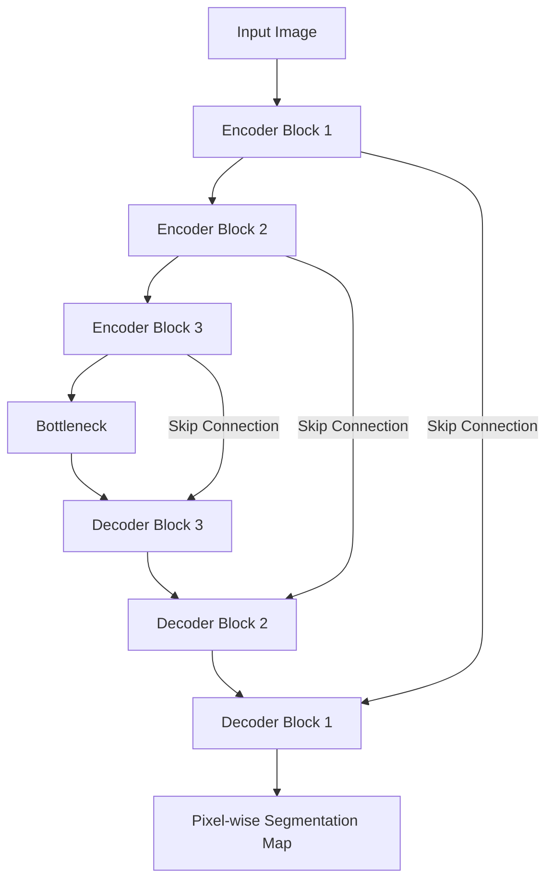

## Semantic Segmentation

### Overview

Semantic segmentation assigns a class label to every pixel in an image, producing a dense, pixel-wise classification map rather than a single label (as in classification) or a bounding box (as in object detection). Unlike instance segmentation, semantic segmentation does not distinguish between separate instances of the same class — all pixels belonging to, for example, "car" are labeled identically regardless of how many individual cars appear.

$$\hat{y}_{i,j} = \arg\max_{c} P(c \mid x_{i,j})$$

where $\hat{y}_{i,j}$ is the predicted class for pixel at spatial location $(i, j)$, and $P(c \mid x_{i,j})$ is the model's estimated probability that pixel belongs to class $c$.

### Problem Formulation

**Dense prediction**The output has the same spatial resolution as the input (or is upsampled to match it), with each pixel independently assigned a class from a fixed set $K$.

**Per-pixel classification vs. instance-awareness**

Semantic segmentation treats all pixels of a class uniformly. This differs from instance segmentation, where individual object instances of the same class are separated (covered separately as a related topic).

**Class imbalance at the pixel level**

Background or dominant classes (e.g., "road," "sky") often occupy far more pixels than smaller foreground classes (e.g., "pedestrian," "traffic sign"), which shapes loss function design.

### Core Architecture Families

#### Fully Convolutional Networks (FCN)

**FCN (2015)** was one of the first architectures to adapt classification CNNs for dense prediction by replacing fully connected layers with convolutional layers, allowing the network to output a spatial map instead of a single vector. It uses learned upsampling (transposed convolutions) to recover spatial resolution lost during downsampling.

#### Encoder-Decoder Architectures

**U-Net (2015)** — Originally developed for biomedical image segmentation, U-Net uses a symmetric encoder-decoder structure with skip connections that directly link encoder feature maps to corresponding decoder layers, helping preserve fine spatial detail lost during downsampling.

**SegNet (2015)** — Uses an encoder-decoder structure where the decoder reuses pooling indices from the encoder to perform non-linear upsampling, which can reduce the number of learnable parameters compared to some alternatives. [Unverified] I cannot verify precise parameter-count comparisons against specific alternative architectures without citing a specific benchmark source.

#### Dilated/Atrous Convolution Approaches

**DeepLab family (v1–v3+)** — Introduces atrous (dilated) convolutions, which expand the receptive field of filters without increasing the number of parameters or reducing spatial resolution through pooling.

$$y[i] = \sum_{k} x[i + r \cdot k] \, w[k]$$

where $r$ is the dilation rate. A dilation rate of 1 corresponds to a standard convolution.

DeepLabv3+ additionally introduces an encoder-decoder structure with atrous spatial pyramid pooling (ASPP), which applies parallel atrous convolutions at multiple dilation rates to capture multi-scale context.

#### Transformer-Based Approaches

**SETR** and **Segmenter** apply Vision Transformer backbones to segmentation by treating the image as a sequence of patches and using a transformer encoder, followed by a decoder to produce the dense prediction map.

**SegFormer** combines a hierarchical transformer encoder with a lightweight MLP decoder, aiming to balance accuracy and computational efficiency. [Unverified] I cannot verify specific comparative efficiency figures for SegFormer against other architectures without citing the specific benchmark reported in its original paper.

**Mask2Former** unifies semantic, instance, and panoptic segmentation under a single mask-classification framework using transformer decoders with masked attention.

### Architecture Comparison Diagram

<svg xmlns="http://www.w3.org/2000/svg" viewBox="0 0 900 440">
<text x="450" y="30" font-size="18" font-weight="bold" text-anchor="middle" fill="#1a1a1a">Semantic Segmentation Architecture Families (svg_diagram)</text>
<rect x="30" y="70" width="260" height="330" rx="10" fill="#e8f0fe" stroke="#4285f4" stroke-width="2" />
<text x="160" y="100" font-size="14" font-weight="bold" text-anchor="middle" fill="#1a1a1a">Encoder-Decoder</text>
<text x="160" y="125" font-size="11" text-anchor="middle" fill="#333">Input Image</text>
<line x1="160" y1="133" x2="160" y2="148" stroke="#4285f4" stroke-width="2" />
<rect x="100" y="148" width="120" height="28" rx="4" fill="#fff" stroke="#4285f4" />
<text x="160" y="166" font-size="10" text-anchor="middle">Encoder (Downsample)</text>
<line x1="160" y1="176" x2="160" y2="191" stroke="#4285f4" stroke-width="2" />
<rect x="100" y="191" width="120" height="28" rx="4" fill="#fff" stroke="#4285f4" />
<text x="160" y="209" font-size="10" text-anchor="middle">Bottleneck</text>
<line x1="160" y1="219" x2="160" y2="234" stroke="#4285f4" stroke-width="2" />
<rect x="100" y="234" width="120" height="28" rx="4" fill="#fff" stroke="#4285f4" />
<text x="160" y="252" font-size="10" text-anchor="middle">Decoder (Upsample)</text>
<line x1="160" y1="262" x2="160" y2="277" stroke="#4285f4" stroke-width="2" />
<rect x="100" y="277" width="120" height="28" rx="4" fill="#fff" stroke="#4285f4" />
<text x="160" y="295" font-size="10" text-anchor="middle">Skip Connections</text>
<line x1="160" y1="305" x2="160" y2="320" stroke="#4285f4" stroke-width="2" />
<rect x="100" y="320" width="120" height="28" rx="4" fill="#fff" stroke="#4285f4" />
<text x="160" y="338" font-size="10" text-anchor="middle">Pixel-wise Softmax</text>
<text x="160" y="380" font-size="10" text-anchor="middle" fill="#555">e.g. U-Net, SegNet</text>
<rect x="320" y="70" width="260" height="330" rx="10" fill="#fef7e0" stroke="#f9ab00" stroke-width="2" />
<text x="450" y="100" font-size="14" font-weight="bold" text-anchor="middle" fill="#1a1a1a">Dilated Convolution</text>
<text x="450" y="125" font-size="11" text-anchor="middle" fill="#333">Input Image</text>
<line x1="450" y1="133" x2="450" y2="148" stroke="#f9ab00" stroke-width="2" />
<rect x="390" y="148" width="120" height="28" rx="4" fill="#fff" stroke="#f9ab00" />
<text x="450" y="166" font-size="10" text-anchor="middle">Backbone CNN</text>
<line x1="450" y1="176" x2="450" y2="191" stroke="#f9ab00" stroke-width="2" />
<rect x="390" y="191" width="120" height="28" rx="4" fill="#fff" stroke="#f9ab00" />
<text x="450" y="209" font-size="10" text-anchor="middle">Atrous Convolutions</text>
<line x1="450" y1="219" x2="450" y2="234" stroke="#f9ab00" stroke-width="2" />
<rect x="390" y="234" width="120" height="28" rx="4" fill="#fff" stroke="#f9ab00" />
<text x="450" y="252" font-size="10" text-anchor="middle">ASPP (Multi-scale)</text>
<line x1="450" y1="262" x2="450" y2="277" stroke="#f9ab00" stroke-width="2" />
<rect x="390" y="277" width="120" height="28" rx="4" fill="#fff" stroke="#f9ab00" />
<text x="450" y="295" font-size="10" text-anchor="middle">Decoder Refinement</text>
<line x1="450" y1="305" x2="450" y2="320" stroke="#f9ab00" stroke-width="2" />
<rect x="390" y="320" width="120" height="28" rx="4" fill="#fff" stroke="#f9ab00" />
<text x="450" y="338" font-size="10" text-anchor="middle">Pixel-wise Softmax</text>
<text x="450" y="380" font-size="10" text-anchor="middle" fill="#555">e.g. DeepLabv3+</text>
<rect x="610" y="70" width="260" height="330" rx="10" fill="#e6f4ea" stroke="#34a853" stroke-width="2" />
<text x="740" y="100" font-size="14" font-weight="bold" text-anchor="middle" fill="#1a1a1a">Transformer-Based</text>
<text x="740" y="125" font-size="11" text-anchor="middle" fill="#333">Input Image</text>
<line x1="740" y1="133" x2="740" y2="148" stroke="#34a853" stroke-width="2" />
<rect x="680" y="148" width="120" height="28" rx="4" fill="#fff" stroke="#34a853" />
<text x="740" y="166" font-size="10" text-anchor="middle">Patch Embedding</text>
<line x1="740" y1="176" x2="740" y2="191" stroke="#34a853" stroke-width="2" />
<rect x="680" y="191" width="120" height="28" rx="4" fill="#fff" stroke="#34a853" />
<text x="740" y="209" font-size="10" text-anchor="middle">Transformer Encoder</text>
<line x1="740" y1="219" x2="740" y2="234" stroke="#34a853" stroke-width="2" />
<rect x="680" y="234" width="120" height="28" rx="4" fill="#fff" stroke="#34a853" />
<text x="740" y="252" font-size="10" text-anchor="middle">Mask Decoder</text>
<line x1="740" y1="262" x2="740" y2="277" stroke="#34a853" stroke-width="2" />
<rect x="680" y="277" width="120" height="28" rx="4" fill="#fff" stroke="#34a853" />
<text x="740" y="295" font-size="10" text-anchor="middle">Class Queries</text>
<line x1="740" y1="305" x2="740" y2="320" stroke="#34a853" stroke-width="2" />
<rect x="680" y="320" width="120" height="28" rx="4" fill="#fff" stroke="#34a853" />
<text x="740" y="338" font-size="10" text-anchor="middle">Pixel-wise Softmax</text>
<text x="740" y="380" font-size="10" text-anchor="middle" fill="#555">e.g. SegFormer</text>
</svg>

### U-Net Skip Connection Flow

### Training Pipeline

1. **Data preprocessing** — Resizing, normalization, and alignment of image and mask pairs.
2. **Data augmentation** — Random crops, flips, rotations, and elastic deformations; augmentations must be applied identically to both the image and its corresponding segmentation mask.
3. **Forward pass** — Produces a per-pixel class probability map of shape $(H, W, K)$.
4. **Loss computation** — Commonly pixel-wise cross-entropy, often combined with region-overlap losses.
5. **Backpropagation and optimization** — Standard gradient-based updates, as in classification and detection.

### Loss Functions

**Pixel-wise cross-entropy**

$$\mathcal{L}_{CE} = -\frac{1}{HW}\sum_{i=1}^{H}\sum_{j=1}^{W}\sum_{c=1}^{K} y_{i,j,c} \log(\hat{y}_{i,j,c})$$

**Dice loss** — Directly optimizes overlap between predicted and ground-truth masks, and is commonly used for imbalanced segmentation tasks (e.g., small foreground regions against large background regions).

$$\mathcal{L}_{Dice} = 1 - \frac{2 \sum_{i} p_i g_i}{\sum_i p_i^2 + \sum_i g_i^2}$$

where $p_i$ is the predicted probability at pixel $i$ and $g_i$ is the ground-truth label at pixel $i$.

**Combined loss** — Cross-entropy and Dice loss are frequently summed or weighted together to balance pixel-level accuracy with region-level overlap. [Inference] This combination is commonly described in segmentation literature as addressing weaknesses of each loss individually, though the optimal weighting is dataset-dependent, and I cannot verify a universally optimal ratio.

### Evaluation Metrics

- **Pixel accuracy** — Fraction of correctly classified pixels across the entire image; can be misleading under class imbalance.
- **Mean Intersection over Union (mIoU)** — IoU computed per class and averaged across all classes; the most widely reported metric for semantic segmentation.

$$\text{mIoU} = \frac{1}{K}\sum_{c=1}^{K} \frac{TP_c}{TP_c + FP_c + FN_c}$$

- **Frequency-weighted IoU** — Weights each class's IoU by its pixel frequency in the dataset, which can better reflect performance on dominant classes.
- **Boundary F1 score** — Evaluates segmentation accuracy specifically near object boundaries, which mIoU can under-represent.

### Common Datasets

| Dataset | Classes | Domain | Notes |
| --- | --- | --- | --- |
| PASCAL VOC | 21 (incl. background) | General objects | Common early benchmark |
| Cityscapes | 30 (19 used for evaluation) | Urban street scenes | Widely used for autonomous driving research |
| ADE20K | 150 | Scene parsing | Broad scene and object categories |
| COCO-Stuff | 171 | General objects + stuff | Extends COCO with "stuff" (background) categories |

[Unverified] I cannot verify that these exact class counts and dataset sizes remain unchanged, as dataset versions and splits are occasionally revised, and I do not have access to a live registry to confirm current figures.

### Practical Considerations

- **Boundary precision** — Standard encoder-decoder downsampling can blur fine object boundaries; skip connections and boundary-aware losses are common mitigations.
- **Class imbalance** — Dominant background classes can bias training toward trivial solutions; addressed via weighted losses, Dice loss, or focal-style pixel losses.
- **Computational cost at high resolution** — Dense prediction at full image resolution is memory-intensive, particularly for transformer-based models with quadratic attention cost relative to sequence length. [Inference] This quadratic cost is a documented property of standard self-attention; whether it becomes a practical bottleneck depends on input resolution, patch size, and hardware, which I cannot verify in general terms.
- **Domain shift** — Models trained on one visual domain (e.g., daytime driving scenes) often degrade when applied to a different domain (e.g., nighttime or adverse weather) without adaptation.

### Common Pitfalls

- Applying data augmentation to the image without applying the identical spatial transformation to its segmentation mask, causing misalignment.
- Relying solely on pixel accuracy, which can appear high even when minority classes are poorly segmented.
- Ignoring boundary quality when only mIoU is reported, potentially masking systematic edge errors.
- Using a single fixed input resolution during training that does not match deployment resolution, which can affect the receptive field's relative coverage of objects.

**Related Topics**

- Instance segmentation and panoptic segmentation
- Feature Pyramid Networks (FPN) for multi-scale segmentation
- Domain adaptation for segmentation models
- Weakly-supervised and semi-supervised segmentation
- Real-time segmentation for embedded and mobile deployment
- Medical image segmentation applications