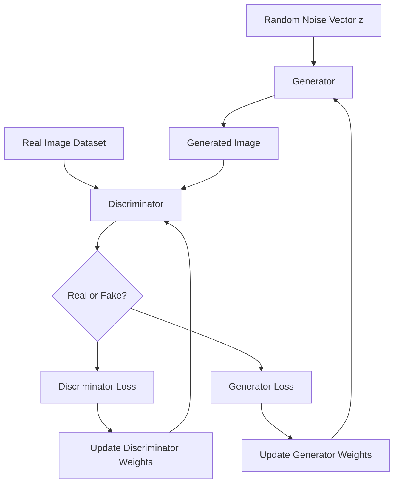

## Image Generation with GANs

### Overview

Generative Adversarial Networks (GANs) are a class of generative models composed of two neural networks — a generator and a discriminator — trained simultaneously in an adversarial setup. The generator learns to produce synthetic images, while the discriminator learns to distinguish real images from generated ones. This adversarial process drives the generator toward producing increasingly realistic outputs.

$$\min_G \max_D V(D, G) = \mathbb{E}_{x \sim p_{data}(x)}[\log D(x)] + \mathbb{E}_{z \sim p_z(z)}[\log(1 - D(G(z)))]$$

Here, $D(x)$ is the discriminator's estimated probability that $x$ is a real sample, $G(z)$ is the generator's output given a random noise vector $z$, and the training objective is a minimax game between the two networks.

### Problem Formulation

**Generator ($G$)**Maps a random noise vector $z$, typically sampled from a simple distribution (e.g., Gaussian or uniform), to a synthetic image $G(z)$.

**Discriminator ($D$)**

A binary classifier that takes an image (real or generated) as input and outputs a probability estimate of that image being real.

**Adversarial training dynamic**

The generator is trained to maximize the discriminator's error rate, while the discriminator is trained to minimize its own classification error. Both networks are updated alternately.

$$\theta_D \leftarrow \theta_D + \eta \nabla_{\theta_D} \left[\log D(x) + \log(1 - D(G(z)))\right]$$

$$\theta_G \leftarrow \theta_G - \eta \nabla_{\theta_G} \log(1 - D(G(z)))$$

### GAN Training Loop Diagram

### Core Architecture Families

#### DCGAN (Deep Convolutional GAN, 2015)

DCGAN established a set of architectural conventions for stable convolutional GAN training, including using strided convolutions instead of pooling layers, batch normalization in both networks, and specific activation function choices (ReLU in the generator, LeakyReLU in the discriminator). [Unverified] I do not have access to a source to confirm these were the exact universal defaults across all subsequent implementations, though they are widely cited as the original DCGAN design choices.

#### Conditional GAN (cGAN, 2014)

Extends the basic GAN framework by conditioning both the generator and discriminator on additional information, such as a class label $y$, allowing controlled generation of specific categories.

$$\min_G \max_D V(D, G) = \mathbb{E}_{x}[\log D(x|y)] + \mathbb{E}_{z}[\log(1 - D(G(z|y)))]$$

#### Pix2Pix (2017)

A conditional GAN designed for paired image-to-image translation tasks (e.g., sketches to photos, maps to satellite imagery), combining an adversarial loss with a pixel-wise reconstruction loss (typically L1).

#### CycleGAN (2017)

Extends image-to-image translation to unpaired datasets by introducing a cycle-consistency loss, which enforces that translating an image to a different domain and back should reconstruct the original image.

$$\mathcal{L}_{cyc}(G, F) = \mathbb{E}_x[\|F(G(x)) - x\|_1] + \mathbb{E}_y[\|G(F(y)) - y\|_1]$$

where $G$ and $F$ are generators mapping between two domains in opposite directions.

#### Progressive GAN (2017) and StyleGAN family (2018 onward)

**Progressive GAN** introduced training that starts at low resolution and progressively adds layers to increase resolution over the course of training, which was reported in its original paper to improve training stability at high resolutions. [Unverified] I cannot verify the exact magnitude of stability improvement without citing the specific paper's reported experiments.

**StyleGAN** introduced a style-based generator architecture that injects latent style information at multiple layers via adaptive instance normalization, enabling more disentangled control over generated image attributes at different scales (e.g., coarse pose vs. fine texture details). Later versions (StyleGAN2, StyleGAN3) introduced further architectural refinements aimed at reducing visual artifacts. [Unverified] I cannot verify the specific artifact-reduction claims of each version without citing their respective original papers.

### Architecture Comparison Diagram

<svg xmlns="http://www.w3.org/2000/svg" viewBox="0 0 900 400">
<text x="450" y="30" font-size="18" font-weight="bold" text-anchor="middle" fill="#1a1a1a">GAN Variant Comparison (svg_diagram)</text>
<rect x="30" y="70" width="270" height="300" rx="10" fill="#e8f0fe" stroke="#4285f4" stroke-width="2" />
<text x="165" y="100" font-size="14" font-weight="bold" text-anchor="middle" fill="#1a1a1a">Unconditional</text>
<text x="165" y="125" font-size="11" text-anchor="middle" fill="#333">Noise Vector z</text>
<line x1="165" y1="133" x2="165" y2="148" stroke="#4285f4" stroke-width="2" />
<rect x="105" y="148" width="120" height="28" rx="4" fill="#fff" stroke="#4285f4" />
<text x="165" y="166" font-size="10" text-anchor="middle">Generator</text>
<line x1="165" y1="176" x2="165" y2="191" stroke="#4285f4" stroke-width="2" />
<rect x="105" y="191" width="120" height="28" rx="4" fill="#fff" stroke="#4285f4" />
<text x="165" y="209" font-size="10" text-anchor="middle">Generated Image</text>
<line x1="165" y1="219" x2="165" y2="234" stroke="#4285f4" stroke-width="2" />
<rect x="105" y="234" width="120" height="28" rx="4" fill="#fff" stroke="#4285f4" />
<text x="165" y="252" font-size="10" text-anchor="middle">Discriminator</text>
<text x="165" y="330" font-size="10" text-anchor="middle" fill="#555">e.g. DCGAN</text>
<rect x="320" y="70" width="270" height="300" rx="10" fill="#fef7e0" stroke="#f9ab00" stroke-width="2" />
<text x="455" y="100" font-size="14" font-weight="bold" text-anchor="middle" fill="#1a1a1a">Conditional / Paired</text>
<text x="455" y="125" font-size="11" text-anchor="middle" fill="#333">Input Image + Label</text>
<line x1="455" y1="133" x2="455" y2="148" stroke="#f9ab00" stroke-width="2" />
<rect x="395" y="148" width="120" height="28" rx="4" fill="#fff" stroke="#f9ab00" />
<text x="455" y="166" font-size="10" text-anchor="middle">Conditional Generator</text>
<line x1="455" y1="176" x2="455" y2="191" stroke="#f9ab00" stroke-width="2" />
<rect x="395" y="191" width="120" height="28" rx="4" fill="#fff" stroke="#f9ab00" />
<text x="455" y="209" font-size="10" text-anchor="middle">Translated Image</text>
<line x1="455" y1="219" x2="455" y2="234" stroke="#f9ab00" stroke-width="2" />
<rect x="395" y="234" width="120" height="28" rx="4" fill="#fff" stroke="#f9ab00" />
<text x="455" y="252" font-size="10" text-anchor="middle">Cond. Discriminator</text>
<text x="455" y="330" font-size="10" text-anchor="middle" fill="#555">e.g. Pix2Pix, CycleGAN</text>
<rect x="610" y="70" width="270" height="300" rx="10" fill="#e6f4ea" stroke="#34a853" stroke-width="2" />
<text x="745" y="100" font-size="14" font-weight="bold" text-anchor="middle" fill="#1a1a1a">Style-Based</text>
<text x="745" y="125" font-size="11" text-anchor="middle" fill="#333">Latent Vector z</text>
<line x1="745" y1="133" x2="745" y2="148" stroke="#34a853" stroke-width="2" />
<rect x="685" y="148" width="120" height="28" rx="4" fill="#fff" stroke="#34a853" />
<text x="745" y="166" font-size="10" text-anchor="middle">Mapping Network</text>
<line x1="745" y1="176" x2="745" y2="191" stroke="#34a853" stroke-width="2" />
<rect x="685" y="191" width="120" height="28" rx="4" fill="#fff" stroke="#34a853" />
<text x="745" y="209" font-size="10" text-anchor="middle">Style-Based Synth.</text>
<line x1="745" y1="219" x2="745" y2="234" stroke="#34a853" stroke-width="2" />
<rect x="685" y="234" width="120" height="28" rx="4" fill="#fff" stroke="#34a853" />
<text x="745" y="252" font-size="10" text-anchor="middle">Discriminator</text>
<text x="745" y="330" font-size="10" text-anchor="middle" fill="#555">e.g. StyleGAN family</text>
</svg>

### Training Challenges

- **Mode collapse** — The generator produces a limited variety of outputs, failing to capture the full diversity of the real data distribution. [Inference] Mode collapse is a widely documented failure mode in GAN literature; the specific conditions that trigger it in a given setup depend on architecture, loss function, and hyperparameters, which I cannot verify in general terms without a specific citation.
- **Training instability** — Because training involves a minimax game between two networks, convergence is not guaranteed in the same way as standard supervised loss minimization, and oscillating or diverging behavior can occur.
- **Vanishing gradients** — If the discriminator becomes too strong too quickly, the generator can receive very small gradient signals, slowing or stalling learning.
- **Evaluation difficulty** — Unlike supervised tasks with clear ground-truth labels, assessing generated image quality and diversity requires specialized metrics (covered below), since there is no direct per-sample ground truth to compare against.

### Mitigations for Training Instability

- **Wasserstein GAN (WGAN)** — Replaces the original min-max loss with a Wasserstein distance-based objective, paired with weight clipping or gradient penalty, which its original paper reports as improving training stability. [Unverified] I cannot verify the precise stability improvement magnitude without citing the specific paper's experiments.
- **Spectral normalization** — Constrains the Lipschitz constant of the discriminator by normalizing weight matrices, intended to stabilize training.
- **Two Time-Scale Update Rule (TTUR)** — Uses different learning rates for the generator and discriminator to help balance their relative training speed.
- **Label smoothing and instance noise** — Techniques applied to discriminator training to reduce overconfidence and improve gradient flow to the generator.

$$\mathcal{L}_{WGAN} = \mathbb{E}_{x \sim p_{data}}[D(x)] - \mathbb{E}_{z \sim p_z}[D(G(z))]$$

### Evaluation Metrics

- **Inception Score (IS)** — Uses a pretrained classifier (commonly Inception-v3) to measure both the confidence of predictions on generated images and the diversity of predicted classes across the generated set.
- **Fréchet Inception Distance (FID)** — Compares the statistics (mean and covariance) of feature representations between real and generated image sets; lower FID is generally interpreted as indicating closer similarity to the real data distribution.

$$\text{FID} = \|\mu_r - \mu_g\|^2 + \text{Tr}(\Sigma_r + \Sigma_g - 2(\Sigma_r \Sigma_g)^{1/2})$$

where $\mu_r, \Sigma_r$ are the mean and covariance of real image features, and $\mu_g, \Sigma_g$ are the mean and covariance of generated image features.

- **Precision and Recall for generative models** — Precision measures how much of the generated distribution overlaps with the real distribution; recall measures how much of the real distribution is covered by the generated samples. [Inference] This precision/recall framing for generative models is described in literature as separating fidelity from diversity concerns, though its adoption and exact formulation vary across papers, which I cannot verify as fully standardized.

### Common Datasets

| Dataset | Domain | Notes |
| --- | --- | --- |
| CelebA / CelebA-HQ | Human faces | Common benchmark for face generation |
| LSUN | Scene categories (bedrooms, churches, etc.) | Used for scene-level generation benchmarks |
| FFHQ (Flickr-Faces-HQ) | Human faces | Introduced alongside StyleGAN research |
| CIFAR-10 | General small objects | Used for lower-resolution generation benchmarks |

[Unverified] I do not have access to a live registry to confirm exact current dataset sizes or version details; the entries above reflect commonly cited dataset names and domains only.

### Practical Considerations

- **Latent space interpolation** — Smoothly interpolating between points in the latent space can reveal whether the generator has learned a continuous, semantically meaningful representation, though this is a qualitative diagnostic rather than a strict guarantee of model quality.
- **Truncation trick** — Sampling latent vectors closer to the mean of the latent distribution (rather than the full distribution) is commonly used at inference time to trade some diversity for higher average sample fidelity.
- **Computational cost** — High-resolution GAN training (e.g., StyleGAN at 1024×1024) typically requires substantial compute and training time relative to lower-resolution generation tasks. [Unverified] I cannot verify specific compute or time figures without citing a specific hardware setup and source.
- **Ethical and misuse considerations** — GAN-generated faces and media have been associated with concerns around synthetic media misuse (e.g., deepfakes); this is a widely discussed topic in AI ethics literature rather than a technical claim about the model architecture itself.

### Common Pitfalls

- Training the discriminator and generator at mismatched learning rates without a deliberate strategy (such as TTUR), which can lead to one network overpowering the other.
- Relying solely on visual inspection of a small sample of generated images to judge overall model quality, rather than using quantitative metrics like FID across a larger sample.
- Misinterpreting a low training loss as an indicator of good generation quality, since GAN losses do not correspond directly to sample quality or diversity the way supervised losses correspond to task accuracy.
- Ignoring mode collapse because overall loss values appear stable, when per-sample diversity has actually collapsed.

**Related Topics**

- Variational Autoencoders (VAEs) as an alternative generative approach
- Diffusion models for image generation
- Image-to-image translation methods in depth
- Text-to-image generation and multimodal generative models
- Evaluation metrics for generative models in depth
- Ethical considerations in synthetic media generation