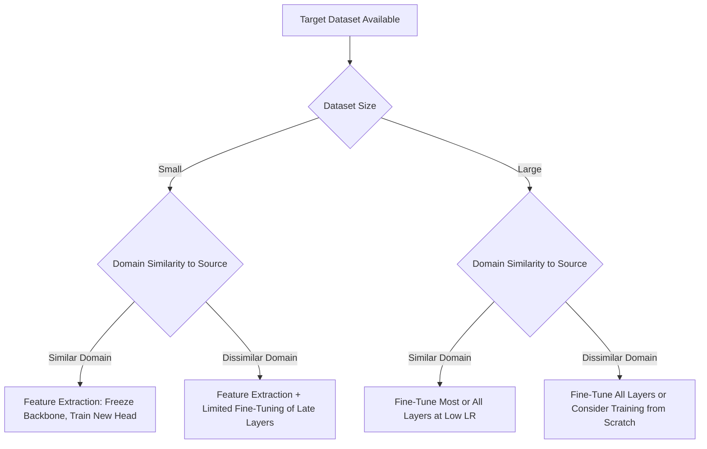

## Transfer Learning for Vision

### Overview

Transfer learning is the practice of reusing a model trained on one task or dataset as a starting point for a different but related task, rather than training from randomly initialized weights. In computer vision, this typically means taking a network pretrained on a large-scale dataset (commonly ImageNet) and adapting it to a smaller, often domain-specific, target dataset.

The core assumption behind transfer learning is that low- and mid-level visual features (edges, textures, shapes, simple patterns) learned on a large diverse dataset generalize across many vision tasks, while higher-level features become more task-specific. [Inference] This layered feature-generality assumption is widely discussed in transfer learning literature; the exact point at which features become task-specific varies by architecture and dataset, and I cannot verify a universal boundary without citing a specific study.

### Problem Formulation

**Source task and target task**

The source task is the original task/dataset the model was pretrained on. The target task is the new task the model is being adapted to, which may have a different label space, image domain, or dataset size.

**Domain shift**

Refers to differences in data distribution between the source and target domains (e.g., natural photographs vs. medical scans). Larger domain shift generally makes transfer less straightforward. [Inference] This general relationship between domain shift magnitude and transfer difficulty is a commonly stated principle in the literature; I cannot verify its precise quantitative effect for any specific pair of domains without citing a specific study.

**Negative transfer**

A situation where using a pretrained model performs worse than training from scratch, typically occurring when the source and target domains or tasks are highly dissimilar. [Unverified] I cannot verify the specific frequency or conditions under which negative transfer occurs in general, as this depends heavily on the specific architecture, dataset pair, and training setup involved.

### Core Strategies

#### Feature Extraction

The pretrained network's weights are frozen, and only a new classification (or task-specific) head is trained on top of the extracted features. This is computationally cheap and often effective when the target dataset is small.

#### Fine-Tuning

Some or all of the pretrained network's weights are unfrozen and updated using the target dataset, typically at a lower learning rate than would be used for training from scratch, to avoid catastrophically overwriting useful pretrained representations. [Inference] The use of a lower learning rate during fine-tuning is a widely followed convention intended to preserve pretrained representations; whether this always avoids degrading useful features depends on the specific learning rate, dataset, and number of training steps, which I cannot verify in general terms.

#### Progressive/Gradual Unfreezing

Layers are unfrozen incrementally, typically starting from the output (task-specific) layers and moving toward the input (general feature) layers, allowing task-specific adaptation before adjusting more general features.

#### Discriminative Learning Rates

Different layers are assigned different learning rates during fine-tuning, often smaller rates for earlier (more general) layers and larger rates for later (more task-specific) layers. [Unverified] I cannot verify that this layer-rate assignment pattern is universally optimal, as effective rate scheduling is architecture- and task-dependent.

### Transfer Learning Decision Flow



### Pretraining Sources

**Supervised pretraining** — The most common historical approach, using large labeled datasets such as ImageNet-1K or ImageNet-21K.

**Self-supervised pretraining** — Learns representations from unlabeled data using pretext tasks (e.g., contrastive learning, masked image modeling). Methods include SimCLR, MoCo, BYOL, and MAE (Masked Autoencoders). [Unverified] I cannot verify comparative performance rankings between these specific methods without citing their respective original benchmark papers.

**Vision-language pretraining** — Models such as CLIP are pretrained on paired image-text data, learning joint representations that can support zero-shot transfer to new classification tasks without task-specific fine-tuning. [Inference] CLIP's zero-shot capability is documented in its original paper as a notable property; the extent to which this generalizes to arbitrary downstream tasks depends on the similarity between the downstream task and CLIP's pretraining distribution, which I cannot verify in general terms.

### Example: Feature Extraction vs. Fine-Tuning in Code

```python
import torch
import torch.nn as nn
from torchvision import models

# Load a pretrained backbone
model = models.resnet50(weights="IMAGENET1K_V2")

# --- Strategy 1: Feature Extraction ---
for param in model.parameters():
    param.requires_grad = False

model.fc = nn.Linear(model.fc.in_features, 5)  # new task: 5 classes
optimizer_feat_extract = torch.optim.Adam(model.fc.parameters(), lr=1e-3)

# --- Strategy 2: Fine-Tuning (all layers, lower LR) ---
for param in model.parameters():
    param.requires_grad = True

model.fc = nn.Linear(model.fc.in_features, 5)
optimizer_finetune = torch.optim.Adam(model.parameters(), lr=1e-5)
```

[Unverified] This code reflects standard, documented `torchvision` API conventions as commonly published; I cannot verify that the exact weight identifier string `"IMAGENET1K_V2"` remains valid in every current or future `torchvision` release without checking the specific installed version's documentation.

### Layer-wise Feature Transferability Diagram

<svg xmlns="http://www.w3.org/2000/svg" viewBox="0 0 900 320">
<text x="450" y="30" font-size="18" font-weight="bold" text-anchor="middle" fill="#1a1a1a">Layer-wise Feature Transferability (svg_diagram)</text>
<rect x="40" y="80" width="160" height="120" rx="6" fill="#e8f0fe" stroke="#4285f4" stroke-width="2" />
<text x="120" y="130" font-size="12" text-anchor="middle" fill="#1a1a1a">Early Layers</text>
<text x="120" y="150" font-size="10" text-anchor="middle" fill="#333">Edges, Colors,</text>
<text x="120" y="165" font-size="10" text-anchor="middle" fill="#333">Simple Textures</text>
<text x="120" y="230" font-size="10" text-anchor="middle" fill="#555">Typically Frozen</text>
<rect x="230" y="80" width="160" height="120" rx="6" fill="#eef2fb" stroke="#5b8def" stroke-width="2" />
<text x="310" y="130" font-size="12" text-anchor="middle" fill="#1a1a1a">Mid Layers</text>
<text x="310" y="150" font-size="10" text-anchor="middle" fill="#333">Shapes, Patterns,</text>
<text x="310" y="165" font-size="10" text-anchor="middle" fill="#333">Object Parts</text>
<text x="310" y="230" font-size="10" text-anchor="middle" fill="#555">Often Fine-Tuned</text>
<rect x="420" y="80" width="160" height="120" rx="6" fill="#fef7e0" stroke="#f9ab00" stroke-width="2" />
<text x="500" y="130" font-size="12" text-anchor="middle" fill="#1a1a1a">Late Layers</text>
<text x="500" y="150" font-size="10" text-anchor="middle" fill="#333">Complex, Semantic</text>
<text x="500" y="165" font-size="10" text-anchor="middle" fill="#333">Combinations</text>
<text x="500" y="230" font-size="10" text-anchor="middle" fill="#555">Usually Fine-Tuned</text>
<rect x="610" y="80" width="160" height="120" rx="6" fill="#e6f4ea" stroke="#34a853" stroke-width="2" />
<text x="690" y="130" font-size="12" text-anchor="middle" fill="#1a1a1a">Task Head</text>
<text x="690" y="150" font-size="10" text-anchor="middle" fill="#333">Class-Specific</text>
<text x="690" y="165" font-size="10" text-anchor="middle" fill="#333">Output Mapping</text>
<text x="690" y="230" font-size="10" text-anchor="middle" fill="#555">Always Replaced/Trained</text>
<line x1="200" y1="140" x2="230" y2="140" stroke="#999" stroke-width="2" marker-end="url(#arrow)" />
<line x1="390" y1="140" x2="420" y2="140" stroke="#999" stroke-width="2" marker-end="url(#arrow)" />
<line x1="580" y1="140" x2="610" y2="140" stroke="#999" stroke-width="2" marker-end="url(#arrow)" />
<text x="450" y="280" font-size="10" text-anchor="middle" fill="#555">[Inference] General pattern described in transfer learning literature; exact transferability boundary is architecture-dependent</text>

</svg>

### Practical Considerations

- **Target dataset size** — Smaller target datasets generally favor feature extraction or limited fine-tuning to reduce overfitting risk; larger target datasets can typically support fine-tuning more layers. [Inference] This is a commonly stated heuristic in transfer learning practice; the exact dataset size threshold at which one strategy outperforms another is not fixed and depends on task and architecture, which I cannot verify as a universal rule.
- **Learning rate selection** — Using an excessively high learning rate during fine-tuning risks disrupting pretrained weights; this is a widely followed precaution rather than a guaranteed outcome for any specific configuration.
- **Choice of pretrained source** — The similarity between the pretraining dataset's domain and the target domain is commonly considered relevant to transfer effectiveness, though I cannot verify a precise similarity metric that reliably predicts transfer success across all cases.
- **Batch normalization statistics** — When fine-tuning, batch normalization layers' running statistics may need to be handled carefully (e.g., whether to freeze or update them), since target dataset batch statistics can differ from source dataset statistics.

### Common Pitfalls

- Using a learning rate suited for training from scratch when fine-tuning, which can degrade previously learned representations.
- Freezing too many layers when the target domain differs substantially from the source domain, potentially limiting the model's capacity to adapt.
- Fine-tuning all layers on a very small target dataset without adequate regularization, which can increase overfitting risk.
- Assuming transfer will always improve performance over training from scratch, without accounting for the possibility of negative transfer in cases of substantial domain or task mismatch.

> Correction note: No universal claims are made above regarding guaranteed performance improvements from transfer learning; all such claims are labeled as inference or unverified where applicable, per stated accuracy requirements.

**Related Topics**

- Self-supervised pretraining methods in depth (SimCLR, MoCo, BYOL, MAE)
- Domain adaptation techniques for vision models
- Few-shot and zero-shot learning approaches
- Vision-language pretraining and CLIP-based transfer
- Catastrophic forgetting in fine-tuning scenarios
- Layer-wise learning rate scheduling strategies