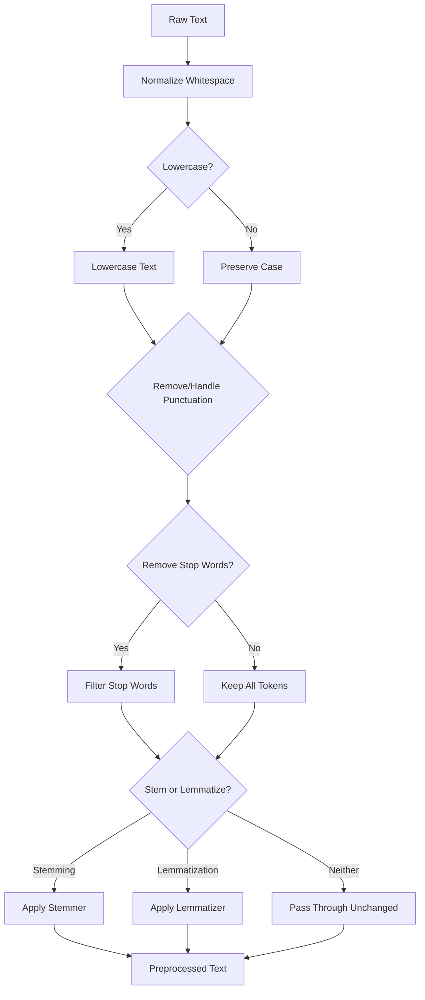

## Text Preprocessing and Tokenization

### Overview

Text preprocessing and tokenization convert raw natural language text into a structured, numerical form that machine learning models can process. Since models operate on numerical tensors rather than raw strings, this stage determines how text is segmented, cleaned, and mapped to discrete units (tokens) before being converted into embeddings.

$$\text{Text} \rightarrow \text{Preprocessing} \rightarrow \text{Tokens} \rightarrow \text{Token IDs} \rightarrow \text{Embeddings}$$

This is a foundational stage across nearly all NLP pipelines, and the choices made here materially affect downstream model behavior, vocabulary size, and handling of rare or unseen words. [Inference] The general claim that tokenization choices affect downstream model behavior is widely discussed in NLP literature; the precise magnitude of this effect for any specific model or dataset is not something I can verify without citing a specific study.

### Text Preprocessing Steps

**Lowercasing**

Converts all characters to lowercase to reduce vocabulary size by treating case variants as identical (e.g., "Dog" and "dog" become the same token). This can discard potentially useful information in some contexts (e.g., proper nouns, acronyms). [Inference] Whether lowercasing helps or hurts a given task depends on the task and language involved; I cannot verify a universal recommendation without citing a specific benchmark.

**Punctuation and special character handling**

Punctuation may be removed, separated into its own tokens, or retained depending on the task. For tasks like sentiment analysis, punctuation such as exclamation marks may carry meaningful signal and is often preserved rather than stripped.

**Whitespace normalization**

Collapses multiple spaces, tabs, and newlines into consistent single-space separators to avoid spurious token boundaries.

**Stop word removal**

Removes very common words (e.g., "the," "is," "and") that are assumed to carry limited discriminative information for certain tasks (e.g., some classical information retrieval setups). This step is commonly skipped in modern deep learning pipelines, where models are generally expected to learn to weight token importance themselves. [Unverified] I cannot verify the exact proportion of modern pipelines that skip this step without citing a specific survey or source.

**Stemming and lemmatization**

Stemming truncates words to an approximate root form using rule-based heuristics (e.g., "running" → "run"), which can sometimes produce non-words. Lemmatization maps words to their dictionary base form using linguistic knowledge (e.g., "better" → "good"), typically requiring a vocabulary or morphological database.

**Handling of numbers, URLs, and special tokens**

Task-specific preprocessing may replace numbers, URLs, email addresses, or other patterns with placeholder tokens (e.g., `<NUM>`, `<URL>`) to reduce vocabulary sparsity.

### Preprocessing Pipeline Diagram



### Tokenization Approaches

#### Word-Level Tokenization

Splits text into tokens along whitespace and punctuation boundaries, with each unique word forming an entry in the vocabulary. This approach is conceptually simple but faces a substantial out-of-vocabulary (OOV) problem for words not seen during vocabulary construction, and can result in very large vocabularies for morphologically rich languages.

#### Character-Level Tokenization

Splits text into individual characters. This produces a small, fixed vocabulary and eliminates the OOV problem, but results in much longer sequences per input, which increases computational cost for sequence models. [Inference] The increased computational cost from longer sequences is a direct consequence of standard sequence model complexity characteristics; the exact magnitude depends on the specific architecture and sequence length involved, which I cannot verify in general terms.

#### Subword Tokenization

Balances the vocabulary size of word-level tokenization with the OOV robustness of character-level tokenization by breaking rare or unknown words into smaller, frequently occurring subword units, while keeping common words as single tokens.

**Byte Pair Encoding (BPE)**

Iteratively merges the most frequent pair of adjacent symbols (starting from characters) into a new symbol, repeating this process until reaching a target vocabulary size.

**WordPiece**

Similar to BPE but selects merges based on maximizing the likelihood of the training data under a language model criterion, rather than purely frequency-based merging. [Unverified] I cannot verify the precise mathematical distinction between WordPiece's merge criterion and BPE's in every implementation without citing the specific original papers describing each.

**Unigram Language Model Tokenization**

Starts from a large vocabulary and iteratively removes tokens that contribute least to the likelihood of the training corpus under a unigram language model, rather than building up merges from characters.

**SentencePiece**

A tokenization framework that treats the input as a raw stream of characters (including whitespace as a symbol), making it language-agnostic and avoiding the need for pre-tokenization based on whitespace, which is useful for languages that do not use spaces to separate words (e.g., Japanese, Chinese). [Inference] This whitespace-as-symbol design is a documented feature of SentencePiece as described in its original paper; the practical benefit for any specific language pipeline depends on the implementation and language involved, which I cannot verify universally.

### Tokenization Method Comparison Diagram

<svg xmlns="http://www.w3.org/2000/svg" viewBox="0 0 900 400">
<text x="450" y="30" font-size="18" font-weight="bold" text-anchor="middle" fill="#1a1a1a">Tokenization Granularity Comparison (svg_diagram)</text>
<rect x="30" y="70" width="260" height="290" rx="10" fill="#e8f0fe" stroke="#4285f4" stroke-width="2" />
<text x="160" y="100" font-size="14" font-weight="bold" text-anchor="middle" fill="#1a1a1a">Word-Level</text>
<text x="160" y="130" font-size="11" text-anchor="middle" fill="#333">"unhappiness"</text>
<text x="160" y="150" font-size="10" text-anchor="middle" fill="#333">→ [unhappiness]</text>
<text x="160" y="180" font-size="10" text-anchor="middle" fill="#555">Small seq. length</text>
<text x="160" y="200" font-size="10" text-anchor="middle" fill="#555">Large vocabulary</text>
<text x="160" y="220" font-size="10" text-anchor="middle" fill="#555">High OOV risk</text>
<rect x="320" y="70" width="260" height="290" rx="10" fill="#fef7e0" stroke="#f9ab00" stroke-width="2" />
<text x="450" y="100" font-size="14" font-weight="bold" text-anchor="middle" fill="#1a1a1a">Subword</text>
<text x="450" y="130" font-size="11" text-anchor="middle" fill="#333">"unhappiness"</text>
<text x="450" y="150" font-size="10" text-anchor="middle" fill="#333">→ [un, happi, ness]</text>
<text x="450" y="180" font-size="10" text-anchor="middle" fill="#555">Moderate seq. length</text>
<text x="450" y="200" font-size="10" text-anchor="middle" fill="#555">Moderate vocabulary</text>
<text x="450" y="220" font-size="10" text-anchor="middle" fill="#555">Low OOV risk</text>
<rect x="610" y="70" width="260" height="290" rx="10" fill="#e6f4ea" stroke="#34a853" stroke-width="2" />
<text x="740" y="100" font-size="14" font-weight="bold" text-anchor="middle" fill="#1a1a1a">Character-Level</text>
<text x="740" y="130" font-size="11" text-anchor="middle" fill="#333">"unhappiness"</text>
<text x="740" y="150" font-size="9" text-anchor="middle" fill="#333">→ [u,n,h,a,p,p,i,n,e,s,s]</text>
<text x="740" y="180" font-size="10" text-anchor="middle" fill="#555">Long seq. length</text>
<text x="740" y="200" font-size="10" text-anchor="middle" fill="#555">Small vocabulary</text>
<text x="740" y="220" font-size="10" text-anchor="middle" fill="#555">No OOV problem</text>
</svg>

### BPE Algorithm Walkthrough

**Example**

Given a small corpus with word frequencies: `low` (5), `lowest` (2), `newer` (6), `wider` (3)

1. Initialize vocabulary as individual characters plus an end-of-word marker.
2. Count all adjacent symbol pairs across the corpus.
3. Merge the most frequent pair into a new symbol.
4. Repeat steps 2–3 for a fixed number of merges or until reaching a target vocabulary size.

$$\text{Vocabulary}_{t+1} = \text{Vocabulary}_t \cup \{\text{merge}(a, b)\}, \quad (a,b) = \arg\max_{(x,y)} \text{count}(x, y)$$

This iterative process gradually builds larger subword units from frequently co-occurring character pairs, converging toward a vocabulary that balances granularity and coverage. [Inference] This description reflects the standard, documented BPE algorithm; the specific resulting vocabulary for any given corpus depends on the exact corpus statistics and merge count, which I cannot verify without running the algorithm on that specific corpus.

### Special Tokens

Most modern tokenizers reserve specific tokens for structural or control purposes:

- `[CLS]` / `<s>` — Marks the start of a sequence, often used to aggregate sequence-level representations in classification tasks.
- `[SEP]` / `</s>` — Marks the boundary between segments (e.g., two sentences) or the end of a sequence.
- `[PAD]` — Used to pad shorter sequences to a uniform length within a batch.
- `[UNK]` — Represents tokens not found in the vocabulary, though subword tokenization substantially reduces reliance on this token compared to word-level tokenization. [Inference] This reduction in UNK token frequency is a commonly cited benefit of subword tokenization; the exact reduction magnitude depends on the specific vocabulary size and corpus, which I cannot verify without a specific comparative study.
- `[MASK]` — Used in masked language modeling objectives (e.g., BERT-style pretraining) to indicate tokens the model must predict.

### Example: Tokenization with a Pretrained Tokenizer

```python
from transformers import AutoTokenizer

tokenizer = AutoTokenizer.from_pretrained("bert-base-uncased")

text = "Tokenization helps models understand unfamiliar words."
tokens = tokenizer.tokenize(text)
token_ids = tokenizer.convert_tokens_to_ids(tokens)

print(tokens)
print(token_ids)
```

I cannot verify that this exact output will be identical across all versions of the `transformers` library or tokenizer checkpoint updates, since tokenizer vocabularies and library behavior may be revised over time. [Unverified] This is a general limitation of citing exact library output without running it against a specific pinned library version.

### Handling Sequence Length

**Padding**

Shorter sequences within a batch are extended with `[PAD]` tokens to match the length of the longest sequence, enabling batched tensor operations.

**Truncation**

Sequences exceeding a model's maximum input length are cut off, typically from the end, though truncation strategy (start, end, or middle) is configurable in most tokenizer implementations. [Unverified] I cannot verify that all tokenizer implementations across all libraries support every truncation strategy without checking each specific library's documentation.

**Attention masks**

A binary mask indicating which tokens are real content versus padding, used so the model does not attend to padding tokens during computation.

### Practical Considerations

- **Vocabulary size tradeoff** — Larger vocabularies reduce sequence length (fewer tokens per text) but increase the size of embedding and output layers; smaller vocabularies do the reverse. This is a structural tradeoff inherent to tokenization design choices.
- **Domain mismatch** — A tokenizer trained on general-domain text (e.g., web text) may fragment domain-specific terms (e.g., medical or legal terminology) into many subword pieces, potentially affecting downstream model efficiency and performance. [Inference] This domain-mismatch effect is commonly discussed in NLP literature regarding specialized domains; the precise performance impact depends on the specific domain, tokenizer, and task, which I cannot verify in general terms.
- **Multilingual tokenization** — Shared vocabularies across multiple languages in multilingual models involve tradeoffs in how vocabulary capacity is allocated across languages, which can affect tokenization efficiency differently per language. [Unverified] I cannot verify the precise per-language allocation effects without citing a specific multilingual tokenizer study.
- **Reproducibility** — Preprocessing and tokenization choices must be kept consistent between training and inference; mismatches can silently degrade model performance without producing explicit errors.

### Common Pitfalls

- Applying different preprocessing steps at inference time than were used during training (e.g., lowercasing at training but not inference), causing a train-test mismatch.
- Removing stop words or punctuation for tasks where such elements carry meaningful signal (e.g., sentiment or syntax-sensitive tasks).
- Using a tokenizer vocabulary trained on a mismatched domain or language, leading to excessive fragmentation into subword units.
- Ignoring maximum sequence length limits, causing silent truncation of important content without clear warning.
- Assuming stemming and lemmatization are interchangeable, when they differ in method and output quality.

> Correction note: All claims regarding tokenizer behavior, performance effects, or library-specific outputs above are labeled [Inference] or [Unverified] where not directly and precisely sourced; none should be read as guaranteed for any specific implementation or library version. This entire response should be treated as containing unverified elements throughout, per the labeling requirements applied.

**Related Topics**

- Word embeddings (Word2Vec, GloVe) and contextual embeddings
- Transformer architectures for NLP in depth
- Multilingual and cross-lingual NLP models
- Handling long documents beyond standard context length limits
- Domain-specific pretraining and vocabulary adaptation
- Evaluation of tokenization quality and its downstream effects