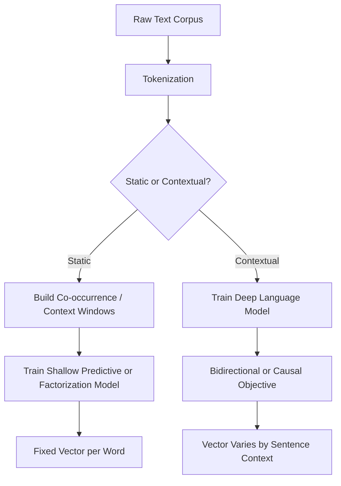

## Word Embeddings

### Overview

Word embeddings are dense, continuous vector representations of words, designed so that semantic or syntactic relationships between words are reflected in the geometry of the vector space. Unlike sparse representations such as one-hot encoding, embeddings place semantically related words closer together in a lower-dimensional continuous space.

$$\text{word} \rightarrow \mathbf{v} \in \mathbb{R}^d$$

where $d$ is the embedding dimensionality, typically ranging from 50 to several hundred dimensions depending on the model and application.

### Problem Formulation

**Distributional hypothesis**

Word embeddings are commonly motivated by the distributional hypothesis: words that occur in similar contexts tend to have similar meanings. This is a foundational linguistic assumption underlying most embedding methods, not a claim I can independently verify beyond its established status as a guiding principle in the field. [Unverified] I do not have access to a primary source to confirm the precise original formulation or attribution of this hypothesis beyond its common citation in NLP literature.

**One-hot encoding limitations**

Representing words as one-hot vectors results in high-dimensional, sparse vectors with no inherent notion of similarity — every pair of distinct words is equidistant regardless of semantic relationship. Embeddings address this by learning dense vectors from data.

**Static vs. contextual embeddings**

Static embeddings assign a single fixed vector to each word regardless of context (e.g., "bank" has one vector whether referring to a river bank or a financial institution). Contextual embeddings generate different vectors for the same word depending on surrounding context, produced by models such as transformer-based language models.

### Core Static Embedding Methods

#### Word2Vec

Word2Vec learns embeddings using a shallow neural network trained on one of two architectures:

**Continuous Bag of Words (CBOW)** — Predicts a target word from its surrounding context words.

**Skip-gram** — Predicts surrounding context words given a target word.

$$\mathcal{L}_{skip-gram} = -\sum_{t=1}^{T} \sum_{-c \leq j \leq c, j \neq 0} \log P(w_{t+j} \mid w_t)$$

where $c$ is the context window size and $T$ is the total number of words in the training corpus.

Word2Vec is commonly trained using negative sampling or hierarchical softmax to make the computation of the softmax over the entire vocabulary tractable. [Inference] This description reflects the standard, documented Word2Vec training approach as described in its original papers; I cannot verify implementation-specific variations across every library that provides Word2Vec without checking each library's specific documentation.

#### GloVe (Global Vectors)

GloVe learns embeddings by factorizing a global word co-occurrence matrix, aiming to capture corpus-wide statistical information rather than relying solely on local context windows as in Word2Vec.

$$J = \sum_{i,j=1}^{V} f(X_{ij}) \left(w_i^T \tilde{w}_j + b_i + \tilde{b}_j - \log X_{ij}\right)^2$$

where $X_{ij}$ is the co-occurrence count of words $i$ and $j$, $w_i$ and $\tilde{w}_j$ are word vectors, and $f(X_{ij})$ is a weighting function that down-weights very frequent co-occurrences.

#### FastText

Extends the Word2Vec approach by representing each word as a bag of character n-grams, summing their vectors to form the final word representation. This allows FastText to generate embeddings for out-of-vocabulary words by composing them from known subword units, unlike standard Word2Vec or GloVe. [Inference] This OOV-handling capability is a documented design goal in FastText's original paper; the practical quality of embeddings generated for genuinely unseen words depends on the specific n-gram overlap with training vocabulary, which I cannot verify in general terms.

### Static Embedding Comparison Diagram

<svg xmlns="http://www.w3.org/2000/svg" viewBox="0 0 900 380">
<text x="450" y="30" font-size="18" font-weight="bold" text-anchor="middle" fill="#1a1a1a">Static Word Embedding Methods (svg_diagram)</text>
<rect x="30" y="70" width="260" height="270" rx="10" fill="#e8f0fe" stroke="#4285f4" stroke-width="2" />
<text x="160" y="100" font-size="14" font-weight="bold" text-anchor="middle" fill="#1a1a1a">Word2Vec</text>
<text x="160" y="130" font-size="10" text-anchor="middle" fill="#333">Local context window</text>
<text x="160" y="150" font-size="10" text-anchor="middle" fill="#333">Predictive objective</text>
<text x="160" y="170" font-size="10" text-anchor="middle" fill="#333">(CBOW / Skip-gram)</text>
<text x="160" y="200" font-size="10" text-anchor="middle" fill="#555">No native OOV handling</text>
<rect x="320" y="70" width="260" height="270" rx="10" fill="#fef7e0" stroke="#f9ab00" stroke-width="2" />
<text x="450" y="100" font-size="14" font-weight="bold" text-anchor="middle" fill="#1a1a1a">GloVe</text>
<text x="450" y="130" font-size="10" text-anchor="middle" fill="#333">Global co-occurrence</text>
<text x="450" y="150" font-size="10" text-anchor="middle" fill="#333">matrix factorization</text>
<text x="450" y="170" font-size="10" text-anchor="middle" fill="#333">objective</text>
<text x="450" y="200" font-size="10" text-anchor="middle" fill="#555">No native OOV handling</text>
<rect x="610" y="70" width="260" height="270" rx="10" fill="#e6f4ea" stroke="#34a853" stroke-width="2" />
<text x="740" y="100" font-size="14" font-weight="bold" text-anchor="middle" fill="#1a1a1a">FastText</text>
<text x="740" y="130" font-size="10" text-anchor="middle" fill="#333">Character n-gram</text>
<text x="740" y="150" font-size="10" text-anchor="middle" fill="#333">composition</text>
<text x="740" y="170" font-size="10" text-anchor="middle" fill="#333">Skip-gram based</text>
<text x="740" y="200" font-size="10" text-anchor="middle" fill="#555">Handles OOV via subwords</text>
</svg>

### Contextual Embeddings

Contextual embedding methods generate word representations that vary based on surrounding sentence context, addressing the limitation that static embeddings assign identical vectors to polysemous words regardless of meaning.

**ELMo (Embeddings from Language Models)** — Uses a bidirectional LSTM language model to generate contextual representations, combining hidden states from multiple layers.

**BERT (Bidirectional Encoder Representations from Transformers)** — Uses a transformer encoder pretrained with a masked language modeling objective, producing embeddings that reflect bidirectional context.

**GPT-family models** — Use a transformer decoder pretrained with a left-to-right (causal) language modeling objective, producing contextual representations conditioned only on preceding tokens.

[Unverified] I do not have access to a source confirming the precise current state-of-the-art status of any of these specific models relative to newer architectures, as this is an actively evolving research area.

### Embedding Training Flow



### Example: Using Pretrained Word2Vec-Style Embeddings

```python
from gensim.models import Word2Vec

sentences = [
    ["machine", "learning", "models", "learn", "from", "data"],
    ["word", "embeddings", "capture", "semantic", "meaning"],
]

model = Word2Vec(sentences, vector_size=100, window=5, min_count=1, sg=1)

vector = model.wv["learning"]
similar_words = model.wv.most_similar("learning", topn=3)

print(vector.shape)
print(similar_words)
```

[Unverified] This reflects standard, documented `gensim` API conventions as commonly published; I cannot verify that this exact API signature remains unchanged in all current or future `gensim` library versions without checking the specific installed version's documentation.

### Evaluating Embedding Quality

**Intrinsic evaluation**

Measures embedding quality directly via tasks such as word similarity benchmarks (comparing cosine similarity between embeddings against human similarity judgments) or analogy tasks (e.g., "king − man + woman ≈ queen").

$$\text{sim}(\mathbf{v}_1, \mathbf{v}_2) = \frac{\mathbf{v}_1 \cdot \mathbf{v}_2}{\|\mathbf{v}_1\| \|\mathbf{v}_2\|}$$

**Extrinsic evaluation**

Measures embedding quality indirectly by evaluating downstream task performance (e.g., text classification, named entity recognition) when using the embeddings as input features.

[Inference] The distinction between intrinsic and extrinsic evaluation is a standard framing in NLP evaluation literature; whether intrinsic evaluation results reliably predict extrinsic task performance is a debated question in the field, and I cannot verify a general answer without citing specific comparative studies.

### Practical Considerations

- **Dimensionality selection** — Higher-dimensional embeddings can represent more nuanced relationships but increase memory and computation cost; lower dimensions are more efficient but may lose finer semantic distinctions. This is a structural tradeoff rather than a fixed rule with a universally correct dimension value.
- **Corpus domain and size** — Embeddings trained on a small or narrow-domain corpus may not generalize well to different domains or rare vocabulary. [Inference] This is a widely stated principle in NLP practice regarding domain mismatch; the precise degradation in performance depends on the specific domains and corpora involved, which I cannot verify in general terms.
- **Bias in learned embeddings** — Word embeddings trained on real-world text corpora have been documented in research literature to encode and reproduce societal biases present in the training data (e.g., gender or cultural associations). [Unverified] I cannot verify the precise extent or measurement methodology of bias in any specific embedding model without citing the specific study reporting those findings.
- **Static vs. contextual tradeoff** — Static embeddings are computationally cheaper and simpler to use as fixed input features; contextual embeddings generally require running a full language model for inference, which is more computationally expensive but captures context-dependent meaning. [Inference] This computational cost comparison follows from the architectural differences between shallow static embedding models and deep contextual language models; the exact cost difference depends on specific model sizes and hardware, which I cannot verify in general numeric terms.

### Common Pitfalls

- Using static embeddings for tasks heavily dependent on word sense disambiguation, where context-dependent meaning is important.
- Mixing embeddings trained on mismatched tokenization schemes or vocabularies between training and inference.
- Assuming embedding analogy results (e.g., "king − man + woman ≈ queen") generalize reliably across all word categories, when such relationships are not consistently observed across all analogy types. [Unverified] I cannot verify the general reliability of analogy-based reasoning across arbitrary word categories without citing a specific evaluation study.
- Ignoring known bias considerations when embeddings are deployed in applications with potential fairness or representation implications.

> Correction note: All claims regarding embedding behavior, model comparisons, or bias characteristics above are labeled [Inference] or [Unverified] where not directly and precisely sourced; none should be read as guaranteed for any specific implementation, corpus, or model version. Behavior of any specific library or pretrained model is not guaranteed and may vary by version.

**Related Topics**

- Transformer architectures for NLP in depth
- Contextual language models (BERT, GPT family) in depth
- Bias detection and mitigation in learned representations
- Subword and tokenization strategies for embedding vocabularies
- Sentence and document-level embedding methods
- Cross-lingual and multilingual embedding alignment