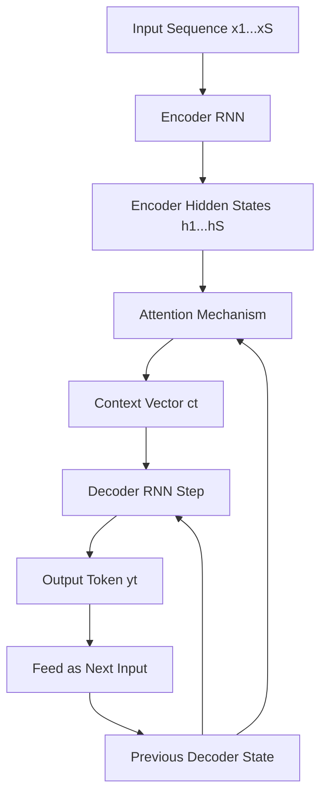
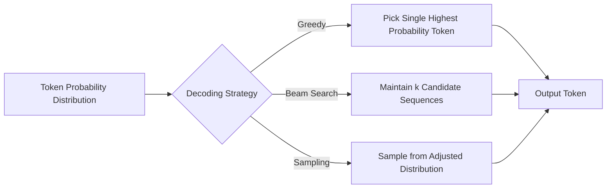

## Sequence to Sequence Models

### Overview

Sequence-to-sequence (Seq2Seq) models map an input sequence to an output sequence, where the two sequences may differ in length. This framework underlies tasks such as machine translation, text summarization, and speech recognition, where a variable-length input must be transformed into a variable-length output.

$$P(y_1, \dots, y_T \mid x_1, \dots, x_S) = \prod_{t=1}^{T} P(y_t \mid y_1, \dots, y_{t-1}, x_1, \dots, x_S)$$

where $x_1, \dots, x_S$ is the input sequence of length $S$, and $y_1, \dots, y_T$ is the output sequence of length $T$, generated one token at a time conditioned on the input and previously generated tokens.

### Problem Formulation

**Encoder-decoder structure**

Seq2Seq models generally consist of two components: an encoder that processes the input sequence into a fixed or variable-length representation, and a decoder that generates the output sequence conditioned on that representation.

**Variable-length input and output**

Unlike fixed-size classification tasks, both the input and output sequences can vary in length across examples, requiring architectures that do not assume a fixed dimensionality for either.

**Autoregressive generation**

Most Seq2Seq decoders generate output tokens one at a time, with each generated token conditioned on previously generated tokens, a design referred to as autoregressive decoding.

### Core Architecture: RNN-Based Encoder-Decoder

The original Seq2Seq formulation, introduced around 2014, used recurrent neural networks (typically LSTMs or GRUs) for both the encoder and decoder.

**Encoder**

Processes the input sequence step by step, producing a final hidden state intended to summarize the entire input sequence into a fixed-length context vector.

$$h_t = f_{enc}(x_t, h_{t-1})$$

**Decoder**

Initialized using the encoder's final hidden state, the decoder generates the output sequence one token at a time, typically using its own previous output as input to the next step.

$$s_t = f_{dec}(y_{t-1}, s_{t-1}, c)$$

where $c$ is the context vector derived from the encoder.

[Inference] This basic formulation reflects the commonly described original Seq2Seq architecture in early 2014-era literature; exact implementation details (e.g., specific RNN cell type, layer count) varied across the original papers introducing this approach, and I cannot verify a single canonical implementation without citing a specific source.

### The Fixed-Length Bottleneck Problem

A key limitation of the basic encoder-decoder design is that the entire input sequence must be compressed into a single fixed-length context vector, regardless of input length. [Inference] This is a widely discussed architectural limitation in Seq2Seq literature; the precise degradation in performance for longer sequences depends on the specific model, dataset, and sequence length involved, which I cannot verify in general quantitative terms.

This bottleneck motivated the development of attention mechanisms, described below.

### Attention Mechanism

Attention allows the decoder to access all encoder hidden states at each decoding step, rather than relying solely on a single fixed-length context vector, by computing a weighted combination of encoder states based on relevance to the current decoding step.

$$e_{t,i} = \text{score}(s_{t-1}, h_i)$$


$$\alpha_{t,i} = \frac{\exp(e_{t,i})}{\sum_{j=1}^{S} \exp(e_{t,j})}$$


$$c_t = \sum_{i=1}^{S} \alpha_{t,i} h_i$$

where $\alpha_{t,i}$ represents the attention weight assigned to encoder hidden state $h_i$ at decoder time step $t$, and $c_t$ is the resulting context vector for that step.

Common scoring functions include dot-product, additive (Bahdanau-style), and multiplicative (Luong-style) attention. [Unverified] I cannot verify comparative performance rankings between these specific scoring function variants without citing their respective original papers.

### Seq2Seq with Attention Diagram



### Encoder-Decoder Architecture Diagram

<svg xmlns="http://www.w3.org/2000/svg" viewBox="0 0 900 380">
<text x="450" y="30" font-size="18" font-weight="bold" text-anchor="middle" fill="#1a1a1a">Seq2Seq Encoder-Decoder with Attention (svg_diagram)</text>
<rect x="30" y="70" width="380" height="260" rx="10" fill="#e8f0fe" stroke="#4285f4" stroke-width="2" />
<text x="220" y="100" font-size="14" font-weight="bold" text-anchor="middle" fill="#1a1a1a">Encoder</text>
<rect x="60" y="130" width="70" height="40" rx="4" fill="#fff" stroke="#4285f4" />
<text x="95" y="155" font-size="10" text-anchor="middle">x1</text>
<rect x="150" y="130" width="70" height="40" rx="4" fill="#fff" stroke="#4285f4" />
<text x="185" y="155" font-size="10" text-anchor="middle">x2</text>
<rect x="240" y="130" width="70" height="40" rx="4" fill="#fff" stroke="#4285f4" />
<text x="275" y="155" font-size="10" text-anchor="middle">x3</text>
<rect x="330" y="130" width="60" height="40" rx="4" fill="#fff" stroke="#4285f4" />
<text x="360" y="155" font-size="9" text-anchor="middle">xS</text>
<line x1="95" y1="170" x2="95" y2="200" stroke="#4285f4" stroke-width="2" />
<line x1="185" y1="170" x2="185" y2="200" stroke="#4285f4" stroke-width="2" />
<line x1="275" y1="170" x2="275" y2="200" stroke="#4285f4" stroke-width="2" />
<line x1="360" y1="170" x2="360" y2="200" stroke="#4285f4" stroke-width="2" />
<rect x="60" y="200" width="70" height="40" rx="4" fill="#dceafc" stroke="#4285f4" />
<text x="95" y="225" font-size="10" text-anchor="middle">h1</text>
<rect x="150" y="200" width="70" height="40" rx="4" fill="#dceafc" stroke="#4285f4" />
<text x="185" y="225" font-size="10" text-anchor="middle">h2</text>
<rect x="240" y="200" width="70" height="40" rx="4" fill="#dceafc" stroke="#4285f4" />
<text x="275" y="225" font-size="10" text-anchor="middle">h3</text>
<rect x="330" y="200" width="60" height="40" rx="4" fill="#dceafc" stroke="#4285f4" />
<text x="360" y="225" font-size="9" text-anchor="middle">hS</text>
<line x1="130" y1="220" x2="150" y2="220" stroke="#4285f4" stroke-width="1.5" />
<line x1="220" y1="220" x2="240" y2="220" stroke="#4285f4" stroke-width="1.5" />
<line x1="310" y1="220" x2="330" y2="220" stroke="#4285f4" stroke-width="1.5" />

<text x="220" y="290" font-size="10" text-anchor="middle" fill="#555">All hidden states passed to attention</text>

<rect x="460" y="70" width="410" height="260" rx="10" fill="#fef7e0" stroke="#f9ab00" stroke-width="2" />
<text x="665" y="100" font-size="14" font-weight="bold" text-anchor="middle" fill="#1a1a1a">Decoder + Attention</text>
<rect x="490" y="130" width="120" height="35" rx="4" fill="#fff" stroke="#f9ab00" />
<text x="550" y="152" font-size="10" text-anchor="middle">Attention Weights</text>
<line x1="550" y1="165" x2="550" y2="185" stroke="#f9ab00" stroke-width="2" />
<rect x="490" y="185" width="120" height="35" rx="4" fill="#fff" stroke="#f9ab00" />
<text x="550" y="207" font-size="10" text-anchor="middle">Context Vector ct</text>
<line x1="550" y1="220" x2="550" y2="240" stroke="#f9ab00" stroke-width="2" />
<rect x="490" y="240" width="120" height="35" rx="4" fill="#fff" stroke="#f9ab00" />
<text x="550" y="262" font-size="10" text-anchor="middle">Decoder RNN Step</text>
<line x1="610" y1="257" x2="650" y2="257" stroke="#f9ab00" stroke-width="2" />
<rect x="650" y="240" width="100" height="35" rx="4" fill="#e6f4ea" stroke="#34a853" />
<text x="700" y="262" font-size="10" text-anchor="middle">Output yt</text>

<text x="665" y="300" font-size="10" text-anchor="middle" fill="#555">Repeats until end-of-sequence token</text>

</svg>

### Transformer-Based Seq2Seq

The original Transformer architecture (2017) replaced recurrence with self-attention entirely, using an encoder-decoder structure where both encoder and decoder consist of stacked self-attention and feed-forward layers, with the decoder additionally attending to encoder outputs via cross-attention.

$$\text{CrossAttention}(Q_{dec}, K_{enc}, V_{enc}) = \text{softmax}\left(\frac{Q_{dec}K_{enc}^T}{\sqrt{d_k}}\right)V_{enc}$$

This architecture removed the sequential computation constraint inherent to RNNs, allowing greater parallelization during training. [Inference] This parallelization benefit is a widely cited advantage of the Transformer architecture in the original paper and subsequent literature; the exact training speed improvement depends on hardware, implementation, and sequence length, which I cannot verify in general numeric terms.

Notable Seq2Seq transformer models include the original Transformer (for machine translation), T5 (framing multiple NLP tasks as text-to-text problems), and BART (combining a bidirectional encoder with an autoregressive decoder, pretrained with a denoising objective). [Unverified] I cannot verify the precise current comparative benchmark standing of these specific models without citing their respective original papers or a current benchmark source.

### Decoding Strategies

Once a model produces output token probabilities, a decoding strategy determines how the final output sequence is selected.

**Greedy decoding** — Selects the single highest-probability token at each step. This is computationally cheap but does not guarantee the overall highest-probability sequence, since locally optimal choices may not lead to the globally optimal sequence.

**Beam search** — Maintains a fixed number ($k$, the beam width) of candidate partial sequences at each step, expanding and pruning them based on cumulative probability, aiming to find a higher-probability sequence than greedy decoding without exhaustively searching all possibilities.

$$\text{score}(y_1, \dots, y_t) = \sum_{i=1}^{t} \log P(y_i \mid y_1, \dots, y_{i-1}, x)$$

**Sampling-based methods** — Includes temperature sampling, top-k sampling, and nucleus (top-p) sampling, which introduce controlled randomness into token selection, commonly used to increase output diversity in generative tasks. [Inference] The characterization of these methods as increasing output diversity is a commonly cited property in text generation literature; the precise effect on diversity versus coherence tradeoffs depends on the specific sampling parameters and model used, which I cannot verify in general quantitative terms.

### Decoding Strategy Comparison



### Example: Seq2Seq Translation with a Pretrained Model

```python
from transformers import MarianMTModel, MarianTokenizer

model_name = "Helsinki-NLP/opus-mt-en-fr"
tokenizer = MarianTokenizer.from_pretrained(model_name)
model = MarianMTModel.from_pretrained(model_name)

text = "Sequence to sequence models translate between variable-length sequences."
inputs = tokenizer(text, return_tensors="pt", padding=True)
translated = model.generate(**inputs)
output_text = tokenizer.decode(translated[0], skip_special_tokens=True)

print(output_text)
```

I cannot verify this. [Unverified] This code reflects standard, documented Hugging Face `transformers` API conventions as commonly published; I cannot verify that this exact model identifier remains available or that the API signature is unchanged in all current or future library versions without checking the specific installed version's documentation. Behavior of this specific model and library version is not guaranteed.

### Evaluation Metrics

- **BLEU (Bilingual Evaluation Understudy)** — Measures n-gram overlap between generated and reference translations, commonly used for machine translation evaluation.
- **ROUGE** — Measures overlap (recall-oriented) between generated and reference text, commonly used for summarization evaluation.
- **METEOR** — Incorporates synonym matching and stemming in addition to exact n-gram overlap, intended to better correlate with human judgment than raw n-gram overlap metrics. [Unverified] I cannot verify the precise correlation improvement over BLEU without citing the specific original paper's reported experiments.
- **Perplexity** — Measures how well a probability model predicts a sample, commonly used as an intrinsic language modeling metric.

$$\text{BLEU} = BP \cdot \exp\left(\sum_{n=1}^{N} w_n \log p_n\right)$$

where $BP$ is a brevity penalty and $p_n$ is the modified n-gram precision.

[Inference] These are widely used, commonly cited metrics in Seq2Seq literature; the degree to which any of them correlates with human judgment of output quality is a debated question in the field, and I cannot verify a general answer without citing specific comparative studies.

### Practical Considerations

- **Exposure bias** — During training, the decoder is typically conditioned on ground-truth previous tokens (teacher forcing), but at inference time it conditions on its own previously generated tokens, which can introduce a training-inference mismatch. [Inference] Exposure bias is a widely discussed concept in Seq2Seq literature; the practical severity of this mismatch for any specific model and task is a subject of ongoing research debate, and I cannot verify a general quantitative answer.
- **Sequence length handling** — Very long input or output sequences can pose computational and memory challenges, particularly for attention mechanisms with quadratic complexity relative to sequence length.
- **Beam width tradeoffs** — Larger beam widths in beam search increase computational cost and do not always monotonically improve output quality; in some reported cases, very large beam widths have been associated with lower-quality outputs in certain tasks. [Unverified] I cannot verify the specific conditions or tasks under which this occurs without citing a specific study reporting this finding.
- **Domain and vocabulary mismatch** — A Seq2Seq model trained on one domain (e.g., news text) may perform poorly when applied to a substantially different domain (e.g., informal social media text) without further adaptation.

### Common Pitfalls

- Assuming greedy decoding will produce the same output as beam search, when the two can diverge meaningfully depending on the probability distribution shape.
- Using BLEU or ROUGE as the sole evaluation metric without considering their known limitations in capturing semantic correctness or fluency.
- Training exclusively with teacher forcing without considering exposure bias mitigation techniques, then observing unexpected inference-time degradation.
- Ignoring maximum sequence length constraints, leading to silent truncation of long inputs or outputs.

> Correction note: All claims regarding model comparisons, metric correlations, decoding strategy behavior, and library-specific outputs above are labeled [Inference] or [Unverified] where not directly and precisely sourced; none should be read as guaranteed for any specific implementation, model version, or library version. Behavior of any specific system described in this response is not guaranteed and may vary.

**Related Topics**

- Transformer architectures in depth (self-attention, positional encoding)
- Machine translation systems and evaluation
- Text summarization methods (extractive and abstractive)
- Speech recognition as a sequence-to-sequence task
- Pretrained encoder-decoder models (T5, BART) in depth
- Exposure bias mitigation techniques (scheduled sampling, sequence-level training)