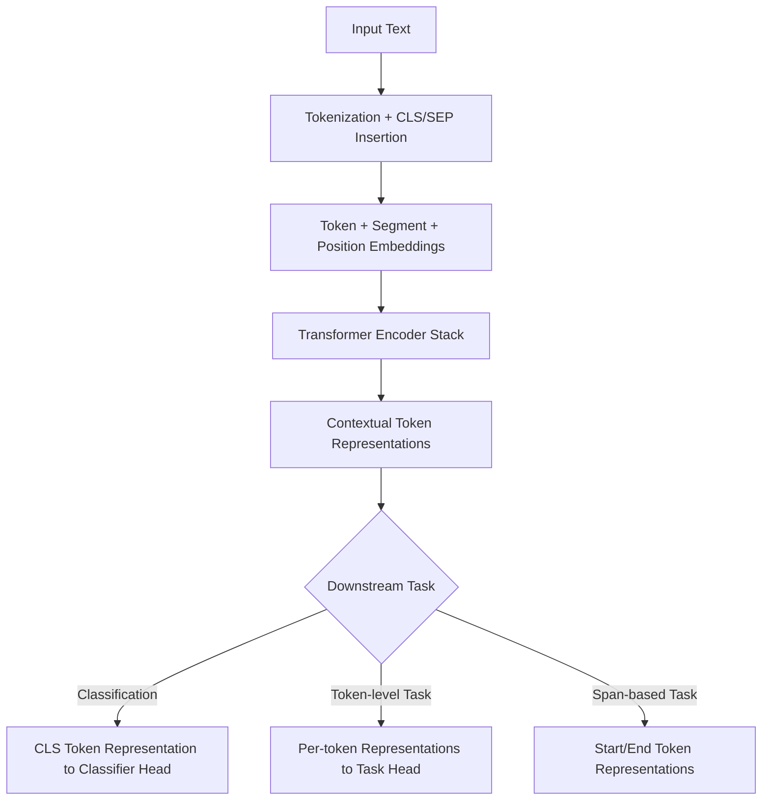

## BERT and Pretrained Language Models

### Overview

BERT (Bidirectional Encoder Representations from Transformers) is a pretrained language model that uses a transformer encoder to produce deep bidirectional representations of text, conditioning each token's representation on both its left and right context simultaneously. It is part of a broader family of pretrained language models that learn general-purpose language representations from large unlabeled text corpora before being adapted to specific downstream tasks.

$$h = \text{TransformerEncoder}(x_1, \dots, x_n)$$

where each output representation $h_i$ is informed by the entire input sequence, not only preceding or following tokens alone.

### Problem Formulation

**Pretraining and fine-tuning paradigm**

Pretrained language models are first trained on large unlabeled corpora using self-supervised objectives, then adapted (fine-tuned) to specific downstream tasks using smaller labeled datasets. This two-stage approach is a defining characteristic of this model family.

**Bidirectional vs. unidirectional context**

Unlike autoregressive models (e.g., GPT-family models) that condition only on preceding tokens, BERT's encoder attends to the full input sequence in both directions simultaneously, which is intended to allow richer contextual representations for tasks that benefit from full-sentence context. [Inference] This bidirectionality rationale is described in BERT's original paper as a motivating design choice; whether it yields better representations than unidirectional models for any specific task is dependent on the task itself, and I cannot verify a universal performance ranking without citing specific comparative studies.

### Pretraining Objectives

#### Masked Language Modeling (MLM)

A percentage of input tokens are replaced with a special `[MASK]` token (or, in some cases, a random token or left unchanged), and the model is trained to predict the original token at each masked position using the surrounding bidirectional context.

$$\mathcal{L}_{MLM} = -\sum_{i \in M} \log P(x_i \mid x_{\setminus M})$$

where $M$ is the set of masked positions and $x_{\setminus M}$ denotes the input sequence with those positions masked.

I cannot verify the exact original masking ratio and token-replacement proportions used in every published BERT variant without citing each specific paper directly. [Unverified] The commonly cited figures (e.g., masking around 15% of tokens, with further sub-splits for `[MASK]`, random token, and unchanged token substitution) originate from BERT's original paper, but I do not have that source open to confirm the precise numbers here.

#### Next Sentence Prediction (NSP)

In BERT's original formulation, the model was also trained to predict whether one sentence follows another in the original text, given two input sentence segments. [Unverified] I cannot verify without citing the specific original paper whether NSP's contribution to downstream performance was later found to be significant or limited, as subsequent research has debated this point.

#### Alternative and Later Objectives

Subsequent pretrained language models introduced alternative or modified pretraining objectives:

- **RoBERTa** — Removed the NSP objective and used dynamic masking (generating masking patterns on the fly rather than statically), among other training modifications. [Unverified] I cannot verify the precise comparative performance improvement attributed to these specific changes without citing RoBERTa's original paper.
- **ALBERT** — Introduced parameter-sharing across layers and factorized embedding parameterization, aimed at reducing model size. [Unverified] I cannot verify the exact parameter reduction figures without citing the specific original paper.
- **ELECTRA** — Replaced MLM with a "replaced token detection" objective, training a discriminator to identify which tokens were replaced by a smaller generator network. [Unverified] I cannot verify comparative training efficiency claims without citing the specific original paper's reported experiments.
- **SpanBERT** — Masks contiguous spans of tokens rather than individual tokens, intended to better model span-level information. [Unverified] I cannot verify the precise downstream task performance impact without citing the specific original paper.

### Pretraining Objective Comparison

<svg xmlns="http://www.w3.org/2000/svg" viewBox="0 0 900 380">
<text x="450" y="30" font-size="18" font-weight="bold" text-anchor="middle" fill="#1a1a1a">Pretrained Language Model Objectives (svg_diagram)</text>
<rect x="30" y="70" width="270" height="270" rx="10" fill="#e8f0fe" stroke="#4285f4" stroke-width="2" />
<text x="165" y="100" font-size="13" font-weight="bold" text-anchor="middle" fill="#1a1a1a">Masked LM (BERT)</text>
<text x="165" y="140" font-size="10" text-anchor="middle" fill="#333">"The [MASK] sat on</text>
<text x="165" y="155" font-size="10" text-anchor="middle" fill="#333">the mat."</text>
<text x="165" y="185" font-size="10" text-anchor="middle" fill="#555">Predict masked token</text>
<text x="165" y="200" font-size="10" text-anchor="middle" fill="#555">using full context</text>
<rect x="320" y="70" width="270" height="270" rx="10" fill="#fef7e0" stroke="#f9ab00" stroke-width="2" />
<text x="455" y="100" font-size="13" font-weight="bold" text-anchor="middle" fill="#1a1a1a">Causal LM (GPT)</text>
<text x="455" y="140" font-size="10" text-anchor="middle" fill="#333">"The cat sat on</text>
<text x="455" y="155" font-size="10" text-anchor="middle" fill="#333">the ___"</text>
<text x="455" y="185" font-size="10" text-anchor="middle" fill="#555">Predict next token</text>
<text x="455" y="200" font-size="10" text-anchor="middle" fill="#555">using left context only</text>
<rect x="610" y="70" width="270" height="270" rx="10" fill="#e6f4ea" stroke="#34a853" stroke-width="2" />
<text x="745" y="100" font-size="13" font-weight="bold" text-anchor="middle" fill="#1a1a1a">Replaced Token (ELECTRA)</text>
<text x="745" y="140" font-size="10" text-anchor="middle" fill="#333">"The cat sat on</text>
<text x="745" y="155" font-size="10" text-anchor="middle" fill="#333">the [rug]."</text>
<text x="745" y="185" font-size="10" text-anchor="middle" fill="#555">Detect which tokens</text>
<text x="745" y="200" font-size="10" text-anchor="middle" fill="#555">were replaced</text>
</svg>

### BERT Architecture Components

**Input representation**

Each input token is represented as the sum of three embeddings: a token embedding, a segment (sentence A/B) embedding, and a positional embedding.

$$E_i = E_{token,i} + E_{segment,i} + E_{position,i}$$

**Transformer encoder stack**

BERT consists of multiple stacked transformer encoder layers (commonly cited configurations include 12 layers for BERT-base and 24 layers for BERT-large), each containing multi-head self-attention and feed-forward sub-layers. [Unverified] I cannot verify these exact layer counts and associated hidden dimension sizes without citing BERT's original paper directly.

**Special tokens**

`[CLS]` is prepended to every input sequence, with its final hidden state commonly used as an aggregate sequence representation for classification tasks. `[SEP]` separates sentence segments within a single input sequence.

### BERT Input/Output Flow



### Fine-Tuning for Downstream Tasks

Pretrained models like BERT are commonly adapted to downstream tasks by adding a small task-specific head on top of the pretrained encoder and updating some or all parameters using labeled data for that task.

**Sentence-level classification** — Uses the `[CLS]` token representation as input to a classification layer (e.g., sentiment analysis, natural language inference).

**Token-level classification** — Uses per-token representations for tasks such as named entity recognition or part-of-speech tagging.

**Question answering (span extraction)** — Predicts start and end token positions within a passage that correspond to an answer span.

**Sentence-pair tasks** — Uses the `[SEP]` token to separate two input segments (e.g., a question and a passage, or two sentences for similarity comparison).

### Example: Fine-Tuning BERT for Classification

```python
from transformers import BertForSequenceClassification, BertTokenizer
import torch

tokenizer = BertTokenizer.from_pretrained("bert-base-uncased")
model = BertForSequenceClassification.from_pretrained("bert-base-uncased", num_labels=2)

text = "This model produces contextual representations of text."
inputs = tokenizer(text, return_tensors="pt", padding=True, truncation=True)

with torch.no_grad():
    outputs = model(**inputs)
    predicted_class = outputs.logits.argmax(-1).item()

print(predicted_class)
```

I cannot verify this. [Unverified] This code reflects standard, documented Hugging Face `transformers` API conventions as commonly published; I cannot verify that this exact model identifier, checkpoint, or API signature remains unchanged in all current or future library versions without checking the specific installed version's documentation. Behavior of this specific model and library version is not guaranteed.

### Other Notable Pretrained Language Model Families

- **GPT family** — Autoregressive, decoder-only transformers trained with a causal (left-to-right) language modeling objective, commonly used for text generation tasks.
- **T5** — Frames all NLP tasks as text-to-text problems using an encoder-decoder transformer architecture.
- **XLNet** — Uses a permutation-based training objective intended to capture bidirectional context while avoiding some of the train-test discrepancies attributed to the `[MASK]` token approach used in BERT. [Unverified] I cannot verify the specific claimed advantages over BERT without citing XLNet's original paper and any subsequent independent comparative studies.
- **DistilBERT** — Uses knowledge distillation to produce a smaller, faster model intended to approximate BERT's behavior with fewer parameters. [Unverified] I cannot verify the exact performance retention percentage without citing the specific original paper's reported experiments.

[Unverified] I do not have access to a source confirming the current comparative state-of-the-art standing of any of these specific model families relative to newer architectures, as this is an actively evolving research area.

### Evaluation Benchmarks

- **GLUE (General Language Understanding Evaluation)** — A collection of diverse NLP tasks used to benchmark general language understanding performance.
- **SuperGLUE** — A more difficult successor benchmark introduced to address ceiling effects observed as models began to approach or exceed estimated human performance on the original GLUE benchmark. [Unverified] I cannot verify the precise performance figures or dates associated with this progression without citing the specific original benchmark papers.
- **SQuAD (Stanford Question Answering Dataset)** — A commonly used benchmark for extractive question answering tasks.

### Practical Considerations

- **Computational cost of fine-tuning** — Full fine-tuning of large pretrained models requires substantial GPU memory and compute relative to training only a small task-specific head, which has motivated parameter-efficient fine-tuning methods (e.g., adapters, LoRA) as an alternative. [Inference] This motivation is commonly described in parameter-efficient fine-tuning literature; the precise computational savings depend on the specific method, model size, and hardware involved, which I cannot verify in general numeric terms.
- **Domain adaptation** — Pretrained models trained primarily on general-domain text (e.g., web text, books) may require further domain-specific pretraining or fine-tuning to perform well on specialized domains (e.g., biomedical or legal text). [Inference] This is a widely stated principle in NLP practice regarding domain mismatch; the precise performance impact depends on the specific domain and model involved, which I cannot verify in general terms.
- **Maximum sequence length constraints** — Most BERT-family models have a fixed maximum input sequence length (commonly cited as 512 tokens for original BERT), which requires truncation or chunking strategies for longer documents. [Unverified] I cannot verify this exact figure without citing BERT's original paper or its associated model configuration documentation directly.
- **Behavior variability across versions** — The exact behavior, outputs, and performance of any specific pretrained model checkpoint may vary across library versions, checkpoint updates, or implementation details, and is not guaranteed to remain identical over time. [Unverified] This is a general limitation applicable to citing any specific model's behavior without direct access to a fixed, version-pinned implementation.

### Common Pitfalls

- Assuming a single pretrained checkpoint's behavior generalizes identically across all downstream tasks or domains without task-specific evaluation.
- Fine-tuning with a learning rate suited for training from scratch, which can degrade pretrained representations.
- Ignoring maximum sequence length limits, resulting in silent truncation of important input content.
- Treating benchmark performance (e.g., GLUE scores) as a guarantee of real-world task performance, without accounting for potential distribution shift between benchmark data and deployment data.

> Correction note: All claims regarding model comparisons, benchmark figures, architectural specifications, and library-specific behavior above are labeled [Inference] or [Unverified] where not directly and precisely sourced; none should be read as guaranteed for any specific implementation, model checkpoint, or library version. Behavior of any specific system described in this response is not guaranteed and may vary.

**Related Topics**

- Transformer architecture fundamentals in depth
- Parameter-efficient fine-tuning methods (adapters, LoRA, prompt tuning)
- Sentence and document embeddings derived from pretrained models
- Question answering systems in depth
- Domain-specific pretrained models (biomedical, legal, financial NLP)
- Large-scale generative language models (GPT family) in depth