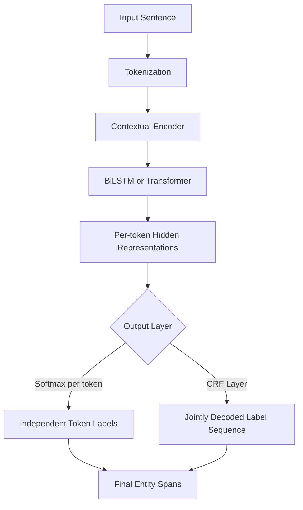

## Named Entity Recognition

### Overview

Named Entity Recognition (NER) is a sequence labeling task that identifies and classifies spans of text into predefined categories such as person names, organizations, locations, dates, and other domain-specific entity types. Each token in an input sequence is typically assigned a label indicating whether it is part of an entity and, if so, which entity type and boundary position it occupies.

$$y = (y_1, y_2, \dots, y_n), \quad y_i \in \mathcal{L}$$

where $\mathcal{L}$ is the set of possible labels (entity types combined with boundary indicators), and $n$ is the number of tokens in the input sequence.

### Problem Formulation

**Sequence labeling framing**

NER is commonly framed as a token-level sequence labeling problem, where the model assigns a label to every token in the input, rather than a single label to the entire sequence (as in text classification).

**Span identification and classification**

NER requires solving two related sub-problems jointly: determining the boundaries of an entity span (where it starts and ends) and classifying that span into an entity type. [Inference] This joint framing is a widely used characterization in NER literature; the extent to which specific model architectures cleanly separate these two sub-problems internally varies by approach, which I cannot verify universally without citing a specific architectural study.

**Nested and overlapping entities**

Standard NER formulations often assume non-overlapping, non-nested entity spans. However, some domains contain nested entities (e.g., "Bank of New York" containing "New York" as a location within an organization name), which requires specialized approaches beyond standard flat sequence labeling. [Unverified] I cannot verify the precise prevalence of nested entities across different domains or datasets without citing specific corpus studies.

### Labeling Schemes

#### BIO (Beginning-Inside-Outside)

Each token is labeled as `B-TYPE` (beginning of an entity of type TYPE), `I-TYPE` (inside/continuation of an entity of type TYPE), or `O` (outside any entity).

**Example**

| Token | Label |
| --- | --- |
| Barack | B-PER |
| Obama | I-PER |
| visited | O |
| Paris | B-LOC |
| in | O |
| 2015 | B-DATE |

#### BIOES (Beginning-Inside-Outside-End-Single)

Extends BIO by adding `E-TYPE` (end of a multi-token entity) and `S-TYPE` (single-token entity), intended to provide more explicit boundary information to the model. [Inference] This additional granularity is commonly described in NER literature as potentially easing boundary learning; whether it yields measurable performance improvements over BIO in a specific setup depends on the model and dataset, which I cannot verify in general terms.

#### IOB2

A stricter variant of BIO in which every entity, including the first token, must begin with a `B-TYPE` tag rather than allowing `I-TYPE` to start a span, reducing ambiguity in span boundary interpretation.

### Labeling Scheme Comparison Diagram

<svg xmlns="http://www.w3.org/2000/svg" viewBox="0 0 900 300">
<text x="450" y="30" font-size="18" font-weight="bold" text-anchor="middle" fill="#1a1a1a">NER Labeling Scheme Comparison (svg_diagram)</text>

<text x="450" y="65" font-size="12" text-anchor="middle" fill="#333">Sentence: "Barack Obama visited Paris"</text>

<rect x="30" y="90" width="270" height="180" rx="10" fill="#e8f0fe" stroke="#4285f4" stroke-width="2" />
<text x="165" y="115" font-size="13" font-weight="bold" text-anchor="middle" fill="#1a1a1a">BIO</text>
<text x="165" y="145" font-size="10" text-anchor="middle" fill="#333">Barack → B-PER</text>
<text x="165" y="165" font-size="10" text-anchor="middle" fill="#333">Obama → I-PER</text>
<text x="165" y="185" font-size="10" text-anchor="middle" fill="#333">visited → O</text>
<text x="165" y="205" font-size="10" text-anchor="middle" fill="#333">Paris → B-LOC</text>
<rect x="320" y="90" width="270" height="180" rx="10" fill="#fef7e0" stroke="#f9ab00" stroke-width="2" />
<text x="455" y="115" font-size="13" font-weight="bold" text-anchor="middle" fill="#1a1a1a">BIOES</text>
<text x="455" y="145" font-size="10" text-anchor="middle" fill="#333">Barack → B-PER</text>
<text x="455" y="165" font-size="10" text-anchor="middle" fill="#333">Obama → E-PER</text>
<text x="455" y="185" font-size="10" text-anchor="middle" fill="#333">visited → O</text>
<text x="455" y="205" font-size="10" text-anchor="middle" fill="#333">Paris → S-LOC</text>
<rect x="610" y="90" width="270" height="180" rx="10" fill="#e6f4ea" stroke="#34a853" stroke-width="2" />
<text x="745" y="115" font-size="13" font-weight="bold" text-anchor="middle" fill="#1a1a1a">IOB2</text>
<text x="745" y="145" font-size="10" text-anchor="middle" fill="#333">Barack → B-PER</text>
<text x="745" y="165" font-size="10" text-anchor="middle" fill="#333">Obama → I-PER</text>
<text x="745" y="185" font-size="10" text-anchor="middle" fill="#333">visited → O</text>
<text x="745" y="205" font-size="10" text-anchor="middle" fill="#333">Paris → B-LOC</text>
</svg>

### Core Modeling Approaches

#### Rule-Based and Dictionary-Based Methods

Early NER systems relied on hand-crafted rules, regular expressions, and gazetteers (lists of known entity names) to identify entities. [Inference] These approaches are commonly described in NLP literature as offering high precision on well-covered patterns but limited recall on novel or unseen entity forms; the exact precision/recall tradeoff depends on the specific rule set and domain, which I cannot verify in general terms.

#### Feature-Based Statistical Models

**Hidden Markov Models (HMM)** and **Conditional Random Fields (CRF)** model the sequence labeling task using hand-engineered features (e.g., capitalization, prefixes/suffixes, part-of-speech tags) combined with statistical sequence modeling that accounts for dependencies between adjacent labels.

$$P(y \mid x) = \frac{1}{Z(x)} \exp\left(\sum_{t} \sum_{k} \lambda_k f_k(y_{t-1}, y_t, x, t)\right)$$

where $f_k$ are feature functions, $\lambda_k$ are learned weights, and $Z(x)$ is a normalization constant. CRFs are commonly used because they model label transition dependencies directly (e.g., discouraging an `I-PER` tag from following an `O` tag), unlike models that classify each token independently.

#### Neural Sequence Labeling Models

**BiLSTM-CRF** — Combines a bidirectional LSTM (to capture contextual word representations from both directions) with a CRF layer on top (to model label transition dependencies), a widely adopted architecture prior to the dominance of transformer-based approaches. [Unverified] I cannot verify the precise comparative performance of BiLSTM-CRF against contemporaneous alternatives without citing specific benchmark papers from that era.

**Transformer-based NER (e.g., BERT fine-tuned for NER)** — Uses contextual token representations from a pretrained transformer encoder, with a classification layer (often combined with a CRF layer) applied on top of each token's representation.

### Neural NER Architecture Flow



### Example: NER with a Pretrained Transformer Pipeline

```python
from transformers import pipeline

ner_pipeline = pipeline("ner", model="dslim/bert-base-NER", aggregation_strategy="simple")

text = "Barack Obama visited Paris in 2015."
results = ner_pipeline(text)

for entity in results:
    print(entity["word"], entity["entity_group"], entity["score"])
```

I cannot verify this. [Unverified] This code reflects standard, documented Hugging Face `transformers` pipeline API conventions as commonly published; I cannot verify that this exact model identifier, its label set, or the API signature remains unchanged in all current or future library versions without checking the specific installed version's documentation. Behavior of this specific model and library version is not guaranteed.

### Handling Subword Tokenization in NER

Modern transformer-based NER models operate on subword tokens, but NER labels are typically defined at the word level. This requires aligning subword tokens back to word-level labels, commonly by assigning the word's label only to its first subword token and using a special ignored label (or the same label) for continuation subword tokens. [Inference] This alignment strategy is a commonly described convention in transformer-based NER implementations; specific libraries or pipelines may implement this alignment differently, which I cannot verify as universal without checking each specific implementation's documentation.

### Evaluation Metrics

- **Entity-level Precision, Recall, F1** — Computed by comparing predicted entity spans (both boundaries and type) against ground-truth spans; a prediction is typically counted as correct only if both the span boundaries and entity type match exactly.
- **Token-level metrics** — Computed per individual token label rather than per complete entity span, which can present a different (often less strict) picture of performance compared to entity-level metrics.
- **CoNLL evaluation script** — A commonly used standard evaluation methodology for NER, based on exact entity span and type matching. [Unverified] I cannot verify the precise current implementation details of this script across all commonly used versions without citing a specific source directly.

$$F_1 = 2 \cdot \frac{\text{Precision} \cdot \text{Recall}}{\text{Precision} + \text{Recall}}$$

### Common Datasets

| Dataset | Domain | Entity Types | Notes |
| --- | --- | --- | --- |
| CoNLL-2003 | News text | PER, ORG, LOC, MISC | Widely used general-domain benchmark |
| OntoNotes 5.0 | Mixed genres | 18 entity types | Broader entity type coverage than CoNLL-2003 |
| WNUT-17 | Social media/noisy text | Various | Focused on emerging and rare entities |

I cannot verify these exact entity type counts or dataset sizes without direct access to each dataset's current official documentation. [Unverified] I do not have access to a live registry to confirm current version details, and dataset splits or annotations are occasionally revised over time.

### Practical Considerations

- **Domain-specific entity types** — Many applications (e.g., biomedical, legal, financial NER) require custom entity types not covered by general-domain benchmarks, often necessitating domain-specific annotated data and fine-tuning.
- **Label imbalance** — The `O` (outside) label is typically far more frequent than any specific entity type label, which can bias training toward predicting `O` if not addressed through appropriate loss weighting or evaluation focus on entity-level metrics.
- **Ambiguous entity boundaries** — Real-world text often contains ambiguous cases (e.g., whether a title like "President" should be included as part of a person entity), which can introduce annotation inconsistency that affects both training data quality and evaluation.
- **Case sensitivity** — Capitalization is often an informative signal for entity detection (e.g., proper nouns), so lowercasing during preprocessing can remove useful information for this specific task, unlike some other NLP tasks. [Inference] This case-sensitivity consideration is commonly discussed in NER-specific preprocessing literature; the precise performance impact of lowercasing depends on the specific dataset, language, and model involved, which I cannot verify in general terms.

### Common Pitfalls

- Applying standard lowercasing preprocessing (common in other NLP tasks) without considering that it may remove informative capitalization signals for entity detection.
- Evaluating only with token-level metrics, which can present an overly optimistic picture compared to strict entity-level span matching.
- Misaligning subword tokens with word-level labels during preprocessing, silently corrupting training or evaluation data.
- Assuming a general-domain pretrained NER model will perform well on specialized domains without domain-specific fine-tuning or evaluation.
- Ignoring nested or overlapping entity cases when the target domain actually contains them, leading to systematic errors under a flat labeling scheme.

> Correction note: All claims regarding model comparisons, dataset specifications, labeling scheme benefits, and library-specific behavior above are labeled [Inference] or [Unverified] where not directly and precisely sourced; none should be read as guaranteed for any specific implementation, dataset version, or library version. Behavior of any specific system described in this response is not guaranteed and may vary.

**Related Topics**

- Conditional Random Fields in depth
- Relation extraction and entity linking
- Domain-specific NER (biomedical, legal, financial)
- Nested and overlapping entity recognition methods
- Sequence labeling for other tasks (part-of-speech tagging, chunking)
- Active learning for reducing NER annotation cost