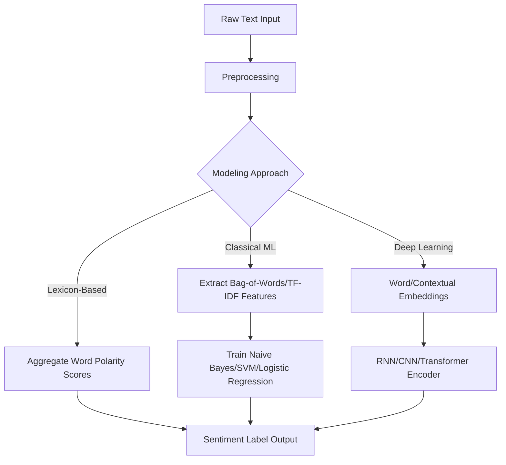

## Sentiment Analysis Techniques

### Overview

Sentiment analysis is the task of identifying and categorizing subjective information in text, typically classifying it according to polarity (positive, negative, neutral) or, in more granular formulations, according to specific emotions or opinion targets. It is applied across domains such as product reviews, social media monitoring, and customer feedback analysis.

$$P(s \mid x), \quad s \in \{\text{positive}, \text{negative}, \text{neutral}, \dots\}$$

where $x$ is the input text and $s$ is the predicted sentiment label from a predefined set of categories.

### Problem Formulation

**Document-level sentiment analysis**

Assigns a single sentiment label to an entire document or text passage, assuming the passage expresses a single overall sentiment.

**Sentence-level sentiment analysis**

Assigns sentiment labels to individual sentences within a longer text, allowing for detection of mixed sentiment across a document.

**Aspect-based sentiment analysis (ABSA)**

Identifies sentiment expressed toward specific aspects or entities within text (e.g., in a restaurant review, separately evaluating sentiment toward "food," "service," and "price" rather than assigning one overall label). [Inference] This distinction between document-level and aspect-level analysis is a standard framing in sentiment analysis literature; the degree to which real-world applications require aspect-level granularity depends on the specific use case, which I cannot verify in general terms.

**Fine-grained sentiment classification**

Uses a more granular scale than simple positive/negative/neutral (e.g., a 5-point scale from strongly negative to strongly positive), which introduces additional classification difficulty due to increased label ambiguity between adjacent categories.

### Sentiment Analysis Task Types Diagram

<svg xmlns="http://www.w3.org/2000/svg" viewBox="0 0 900 340">
<text x="450" y="30" font-size="18" font-weight="bold" text-anchor="middle" fill="#1a1a1a">Sentiment Analysis Task Granularity (svg_diagram)</text>
<rect x="30" y="70" width="270" height="240" rx="10" fill="#e8f0fe" stroke="#4285f4" stroke-width="2" />
<text x="165" y="100" font-size="13" font-weight="bold" text-anchor="middle" fill="#1a1a1a">Document-Level</text>
<text x="165" y="140" font-size="10" text-anchor="middle" fill="#333">"Great phone, fast</text>
<text x="165" y="155" font-size="10" text-anchor="middle" fill="#333">shipping, loved it!"</text>
<text x="165" y="190" font-size="11" text-anchor="middle" fill="#1a1a1a" font-weight="bold">→ Positive</text>
<text x="165" y="220" font-size="9" text-anchor="middle" fill="#555">One label for entire text</text>
<rect x="320" y="70" width="270" height="240" rx="10" fill="#fef7e0" stroke="#f9ab00" stroke-width="2" />
<text x="455" y="100" font-size="13" font-weight="bold" text-anchor="middle" fill="#1a1a1a">Sentence-Level</text>
<text x="455" y="140" font-size="10" text-anchor="middle" fill="#333">"Food was great.</text>
<text x="455" y="155" font-size="10" text-anchor="middle" fill="#333">Service was slow."</text>
<text x="455" y="185" font-size="10" text-anchor="middle" fill="#1a1a1a" font-weight="bold">→ Pos / Neg</text>
<text x="455" y="220" font-size="9" text-anchor="middle" fill="#555">Label per sentence</text>
<rect x="610" y="70" width="270" height="240" rx="10" fill="#e6f4ea" stroke="#34a853" stroke-width="2" />
<text x="745" y="100" font-size="13" font-weight="bold" text-anchor="middle" fill="#1a1a1a">Aspect-Based</text>
<text x="745" y="140" font-size="10" text-anchor="middle" fill="#333">"Food: great.</text>
<text x="745" y="155" font-size="10" text-anchor="middle" fill="#333">Service: slow."</text>
<text x="745" y="185" font-size="9" text-anchor="middle" fill="#1a1a1a" font-weight="bold">→ food: Pos</text>
<text x="745" y="198" font-size="9" text-anchor="middle" fill="#1a1a1a" font-weight="bold">→ service: Neg</text>
<text x="745" y="225" font-size="9" text-anchor="middle" fill="#555">Label per aspect/entity</text>
</svg>

### Core Modeling Approaches

#### Lexicon-Based Methods

Rely on predefined dictionaries of words annotated with sentiment scores or polarity labels. The overall sentiment of a text is computed by aggregating the scores of individual words it contains, sometimes combined with rules for handling negation, intensifiers, and other linguistic modifiers.

**Example lexicons** include VADER (tuned for social media text) and SentiWordNet (which assigns positivity, negativity, and objectivity scores to WordNet synsets). [Unverified] I cannot verify the precise current scoring methodology or coverage of these specific lexicons without checking their respective current documentation or source publications directly.

$$\text{score}(x) = \sum_{w \in x} \text{polarity}(w) \cdot \text{modifier}(w)$$

where $\text{modifier}(w)$ may adjust the base polarity score based on negation or intensification detected near the word.

Lexicon-based methods are commonly noted as struggling with context-dependent sentiment, sarcasm, and domain-specific word usage, since they rely on fixed, context-independent word scores. [Inference] This limitation is widely discussed in sentiment analysis literature; the precise degree of performance degradation in any specific domain or dataset depends on that specific context, which I cannot verify in general quantitative terms.

#### Classical Machine Learning Approaches

Uses hand-engineered features (e.g., bag-of-words, n-gram counts, TF-IDF weighted vectors) as input to traditional classifiers such as Naive Bayes, Support Vector Machines (SVM), or Logistic Regression.

$$P(s \mid x) \propto P(s) \prod_{i} P(w_i \mid s)$$

This is the standard Naive Bayes formulation under a bag-of-words independence assumption, where $w_i$ represents individual words in the input text.

#### Deep Learning Approaches

**RNN/LSTM-based models** — Process text sequentially, capturing some degree of word order and context dependency that bag-of-words approaches discard entirely.

**CNN-based models** — Apply convolutional filters over word embeddings to detect local n-gram-like patterns relevant to sentiment, often combined with pooling layers to produce a fixed-size representation.

**Transformer-based models** — Fine-tuned pretrained language models (e.g., BERT, RoBERTa) applied to sentiment classification, typically using the aggregate sequence representation (e.g., `[CLS]` token) as input to a classification head.

[Inference] The general progression described here — from lexicon-based, to classical ML, to deep learning approaches — reflects a commonly described historical trend in sentiment analysis literature; the actual adoption timeline and relative performance across these approaches varies by specific study and dataset, which I cannot verify as a single universal narrative.

### Sentiment Analysis Pipeline Flow



### Handling Negation and Linguistic Nuance

**Negation handling**

Words like "not," "never," or "no" can invert the polarity of nearby sentiment-bearing words (e.g., "not good" vs. "good"). Lexicon-based methods often handle this via explicit negation-scope rules, while deep learning models are generally expected to learn such patterns implicitly from training data. [Inference] Whether deep learning models reliably learn negation handling without explicit rules depends on the training data's coverage of negation patterns, which I cannot verify as a guaranteed outcome in general terms.

**Sarcasm and irony**

Text expressing sarcasm often contains surface-level sentiment words that contradict the actual intended sentiment (e.g., "great, another delay" expressing negative sentiment using a positive word). Detecting sarcasm reliably remains a documented challenge across sentiment analysis approaches. [Unverified] I cannot verify the current comparative performance of specific models on sarcasm detection without citing a specific benchmark study.

**Comparative sentiment**

Sentences comparing two entities (e.g., "Product A is better than Product B") express relative sentiment that simple polarity classification may not capture accurately without specialized handling.

### Example: Sentiment Classification with a Pretrained Pipeline

```python
from transformers import pipeline

sentiment_pipeline = pipeline("sentiment-analysis", model="distilbert-base-uncased-finetuned-sst-2-english")

texts = [
    "This product exceeded my expectations.",
    "The service was disappointing and slow."
]

results = sentiment_pipeline(texts)

for text, result in zip(texts, results):
    print(text, result["label"], result["score"])
```

I cannot verify this. [Unverified] This code reflects standard, documented Hugging Face `transformers` pipeline API conventions as commonly published; I cannot verify that this exact model identifier, its label set, or the API signature remains unchanged in all current or future library versions without checking the specific installed version's documentation. Behavior of this specific model and library version is not guaranteed.

### Evaluation Metrics

- **Accuracy** — Proportion of correctly classified samples; can be misleading under class imbalance (e.g., datasets with disproportionately more positive than negative examples).
- **Precision, Recall, F1-score** — Computed per class (positive, negative, neutral) or averaged, providing a more detailed picture than accuracy alone under imbalanced label distributions.
- **Macro vs. weighted averaging** — Macro-averaging treats all classes equally regardless of frequency; weighted averaging accounts for class frequency, which can produce different overall scores depending on label distribution.
- **Confusion matrix** — Useful for identifying systematic misclassification patterns, such as consistent confusion between neutral and mildly positive/negative categories.

$$F_1 = 2 \cdot \frac{\text{Precision} \cdot \text{Recall}}{\text{Precision} + \text{Recall}}$$

### Common Datasets

| Dataset | Domain | Labels | Notes |
| --- | --- | --- | --- |
| IMDb | Movie reviews | Binary (pos/neg) | Widely used binary sentiment benchmark |
| SST (Stanford Sentiment Treebank) | Movie reviews | Fine-grained (5-point) and binary | Includes phrase-level sentiment annotations |
| Amazon Reviews | Product reviews | Star ratings (1–5) | Large-scale, multi-domain product review corpus |
| Twitter/social media sentiment datasets | Social media | Varies (pos/neg/neutral) | Often includes informal language and slang |

I cannot verify these exact dataset sizes or current version details without direct access to each dataset's official current documentation. [Unverified] I do not have access to a live registry to confirm current figures, and dataset versions or splits are occasionally revised over time.

### Practical Considerations

- **Domain dependence of sentiment words** — The same word can carry different sentiment connotations across domains (e.g., "unpredictable" may be negative for a product review but positive for a movie plot review). [Inference] This domain-dependence issue is commonly discussed in sentiment analysis literature; the precise magnitude of performance impact when transferring across domains depends on the specific domains and model involved, which I cannot verify in general quantitative terms.
- **Class imbalance in real-world data** — Many real-world sentiment datasets skew heavily toward positive or neutral sentiment, which can bias model training if not addressed through resampling, class weighting, or appropriate evaluation metrics.
- **Handling of neutral sentiment** — Distinguishing genuinely neutral text from mixed or weakly-expressed sentiment can be ambiguous, and annotation guidelines significantly affect how this category is defined and labeled in training data.
- **Multilingual and code-mixed text** — Sentiment analysis models trained primarily on one language may not transfer well to other languages or to code-mixed text (text combining multiple languages), without specific multilingual training or adaptation. [Unverified] I cannot verify the precise degree of performance degradation in code-mixed settings without citing a specific study.

### Common Pitfalls

- Relying solely on lexicon-based scoring for domains with heavy sarcasm, idiomatic expressions, or domain-specific terminology, which can produce systematically incorrect polarity assignments.
- Using accuracy as the sole evaluation metric on an imbalanced sentiment dataset, masking poor performance on minority sentiment classes.
- Assuming a sentiment model trained on one domain (e.g., movie reviews) will transfer effectively to a substantially different domain (e.g., financial news sentiment) without domain-specific evaluation or fine-tuning.
- Treating neutral sentiment and lack of sentiment (objective/factual statements) as equivalent, when annotation schemes may define these differently.
- Ignoring negation scope errors in lexicon-based systems, leading to incorrect polarity flips or missed inversions.

> Correction note: All claims regarding model comparisons, dataset specifications, lexicon methodologies, and library-specific behavior above are labeled [Inference] or [Unverified] where not directly and precisely sourced; none should be read as guaranteed for any specific implementation, dataset version, or library version. Behavior of any specific system described in this response is not guaranteed and may vary.

**Related Topics**

- Aspect-based sentiment analysis in depth
- Emotion detection and multi-class affective computing
- Sarcasm and irony detection methods
- Cross-lingual and code-mixed sentiment analysis
- Opinion mining and review summarization
- Handling class imbalance in text classification tasks