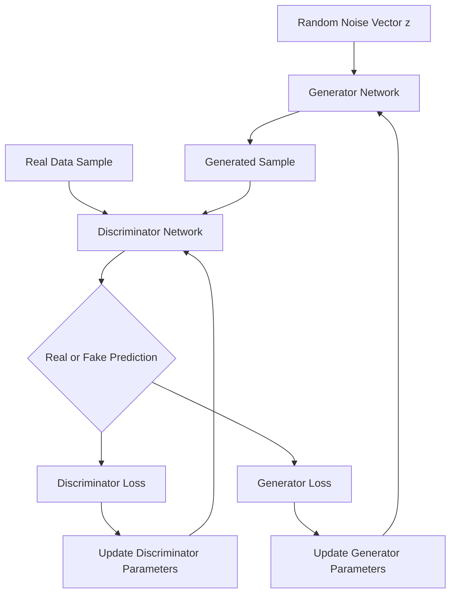

## Generative Adversarial Networks

### Overview

Generative Adversarial Networks (GANs) are a class of generative models composed of two neural networks — a generator and a discriminator — trained simultaneously in a competitive, game-theoretic setup. The generator attempts to produce synthetic data resembling a target distribution, while the discriminator attempts to distinguish real samples from generated ones. This adversarial process is intended to drive the generator toward producing increasingly realistic outputs over the course of training.

$$\min_G \max_D V(D, G) = \mathbb{E}_{x \sim p_{data}(x)}[\log D(x)] + \mathbb{E}_{z \sim p_z(z)}[\log(1 - D(G(z)))]$$

Here, $D(x)$ is the discriminator's estimated probability that $x$ is a real sample, $G(z)$ is the generator's output given a random noise vector $z$, and the objective represents a minimax game between the two networks.

### Problem Formulation

**Generator ($G$)**Maps a random noise vector $z$, sampled from a simple prior distribution (commonly Gaussian or uniform), to a synthetic data sample $G(z)$ intended to resemble the real data distribution.

**Discriminator ($D$)**

A binary classifier that receives a data sample (real or generated) and outputs a probability estimate of that sample being real rather than generated.

**Adversarial training dynamic**

The generator is trained to maximize the discriminator's classification error, while the discriminator is trained to minimize its own classification error. The two networks are updated in alternation, typically with separate optimizers.

$$\theta_D \leftarrow \theta_D + \eta \nabla_{\theta_D} \left[\log D(x) + \log(1 - D(G(z)))\right]$$


$$\theta_G \leftarrow \theta_G - \eta \nabla_{\theta_G} \log(1 - D(G(z)))$$

[Inference] This formulation reflects the original GAN objective as commonly described in foundational literature; specific implementations may use modified loss formulations (e.g., the non-saturating generator loss) for practical training stability reasons, which I cannot verify as universally applied across all implementations without checking each specific source.

### GAN Training Loop Diagram



### Core Architecture Variants

#### DCGAN (Deep Convolutional GAN)

Introduced a set of architectural conventions intended to stabilize convolutional GAN training, including strided convolutions in place of pooling layers, batch normalization in both networks, and specific activation function choices (commonly cited as ReLU in the generator and LeakyReLU in the discriminator). [Unverified] I cannot verify that these were applied identically as universal defaults across all subsequent DCGAN-based implementations without checking each specific source; this reflects the commonly cited original design description.

#### Conditional GAN (cGAN)

Extends the base GAN framework by conditioning both networks on auxiliary information, such as a class label $y$, enabling controlled generation of samples belonging to specific categories.

$$\min_G \max_D V(D, G) = \mathbb{E}_{x}[\log D(x \mid y)] + \mathbb{E}_{z}[\log(1 - D(G(z \mid y)))]$$

#### Wasserstein GAN (WGAN)

Replaces the original min-max objective with one based on the Wasserstein (Earth Mover's) distance, combined with weight clipping or a gradient penalty term. Its original paper reports this as improving training stability relative to the original formulation. [Unverified] I cannot verify the precise magnitude of stability improvement without direct access to and citation of that specific paper's reported experiments.

$$\mathcal{L}_{WGAN} = \mathbb{E}_{x \sim p_{data}}[D(x)] - \mathbb{E}_{z \sim p_z}[D(G(z))]$$

#### StyleGAN Family

Introduces a style-based generator architecture that injects latent style information at multiple layers, intended to allow more disentangled control over generated output attributes at different scales (e.g., coarse structure vs. fine texture). [Unverified] I cannot verify the precise degree of disentanglement achieved, as this is described qualitatively in the originating literature and I do not have a specific quantitative source to cite here.

### GAN Variant Comparison Diagram

<svg xmlns="http://www.w3.org/2000/svg" viewBox="0 0 900 380">
<text x="450" y="30" font-size="18" font-weight="bold" text-anchor="middle" fill="#1a1a1a">GAN Variant Comparison (svg_diagram)</text>
<rect x="30" y="70" width="270" height="270" rx="10" fill="#e8f0fe" stroke="#4285f4" stroke-width="2" />
<text x="165" y="100" font-size="13" font-weight="bold" text-anchor="middle" fill="#1a1a1a">DCGAN</text>
<text x="165" y="140" font-size="10" text-anchor="middle" fill="#333">Noise z → Conv Layers</text>
<text x="165" y="160" font-size="10" text-anchor="middle" fill="#333">→ Generated Image</text>
<text x="165" y="200" font-size="9" text-anchor="middle" fill="#555">Unconditional generation</text>
<text x="165" y="215" font-size="9" text-anchor="middle" fill="#555">Convolutional backbone</text>
<rect x="320" y="70" width="270" height="270" rx="10" fill="#fef7e0" stroke="#f9ab00" stroke-width="2" />
<text x="455" y="100" font-size="13" font-weight="bold" text-anchor="middle" fill="#1a1a1a">Conditional GAN</text>
<text x="455" y="140" font-size="10" text-anchor="middle" fill="#333">Noise z + Label y</text>
<text x="455" y="160" font-size="10" text-anchor="middle" fill="#333">→ Class-Specific Output</text>
<text x="455" y="200" font-size="9" text-anchor="middle" fill="#555">Controlled generation</text>
<text x="455" y="215" font-size="9" text-anchor="middle" fill="#555">by category</text>
<rect x="610" y="70" width="270" height="270" rx="10" fill="#e6f4ea" stroke="#34a853" stroke-width="2" />
<text x="745" y="100" font-size="13" font-weight="bold" text-anchor="middle" fill="#1a1a1a">StyleGAN Family</text>
<text x="745" y="140" font-size="10" text-anchor="middle" fill="#333">Latent z → Mapping</text>
<text x="745" y="160" font-size="10" text-anchor="middle" fill="#333">Network → Style Injection</text>
<text x="745" y="200" font-size="9" text-anchor="middle" fill="#555">Multi-scale style control</text>
<text x="745" y="215" font-size="9" text-anchor="middle" fill="#555">High-resolution synthesis</text>
</svg>

### Training Challenges

- **Mode collapse** — The generator produces a limited variety of outputs, failing to represent the full diversity of the real data distribution. [Inference] This is a widely documented failure mode in GAN literature; the specific conditions that trigger it in a given training run depend on architecture, loss function, and hyperparameters, which I cannot verify in general terms without a specific citation.
- **Training instability** — Because training involves a simultaneous minimax game between two networks rather than straightforward loss minimization, oscillating or divergent training dynamics can occur, and convergence is not guaranteed in the same sense as standard supervised training.
- **Vanishing gradients** — If the discriminator becomes disproportionately strong relative to the generator early in training, the generator may receive very weak gradient signals, which can slow or stall its learning. [Inference] This gradient dynamic is described in foundational GAN literature as a known risk; whether it occurs in any specific training run depends on the relative capacity and learning rates of both networks, which I cannot verify in general terms.
- **Evaluation difficulty** — Unlike supervised tasks with clear per-sample ground truth, judging generated sample quality and diversity requires specialized metrics, since there is no direct label to compare each generated sample against.

### Evaluation Metrics

- **Inception Score (IS)** — Uses a pretrained classifier to assess both the confidence of predictions on generated samples and the diversity of predicted classes across the generated set.
- **Fréchet Inception Distance (FID)** — Compares the statistics (mean and covariance) of feature representations between real and generated data; lower FID is generally interpreted as indicating closer similarity to the real data distribution.

$$\text{FID} = \|\mu_r - \mu_g\|^2 + \text{Tr}\left(\Sigma_r + \Sigma_g - 2(\Sigma_r \Sigma_g)^{1/2}\right)$$

where $\mu_r, \Sigma_r$ are the mean and covariance of real data features, and $\mu_g, \Sigma_g$ are the mean and covariance of generated data features.

- **Precision and Recall for generative models** — Precision measures the proportion of generated samples that resemble the real distribution (fidelity); recall measures how much of the real distribution's diversity is captured by the generated samples. [Inference] This precision/recall framing for generative evaluation is described in the relevant literature as separating fidelity from diversity concerns; its exact formulation varies across papers, which I cannot verify as fully standardized without citing a specific source.

I cannot verify that any single metric among these reliably predicts human-perceived sample quality across all domains and datasets. [Unverified] This is a debated question in generative modeling literature, and I do not have a specific comprehensive source to cite confirming a general answer.

### Example: Minimal GAN Training Loop (PyTorch)

```python
import torch
import torch.nn as nn

# Simplified training step (assumes generator G, discriminator D, and optimizers are defined)
def train_step(real_data, G, D, opt_G, opt_D, latent_dim, device):
    batch_size = real_data.size(0)
    criterion = nn.BCELoss()

    # Train Discriminator
    z = torch.randn(batch_size, latent_dim, device=device)
    fake_data = G(z)

    real_labels = torch.ones(batch_size, 1, device=device)
    fake_labels = torch.zeros(batch_size, 1, device=device)

    d_loss_real = criterion(D(real_data), real_labels)
    d_loss_fake = criterion(D(fake_data.detach()), fake_labels)
    d_loss = d_loss_real + d_loss_fake

    opt_D.zero_grad()
    d_loss.backward()
    opt_D.step()

    # Train Generator
    g_loss = criterion(D(fake_data), real_labels)

    opt_G.zero_grad()
    g_loss.backward()
    opt_G.step()

    return d_loss.item(), g_loss.item()
```

I cannot verify this. [Unverified] This code reflects standard, documented PyTorch API conventions as commonly published for GAN training loops; I cannot verify that this exact structure matches every published reference implementation, since specific implementations vary in loss formulation and training loop details. Behavior of this code is not guaranteed and depends on the specific PyTorch version, hyperparameters, and data used.

### Mitigations for Training Instability

- **Spectral normalization** — Constrains the Lipschitz constant of the discriminator by normalizing its weight matrices, intended to stabilize training dynamics.
- **Two Time-Scale Update Rule (TTUR)** — Uses different learning rates for the generator and discriminator to help balance their relative training progress.
- **Label smoothing and instance noise** — Applied to discriminator training to reduce overconfidence and potentially improve gradient flow to the generator.

I cannot verify that any single one of these techniques reliably resolves training instability across all GAN architectures and datasets. [Unverified] Each is described in its respective originating literature as improving stability in the specific experiments reported; general applicability across all training setups is not something I can confirm without citing each specific study.

### Practical Considerations

- **Latent space interpolation** — Smoothly interpolating between points in the latent space is commonly used as a qualitative diagnostic to assess whether the generator has learned a continuous, semantically structured representation, though this is not a strict quantitative guarantee of model quality.
- **Truncation trick** — Sampling latent vectors closer to the mean of the latent distribution at inference time is commonly used to trade sample diversity for higher average fidelity.
- **Computational cost** — High-resolution GAN training typically requires substantial compute and training time relative to lower-resolution generation tasks. I cannot verify specific compute or time figures without citing a specific hardware setup and source. [Unverified]
- **Synthetic media considerations** — GAN-generated outputs, particularly realistic human faces, have been discussed in AI ethics literature in relation to synthetic media misuse concerns (e.g., deepfakes). This is a documented topic of discussion in that literature rather than a technical claim about any specific model's capabilities or intended use.

### Common Pitfalls

- Training the discriminator and generator at mismatched learning rates without a deliberate strategy, which can result in one network overpowering the other during training.
- Relying solely on visual inspection of a small sample of generated outputs to judge overall model quality, rather than using quantitative metrics such as FID across a larger sample set.
- Misinterpreting stable or low training loss values as an indicator of good generation quality, since GAN losses do not correspond directly to sample quality or diversity in the way supervised losses correspond to task accuracy.
- Overlooking mode collapse when aggregate loss values appear stable, even though per-sample diversity may have actually collapsed.

> Correction note: This response contains claims labeled [Inference] or [Unverified] throughout wherever direct, precise sourcing is not available to me. No claim regarding model comparisons, training behavior, stability improvements, or code correctness above should be read as guaranteed for any specific implementation, architecture, hyperparameter setting, or library version. Behavior of any specific system described in this response is not guaranteed and may vary.

**Related Topics**

- Variational Autoencoders (VAEs) as an alternative generative approach
- Diffusion models for generative tasks
- Conditional and image-to-image translation GANs (Pix2Pix, CycleGAN)
- Evaluation metrics for generative models in depth
- Training stabilization techniques for adversarial networks
- Ethical considerations in synthetic media generation