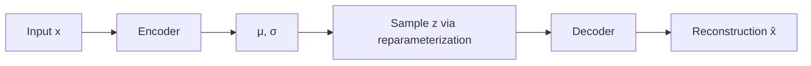

## Variational Autoencoders

### Overview

A variational autoencoder (VAE) is a generative model that learns a probabilistic mapping between a high-dimensional data space and a lower-dimensional latent space. Unlike a standard autoencoder, which learns a deterministic encoding, a VAE learns a distribution over latent variables, which allows it to generate new data by sampling from that distribution. VAEs were introduced by Kingma and Welling in 2013 and combine ideas from variational inference (a technique in Bayesian statistics) with neural network function approximation.

### Core Motivation

Standard autoencoders compress data into a latent code and reconstruct it, but the latent space they learn is not necessarily continuous or well-structured. Interpolating between two points in that latent space, or sampling a random point, often produces outputs that don't resemble valid data. VAEs address this by forcing the latent space to follow a known, continuous distribution (typically a standard normal distribution), which makes sampling and interpolation meaningful.

### Architecture

A VAE consists of two main components:

- **Encoder (recognition model)**: Maps an input $x$ to parameters of a distribution over latent variables $z$, typically a mean $\mu$ and standard deviation $\sigma$ of a Gaussian.
- **Decoder (generative model)**: Maps a sampled latent vector $z$ back to a reconstruction of the input, $\hat{x}$.

The encoder approximates the posterior distribution $q(z|x)$, while the decoder approximates the likelihood $p(x|z)$.

flowchart LR
    A[Input x] --> B[Encoder]
    B --> C["μ, σ (svg_diagram)"]
    C --> D[Sample z via reparameterization]
    D --> E[Decoder]
    E --> F[Reconstruction x̂]



### Mathematical Formulation

The goal is to maximize the marginal likelihood of the data $p(x)$, which is generally intractable to compute directly because it requires integrating over all possible latent values:

$$p(x) = \int p(x|z) \, p(z) \, dz$$

Instead of maximizing this directly, VAEs maximize a tractable lower bound called the Evidence Lower Bound (ELBO):

$$\text{ELBO} = \mathbb{E}_{q(z|x)}[\log p(x|z)] - D_{KL}(q(z|x) \, \| \, p(z))$$

This expression has two components:

- **Reconstruction term**: $\mathbb{E}_{q(z|x)}[\log p(x|z)]$ — encourages the decoder to accurately reconstruct the input from the sampled latent code.
- **KL divergence term**: $D_{KL}(q(z|x) \, \| \, p(z))$ — pushes the learned latent distribution $q(z|x)$ toward the prior distribution $p(z)$, usually a standard normal $\mathcal{N}(0, I)$.

The loss function minimized during training is the negative ELBO:

$$\mathcal{L}(\theta, \phi; x) = -\mathbb{E}_{q_\phi(z|x)}[\log p_\theta(x|z)] + D_{KL}(q_\phi(z|x) \, \| \, p(z))$$

where $\theta$ represents decoder parameters and $\phi$ represents encoder parameters.

### The Reparameterization Trick

A key technical challenge is that sampling $z \sim q(z|x)$ is a stochastic operation, and gradients cannot be backpropagated through a random sampling step in the standard way. The reparameterization trick resolves this by expressing the random variable $z$ as a deterministic function of the parameters $\mu$, $\sigma$, and an independent noise variable $\epsilon$:

$$z = \mu + \sigma \odot \epsilon, \quad \epsilon \sim \mathcal{N}(0, I)$$

Here, $\odot$ denotes element-wise multiplication. Because the randomness is isolated in $\epsilon$, which does not depend on the network parameters, gradients can flow through $\mu$ and $\sigma$ during backpropagation using standard methods. This restructuring is what makes end-to-end training of VAEs with gradient descent practical.

### KL Divergence in Closed Form

When the prior $p(z)$ and the approximate posterior $q(z|x)$ are both Gaussian, the KL divergence term has a closed-form solution, which avoids the need for numerical approximation. For a single latent dimension:

$$D_{KL} = -\frac{1}{2} \sum_{j=1}^{J} \left(1 + \log(\sigma_j^2) - \mu_j^2 - \sigma_j^2\right)$$

where $J$ is the dimensionality of the latent space. This closed-form expression is one of the practical reasons Gaussian priors are the standard default choice in VAE implementations.

### Practical Example (PyTorch-style pseudocode)

```python
import torch
import torch.nn as nn

class VAE(nn.Module):
    def __init__(self, input_dim, hidden_dim, latent_dim):
        super().__init__()
        self.encoder = nn.Sequential(
            nn.Linear(input_dim, hidden_dim),
            nn.ReLU()
        )
        self.mu_layer = nn.Linear(hidden_dim, latent_dim)
        self.logvar_layer = nn.Linear(hidden_dim, latent_dim)

        self.decoder = nn.Sequential(
            nn.Linear(latent_dim, hidden_dim),
            nn.ReLU(),
            nn.Linear(hidden_dim, input_dim),
            nn.Sigmoid()
        )

    def reparameterize(self, mu, logvar):
        std = torch.exp(0.5 * logvar)
        eps = torch.randn_like(std)
        return mu + eps * std

    def forward(self, x):
        h = self.encoder(x)
        mu, logvar = self.mu_layer(h), self.logvar_layer(h)
        z = self.reparameterize(mu, logvar)
        x_hat = self.decoder(z)
        return x_hat, mu, logvar

def vae_loss(x_hat, x, mu, logvar):
    recon_loss = nn.functional.binary_cross_entropy(x_hat, x, reduction='sum')
    kl_div = -0.5 * torch.sum(1 + logvar - mu.pow(2) - logvar.exp())
    return recon_loss + kl_div
```

This implementation follows the standard VAE formulation documented in the original Kingma and Welling paper and is consistent with common reference implementations across major deep learning frameworks.

### Latent Space Structure

Because the KL term regularizes the latent space toward a standard normal distribution, the resulting space tends to be smooth and continuous. Nearby points decode to visually or semantically similar outputs, and interpolating linearly between two latent vectors typically produces a smooth transition between the corresponding data samples. This property is a well-documented characteristic of VAEs relative to plain autoencoders.

[Inference] The degree of smoothness and disentanglement in the latent space depends on architecture choices, the weighting of the KL term, and the dataset, so the exact quality of interpolation will vary across implementations and is not something that can be stated as a fixed guarantee.

### The Posterior Collapse Problem

A known failure mode in VAE training is posterior collapse, where the decoder becomes powerful enough to ignore the latent code entirely, and the encoder outputs a distribution $q(z|x)$ that matches the prior $p(z)$ regardless of input. When this happens, the latent variables carry little to no information about the input, and the model degrades toward simply learning the marginal data distribution.

[Unverified] The specific conditions under which posterior collapse occurs (e.g., particular decoder capacities, KL weighting schedules, or dataset characteristics) are discussed extensively in the research literature but vary by setup, so no single deterministic trigger can be cited as universally applicable.

Common mitigation strategies include:

- **KL annealing**: Gradually increasing the weight of the KL term during training rather than applying it at full strength from the start.
- **Free bits**: Setting a minimum threshold on the KL term per latent dimension so it cannot be driven to zero.
- **Weaker decoders**: Using a less expressive decoder architecture to force reliance on the latent code.

### Beta-VAE

A common variant introduces a weighting hyperparameter $\beta$ on the KL term:

$$\mathcal{L} = -\mathbb{E}_{q(z|x)}[\log p(x|z)] + \beta \, D_{KL}(q(z|x) \, \| \, p(z))$$

Setting $\beta > 1$ encourages a more disentangled latent representation, where individual latent dimensions correspond more closely to independent generative factors in the data (e.g., rotation, scale, color, in an image dataset). This comes at a tradeoff with reconstruction quality.

[Inference] Whether a given $\beta$ value produces meaningfully disentangled representations depends on the dataset and architecture, so this behavior should be treated as a documented tendency in the literature rather than a fixed outcome for every configuration.

### Comparison with Other Generative Models

| Aspect | VAE | GAN | Diffusion Model |
|---|---|---|---|
| Training objective | ELBO maximization | Adversarial min-max game | Denoising score matching |
| Latent space | Continuous, structured | Often less structured | Implicit, via noise schedule |
| Sample quality | Typically blurrier | Typically sharper | Typically high fidelity |
| Training stability | Generally stable | Can be unstable | Generally stable |
| Explicit likelihood | Approximate (via ELBO) | No explicit likelihood | Approximate |

[Inference] Relative sample quality comparisons (e.g., "blurrier" outputs from VAEs) are a widely reported empirical tendency in the literature, but exact results depend on architecture, dataset, and training configuration, so these should be read as general tendencies rather than fixed rankings.

### Common Applications

- **Image generation and reconstruction**: Generating novel images similar to a training distribution.
- **Anomaly detection**: Using reconstruction error or likelihood estimates to flag out-of-distribution samples.
- **Data denoising**: Reconstructing clean data from noisy input.
- **Representation learning**: Using the learned latent space as a compact feature representation for downstream tasks.
- **Drug discovery and molecule generation**: Representing molecular structures in a continuous latent space, enabling interpolation and optimization.

### Limitations

- Reconstructions are often blurrier than GAN- or diffusion-based outputs, since the pixel-wise reconstruction loss tends to average over plausible outputs.
- The Gaussian assumption on the latent distribution may not match the true underlying structure of complex data.
- Balancing the reconstruction term and KL term is often sensitive to hyperparameter choices and can require manual tuning.

### **Related Topics**

- Conditional Variational Autoencoders (CVAEs)
- Vector Quantized VAEs (VQ-VAE)
- Generative Adversarial Networks (GANs)
- Diffusion Models
- Normalizing Flows
- Disentangled Representation Learning
- Variational Inference (general Bayesian foundations)
- Evidence Lower Bound (ELBO) derivations in depth