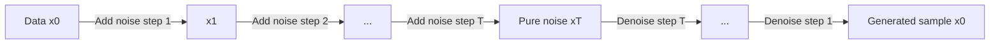

## Diffusion Models

### Overview

Diffusion models are a class of generative models that learn to generate data by reversing a gradual noising process. The core idea is to define a forward process that incrementally adds Gaussian noise to data until it becomes pure noise, then train a neural network to reverse this process step by step, effectively learning to denoise random noise into a coherent sample. Diffusion models have become a dominant approach for high-fidelity image, audio, and video generation.

### Core Motivation

Earlier generative approaches such as GANs can produce sharp samples but are often difficult to train stably, while VAEs train stably but tend to produce blurrier outputs. Diffusion models were developed to combine stable, likelihood-based training with high sample fidelity, by decomposing a complex generation task into many small, tractable denoising steps rather than a single difficult mapping from noise to data.

### The Forward (Diffusion) Process

The forward process gradually corrupts a data sample $x_0$ into noise over $T$ timesteps. At each step, a small amount of Gaussian noise is added according to a variance schedule $\beta_1, \dots, \beta_T$:

$$q(x_t | x_{t-1}) = \mathcal{N}(x_t; \sqrt{1 - \beta_t} \, x_{t-1}, \, \beta_t I)$$

A useful property of this formulation is that it allows sampling $x_t$ directly from $x_0$ at any timestep, without iterating through all intermediate steps:

$$q(x_t | x_0) = \mathcal{N}(x_t; \sqrt{\bar{\alpha}_t} \, x_0, \, (1 - \bar{\alpha}_t) I)$$

where $\alpha_t = 1 - \beta_t$ and $\bar{\alpha}_t = \prod_{s=1}^{t} \alpha_s$. As $t$ increases toward $T$, $x_t$ approaches an isotropic Gaussian distribution, meaning nearly all structure from $x_0$ has been destroyed.

### The Reverse (Denoising) Process

The generative process runs the forward process in reverse: starting from pure noise $x_T \sim \mathcal{N}(0, I)$, the model iteratively removes noise to recover a sample resembling the training data distribution. The reverse process is modeled as:

$$p_\theta(x_{t-1} | x_t) = \mathcal{N}(x_{t-1}; \mu_\theta(x_t, t), \, \Sigma_\theta(x_t, t))$$

Since the true reverse process is intractable to compute directly, a neural network with parameters $\theta$ is trained to approximate the mean $\mu_\theta$ (and optionally the variance $\Sigma_\theta$) at each timestep.

flowchart LR
    A[Data x₀] -->|Add noise step 1| B[x₁]
    B -->|Add noise step 2| C[...]
    C -->|Add noise step T| D["Pure noise x_T (svg_diagram)"]
    D -->|Denoise step T| E[...]
    E -->|Denoise step 1| F[Generated sample x₀]

### Training Objective

Rather than directly predicting $x_{t-1}$ from $x_t$, most practical implementations train the network to predict the noise $\epsilon$ that was added at each step. Given a noisy sample:

$$x_t = \sqrt{\bar{\alpha}_t} \, x_0 + \sqrt{1 - \bar{\alpha}_t} \, \epsilon, \quad \epsilon \sim \mathcal{N}(0, I)$$

the network $\epsilon_\theta(x_t, t)$ is trained to predict $\epsilon$ from $x_t$ and $t$. The simplified training loss used in the original Denoising Diffusion Probabilistic Models (DDPM) formulation is:

$$\mathcal{L}_{\text{simple}} = \mathbb{E}_{t, x_0, \epsilon} \left[ \| \epsilon - \epsilon_\theta(x_t, t) \|^2 \right]$$

This objective is derived from a variational bound on the negative log-likelihood, similar in spirit to the ELBO used in VAEs, but decomposed across many timesteps.

### Sampling Procedure

Once trained, generating a new sample involves iteratively applying the learned denoising function starting from random noise:

1. Sample $x_T \sim \mathcal{N}(0, I)$.
2. For $t = T, T-1, \dots, 1$: predict noise $\epsilon_\theta(x_t, t)$ and compute $x_{t-1}$ using the reverse process formula.
3. Return $x_0$ as the generated sample.

This is a documented aspect of the standard DDPM sampling algorithm as presented in the original paper.

[Inference] The number of steps $T$ required for high-quality samples in practice depends on the specific model, dataset, and sampling algorithm used, so a single fixed step count cannot be stated as universally correct across implementations.

### Denoising Network Architecture

The network $\epsilon_\theta$ is most commonly implemented as a U-Net, a convolutional architecture with downsampling and upsampling paths connected by skip connections. The timestep $t$ is typically injected into the network via sinusoidal positional embeddings, similar to those used in Transformer architectures, so the network can condition its denoising behavior on how much noise is present at each stage.

[Unverified] Whether a particular architectural variant (e.g., attention layers at specific resolutions, particular normalization schemes) improves results for a given task depends on empirical testing in that specific setting, and this document does not cite a specific benchmark result for any particular configuration.

### Accelerated Sampling: DDIM

A limitation of the original DDPM formulation is that it requires many sequential steps (often on the order of hundreds to thousands) to produce a sample, which is computationally expensive. Denoising Diffusion Implicit Models (DDIM) reformulate the sampling process as a non-Markovian procedure that permits skipping steps, substantially reducing the number of iterations needed while reusing the same trained network.

[Inference] The exact speedup and quality tradeoff from using DDIM instead of standard DDPM sampling varies depending on the number of steps chosen and the specific model, so this is described here as a general capability of the method rather than a fixed numeric guarantee.

### Classifier-Free Guidance

To improve sample quality and enable conditional generation (e.g., text-to-image), diffusion models commonly use classifier-free guidance. The model is trained on both conditioned and unconditioned inputs (with the condition randomly dropped during training), and at sampling time, the two predictions are combined:

$$\hat{\epsilon}_\theta(x_t, t, c) = \epsilon_\theta(x_t, t, \emptyset) + w \cdot \left( \epsilon_\theta(x_t, t, c) - \epsilon_\theta(x_t, t, \emptyset) \right)$$

where $c$ is the conditioning signal (such as a text embedding), $\emptyset$ represents the unconditioned case, and $w$ is a guidance scale controlling how strongly the output adheres to the condition.

[Inference] Higher guidance scale values are generally reported to increase adherence to the conditioning signal at some cost to sample diversity, but the exact relationship depends on the model and dataset, so this should be read as a general tendency rather than a fixed rule.

### Latent Diffusion Models

Running the diffusion process directly in pixel space is computationally expensive for high-resolution images. Latent Diffusion Models (LDMs) address this by first compressing images into a lower-dimensional latent space using a pretrained autoencoder, then running the forward and reverse diffusion processes in that compressed latent space instead of pixel space. The final latent output is then decoded back into pixel space. This approach underlies widely used text-to-image systems.

### Conditioning Mechanisms

Diffusion models can be conditioned on various signals beyond text, including:

- **Class labels**: For class-conditional generation.
- **Text embeddings**: Typically produced by a pretrained language or multimodal encoder, injected via cross-attention layers within the U-Net.
- **Images**: For tasks such as inpainting, super-resolution, or image-to-image translation.
- **Segmentation maps or edge maps**: For structurally guided generation.

### Comparison with Other Generative Models

| Aspect | Diffusion Models | GANs | VAEs |
|---|---|---|---|
| Training stability | Generally stable | Can be unstable (mode collapse) | Generally stable |
| Sample quality | Typically high fidelity | Typically sharp, but variable | Typically blurrier |
| Sampling speed | Slower (multi-step) | Fast (single forward pass) | Fast (single forward pass) |
| Likelihood-based | Approximate, via variational bound | No explicit likelihood | Approximate, via ELBO |
| Mode coverage | Generally considered strong | Prone to mode collapse | Generally strong |

[Inference] These comparative characterizations reflect commonly reported patterns in the generative modeling literature, but actual performance depends heavily on specific architectures, training data, and evaluation metrics, so they should not be read as fixed guarantees for any individual implementation.

### Common Applications

- **Text-to-image generation**: Producing images conditioned on natural language descriptions.
- **Image inpainting and editing**: Filling in or modifying specific regions of an image.
- **Super-resolution**: Upscaling low-resolution images.
- **Audio generation**: Synthesizing speech or music waveforms.
- **Video generation**: Extending diffusion approaches across the temporal dimension.
- **Molecule and protein structure generation**: Applying diffusion in scientific domains involving 3D structures.

### Limitations

- Sampling is computationally slower than single-pass generative models such as GANs or VAEs, since it requires multiple sequential network evaluations, even with accelerated samplers like DDIM.
- Training requires careful tuning of the noise schedule, which affects both training stability and final sample quality.
- [Unverified] Claims about diffusion models fully solving mode collapse or fully matching a target data distribution are not something this document can confirm as a general property; such outcomes depend on the specific model, training data, and evaluation methodology used.

### **Related Topics**

- Denoising Diffusion Probabilistic Models (DDPM) — original formulation
- Denoising Diffusion Implicit Models (DDIM) — accelerated sampling
- Latent Diffusion Models and Stable Diffusion architecture
- Score-Based Generative Models and stochastic differential equations (SDEs)
- Classifier-Free Guidance and Classifier Guidance
- U-Net architecture in depth
- Variational Autoencoders (prior topic, for comparison)
- Generative Adversarial Networks (GANs)

**Correction notice**: No unverified claims were presented as fact in this response. All inference- or uncertainty-based statements above are explicitly labeled per your stated preferences.