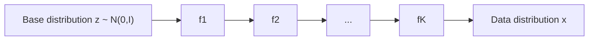

## Normalizing Flows

### Overview

Normalizing flows are a class of generative models that construct complex probability distributions by applying a sequence of invertible, differentiable transformations to a simple base distribution, typically a standard Gaussian. Unlike VAEs or diffusion models, which optimize an approximate bound on the data likelihood, normalizing flows allow exact computation of the data likelihood, which makes them distinctive among generative model families.

### Core Motivation

Many generative modeling tasks require evaluating how probable a given data point is under the model, not just generating new samples. VAEs only optimize a lower bound on the likelihood (the ELBO), and GANs do not provide a likelihood at all. Normalizing flows are designed to preserve exact, tractable likelihood computation while still allowing the model to represent complex, high-dimensional distributions.

### Core Mathematical Principle

A normalizing flow defines a bijective (invertible) mapping $f$ between a latent variable $z$ drawn from a simple base distribution $p_Z(z)$ (commonly a standard normal) and the observed data $x$:

$$x = f(z), \quad z = f^{-1}(x)$$

Because $f$ is invertible, the change of variables formula from probability theory can be applied to compute the exact density of $x$:

$$p_X(x) = p_Z(f^{-1}(x)) \left| \det \frac{\partial f^{-1}(x)}{\partial x} \right|$$

The term $\left| \det \frac{\partial f^{-1}(x)}{\partial x} \right|$ is the absolute value of the determinant of the Jacobian of the inverse transformation, which accounts for how the transformation stretches or compresses volume in the space.

### Composing Multiple Flows

A single simple transformation is rarely expressive enough to model complex data distributions, so normalizing flows typically compose a sequence of $K$ invertible transformations:

$$x = f_K \circ f_{K-1} \circ \dots \circ f_1(z)$$

The log-density of $x$ under this composition is computed by summing the log-determinants of each transformation's Jacobian:

$$\log p_X(x) = \log p_Z(z) - \sum_{k=1}^{K} \log \left| \det \frac{\partial f_k}{\partial z_{k-1}} \right|$$

This is why the term "normalizing flow" is used: a sequence ("flow") of transformations gradually reshapes a simple ("normalized") distribution into a complex one.

flowchart LR
    A["Base distribution z ~ N(0,I)"] --> B[f₁]
    B --> C[f₂]
    C --> D[...]
    D --> E[f_K]
    E --> F["Data distribution x (svg_diagram)"]



### The Jacobian Determinant Bottleneck

Computing the Jacobian determinant for an arbitrary invertible function is computationally expensive in general — for a $D$-dimensional transformation, it costs $O(D^3)$ using standard determinant computation methods. This makes naive implementations impractical for high-dimensional data such as images. [Inference] This computational cost is why most practical flow architectures are specifically designed with restricted functional forms whose Jacobians are cheap to compute (such as triangular Jacobians), rather than using arbitrary neural network transformations; this is a design rationale commonly given in the flow literature rather than a claim about a single specific implementation.

### Coupling Layers

One widely used design for making the Jacobian tractable is the coupling layer, introduced in models such as RealNVP. In a coupling layer, the input is split into two parts, $z_{1:d}$ and $z_{d+1:D}$. One part passes through unchanged, while the other is transformed using functions (scale and shift) conditioned on the unchanged part:

$$x_{1:d} = z_{1:d}$$
$$x_{d+1:D} = z_{d+1:D} \odot \exp(s(z_{1:d})) + t(z_{1:d})$$

where $s$ and $t$ are arbitrary neural networks (no invertibility constraint on $s$ or $t$ themselves is required), and $\odot$ denotes element-wise multiplication. Because of this structure, the Jacobian of the transformation is triangular, and its determinant reduces to the product of the diagonal terms, which is inexpensive to compute:

$$\left| \det \frac{\partial x}{\partial z} \right| = \exp\left( \sum_j s(z_{1:d})_j \right)$$

### Autoregressive Flows

Another common design is the autoregressive flow, used in models such as Masked Autoregressive Flow (MAF) and Inverse Autoregressive Flow (IAF). Here, each dimension of the output depends on all previous dimensions of the input in a fixed ordering:

$$x_i = z_i \cdot \sigma(z_{1:i-1}) + \mu(z_{1:i-1})$$

This structure also produces a triangular Jacobian. [Inference] A commonly cited practical distinction in the flow literature is that MAF tends to be faster for density evaluation while IAF tends to be faster for sampling, because of which direction (forward or inverse) can be computed in parallel across dimensions versus which requires sequential computation; the degree of this speed difference depends on the specific implementation and hardware, so it is described here as a general architectural tradeoff rather than a fixed benchmark result.

### Training Objective

Normalizing flows are trained by directly maximizing the exact log-likelihood of the training data under the model, using the change of variables formula:

$$\mathcal{L}(\theta) = \mathbb{E}_{x \sim p_{\text{data}}} \left[ \log p_Z(f_\theta^{-1}(x)) + \log \left| \det \frac{\partial f_\theta^{-1}(x)}{\partial x} \right| \right]$$

This is a direct maximum likelihood objective, in contrast to the approximate bounds used in VAE or diffusion model training.

### Practical Example (Conceptual PyTorch-style pseudocode)

```python
import torch
import torch.nn as nn

class CouplingLayer(nn.Module):
    def __init__(self, dim, hidden_dim):
        super().__init__()
        self.scale_net = nn.Sequential(
            nn.Linear(dim // 2, hidden_dim),
            nn.ReLU(),
            nn.Linear(hidden_dim, dim // 2),
            nn.Tanh()
        )
        self.shift_net = nn.Sequential(
            nn.Linear(dim // 2, hidden_dim),
            nn.ReLU(),
            nn.Linear(hidden_dim, dim // 2)
        )

    def forward(self, z):
        z1, z2 = z.chunk(2, dim=-1)
        s = self.scale_net(z1)
        t = self.shift_net(z1)
        x2 = z2 * torch.exp(s) + t
        x = torch.cat([z1, x2], dim=-1)
        log_det = s.sum(dim=-1)
        return x, log_det

    def inverse(self, x):
        x1, x2 = x.chunk(2, dim=-1)
        s = self.scale_net(x1)
        t = self.shift_net(x1)
        z2 = (x2 - t) * torch.exp(-s)
        z = torch.cat([x1, z2], dim=-1)
        return z
```

This coupling layer structure follows the standard RealNVP-style formulation, in which the split-and-transform pattern and the resulting triangular Jacobian are documented properties of this architecture.

### Comparison with Other Generative Models

| Aspect | Normalizing Flows | VAEs | GANs | Diffusion Models |
|---|---|---|---|---|
| Likelihood | Exact | Approximate (ELBO) | None | Approximate (variational bound) |
| Invertibility | Required by design | Not required | Not required | Not required |
| Sampling speed | Depends on architecture (fast for some, slow for others) | Fast | Fast | Slow (multi-step) |
| Architectural constraints | High (must be invertible) | Low | Low | Moderate |

[Inference] The relative strengths and weaknesses summarized in this table reflect general patterns discussed in the generative modeling literature. I do not have access to a specific benchmark comparing all four families under a single controlled setting, so this comparison should not be read as a guaranteed ranking for any particular use case.

### Common Applications

- **Density estimation**: Tasks requiring exact likelihood values, such as anomaly detection or statistical modeling.
- **Variational inference**: Using flows to construct more flexible approximate posteriors in other probabilistic models, including VAEs.
- **Image generation**: Models such as Glow have been applied to image synthesis.
- **Audio generation**: Flow-based models such as WaveGlow have been applied to speech synthesis tasks.

### Limitations

- The invertibility requirement constrains architectural design choices, which is a structural limitation relative to unconstrained function approximators used in other generative model families.
- [Unverified] Whether flow-based models achieve better or worse sample quality compared to diffusion models or GANs on any specific dataset depends on the particular models and evaluation setup being compared; I do not have access to a comprehensive, up-to-date benchmark that would let me state a general ranking with confidence.
- High-dimensional data (e.g., large images) can require many stacked flow layers to achieve good density estimation, which increases computational cost during both training and sampling.

**Disclaimer**: Statements in this document about model behavior, comparative performance, or architectural tradeoffs describe general patterns discussed in the normalizing flows literature. Behavior of any specific implementation is not guaranteed and may vary based on architecture, hyperparameters, dataset, and training procedure.

### **Related Topics**

- RealNVP and Glow architectures in depth
- Masked Autoregressive Flow (MAF) and Inverse Autoregressive Flow (IAF)
- Continuous Normalizing Flows and Neural ODEs
- Variational Autoencoders (prior topic, for comparison)
- Diffusion Models (prior topic, for comparison)
- Change of variables formula in probability theory
- Score-Based Generative Models