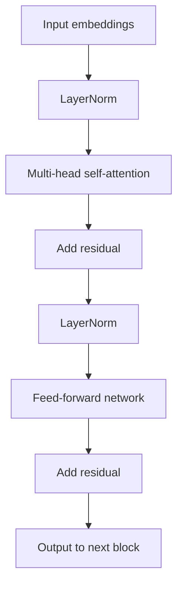

## Large Language Model Architectures

### Overview

Large language models (LLMs) are neural networks trained on vast text corpora to model the statistical structure of language, typically by predicting the next token in a sequence given preceding context. The dominant architecture underlying nearly all modern LLMs is the Transformer, introduced in 2017, which replaced earlier recurrent and convolutional approaches to sequence modeling. This document covers the core architectural components that make up modern LLMs.

### Core Motivation

Earlier sequence models such as recurrent neural networks (RNNs) and LSTMs process tokens sequentially, which limits parallelization during training and makes it difficult to model long-range dependencies due to vanishing gradients. The Transformer architecture was designed to process entire sequences in parallel using an attention mechanism, allowing every token to directly attend to every other token regardless of distance, which substantially improved both training efficiency and the ability to capture long-range dependencies.

### The Transformer Block

A standard Transformer decoder block, which forms the backbone of most autoregressive LLMs, consists of the following components applied in sequence:

1. **Layer normalization**
2. **Multi-head self-attention**
3. **Residual connection**
4. **Layer normalization**
5. **Feed-forward network (MLP)**
6. **Residual connection**

These blocks are stacked repeatedly (often dozens of times in large models) to form the full network.

flowchart TD
    A[Input embeddings] --> B[LayerNorm]
    B --> C[Multi-head self-attention]
    C --> D["Add residual (svg_diagram)"]
    D --> E[LayerNorm]
    E --> F[Feed-forward network]
    F --> G["Add residual (svg_diagram)"]
    G --> H[Output to next block]



### Self-Attention Mechanism

Self-attention allows each token in a sequence to compute a weighted representation of all other tokens, based on learned relevance scores. For each token, three vectors are computed via learned linear projections: a query $Q$, a key $K$, and a value $V$. The attention output is computed as:

$$\text{Attention}(Q, K, V) = \text{softmax}\left(\frac{QK^T}{\sqrt{d_k}}\right)V$$

where $d_k$ is the dimensionality of the key vectors. The scaling factor $\sqrt{d_k}$ is used to keep the dot products in a range that avoids extremely small gradients after the softmax operation, as described in the original Transformer paper.

### Multi-Head Attention

Rather than computing a single attention function, Transformers compute multiple attention "heads" in parallel, each with separate learned projections for $Q$, $K$, and $V$:

$$\text{MultiHead}(Q, K, V) = \text{Concat}(\text{head}_1, \dots, \text{head}_h) W^O$$

$$\text{head}_i = \text{Attention}(Q W_i^Q, K W_i^K, V W_i^V)$$

Each head can learn to attend to different types of relationships within the sequence (e.g., syntactic patterns, positional relationships, or semantic associations). [Inference] The specific linguistic or structural patterns that any individual attention head learns to capture are not fixed properties of the architecture itself but emerge from training on a given dataset, so claims about what a particular head "represents" are interpretive findings from specific studies rather than guaranteed architectural properties.

### Causal Masking

In autoregressive LLMs (used for text generation), self-attention is restricted so that each token can only attend to itself and preceding tokens, not future ones. This is implemented by applying a mask that sets attention scores for future positions to negative infinity before the softmax operation, ensuring the model cannot use information from tokens it has not yet generated during training or inference.

### Positional Encoding

Because self-attention has no inherent notion of token order (it treats the input as a set unless order information is added), positional information must be injected explicitly. Several approaches are used across different model families:

- **Sinusoidal positional encoding**: Fixed, non-learned encodings based on sine and cosine functions of different frequencies, as used in the original Transformer.
- **Learned positional embeddings**: A trainable embedding vector for each position, added to the token embeddings.
- **Rotary Positional Embeddings (RoPE)**: Encodes position by rotating query and key vectors in a way that makes the attention score depend on relative position between tokens. RoPE is used in many modern LLMs.
- **ALiBi (Attention with Linear Biases)**: Adds a fixed, distance-dependent penalty directly to attention scores rather than modifying the embeddings.

[Unverified] I do not have access to a comprehensive, up-to-date comparison confirming which positional encoding scheme is currently used by every major LLM in production, since specific architectural choices in proprietary models are not always fully disclosed and may change between model versions.

### Feed-Forward Network (MLP) Layers

Following the attention sub-layer, each Transformer block includes a position-wise feed-forward network, applied independently to each token's representation:

$$\text{FFN}(x) = W_2 \cdot \sigma(W_1 x + b_1) + b_2$$

where $\sigma$ is a non-linear activation function. The original Transformer used ReLU, while many modern LLMs use variants such as GELU or SwiGLU. This sub-layer typically has a much higher intermediate dimensionality than the model's hidden size (often 4x or more), which accounts for a substantial portion of the model's total parameter count.

### Residual Connections and Layer Normalization

Residual (skip) connections add the input of a sub-layer directly to its output, which helps gradients propagate through very deep networks during training. Layer normalization stabilizes training by normalizing activations across the feature dimension. Two common configurations exist:

- **Post-LN**: Normalization applied after the residual addition (used in the original Transformer).
- **Pre-LN**: Normalization applied before the sub-layer, with the residual added afterward. Pre-LN is more commonly used in modern large-scale LLMs.

[Inference] Pre-LN is generally reported in the literature as producing more stable training dynamics at large scale compared to Post-LN, which is a commonly cited rationale for its adoption in many recent architectures; this reflects reported findings from specific studies rather than a claim verified across every model family.

### Tokenization

Before text is processed by the model, it is converted into discrete tokens using a tokenizer. Common approaches include:

- **Byte Pair Encoding (BPE)**: Iteratively merges the most frequent adjacent character or subword pairs into new tokens.
- **WordPiece**: A similar subword tokenization approach, used in models such as BERT.
- **SentencePiece**: A tokenization framework that can implement BPE or unigram language model tokenization directly on raw text, including whitespace, without requiring pre-tokenized words.

Subword tokenization allows models to handle rare or unseen words by decomposing them into smaller known subword units, rather than requiring a fixed vocabulary of whole words.

### Embedding Layer and Output Head

Input tokens are mapped to dense vector representations via a learned embedding matrix. In most modern LLMs, the same embedding matrix (or its transpose) is used for both the input embedding layer and the final output projection layer that produces logits over the vocabulary, a design choice known as weight tying. This reduces the total parameter count and is commonly reported to improve training efficiency.

### Architectural Variants

| Variant | Attention Pattern | Common Use Case |
|---|---|---|
| Encoder-only | Bidirectional (full attention) | Classification, embeddings (e.g., BERT) |
| Decoder-only | Causal (unidirectional) | Text generation (e.g., GPT-style models) |
| Encoder-decoder | Bidirectional encoder, causal decoder with cross-attention | Sequence-to-sequence tasks (e.g., translation, T5) |

Decoder-only architectures are the dominant design for general-purpose LLMs as of the current literature, though encoder-only and encoder-decoder designs remain in use for specific tasks.

### Mixture of Experts (MoE)

A scaling technique used in some large models replaces the single dense feed-forward network in each block with multiple "expert" feed-forward networks, of which only a small subset (typically one or two) is activated per token via a learned routing mechanism. This allows the total parameter count of the model to increase substantially while keeping the computational cost per token closer to that of a much smaller dense model.

[Unverified] I do not have access to verified, up-to-date specifications confirming the exact architectural details (number of experts, routing mechanism, activation counts) of any specific current production LLM, since these details are often not fully disclosed by the organizations that develop them.

### Scaling Considerations

Model size, dataset size, and compute budget are commonly discussed together in the context of empirical scaling laws, which describe how model performance (typically measured via loss on held-out data) tends to improve as these quantities are increased, following approximately power-law relationships within studied ranges.

[Inference] Scaling laws describing the relationship between compute, data, and model size are derived from empirical studies conducted at the scales tested by specific research groups; whether these relationships hold precisely outside the ranges tested, or across different architectures and training recipes, is not something that can be confirmed as a fixed rule, and results have been reported to vary across studies.

### Practical Example (Conceptual PyTorch-style pseudocode)

```python
import torch
import torch.nn as nn

class TransformerBlock(nn.Module):
    def __init__(self, d_model, n_heads, d_ff):
        super().__init__()
        self.ln1 = nn.LayerNorm(d_model)
        self.attn = nn.MultiheadAttention(d_model, n_heads, batch_first=True)
        self.ln2 = nn.LayerNorm(d_model)
        self.ffn = nn.Sequential(
            nn.Linear(d_model, d_ff),
            nn.GELU(),
            nn.Linear(d_ff, d_model)
        )

    def forward(self, x, attn_mask):
        h = self.ln1(x)
        attn_out, _ = self.attn(h, h, h, attn_mask=attn_mask)
        x = x + attn_out
        h = self.ln2(x)
        x = x + self.ffn(h)
        return x
```

This structure follows the Pre-LN Transformer decoder block pattern documented in widely used reference implementations.

### Common Applications

- **Text generation**: Open-ended and instruction-following generation tasks.
- **Question answering**: Extractive and generative QA over provided context or parametric knowledge.
- **Code generation**: Producing and completing source code.
- **Summarization and translation**: Sequence-to-sequence language tasks.
- **Embeddings for retrieval**: Using encoder representations for semantic search and retrieval-augmented generation.

### Limitations

- Self-attention has quadratic computational and memory cost with respect to sequence length ($O(n^2)$), which constrains maximum context length in standard implementations without additional optimization techniques.
- [Unverified] Claims that any specific attention variant or efficiency technique (e.g., sparse attention, sliding window attention, linear attention) fully closes the performance gap with standard full attention on all tasks are not something this document can confirm, as reported results vary across tasks, model scales, and benchmarks.
- Training large models requires substantial compute and energy resources, and behavior on tasks far outside the training distribution is not something that can be predicted with certainty from architecture alone.

**Disclaimer**: Statements in this document regarding LLM behavior, emergent capabilities, attention head function, scaling relationships, or comparative architectural performance are based on patterns reported in the research literature. This behavior is not something I can guarantee for any specific model, and actual results may vary based on training data, scale, hyperparameters, and implementation details.

### **Related Topics**

- Attention mechanisms in depth (sparse, linear, sliding-window variants)
- Retrieval-Augmented Generation (RAG)
- Instruction tuning and Reinforcement Learning from Human Feedback (RLHF)
- Mixture of Experts architectures in depth
- Tokenization algorithms in depth (BPE, SentencePiece, WordPiece)
- KV-caching and inference optimization
- Scaling laws and compute-optimal training
- Positional encoding schemes in depth (RoPE, ALiBi)