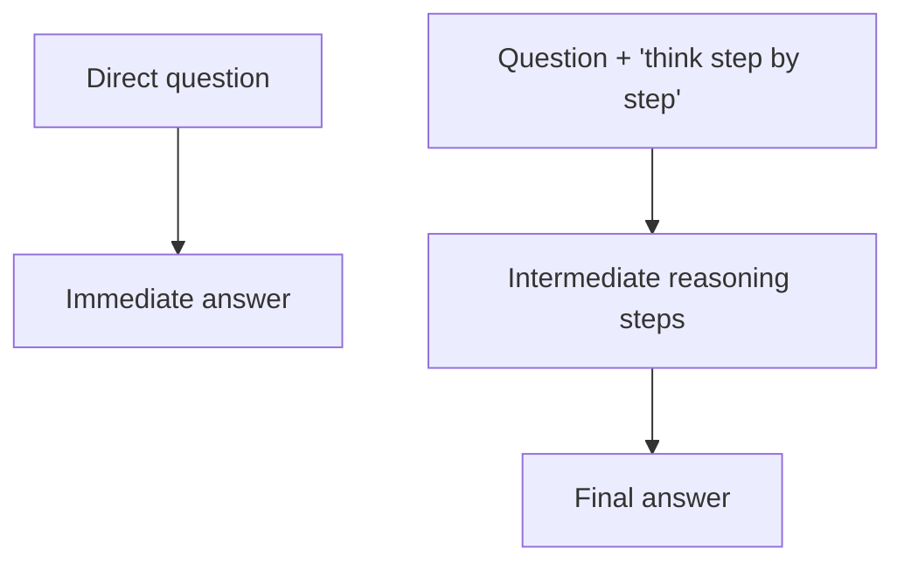

## Prompt Engineering Fundamentals

### Overview

Prompt engineering is the practice of designing and refining input text (prompts) to guide the behavior of large language models toward desired outputs. Because LLMs generate responses based on patterns learned from training data and the context provided at inference time, the way a request is phrased, structured, and framed can substantially influence the quality, format, and accuracy of the output.

### Core Motivation

LLMs do not have fixed, deterministic behavior for a given task; their output depends heavily on the specific wording, structure, and examples provided in the prompt. Prompt engineering exists because small changes in phrasing, ordering, or formatting can produce meaningfully different results, and systematic techniques have been developed to make this behavior more reliable and controllable.

### Zero-Shot Prompting

Zero-shot prompting refers to asking a model to perform a task with only an instruction and no examples of the desired input-output pattern. This relies entirely on the model's pretrained and fine-tuned knowledge to infer what is being asked.

**Example**:
```
Classify the sentiment of this review as positive, negative, or neutral:
"The battery life is disappointing, but the camera quality is excellent."
```

### Few-Shot Prompting

Few-shot prompting provides one or more examples of the input-output pattern before presenting the actual query, which helps the model infer the expected format, style, or reasoning pattern from the examples themselves rather than from instructions alone.

**Example**:
```
Review: "The food was cold and the service was slow." -> Negative
Review: "Amazing experience, will come back again!" -> Positive
Review: "The battery life is disappointing, but the camera quality is excellent." ->
```

[Inference] Few-shot prompting is commonly reported to improve output consistency and format adherence compared to zero-shot prompting for certain tasks, but the degree of improvement depends on the specific model, task, and examples chosen, so this should be read as a general tendency rather than a guaranteed outcome for any specific case. This behavior is not something I can confirm holds universally across all models, and actual results may vary.

### Chain-of-Thought Prompting

Chain-of-thought (CoT) prompting encourages a model to produce intermediate reasoning steps before arriving at a final answer, rather than jumping directly to a conclusion. This is often triggered by explicitly instructing the model to "think step by step" or by providing examples that include worked-out reasoning.

**Example**:
```
Q: A store had 23 apples. They sold 8 and received a new shipment of 15. How many apples do they have now?
A: Let's think step by step. Start with 23 apples. After selling 8, they have 23 - 8 = 15. After receiving 15 more, they have 15 + 15 = 30 apples.
```

[Unverified] I do not have access to a comprehensive, up-to-date benchmark confirming the exact magnitude of improvement chain-of-thought prompting provides across all current models and task types, since reported results vary across studies, models, and task categories. This is not something I can guarantee generalizes to any specific use case, and behavior may vary.

flowchart TD
    A[Direct question] --> B["Immediate answer (svg_diagram)"]
    C[Question + 'think step by step'] --> D[Intermediate reasoning steps]
    D --> E["Final answer (svg_diagram)"]



### Role Prompting (System Framing)

Role prompting involves instructing the model to adopt a specific persona, perspective, or area of expertise (e.g., "You are an experienced tax accountant") before presenting the actual task. This is intended to bias the model's output style, vocabulary, and framing toward what would be expected from that role.

[Inference] Role prompting is reasoned to influence output style and framing because it conditions the model on additional context, which is consistent with how language models generate text based on preceding context. However, I do not have access to a verified benchmark quantifying the effect of role prompting on factual accuracy specifically, so any claim that it improves correctness (rather than just style) should be treated as unconfirmed. This is not something I can guarantee holds for any specific case, and actual results may vary.

### Instruction Placement and Structure

The position and structure of instructions within a prompt can affect how reliably a model follows them. Common structural practices include:

- Placing key instructions near the beginning or end of a long prompt, since [Inference] some models are reported in the literature to weight information at the start and end of context more heavily than information in the middle, a pattern sometimes referred to as a "lost in the middle" effect in specific published studies; whether this applies to any particular model is not something I can verify without a specific benchmark for that model, and behavior may vary.
- Using delimiters (e.g., triple quotes, XML-like tags, or markdown headers) to clearly separate instructions from content that should be processed, such as documents or user-provided text.
- Numbering steps explicitly when a multi-step task is being requested.

### Specifying Output Format

Explicitly describing the desired output format (e.g., JSON, a specific list structure, a word count, or a particular tone) is a widely used technique to reduce ambiguity in what the model should produce.

**Example**:
```
Return your answer as a JSON object with exactly two fields: "summary" (string) and "confidence" (float between 0 and 1).
```

[Inference] Providing an explicit schema or format specification is reasoned to reduce output variability because it narrows the space of plausible completions consistent with the instruction, which is consistent with how these models generate text conditioned on prior context. I do not have access to a verified benchmark quantifying this reduction in variability across models, so this should be treated as a reasoned expectation rather than a confirmed guarantee. This is not something I can guarantee holds for any specific case, and actual results may vary.

### Providing Negative and Positive Examples

Prompts can include both examples of desired behavior and explicit examples of behavior to avoid, which helps narrow down ambiguous instructions.

**Example**:
```
Good: "The quarterly report shows a 12% increase in revenue."
Avoid: "The numbers went up a lot this quarter, which is great news!"
```

### Self-Consistency and Multiple Sampling

Self-consistency is a technique in which multiple independent completions are generated for the same prompt (often using chain-of-thought reasoning), and the most frequently occurring final answer across samples is selected. [Unverified] I do not have access to a verified, up-to-date benchmark confirming the exact improvement this technique provides across current models, since reported results vary by study, model, and task, and I cannot confirm this generalizes to any specific case. Behavior may vary.

### Iterative Refinement

Iterative refinement involves prompting a model to critique or revise its own prior output, either in a single conversation turn or across multiple turns. This can involve asking the model to check its own work, identify errors, or improve clarity.

[Speculation] It is possible that iterative refinement is particularly effective for tasks involving style, clarity, or format compliance compared to tasks requiring new factual knowledge the model does not already have, since asking a model to revise output does not provide it with information it did not already have access to. This is a speculative distinction on my part, not a confirmed finding from a specific cited study, and I cannot verify this holds generally.

### Prompt Structure Elements Summary

| Element | Purpose |
|---|---|
| Task instruction | States what the model should do |
| Context/background | Provides relevant information the model needs |
| Examples (few-shot) | Demonstrates the expected input-output pattern |
| Output format specification | Constrains the structure of the response |
| Constraints | Specifies length, tone, or content restrictions |
| Role/persona framing | Biases style and perspective |

### Common Pitfalls

- **Ambiguous instructions**: Vague requests leave room for the model to make assumptions that may not match user intent.
- **Conflicting instructions**: Providing contradictory constraints within the same prompt, which can produce inconsistent output because the model must resolve the conflict in some way.
- **Overloading a single prompt**: Requesting too many distinct subtasks simultaneously, which [Inference] is reasoned to increase the likelihood that some subtasks receive less thorough treatment than others, based on general patterns of instruction-following behavior discussed in the literature. I do not have access to a specific verified benchmark quantifying this for any particular model, so this should be treated as a reasoned expectation rather than a confirmed finding. Behavior may vary.
- **Assuming knowledge of proprietary or recent information**: Prompting a model as though it has access to information beyond its training data or real-time data sources, when it does not have such access unless explicitly provided in the prompt or via tool use.

### Common Applications

- Structuring prompts for classification, extraction, or summarization tasks.
- Designing system prompts for chatbots and AI assistants that require consistent behavior and formatting across many interactions.
- Building multi-step reasoning pipelines using chain-of-thought or self-consistency techniques.
- Constructing few-shot examples for tasks with limited labeled training data available for fine-tuning.

### Limitations

- Prompt engineering techniques that work well for one model are not guaranteed to transfer directly to a different model, since underlying training data, architecture, and fine-tuning procedures differ. [Unverified] I do not have access to a comprehensive, up-to-date cross-model benchmark confirming the degree of transferability of any specific technique, and this is not something I can guarantee for any specific pair of models. Behavior may vary.
- Prompting alone cannot provide a model with factual information it was not trained on or has not been given via context or tool access; it can only influence how the model uses information it already has access to.
- [Speculation] The effectiveness of any given prompting technique may shift over time as underlying models are updated, since techniques are generally tuned against the behavior of specific model versions available at the time of testing. This is a speculative concern on my part rather than a confirmed finding, and I cannot verify how any specific current model will behave relative to past versions without direct testing.

**Disclaimer**: All claims in this document regarding the effectiveness of specific prompting techniques are based on patterns reported in published research and general community practice. I do not have access to a comprehensive, verified, up-to-date benchmark confirming these effects for any specific current model. This behavior is not guaranteed, and actual results may vary based on the model, task, and context used.

### **Related Topics**

- Retrieval-Augmented Generation (RAG) and prompt-context integration
- In-context learning mechanisms
- System prompts versus user prompts in conversational AI
- Fine-tuning versus prompting for task adaptation
- Prompt injection and prompt security considerations
- Structured output generation (JSON mode, function calling)
- Evaluation methods for prompt effectiveness