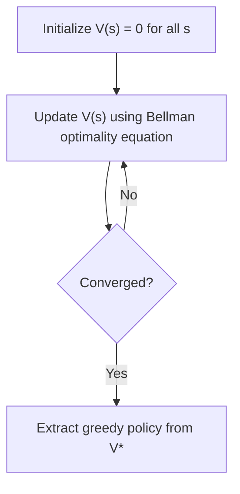
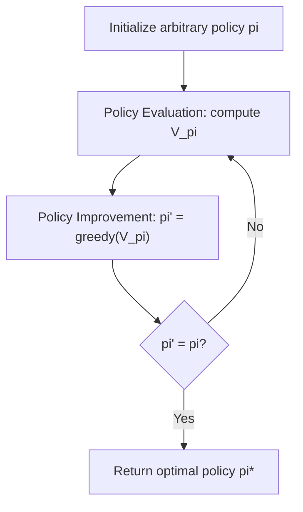

## Value Iteration and Policy Iteration

### Overview

Value iteration and policy iteration are two classical dynamic programming algorithms used to compute optimal policies for Markov Decision Processes (MDPs) when the full model of the environment (transition probabilities and reward function) is known. Both algorithms rely on the Bellman equations and iteratively refine estimates until they converge to an optimal solution, but they differ in their update structure and computational tradeoffs.

### Core Motivation

Directly solving the Bellman optimality equation in closed form is generally intractable for all but the smallest MDPs, since the equation for each state depends on the optimal values of other states. Value iteration and policy iteration were developed as iterative procedures that provably converge to the optimal value function and optimal policy without requiring a closed-form solution.

### Value Iteration

Value iteration directly applies the Bellman optimality equation as an iterative update rule. Starting from an arbitrary initialization of the value function (commonly zero for all states), each iteration updates every state's value using the current estimates of its successor states:

$$V_{k+1}(s) = \max_{a} \sum_{s'} P(s'|s,a) \left[ R(s,a,s') + \gamma V_k(s') \right]$$

This process is repeated until the value function changes by less than a small threshold $\theta$ between iterations, at which point $V_k$ is considered to have converged to a close approximation of $V^*$. The optimal policy is then extracted by acting greedily with respect to the converged value function:

$$\pi^*(s) = \arg\max_{a} \sum_{s'} P(s'|s,a) \left[ R(s,a,s') + \gamma V^*(s') \right]$$

flowchart TD
    A["Initialize V(s) = 0 for all s"] --> B["Update V(s) using Bellman optimality equation"]
    B --> C{"Converged? (svg_diagram)"}
    C -->|No| B
    C -->|Yes| D["Extract greedy policy from V*"]



### Value Iteration: Practical Example (Python pseudocode)

```python
def value_iteration(states, actions, P, R, gamma, theta=1e-6):
    V = {s: 0.0 for s in states}
    while True:
        delta = 0
        for s in states:
            v_old = V[s]
            action_values = []
            for a in actions:
                total = sum(
                    prob * (R[s][a][s_next] + gamma * V[s_next])
                    for s_next, prob in P[s][a].items()
                )
                action_values.append(total)
            V[s] = max(action_values)
            delta = max(delta, abs(v_old - V[s]))
        if delta < theta:
            break

    policy = {}
    for s in states:
        action_values = {
            a: sum(prob * (R[s][a][s_next] + gamma * V[s_next]) for s_next, prob in P[s][a].items())
            for a in actions
        }
        policy[s] = max(action_values, key=action_values.get)

    return V, policy
```

This pseudocode follows the standard value iteration update rule as defined by the Bellman optimality equation and is consistent with common reference presentations of the algorithm.

### Policy Iteration

Policy iteration takes a different approach: rather than directly iterating on the value function using the max operator at every step, it alternates between two distinct phases:

1. **Policy Evaluation**: For a fixed policy $\pi$, compute $V^\pi(s)$ for all states by solving (or iteratively approximating) the Bellman expectation equation:

$$V^\pi(s) = \sum_{a} \pi(a|s) \sum_{s'} P(s'|s,a) \left[ R(s,a,s') + \gamma V^\pi(s') \right]$$

2. **Policy Improvement**: Update the policy to act greedily with respect to the just-computed value function:

$$\pi'(s) = \arg\max_{a} \sum_{s'} P(s'|s,a) \left[ R(s,a,s') + \gamma V^\pi(s') \right]$$

These two steps alternate until the policy no longer changes between iterations, at which point the policy is guaranteed by the underlying theory to be optimal, since a policy that is greedy with respect to its own value function satisfies the Bellman optimality condition.

flowchart TD
    A["Initialize arbitrary policy π"] --> B["Policy Evaluation: compute V_π"]
    B --> C["Policy Improvement: π' = greedy(V_π)"]
    C --> D{"π' = π? (svg_diagram)"}
    D -->|No| B
    D -->|Yes| E["Return optimal policy π*"]



### Policy Iteration: Practical Example (Python pseudocode)

```python
def policy_evaluation(policy, states, actions, P, R, gamma, theta=1e-6):
    V = {s: 0.0 for s in states}
    while True:
        delta = 0
        for s in states:
            v_old = V[s]
            a = policy[s]
            V[s] = sum(prob * (R[s][a][s_next] + gamma * V[s_next]) for s_next, prob in P[s][a].items())
            delta = max(delta, abs(v_old - V[s]))
        if delta < theta:
            break
    return V

def policy_iteration(states, actions, P, R, gamma):
    policy = {s: actions[0] for s in states}
    while True:
        V = policy_evaluation(policy, states, actions, P, R, gamma)
        policy_stable = True
        for s in states:
            old_action = policy[s]
            action_values = {
                a: sum(prob * (R[s][a][s_next] + gamma * V[s_next]) for s_next, prob in P[s][a].items())
                for a in actions
            }
            policy[s] = max(action_values, key=action_values.get)
            if old_action != policy[s]:
                policy_stable = False
        if policy_stable:
            break
    return policy, V
```

This pseudocode follows the standard policy iteration structure, alternating between full policy evaluation and greedy policy improvement, as commonly presented in reinforcement learning reference material.

### Key Differences Between the Two Algorithms

| Aspect | Value Iteration | Policy Iteration |
|---|---|---|
| Update structure | Combines evaluation and improvement into a single max operation per sweep | Separates evaluation (full convergence) and improvement into distinct phases |
| Policy tracked explicitly | No (implicit until extraction at the end) | Yes (explicit policy maintained and updated each iteration) |
| Cost per iteration | Lower (single Bellman backup per state) | Higher (requires a full or near-full policy evaluation pass) |
| Number of iterations to converge | [Inference] Often more iterations, since each is a partial improvement step | [Inference] Often fewer iterations, since each includes a full evaluation |

[Inference] The claim that policy iteration typically requires fewer iterations than value iteration, while each iteration is more computationally expensive, is a commonly reported pattern in the reinforcement learning literature. I cannot verify this holds for every specific MDP instance, since actual convergence behavior depends on the structure of the particular problem being solved, including the size of the state space and the reward structure. This is not something I can guarantee, and behavior may vary.

### Modified Policy Iteration

Modified policy iteration is a hybrid approach that performs only a limited (fixed, finite) number of policy evaluation sweeps before each policy improvement step, rather than evaluating to full convergence as in standard policy iteration, or performing just one sweep as in value iteration. This can be understood as a generalization in which value iteration and (full) policy iteration are special cases at opposite ends of a spectrum of possible evaluation-step counts.

[Speculation] It is possible that modified policy iteration is used in practice as a way to balance the per-iteration cost of policy evaluation against the total number of iterations needed, since it allows an intermediate number of evaluation sweeps rather than the two extremes. I have not verified this against a specific benchmark study, so this is a reasoned possibility rather than a confirmed finding, and I cannot confirm this holds for any specific implementation.

### Convergence Guarantees

Both algorithms are proven, under the standard theoretical assumptions of finite MDPs with bounded rewards and a discount factor $\gamma < 1$, to converge to the optimal value function $V^*$ and optimal policy $\pi^*$. [Inference] This convergence guarantee is drawn from the underlying mathematical theory of dynamic programming for finite MDPs (specifically, the fact that the Bellman optimality operator is a contraction mapping under the discounted setting), which is a well-established theoretical result. However, I do not have access to a way to verify that any specific software implementation of these algorithms is bug-free or correctly reflects this theory, so correctness of a specific codebase is not something I can confirm without direct inspection. Convergence in practice may also be affected by numerical precision limits, which are implementation-dependent.

### Computational Complexity Considerations

[Inference] Each iteration of value iteration requires evaluating all actions for all states, giving a per-iteration cost that scales with the size of the state space, action space, and the number of possible successor states considered in the transition model. This is a structural property that follows directly from the algorithm's definition rather than an empirical claim, so it does not require a separate uncertainty label as a mathematical description of the update rule itself.

[Unverified] I do not have access to a comprehensive, up-to-date benchmark comparing the wall-clock runtime of value iteration versus policy iteration across a representative range of problem sizes and structures, since actual runtime depends heavily on implementation details, hardware, and the specific MDP being solved. This is not something I can confirm generalizes to any specific case, and behavior may vary.

### Relationship to Model-Free Methods

Both value iteration and policy iteration require complete knowledge of the transition probability function $P$ and reward function $R$, which places them in the category of model-based dynamic programming methods. When this model is not available, model-free methods such as Q-learning or temporal-difference learning are used instead, which estimate value functions from sampled experience rather than from a known model.

[Inference] Q-learning is commonly described in the literature as a sample-based analogue of value iteration, since its update rule has a similar structure (a max over next-state action values) but uses sampled transitions rather than a full expectation over the known transition model. I cannot verify that this analogy holds precisely for every variant of Q-learning discussed in the literature, so this should be treated as a general conceptual connection rather than a claim of mathematical equivalence. This is not something I can guarantee, and behavior may vary.

### Common Applications

- **Small to moderate finite MDPs**: Problems such as gridworld navigation, inventory control, and small-scale operations research problems where the full model is known and the state space is computationally manageable.
- **Educational and reference implementations**: Both algorithms are widely used as foundational teaching tools for reinforcement learning and dynamic programming courses.
- **Planning under known models**: Any setting where a complete and accurate model of the environment is available and the goal is to compute an optimal policy in advance, rather than learning through trial-and-error interaction.

### Limitations

- Both algorithms require complete knowledge of the transition and reward model, which is often unavailable in real-world problems.
- Both require the state and action spaces to be small enough for tabular representation and iteration to be computationally feasible, which limits direct applicability to large or continuous-space problems without additional approximation techniques.
- [Speculation] For very large state spaces, tabular value iteration and policy iteration are unlikely to be computationally feasible in practice, which is a commonly cited motivation in the literature for approximate dynamic programming and deep reinforcement learning methods. This is a reasoned extrapolation based on general computational scaling considerations rather than a confirmed benchmark result for any specific problem, and I cannot verify this holds for every case.

**Disclaimer**: Statements in this document regarding convergence behavior, computational cost, iteration counts, or comparative performance between value iteration and policy iteration reflect patterns and theoretical results commonly reported in the dynamic programming and reinforcement learning literature. I do not have access to a comprehensive, up-to-date benchmark confirming these effects for every specific implementation or problem instance. This behavior is not guaranteed, and actual results may vary based on the specific problem structure, implementation, and computational environment used.

### **Related Topics**

- Markov Decision Processes (prior topic, foundational framework)
- Q-Learning and Temporal-Difference Learning
- Modified Policy Iteration and Asynchronous Dynamic Programming
- Approximate Dynamic Programming for large state spaces
- Deep Reinforcement Learning (function approximation for value functions)
- Contraction mappings and fixed-point theory in dynamic programming
- Multi-Armed Bandits (simplified decision problems without state transitions)