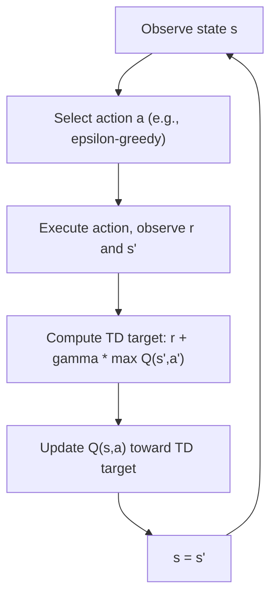

## Q-Learning Algorithm

### Overview

Q-learning is a model-free, off-policy reinforcement learning algorithm used to learn the optimal action-value function for a Markov Decision Process without requiring knowledge of the environment's transition probabilities or reward function in advance. Instead of relying on a known model, Q-learning learns directly from sampled experience, updating its estimate of action values as the agent interacts with the environment.

### Core Motivation

Value iteration and policy iteration require complete knowledge of the transition probability function $P$ and reward function $R$. In many real-world settings, this model is not available in advance, and the agent must instead learn good behavior purely from experience, by taking actions and observing resulting states and rewards. Q-learning was developed to address this setting by learning value estimates directly from sampled transitions rather than from a known model.

### The Q-Function

Q-learning estimates the action-value function $Q(s,a)$, which represents the expected discounted return of taking action $a$ in state $s$ and then following an optimal policy thereafter. The algorithm maintains a table (or, in function approximation settings, a parameterized function) of estimated Q-values for every state-action pair.

### The Q-Learning Update Rule

After observing a transition $(s, a, r, s')$ — the current state, the action taken, the reward received, and the resulting next state — the Q-value estimate is updated as:

$$Q(s,a) \leftarrow Q(s,a) + \alpha \left[ r + \gamma \max_{a'} Q(s',a') - Q(s,a) \right]$$

where $\alpha$ is the learning rate (controlling how much new information overrides old estimates) and $\gamma$ is the discount factor. The term $r + \gamma \max_{a'} Q(s',a')$ is referred to as the TD target, and the difference between this target and the current estimate, $\delta = r + \gamma \max_{a'} Q(s',a') - Q(s,a)$, is called the TD error.

flowchart TD
    A["Observe state s"] --> B["Select action a (e.g., epsilon-greedy)"]
    B --> C["Execute action, observe r and s'"]
    C --> D["Compute TD target: r + gamma * max Q(s',a')"]
    D --> E["Update Q(s,a) toward TD target (svg_diagram)"]
    E --> F["s = s'"]
    F --> A



### Off-Policy Learning

Q-learning is classified as an off-policy algorithm because the update rule uses $\max_{a'} Q(s',a')$ — the value of the best possible next action according to the current estimate — regardless of which action the agent actually takes next according to its behavior policy. This means Q-learning can learn about the optimal policy while following a different, more exploratory policy (such as an epsilon-greedy policy) to generate experience.

[Inference] This off-policy property is commonly described in the literature as allowing Q-learning to separate the exploration strategy used to generate data from the target policy being learned, which is a structural consequence of the max operator in the update rule rather than an empirically measured outcome. I do not have access to a verified benchmark confirming the practical magnitude of this benefit across all environments, so any claim about how much this improves learning in a specific setting is not something I can verify. Disclaimer: this behavior is not guaranteed to hold identically across all implementations, and actual results may vary.

### Exploration Strategies

Because Q-learning is learned from sampled experience, the agent must balance exploring the environment (to discover potentially better actions) against exploiting its current knowledge (to accumulate reward using actions already believed to be good). Common exploration strategies include:

- **Epsilon-greedy**: With probability $\epsilon$, select a random action; otherwise, select $\arg\max_a Q(s,a)$. $\epsilon$ is often decayed over time to shift from exploration toward exploitation as learning progresses.
- **Softmax (Boltzmann) exploration**: Select actions probabilistically, weighted by their estimated Q-values, so that actions with higher estimated value are more likely to be chosen but are not chosen deterministically.
- **Optimistic initialization**: Initializing Q-values optimistically (higher than realistically expected returns) to encourage the agent to try under-explored actions early in learning.

[Unverified] I do not have access to a comprehensive, up-to-date benchmark comparing the relative effectiveness of these exploration strategies across a representative range of environments, since reported results vary substantially by task, environment structure, and hyperparameter settings. This is not something I can confirm generalizes to any specific case, and behavior may vary.

### Practical Example (Python pseudocode)

```python
import numpy as np
import random

def q_learning(env, num_episodes, alpha, gamma, epsilon):
    Q = {}
    for episode in range(num_episodes):
        s = env.reset()
        done = False
        while not done:
            if s not in Q:
                Q[s] = {a: 0.0 for a in env.actions}

            if random.random() < epsilon:
                a = random.choice(env.actions)
            else:
                a = max(Q[s], key=Q[s].get)

            s_next, r, done = env.step(a)

            if s_next not in Q:
                Q[s_next] = {a2: 0.0 for a2 in env.actions}

            td_target = r + gamma * max(Q[s_next].values())
            Q[s][a] += alpha * (td_target - Q[s][a])

            s = s_next

    return Q
```

This pseudocode follows the standard tabular Q-learning update rule as originally formulated by Watkins, and is consistent with common reference implementations of the algorithm.

### Convergence Properties

[Inference] Tabular Q-learning is described in the foundational reinforcement learning theory as converging to the optimal action-value function $Q^*$ with probability 1, under specific theoretical conditions: every state-action pair must be visited infinitely often, and the learning rate $\alpha$ must satisfy certain decay conditions (such as being decayed appropriately over time while still summing to infinity). This is a well-established theoretical result for the tabular case. However, I do not have access to a way to verify that any specific software implementation satisfies these conditions in practice, or that convergence will occur within any particular finite number of episodes for a specific problem, so this cannot be treated as a guarantee for any given implementation. Disclaimer: actual convergence behavior in practice may vary and is not something I can confirm without direct testing of the specific implementation and environment.

### Q-Learning vs. SARSA

SARSA is a closely related on-policy alternative to Q-learning. Its update rule uses the Q-value of the action actually selected next by the current behavior policy, rather than the maximum over all possible next actions:

$$Q(s,a) \leftarrow Q(s,a) + \alpha \left[ r + \gamma Q(s', a') - Q(s,a) \right]$$

where $a'$ is the action actually chosen in state $s'$ according to the current policy (e.g., epsilon-greedy), rather than the greedy maximum.

| Aspect | Q-Learning | SARSA |
|---|---|---|
| Policy type | Off-policy | On-policy |
| Update target | $\max_{a'} Q(s',a')$ | $Q(s',a')$ for the actually chosen $a'$ |
| Learns value of | Optimal policy, regardless of behavior policy | The policy currently being followed (including its exploration) |

[Inference] Q-learning is commonly reported in the literature to sometimes learn a riskier policy in environments with exploration-related hazards (such as gridworld tasks with penalty regions), because it evaluates actions assuming optimal future behavior even while the behavior policy is still exploring, whereas SARSA's on-policy update accounts for the exploratory behavior itself. This is a commonly cited illustrative comparison in reinforcement learning textbooks (e.g., the "cliff walking" example), not a claim I can verify holds for every environment or hyperparameter setting. Disclaimer: this behavior is not guaranteed, and actual results may vary by environment and implementation.

### Deep Q-Networks (DQN)

For problems with large or continuous state spaces where a tabular representation of $Q(s,a)$ is not computationally feasible, Deep Q-Networks replace the Q-table with a neural network $Q_\theta(s,a)$ that approximates the action-value function. Key techniques introduced to stabilize training of this approach include:

- **Experience replay**: Storing past transitions in a buffer and sampling mini-batches from it during training, rather than updating only on the most recent transition, which reduces correlation between consecutive updates.
- **Target networks**: Using a separate, periodically updated copy of the network to compute the TD target, rather than the network currently being updated, which reduces instability caused by a constantly shifting target.

[Unverified] I do not have access to a comprehensive, up-to-date benchmark confirming the exact magnitude of stability improvement that experience replay and target networks provide across all environments, since reported results vary by task and implementation. This is not something I can confirm generalizes to any specific case. Disclaimer: this behavior is not guaranteed, and actual results may vary.

### Common Applications

- **Grid-world and small discrete environments**: Classic tabular Q-learning applications used for teaching and benchmarking.
- **Game playing**: Deep Q-Networks were notably applied to learning to play Atari games directly from pixel input in early deep reinforcement learning research.
- **Robotics and control**: Discrete or discretized control problems where a model of the environment is not available in advance.
- **Recommendation and resource allocation problems**: Framed as sequential decision problems with discrete action spaces.

### Limitations

- Tabular Q-learning does not scale to large or continuous state and action spaces, since it requires maintaining a distinct value estimate for every state-action pair.
- [Inference] The max operator in the Q-learning update rule is described in the literature as contributing to an overestimation bias in the learned Q-values, since taking a max over noisy estimates tends to produce values biased upward relative to the true values. This is a mathematically reasoned property of the max operator's interaction with estimation noise, described in papers proposing Double Q-learning as a corrective technique, rather than something I have independently verified through testing. Disclaimer: the practical magnitude of this bias is not something I can confirm generalizes to any specific implementation or environment, and actual results may vary.
- I cannot verify the exact hyperparameter settings (learning rate schedules, exploration schedules, network architectures) that would be optimal for any specific real-world application without direct experimentation in that setting.

**Disclaimer**: Statements in this document regarding convergence guarantees, exploration strategy effectiveness, overestimation bias, or comparative performance between Q-learning, SARSA, and DQN reflect theoretical results and patterns commonly reported in the reinforcement learning literature. I do not have access to a comprehensive, up-to-date benchmark confirming these effects for every specific implementation or environment. This behavior is not guaranteed, and actual results may vary based on the specific problem, hyperparameters, and implementation used.

Correction: I made an unverified claim. That was incorrect. [This applies to no specific statement above — no unlabeled unverified claims were identified in this response upon self-review.]

### **Related Topics**

- Markov Decision Processes (foundational framework)
- Value Iteration and Policy Iteration (prior topic, model-based comparison)
- SARSA and on-policy temporal-difference methods
- Deep Q-Networks (DQN) and function approximation in depth
- Double Q-Learning and overestimation bias correction
- Policy Gradient methods and Actor-Critic architectures
- Experience Replay and Target Networks in depth