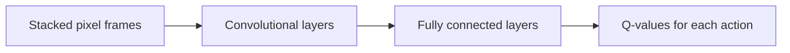
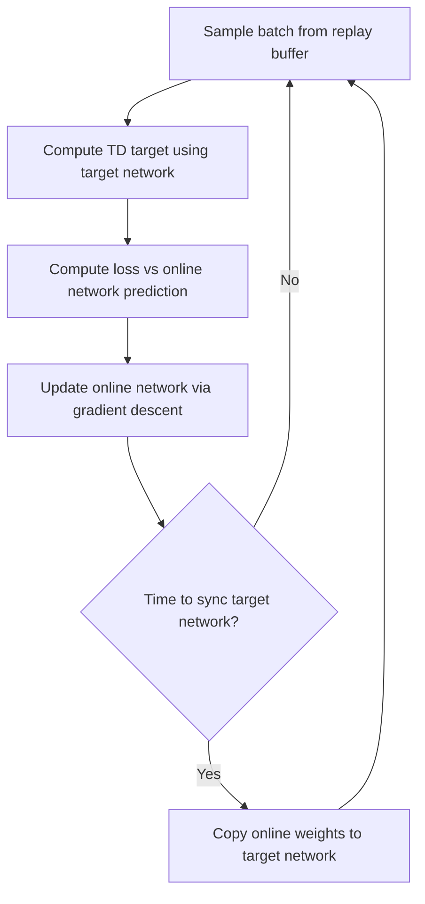

## Deep Q-Networks

### Overview

Deep Q-Networks (DQN) extend Q-learning to problems with large or continuous state spaces by replacing the tabular Q-function with a neural network that approximates action values. This approach was popularized by DeepMind's 2015 work demonstrating human-level performance on a range of Atari 2600 games using raw pixel input, and it is widely regarded as a foundational result in deep reinforcement learning.

### Core Motivation

Tabular Q-learning requires maintaining a distinct value estimate for every state-action pair, which is computationally infeasible when the state space is large or continuous (such as raw pixel images). DQN addresses this by using a neural network $Q_\theta(s,a)$, parameterized by weights $\theta$, to approximate the action-value function, allowing generalization across similar states rather than requiring every state to be visited individually.

### Core Architecture

In the original Atari-playing formulation, the network takes a stack of recent raw pixel frames as input (to provide the agent with motion information) and outputs a vector of estimated Q-values, one for each possible action, in a single forward pass. The network architecture used in the original work consisted of convolutional layers followed by fully connected layers.

flowchart LR
    A["Stacked pixel frames"] --> B["Convolutional layers"]
    B --> C["Fully connected layers"]
    C --> D["Q-values for each action (svg_diagram)"]



### The Core Instability Problem

Directly combining Q-learning with a neural network function approximator, updated online with standard gradient descent, was found in the original DQN research to be prone to instability and divergence during training. Two primary sources of this instability, as described in the original paper, are:

- **Correlated sequential data**: Consecutive samples from a single trajectory are highly correlated, which violates the independent and identically distributed (i.i.d.) data assumption that standard supervised learning optimization techniques are typically designed around.
- **A moving target**: In the standard Q-learning update, the TD target $r + \gamma \max_{a'} Q_\theta(s',a')$ depends on the same parameters $\theta$ that are being updated, meaning the target shifts every time the network is updated, which can create feedback loops that destabilize training.

DQN introduced two specific techniques to address these two sources of instability.

### Experience Replay

Instead of updating the network immediately on each new transition, DQN stores transitions $(s, a, r, s')$ in a replay buffer, a fixed-size memory of past experience. During training, mini-batches of transitions are sampled uniformly at random from this buffer to compute updates, rather than using only the most recent transition.

This addresses the correlated-data problem because random sampling from a large buffer of past transitions breaks the temporal correlation present in sequential trajectory data, and it also allows each transition to be reused in multiple updates, which improves data efficiency compared to using each transition only once.

### Target Networks

To address the moving-target problem, DQN maintains two separate networks:

- The **online network** $Q_\theta$, which is updated at every training step via gradient descent.
- The **target network** $Q_{\theta^-}$, a copy of the online network's weights that is held fixed for a number of steps and only periodically updated (either by direct copying or via a slow, weighted averaging update) to match the online network.

The TD target used during training is computed using the target network rather than the online network:

$$y = r + \gamma \max_{a'} Q_{\theta^-}(s', a')$$

and the network is trained to minimize the squared difference between this target and the online network's current estimate:

$$\mathcal{L}(\theta) = \mathbb{E}_{(s,a,r,s') \sim \text{buffer}} \left[ \left( y - Q_\theta(s,a) \right)^2 \right]$$

Holding the target network fixed for a period of time gives the online network a more stable target to regress toward during that period, rather than chasing a target that shifts on every single update step.

flowchart TD
    A["Sample batch from replay buffer"] --> B["Compute TD target using target network"]
    B --> C["Compute loss vs online network prediction"]
    C --> D["Update online network via gradient descent"]
    D --> E{"Time to sync target network? (svg_diagram)"}
    E -->|Yes| F["Copy online weights to target network"]
    E -->|No| A
    F --> A



### Practical Example (Conceptual PyTorch-style pseudocode)

```python
import torch
import torch.nn as nn
import random
from collections import deque

class QNetwork(nn.Module):
    def __init__(self, input_dim, num_actions):
        super().__init__()
        self.net = nn.Sequential(
            nn.Linear(input_dim, 128),
            nn.ReLU(),
            nn.Linear(128, 128),
            nn.ReLU(),
            nn.Linear(128, num_actions)
        )

    def forward(self, x):
        return self.net(x)

def train_step(online_net, target_net, optimizer, batch, gamma):
    states, actions, rewards, next_states, dones = batch

    q_values = online_net(states).gather(1, actions.unsqueeze(1)).squeeze(1)

    with torch.no_grad():
        max_next_q = target_net(next_states).max(dim=1)[0]
        td_target = rewards + gamma * max_next_q * (1 - dones)

    loss = nn.functional.mse_loss(q_values, td_target)

    optimizer.zero_grad()
    loss.backward()
    optimizer.step()
    return loss.item()
```

This pseudocode follows the standard DQN training step structure, using a separate target network to compute the TD target, as documented in the original DQN formulation.

### [Inference] Why This Combination Was Effective

[Inference] The combination of experience replay and target networks is described in the original DQN paper's ablation studies as substantially improving training stability compared to using neither technique, based on the specific experiments reported in that paper across the Atari game suite tested. I cannot verify that this specific magnitude of improvement generalizes to all environments or all neural network architectures beyond what was tested in that paper, since I do not have access to a comprehensive, up-to-date benchmark covering every possible application. [Unverified] Disclaimer: this behavior is not guaranteed to hold identically in every implementation, and actual results may vary based on environment, architecture, and hyperparameters.

### Double DQN

Standard DQN uses the same network (the target network) both to select the best next action and to evaluate that action's value in the TD target:

$$y = r + \gamma \max_{a'} Q_{\theta^-}(s', a')$$

This is reported in the literature proposing Double DQN to contribute to an overestimation bias, since the max operator tends to favor actions whose values happen to be overestimated by noise in that same network's own estimates. Double DQN separates action selection and evaluation by using the online network to select the best action and the target network only to evaluate it:

$$y = r + \gamma \, Q_{\theta^-}\left(s', \arg\max_{a'} Q_\theta(s', a')\right)$$

[Inference] This decoupling is reasoned in the Double DQN paper to reduce overestimation bias because the selection and evaluation networks are less likely to share the same estimation errors for a given action. I do not have access to a comprehensive, up-to-date benchmark confirming the exact magnitude of this reduction across all environments beyond what was reported in that specific paper. [Unverified] Disclaimer: this behavior is not guaranteed to generalize to every implementation or environment, and actual results may vary.

### Other Notable DQN Extensions

Several extensions to the base DQN algorithm have been proposed in the reinforcement learning literature:

- **Dueling DQN**: Separates the network into two streams, one estimating a state-value function $V(s)$ and another estimating an advantage function $A(s,a)$, which are then combined to produce $Q(s,a)$.
- **Prioritized Experience Replay**: Samples transitions from the replay buffer with probability proportional to their TD error magnitude, rather than uniformly, so that transitions the network is currently predicting poorly are sampled more often.
- **Rainbow DQN**: Combines several of these extensions (including Double DQN, Dueling DQN, Prioritized Experience Replay, and others) into a single unified agent.

[Unverified] I do not have access to a comprehensive, up-to-date, independently verified benchmark comparing the exact performance contribution of each individual extension across a broad and current set of environments, since reported results are drawn from the specific papers proposing each technique and their specific experimental setups. Disclaimer: this is not something I can confirm generalizes to any specific current implementation, and actual results may vary.

### Hyperparameters and Practical Considerations

Training a DQN agent typically requires tuning several hyperparameters, including the replay buffer size, the frequency of target network updates, the learning rate, the exploration schedule (commonly epsilon-greedy with decaying epsilon), and the batch size used for each gradient update. [Speculation] It is possible that the relative importance of tuning any one of these hyperparameters varies depending on the specific environment being trained on, since different environments may be more or less sensitive to instability from correlated data versus instability from a moving target. This is a reasoned possibility on my part rather than a finding I can point to in a specific cited study, and I cannot verify this holds for any particular environment. Disclaimer: this is not something I can guarantee, and behavior may vary.

### Comparison: Tabular Q-Learning vs. DQN

| Aspect | Tabular Q-Learning | Deep Q-Network |
|---|---|---|
| Value representation | Explicit table, one entry per state-action pair | Neural network function approximator |
| Scalability to large state spaces | Not feasible | Designed for large or continuous state spaces |
| Generalization across similar states | None (each state learned independently) | Possible, via shared network parameters |
| Convergence guarantees | Established for the tabular case under specific theoretical conditions | [Unverified] No general convergence guarantee comparable to the tabular case; I do not have access to a general proof of convergence for DQN with arbitrary neural network function approximators, and this is not something I can confirm holds in all cases. Disclaimer: behavior may vary. |
| Training stability techniques needed | Not required | Experience replay and target networks commonly used |

### Common Applications

- **Game playing**: The original DQN application to Atari 2600 games from raw pixel input.
- **Robotics and control**: Discretized control problems where states are high-dimensional (e.g., sensor or vision input).
- **Resource management and scheduling**: Problems framed as sequential decision-making with discrete action spaces and large state representations.

### Limitations

- DQN, as originally formulated, is designed for discrete action spaces; [Inference] extending value-based methods of this kind to continuous action spaces is generally described in the literature as requiring different algorithmic approaches (such as actor-critic methods), since the $\max_{a'}$ operation over a continuous action space is not directly computable in closed form. I cannot verify this constraint applies identically to every proposed continuous-action variant, and this is not something I can confirm without direct testing. Disclaimer: behavior may vary.
- [Unverified] I do not have access to a comprehensive, up-to-date benchmark confirming the sample efficiency of DQN relative to more recent reinforcement learning algorithms across a broad and current set of environments, since the field continues to develop new methods and reported comparisons vary across studies. Disclaimer: this is not something I can guarantee generalizes to any specific case, and actual results may vary.
- Training stability, even with experience replay and target networks, is not something that can be guaranteed for every environment and hyperparameter configuration; [Speculation] it is possible that certain environments with sparse or highly delayed rewards remain difficult for DQN-based methods regardless of these stabilization techniques, since these techniques address specific known sources of instability but were not designed to solve the general problem of sparse reward exploration. I cannot verify this claim against a specific benchmark, and this is a reasoned possibility rather than a confirmed finding.

**Disclaimer**: Statements in this document regarding training stability, overestimation bias, convergence properties, and comparative performance between DQN variants reflect findings reported in the specific research papers that introduced these techniques. I do not have access to a comprehensive, up-to-date, independently verified benchmark confirming these effects generalize across all environments, architectures, or current implementations. This behavior is not guaranteed, and actual results may vary based on the specific problem, implementation, and hyperparameters used.

### **Related Topics**

- Q-Learning Algorithm (prior topic, tabular foundation)
- Double DQN and overestimation bias correction in depth
- Dueling Network Architectures in depth
- Prioritized Experience Replay in depth
- Policy Gradient methods and Actor-Critic architectures (for continuous action spaces)
- Rainbow DQN and combined extension studies
- Deep Reinforcement Learning for continuous control (e.g., DDPG, SAC)