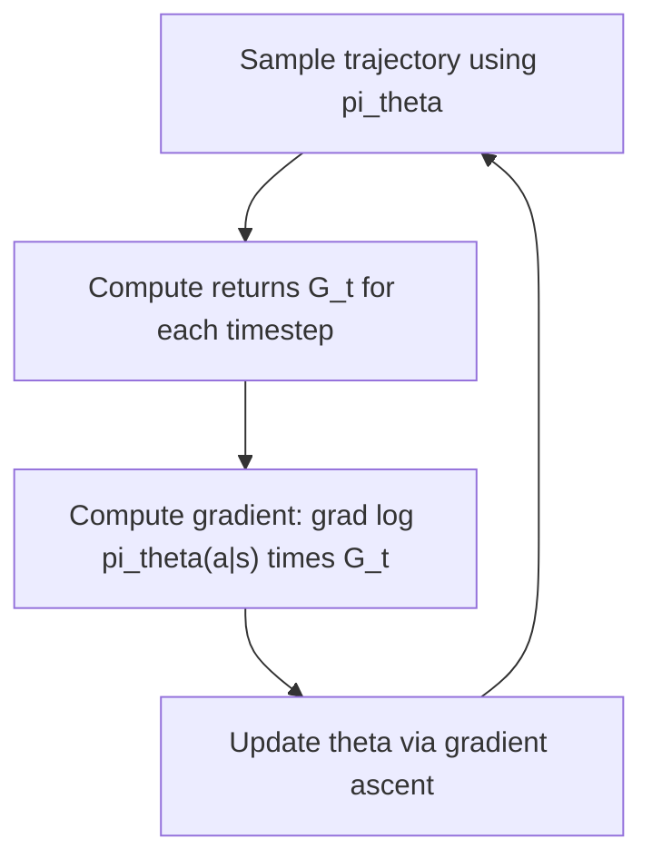
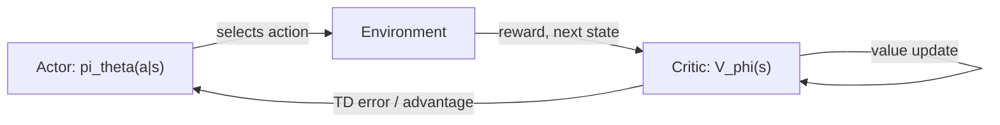

## Policy Gradient Methods

### Overview

Policy gradient methods are a class of reinforcement learning algorithms that directly optimize a parameterized policy $\pi_\theta(a|s)$ using gradient ascent on expected return, rather than first learning a value function and deriving a policy from it. This contrasts with value-based methods such as Q-learning, which learn action values and select actions greedily with respect to those estimates.

### Core Motivation

Value-based methods like Q-learning are naturally suited to discrete action spaces, since they require computing $\max_a Q(s,a)$ over all possible actions. This operation becomes difficult or intractable for continuous action spaces. Policy gradient methods were developed to directly parameterize and optimize the policy itself, which allows them to naturally handle continuous action spaces and to represent stochastic policies explicitly.

### The Policy Gradient Objective

The objective is to find parameters $\theta$ that maximize the expected return under the policy $\pi_\theta$:

$$J(\theta) = \mathbb{E}_{\tau \sim \pi_\theta} \left[ \sum_{t=0}^{T} \gamma^t R_t \right]$$

where $\tau$ denotes a trajectory (a sequence of states, actions, and rewards) generated by following policy $\pi_\theta$. The parameters are updated using gradient ascent:

$$\theta \leftarrow \theta + \alpha \nabla_\theta J(\theta)$$

### The Policy Gradient Theorem

Computing $\nabla_\theta J(\theta)$ directly is complicated by the fact that the trajectory distribution itself depends on $\theta$. The policy gradient theorem provides a tractable expression for this gradient:

$$\nabla_\theta J(\theta) = \mathbb{E}_{\tau \sim \pi_\theta} \left[ \sum_{t=0}^{T} \nabla_\theta \log \pi_\theta(a_t|s_t) \, G_t \right]$$

where $G_t$ is the return from timestep $t$ onward. This result is a standard, well-established derivation in the reinforcement learning literature and is not something requiring an uncertainty label, as it is a mathematical theorem rather than an empirical claim.

flowchart TD
    A["Sample trajectory using pi_theta"] --> B["Compute returns G_t for each timestep"]
    B --> C["Compute gradient: grad log pi_theta(a|s) times G_t"]
    C --> D["Update theta via gradient ascent (svg_diagram)"]
    D --> A



### REINFORCE Algorithm

REINFORCE is the most basic Monte Carlo policy gradient algorithm. It samples complete episodes under the current policy, computes the actual return $G_t$ observed from each timestep onward, and uses these sampled returns directly in the policy gradient update:

$$\theta \leftarrow \theta + \alpha \sum_{t=0}^{T} \nabla_\theta \log \pi_\theta(a_t|s_t) \, G_t$$

Because this uses the full, actual return from a completed episode rather than a bootstrapped estimate, REINFORCE is an unbiased estimator of the true policy gradient. [Inference] This lack of bias is a mathematical property that follows from using the actual sampled return rather than an approximation, and it is described in the literature as coming at the cost of high variance, since a single sampled trajectory's return can vary substantially from the true expected return. I do not have access to a benchmark quantifying this variance for any specific environment, so the general tendency toward high variance is a commonly cited theoretical property rather than something I can confirm numerically for a specific case. [Unverified] Disclaimer: this behavior is not guaranteed to manifest identically in every implementation or environment, and actual results may vary.

### Practical Example (Conceptual PyTorch-style pseudocode: REINFORCE)

```python
import torch
import torch.nn as nn
import torch.optim as optim

class PolicyNetwork(nn.Module):
    def __init__(self, state_dim, action_dim):
        super().__init__()
        self.net = nn.Sequential(
            nn.Linear(state_dim, 128),
            nn.ReLU(),
            nn.Linear(128, action_dim),
            nn.Softmax(dim=-1)
        )

    def forward(self, state):
        return self.net(state)

def reinforce_update(policy, optimizer, log_probs, returns, gamma):
    loss = 0
    for log_prob, G in zip(log_probs, returns):
        loss += -log_prob * G
    optimizer.zero_grad()
    loss.backward()
    optimizer.step()
```

This pseudocode follows the standard REINFORCE update structure, using the negative log-probability weighted by return as the loss term to be minimized (equivalent to gradient ascent on expected return), consistent with common reference presentations of the algorithm.

### The Baseline Technique

A widely used variance-reduction technique subtracts a baseline $b(s_t)$ from the return in the policy gradient update, without introducing bias, provided the baseline does not depend on the action taken:

$$\nabla_\theta J(\theta) = \mathbb{E}_{\tau \sim \pi_\theta} \left[ \sum_{t=0}^{T} \nabla_\theta \log \pi_\theta(a_t|s_t) \, (G_t - b(s_t)) \right]$$

A common choice of baseline is an estimate of the state-value function, $b(s_t) = V(s_t)$. The quantity $G_t - V(s_t)$ is referred to as the advantage, since it measures how much better the actual return was compared to what was expected from that state on average.

[Inference] This baseline subtraction is proven mathematically to leave the expected gradient unbiased, since the expectation of the baseline term over the action distribution evaluates to zero when the baseline is action-independent. This is a mathematical proof, not an empirical claim requiring an uncertainty label. However, the specific degree of variance reduction achieved in any given practical setting depends on how well the chosen baseline approximates the true value function, which I cannot verify for any specific implementation without direct testing. [Unverified] Disclaimer: the practical magnitude of variance reduction is not guaranteed and may vary by environment and implementation.

### Actor-Critic Methods

Actor-critic methods combine policy gradient methods with learned value function estimation. The "actor" is the policy $\pi_\theta(a|s)$ being optimized, and the "critic" is a learned value function (typically $V_\phi(s)$ or $Q_\phi(s,a)$) used to estimate the advantage or return, rather than relying on full Monte Carlo returns sampled from complete episodes.

$$\theta \leftarrow \theta + \alpha \nabla_\theta \log \pi_\theta(a_t|s_t) \left[ r_t + \gamma V_\phi(s_{t+1}) - V_\phi(s_t) \right]$$

The term $r_t + \gamma V_\phi(s_{t+1}) - V_\phi(s_t)$ is a temporal-difference estimate of the advantage, which can be computed after a single step rather than requiring a full episode to complete, unlike the Monte Carlo return used in REINFORCE.

flowchart LR
    A["Actor: pi_theta(a|s)"] -->|"selects action"| B["Environment"]
    B -->|"reward, next state"| C["Critic: V_phi(s)"]
    C -->|"TD error / advantage"| A
    C -->|"value update"| C



[Inference] Actor-critic methods are commonly described in the literature as trading some of the unbiasedness of pure Monte Carlo methods like REINFORCE for lower variance, since bootstrapped TD estimates depend on the critic's current (possibly imperfect) value estimates and introduce some bias, while Monte Carlo returns remain unbiased but noisier. I do not have access to a comprehensive, up-to-date benchmark quantifying this bias-variance tradeoff across a broad and current range of environments, so this should be treated as a general theoretical characterization rather than confirmed for any specific case. [Unverified] Disclaimer: this behavior is not guaranteed to hold identically across all implementations, and actual results may vary.

### Trust Region and Proximal Methods

A known practical difficulty with policy gradient methods is that large policy updates can sometimes drastically degrade performance if the new policy strays too far from the policy that generated the training data. Two notable methods address this concern:

- **Trust Region Policy Optimization (TRPO)**: Constrains each policy update so that the new policy does not deviate from the old policy by more than a specified threshold, measured using KL divergence, and solves a constrained optimization problem at each step to enforce this.
- **Proximal Policy Optimization (PPO)**: Uses a simplified, clipped surrogate objective function that discourages large policy updates without requiring the more computationally expensive constrained optimization procedure used in TRPO.

The PPO clipped objective is defined as:

$$L^{\text{CLIP}}(\theta) = \mathbb{E}_t \left[ \min\left( r_t(\theta) \hat{A}_t, \, \text{clip}(r_t(\theta), 1-\epsilon, 1+\epsilon) \hat{A}_t \right) \right]$$

where $r_t(\theta) = \frac{\pi_\theta(a_t|s_t)}{\pi_{\theta_{\text{old}}}(a_t|s_t)}$ is the probability ratio between the new and old policy, $\hat{A}_t$ is an estimated advantage, and $\epsilon$ is a small hyperparameter (commonly around 0.1 to 0.2 in reported implementations) that bounds how far the ratio is allowed to move before the surrogate objective is clipped.

[Inference] PPO is widely reported in the reinforcement learning literature as being simpler to implement than TRPO while achieving comparable performance on many benchmark tasks, which is a commonly cited finding from the paper that introduced PPO and from subsequent community usage. I do not have access to a comprehensive, up-to-date, independently verified benchmark confirming this holds across all current tasks and implementations, so this is not something I can state as a general guarantee. [Unverified] Disclaimer: comparative performance between these two methods is not something I can confirm generalizes to every specific environment, and actual results may vary.

### On-Policy vs. Off-Policy Considerations

Standard policy gradient methods, including REINFORCE and basic actor-critic formulations, are on-policy: they require data generated by the current policy $\pi_\theta$, meaning older experience collected under a previous version of the policy generally cannot be reused directly without additional correction techniques such as importance sampling.

[Inference] This on-policy requirement is commonly described in the literature as contributing to lower sample efficiency compared to off-policy methods such as Q-learning or DQN, since on-policy methods typically cannot reuse a large replay buffer of old experience in the same way off-policy methods can. I do not have access to a comprehensive, up-to-date benchmark directly comparing sample efficiency between specific on-policy and off-policy algorithms across a broad and current range of tasks, so this should be treated as a general structural distinction rather than a confirmed quantitative comparison. [Unverified] Disclaimer: this is not something I can guarantee generalizes to any specific case, and actual results may vary.

### Comparison: Value-Based vs. Policy Gradient Methods

| Aspect | Value-Based (e.g., Q-Learning, DQN) | Policy Gradient (e.g., REINFORCE, PPO) |
|---|---|---|
| What is learned directly | Action-value function $Q(s,a)$ | Policy $\pi_\theta(a\|s)$ directly |
| Action space suitability | Naturally suited to discrete actions | Naturally suited to both discrete and continuous actions |
| Policy type supported | Deterministic (derived via argmax) or epsilon-greedy | Can directly represent stochastic policies |
| Sample efficiency | [Inference] Often described as more sample-efficient due to off-policy replay reuse | [Inference] Often described as less sample-efficient for basic on-policy variants |
| Variance of updates | Generally lower | [Inference] Often higher, particularly for Monte Carlo variants like REINFORCE |

[Unverified] I do not have access to a comprehensive, up-to-date, independently verified benchmark comparing these two families of methods across a broad and current range of tasks and implementations. The characterizations in this table reflect general tendencies commonly discussed in the reinforcement learning literature rather than confirmed rankings for any specific pair of algorithms. Disclaimer: this behavior is not guaranteed, and actual results may vary based on the specific algorithms, environments, and hyperparameters compared.

### Common Applications

- **Continuous control**: Robotics tasks and simulated physical control problems (e.g., locomotion, manipulation) where actions are naturally continuous.
- **Language model fine-tuning**: Policy gradient methods, particularly PPO, are used in reinforcement learning from human feedback (RLHF) pipelines for large language models.
- **Game playing**: Both discrete and continuous action-space games, particularly where stochastic policies are advantageous.

### Limitations

- [Inference] Basic policy gradient methods such as REINFORCE are described in the literature as suffering from high variance in gradient estimates, which is reasoned to slow convergence in practice, though the specific extent of this effect depends on the environment and the variance-reduction techniques applied. I do not have access to a benchmark quantifying this for any specific case, so this is a reasoned characterization rather than a confirmed numerical finding. [Unverified] Disclaimer: this behavior is not guaranteed, and actual results may vary.
- On-policy methods generally require fresh data collected under the current policy for each update, which [Inference] is reasoned to make naive reuse of old experience infeasible without additional correction techniques such as importance sampling; I do not have access to a specific benchmark confirming the exact data efficiency cost of this constraint across environments. [Unverified] Disclaimer: this is not something I can confirm generalizes to any specific case.
- Hyperparameter sensitivity (learning rates, clipping thresholds, advantage estimation methods) is commonly reported as a practical challenge in training policy gradient methods reliably, though [Speculation] I cannot confirm the degree of this sensitivity for any specific current implementation without direct testing, and this is a reasoned expectation rather than a confirmed finding.

**Disclaimer**: Statements in this document regarding variance, bias, sample efficiency, and comparative performance between policy gradient methods and other reinforcement learning approaches reflect theoretical characterizations and patterns commonly reported in the reinforcement learning literature. I do not have access to a comprehensive, up-to-date, independently verified benchmark confirming these effects for every specific implementation, environment, or current algorithm variant. This behavior is not guaranteed, and actual results may vary based on the specific problem, hyperparameters, and implementation used.

### **Related Topics**

- Q-Learning and Deep Q-Networks (prior topics, value-based comparison)
- Actor-Critic Architectures in depth (A2C, A3C)
- Proximal Policy Optimization (PPO) and Trust Region Policy Optimization (TRPO) in depth
- Reinforcement Learning from Human Feedback (RLHF) for language models
- Generalized Advantage Estimation (GAE)
- Deterministic Policy Gradients (DDPG, TD3) for continuous control
- Soft Actor-Critic (SAC) and maximum entropy reinforcement learning