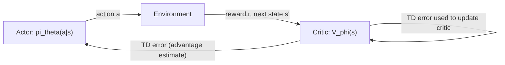

## Actor-Critic Architectures

### Overview

Actor-critic architectures are a family of reinforcement learning methods that combine two components trained together: an actor, which is a parameterized policy that selects actions, and a critic, which estimates a value function used to evaluate those actions. This combination is designed to reduce the variance of pure policy gradient methods while avoiding some of the limitations of pure value-based methods.

### Core Motivation

Pure Monte Carlo policy gradient methods such as REINFORCE require complete episodes to compute returns and tend to produce high-variance gradient estimates. Pure value-based methods such as Q-learning are naturally suited to discrete action spaces and do not directly represent a stochastic policy. Actor-critic methods were developed to combine a directly parameterized policy (the actor) with a learned value function (the critic) that can provide lower-variance, step-by-step feedback, rather than waiting for full-episode returns.

### The Two Components

- **Actor**: A parameterized policy $\pi_\theta(a|s)$ that selects actions given the current state. This is updated using policy gradient methods.
- **Critic**: A learned value function, typically $V_\phi(s)$ or $Q_\phi(s,a)$, parameterized separately from the actor and updated using standard value-function learning techniques such as temporal-difference learning.

The critic's role is to evaluate the actor's action choices, providing a learning signal that the actor uses to adjust its policy toward actions that lead to higher estimated value.

flowchart LR
    A["Actor: pi_theta(a|s)"] -->|"action a"| B["Environment"]
    B -->|"reward r, next state s'"| C["Critic: V_phi(s)"]
    C -->|"TD error (advantage estimate)"| A
    C -->|"TD error used to update critic"| C



### The Actor Update

The actor is updated using the policy gradient theorem, but instead of using the full Monte Carlo return $G_t$ (as in REINFORCE), it uses an estimate of the advantage function computed by the critic:

$$\theta \leftarrow \theta + \alpha_\theta \, \nabla_\theta \log \pi_\theta(a_t|s_t) \, \hat{A}_t$$

A common choice for $\hat{A}_t$ is the one-step temporal-difference (TD) error:

$$\hat{A}_t = r_t + \gamma V_\phi(s_{t+1}) - V_\phi(s_t)$$

This quantity estimates how much better (or worse) the action actually taken was compared to the critic's expectation of the average value of that state.

### The Critic Update

The critic is trained to minimize the difference between its value estimate and the observed TD target, using standard temporal-difference learning:

$$\phi \leftarrow \phi + \alpha_\phi \, \nabla_\phi \left[ \frac{1}{2} \left( r_t + \gamma V_\phi(s_{t+1}) - V_\phi(s_t) \right)^2 \right]$$

Both the actor and critic are typically updated simultaneously at each timestep (or after a small batch of steps), rather than the critic being fully trained before the actor begins updating.

### Why Use a Critic Instead of Raw Returns

[Inference] Using a bootstrapped, one-step TD estimate from the critic instead of a full Monte Carlo return is reasoned in the literature to reduce the variance of the actor's gradient estimate, since a single-step estimate depends on less accumulated randomness than a full-episode return does. I cannot verify the specific magnitude of this variance reduction for any particular environment without a specific benchmark, so this should be treated as a commonly cited theoretical property rather than a confirmed numerical result for any specific case. This introduces some bias from the critic's own imperfect value estimates, which is a documented bias-variance tradeoff discussed in the actor-critic literature. [Unverified] Disclaimer: the practical magnitude of this tradeoff is not something I can guarantee for any specific implementation, and actual results may vary.

### Practical Example (Conceptual PyTorch-style pseudocode)

```python
import torch
import torch.nn as nn
import torch.optim as optim

class Actor(nn.Module):
    def __init__(self, state_dim, action_dim):
        super().__init__()
        self.net = nn.Sequential(
            nn.Linear(state_dim, 128),
            nn.ReLU(),
            nn.Linear(128, action_dim),
            nn.Softmax(dim=-1)
        )

    def forward(self, state):
        return self.net(state)

class Critic(nn.Module):
    def __init__(self, state_dim):
        super().__init__()
        self.net = nn.Sequential(
            nn.Linear(state_dim, 128),
            nn.ReLU(),
            nn.Linear(128, 1)
        )

    def forward(self, state):
        return self.net(state)

def actor_critic_step(actor, critic, actor_opt, critic_opt, s, a, r, s_next, log_prob, gamma, done):
    v_s = critic(s)
    v_s_next = critic(s_next).detach() * (1 - done)
    td_target = r + gamma * v_s_next
    advantage = (td_target - v_s).detach()

    actor_loss = -log_prob * advantage
    actor_opt.zero_grad()
    actor_loss.backward()
    actor_opt.step()

    critic_loss = nn.functional.mse_loss(v_s, td_target)
    critic_opt.zero_grad()
    critic_loss.backward()
    critic_opt.step()
```

This pseudocode follows the standard structure of a one-step actor-critic update, in which the critic's TD error is used as the advantage signal for the actor, consistent with common reference presentations of the algorithm.

### Advantage Actor-Critic (A2C)

Advantage Actor-Critic (A2C) is a widely used synchronous variant of the actor-critic framework in which multiple parallel environment instances are run simultaneously, and their experience is collected and used together to compute a batched update for both the actor and critic. This synchronous batching is intended to provide more stable gradient estimates than a single-environment actor-critic update, since the batch aggregates experience from multiple independent trajectories.

### Asynchronous Advantage Actor-Critic (A3C)

Asynchronous Advantage Actor-Critic (A3C) is a related method in which multiple actor-learner threads or processes interact with separate copies of the environment in parallel and asynchronously update a shared set of global network parameters, rather than synchronizing updates into a single batch as in A2C.

[Inference] Running multiple decorrelated environment instances in parallel is reasoned in the A3C paper to serve a similar variance- and correlation-reduction purpose to experience replay in DQN, by providing more diverse, less correlated data for updates without requiring a replay buffer. I do not have access to a comprehensive, up-to-date benchmark directly comparing A3C against replay-buffer-based methods across a broad and current range of environments, so this is a structural comparison drawn from the original paper's reasoning rather than an independently confirmed finding. [Unverified] Disclaimer: this is not something I can guarantee generalizes to any specific implementation or environment, and actual results may vary.

### Comparison: A2C vs. A3C

| Aspect | A2C | A3C |
|---|---|---|
| Update synchronization | Synchronous (waits for all parallel workers before updating) | Asynchronous (each worker updates shared parameters independently) |
| Implementation complexity | [Inference] Generally considered simpler due to synchronous batching | [Inference] Generally considered more complex due to asynchronous coordination |
| Hardware utilization | Well suited to GPU-based batched computation | Originally designed around multi-core CPU parallelism |

[Unverified] I do not have access to a comprehensive, up-to-date, independently verified benchmark comparing the practical performance of A2C and A3C across a broad and current range of tasks and hardware setups. These characterizations reflect commonly discussed structural differences rather than confirmed performance rankings. Disclaimer: this behavior is not guaranteed, and actual results may vary based on implementation and environment.

### Generalized Advantage Estimation (GAE)

Generalized Advantage Estimation is a technique for computing the advantage estimate $\hat{A}_t$ using a weighted combination of multi-step TD estimates, controlled by a parameter $\lambda$ (in addition to the discount factor $\gamma$), rather than relying solely on either the one-step TD error or the full Monte Carlo return.

$$\hat{A}_t^{\text{GAE}(\gamma,\lambda)} = \sum_{l=0}^{\infty} (\gamma \lambda)^l \delta_{t+l}$$

where $\delta_t = r_t + \gamma V_\phi(s_{t+1}) - V_\phi(s_t)$ is the one-step TD error at time $t$. Setting $\lambda = 0$ recovers the one-step TD advantage estimate, while $\lambda = 1$ recovers something closer to the full Monte Carlo advantage estimate.

[Inference] GAE is described in the paper that introduced it as providing a tunable mechanism for trading off bias and variance in the advantage estimate, using $\lambda$ to interpolate between the low-variance, higher-bias one-step estimate and the low-bias, higher-variance full-return estimate. I do not have access to a comprehensive, up-to-date benchmark confirming the optimal $\lambda$ value across a broad and current range of environments, since the appropriate setting is commonly reported to be environment- and task-dependent. [Unverified] Disclaimer: this is not something I can guarantee generalizes to any specific implementation, and actual results may vary.

### Deterministic Policy Gradient Methods

Standard actor-critic methods described above typically use stochastic policies. A related family of methods uses deterministic actor-critic architectures for continuous action spaces:

- **Deep Deterministic Policy Gradient (DDPG)**: Combines a deterministic actor with a critic estimating $Q(s,a)$, using techniques adapted from DQN (such as a replay buffer and target networks) to stabilize training in the continuous-action, off-policy setting.
- **Twin Delayed DDPG (TD3)**: Introduces additional modifications to DDPG, including using two critic networks and taking the minimum of their estimates to reduce overestimation bias, along with delayed actor updates.
- **Soft Actor-Critic (SAC)**: Incorporates an entropy maximization term into the objective, encouraging the policy to remain as random as possible while still maximizing expected return, which is intended to improve exploration.

[Unverified] I do not have access to a comprehensive, up-to-date benchmark comparing the practical performance of DDPG, TD3, and SAC across a broad and current range of continuous control tasks and implementations. Any characterization of relative performance among these three methods would require citing a specific study's specific experimental conditions, which I have not done here. Disclaimer: this behavior is not guaranteed, and actual results may vary based on environment, hyperparameters, and implementation.

### On-Policy vs. Off-Policy Actor-Critic Variants

| Aspect | On-Policy (e.g., A2C, A3C, PPO) | Off-Policy (e.g., DDPG, TD3, SAC) |
|---|---|---|
| Data reuse | Generally requires fresh on-policy data for each update | Can reuse past experience via a replay buffer |
| Action space | Discrete or continuous | Primarily designed for continuous action spaces |
| Sample efficiency | [Inference] Often described as lower due to limited data reuse | [Inference] Often described as higher due to replay buffer reuse |

[Unverified] I do not have access to a comprehensive, up-to-date, independently verified benchmark comparing sample efficiency across these specific method families for a broad and current range of tasks. These characterizations reflect general structural tendencies discussed in the reinforcement learning literature rather than confirmed quantitative comparisons for any specific pair of algorithms. Disclaimer: this behavior is not guaranteed, and actual results may vary.

### Common Applications

- **Continuous control tasks**: Robotic locomotion, manipulation, and simulated physics control problems.
- **Game playing**: Both discrete and continuous action-space games.
- **Reinforcement learning from human feedback (RLHF)**: Actor-critic structures, particularly via PPO, are commonly used in fine-tuning pipelines for large language models.
- **Resource allocation and scheduling problems**: Framed as sequential decision problems where a learned value estimate can guide policy updates.

### Limitations

- [Inference] The critic's value estimates are themselves approximations learned during training, and any bias or error in these estimates is described in the literature as propagating into the actor's gradient updates, since the actor's learning signal depends directly on the critic's output. I do not have access to a benchmark quantifying the practical impact of this propagated error for any specific implementation. [Unverified] Disclaimer: this is not something I can confirm generalizes to any specific case, and actual results may vary.
- Training two interacting networks (actor and critic) simultaneously introduces additional hyperparameters (separate learning rates, update frequencies, network architectures for each component) that must be tuned, which [Speculation] may increase the practical difficulty of achieving stable training compared to a single-network method, though I cannot confirm this claim against a specific benchmark and this is a reasoned expectation rather than a confirmed finding.
- [Unverified] I do not have access to a comprehensive, up-to-date benchmark confirming which specific actor-critic variant (A2C, A3C, PPO, DDPG, TD3, SAC, or others) performs best on any given class of problems, since reported comparisons vary by study, task, and implementation, and the field continues to develop new methods. Disclaimer: this is not something I can guarantee generalizes to any specific case, and actual results may vary.

**Disclaimer**: Statements in this document regarding variance reduction, bias-variance tradeoffs, comparative performance between actor-critic variants, and training stability reflect theoretical characterizations and patterns reported in the reinforcement learning literature. I do not have access to a comprehensive, up-to-date, independently verified benchmark confirming these effects for every specific implementation, environment, or current algorithm variant. This behavior is not guaranteed, and actual results may vary based on the specific problem, hyperparameters, and implementation used.

### **Related Topics**

- Policy Gradient Methods and REINFORCE (prior topic, foundational framework)
- Proximal Policy Optimization (PPO) and Trust Region Policy Optimization (TRPO)
- Deep Deterministic Policy Gradient (DDPG), TD3, and Soft Actor-Critic (SAC) in depth
- Generalized Advantage Estimation (GAE) in depth
- Reinforcement Learning from Human Feedback (RLHF)
- Multi-agent reinforcement learning architectures
- Entropy regularization in reinforcement learning