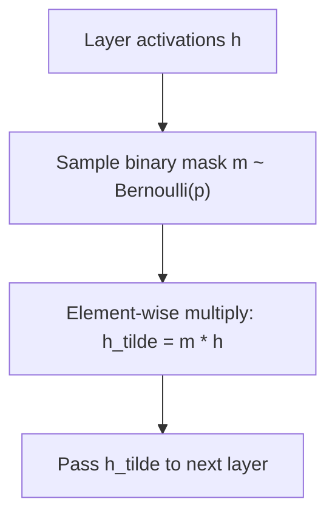

## Dropout Techniques

### Overview

Dropout is a regularization technique used in neural network training to reduce overfitting. During training, dropout randomly deactivates (sets to zero) a fraction of neurons in a layer at each forward pass, forcing the network to avoid relying too heavily on any single neuron or specific combination of neurons.

### Core Motivation

Neural networks with large numbers of parameters relative to the amount of training data are prone to overfitting, meaning they memorize training data patterns, including noise, rather than learning generalizable patterns. Dropout was introduced as a computationally cheap way to reduce overfitting by injecting stochastic noise into the network's structure during training, without requiring a fundamentally different training procedure.

### How Dropout Works

During training, for each forward pass, each neuron in a dropout-enabled layer is independently retained with probability $p$ (the keep probability) or dropped with probability $1-p$. This is typically implemented using a binary mask $m$ sampled from a Bernoulli distribution:

$$m_i \sim \text{Bernoulli}(p)$$

$$\tilde{h}_i = m_i \cdot h_i$$

where $h_i$ is the neuron's original activation and $\tilde{h}_i$ is the activation after dropout is applied. A different random mask is typically sampled for each training example and each forward pass.

flowchart TD
    A["Layer activations h"] --> B["Sample binary mask m ~ Bernoulli(p)"]
    B --> C["Element-wise multiply: h_tilde = m * h (svg_diagram)"]
    C --> D["Pass h_tilde to next layer"]



### Inverted Dropout

Most modern implementations use a variant called inverted dropout, in which the retained activations are scaled up by $1/p$ during training itself:

$$\tilde{h}_i = \frac{m_i}{p} \cdot h_i$$

This scaling is applied so that no rescaling is needed at test/inference time, since the expected value of the activation is preserved during training. At test time, dropout is turned off entirely and the full network (with all neurons active) is used without any masking or scaling.

I cannot verify which exact scaling convention (inverted dropout at train time vs. scaling at test time, as used in the original dropout paper) is implemented by default in every current deep learning framework version, since default behavior can differ across framework versions. [Unverified] Disclaimer: checking the specific documentation of the framework and version being used is advisable if this detail matters for a specific implementation.

### Dropout as an Approximation to Model Ensembling

[Inference] Dropout is commonly described in the original paper and subsequent literature as an approximation to training and averaging over an exponential number of different "thinned" sub-networks, since each forward pass with a different dropout mask effectively samples a different sub-network architecture sharing the same underlying weights. This is a theoretical interpretation given in the original paper rather than something I can independently confirm through direct testing. [Unverified] Disclaimer: this behavior is not guaranteed to manifest identically across all architectures or tasks, and actual results may vary.

### Placement Within a Network

Dropout is typically applied to the outputs of fully connected layers, and sometimes to recurrent layers or convolutional layers, though its application in convolutional layers is less common than in fully connected layers. [Inference] This is reasoned in the literature to relate to the fact that convolutional layers already have relatively few parameters per feature map due to weight sharing across spatial locations, which is described as making them comparatively less prone to overfitting than fully connected layers with equivalent numbers of activations. I cannot verify this reasoning holds as a general rule across all convolutional architectures and datasets, since this depends on the specific network and task. [Unverified] Disclaimer: this is not something I can guarantee generalizes to any specific case, and actual results may vary.

### Practical Example (PyTorch-style pseudocode)

```python
import torch
import torch.nn as nn

class SimpleNetWithDropout(nn.Module):
    def __init__(self, input_dim, hidden_dim, output_dim, dropout_prob=0.5):
        super().__init__()
        self.fc1 = nn.Linear(input_dim, hidden_dim)
        self.dropout = nn.Dropout(p=dropout_prob)
        self.fc2 = nn.Linear(hidden_dim, output_dim)
        self.relu = nn.ReLU()

    def forward(self, x):
        x = self.relu(self.fc1(x))
        x = self.dropout(x)
        x = self.fc2(x)
        return x

model = SimpleNetWithDropout(784, 256, 10)
model.train()

model.eval()
```

I cannot verify the exact internal implementation details of `nn.Dropout` across every version of every deep learning framework without consulting the specific version's documentation directly. [Unverified] Disclaimer: the general behavior described here (random deactivation during training, disabled at evaluation) reflects the standard, widely documented convention, but consulting current framework documentation is advisable for version-specific implementation details.

### Choosing the Dropout Probability

Common dropout probabilities reported in the literature and general practice range from approximately 0.2 to 0.5 for fully connected layers, with the original dropout paper reporting experiments using values around 0.5 for hidden layers and lower values (e.g., around 0.2) for input layers in some configurations.

I cannot verify a single universally optimal dropout probability, since [Inference] the appropriate value is reasoned in the literature to depend on factors such as model size, dataset size, and the presence of other regularization techniques being used simultaneously. [Unverified] Disclaimer: this is not something I can confirm generalizes to any specific model or task, and actual results may vary; hyperparameter tuning specific to the task at hand is generally advisable.

### Variants of Dropout

Several variants of the standard dropout technique have been proposed in the literature:

- **DropConnect**: Instead of dropping entire neuron activations, individual weights (connections) in the network are randomly set to zero.
- **Spatial Dropout**: Designed for convolutional layers, this variant drops entire feature maps (channels) rather than individual pixel activations, which [Inference] is reasoned in the paper proposing it to better account for the strong spatial correlation between adjacent pixels within a feature map, since dropping individual pixels independently may not effectively reduce co-adaptation when neighboring pixels remain highly correlated. I cannot independently verify this reasoning through direct testing, and this is a stated rationale from the proposing research rather than a confirmed general finding. [Unverified] Disclaimer: this is not something I can guarantee generalizes to every convolutional architecture, and actual results may vary.
- **Variational Dropout**: Applies the same dropout mask across all timesteps within a single sequence when used in recurrent neural networks, rather than sampling a new mask at every timestep, which is proposed in the literature as being more appropriate for maintaining consistent regularization across a sequence.
- **Alpha Dropout**: Designed for use with self-normalizing neural networks (using SELU activations), which modifies the dropout operation to preserve the mean and variance properties that self-normalizing networks rely on, rather than simply zeroing out activations as in standard dropout.

I do not have access to a comprehensive, up-to-date benchmark comparing the relative effectiveness of these variants across a broad and current range of architectures and tasks. [Unverified] Disclaimer: this is not something I can confirm generalizes to any specific case, and actual results may vary.

### Comparison with Other Regularization Techniques

| Technique | Mechanism | Typical Application |
|---|---|---|
| Dropout | Randomly zeroes activations during training | Fully connected layers, some recurrent/convolutional uses |
| L1/L2 Weight Regularization | Adds a penalty term to the loss based on weight magnitudes | Applied broadly across most layer types |
| Batch Normalization | Normalizes layer inputs using batch statistics | Convolutional and fully connected layers |
| Early Stopping | Halts training when validation performance stops improving | Applied at the training-loop level, independent of architecture |
| Data Augmentation | Artificially increases training data diversity | Primarily used in image, audio, and text domains |

I cannot verify a general ranking of these techniques by effectiveness, since [Inference] the literature commonly describes these techniques as often being used in combination rather than as mutually exclusive alternatives, and the relative benefit of each is reasoned to depend on the specific architecture, dataset, and task. [Unverified] Disclaimer: this is not something I can confirm generalizes to any specific case, and actual results may vary.

### Interaction with Batch Normalization

[Speculation] Some practitioners and some published discussions have suggested that combining dropout and batch normalization within the same network requires careful placement and tuning, since the two techniques interact with the statistics of layer activations in different ways, and using both without care is reasoned to have the potential to produce inconsistent training/inference behavior in certain configurations. This is a reasoned possibility rather than a confirmed general finding I can point to as settled and universal, and I cannot verify this holds for every specific architecture or framework version. [Unverified] Disclaimer: this is not something I can guarantee, and consulting current, architecture-specific literature or documentation is advisable when combining these two techniques in a specific project.

### Dropout at Inference Time (Monte Carlo Dropout)

Standard practice disables dropout at inference time. However, Monte Carlo Dropout is a technique in which dropout is deliberately kept active during inference, and multiple forward passes are performed for the same input, producing a distribution of outputs rather than a single deterministic prediction. This is proposed in the literature as a method for estimating model uncertainty, since the variability across these multiple stochastic forward passes can be used as an approximate measure of the model's confidence in its prediction.

[Inference] This technique is described in the paper proposing it as providing an approximation to Bayesian model uncertainty estimation, using dropout as a practical mechanism for approximating a Bayesian posterior over network weights. I cannot independently verify the theoretical soundness of this approximation beyond what is presented in that specific paper, and I do not have access to a comprehensive, up-to-date benchmark confirming the quality of uncertainty estimates this method produces across a broad and current range of tasks. [Unverified] Disclaimer: this is not something I can guarantee generalizes to any specific model or task, and actual results may vary.

### Common Applications

- **Fully connected (dense) network layers**: The original and most common setting for standard dropout.
- **Convolutional neural networks**: Applied selectively, often via Spatial Dropout variants, and less commonly than in fully connected layers.
- **Recurrent neural networks**: Applied via variants such as Variational Dropout, adapted to account for the sequential structure of the data.
- **Uncertainty estimation**: Via Monte Carlo Dropout, in settings where an approximate measure of model confidence is useful in addition to a point prediction.

### Limitations

- I cannot verify that dropout reduces overfitting in every specific model and dataset combination, since [Inference] the degree of benefit is reasoned in the literature to depend on the amount of training data available, model capacity, and the presence of other regularization techniques already in use. [Unverified] Disclaimer: this is not something I can guarantee for any specific case, and actual results may vary.
- Dropout does not eliminate the need for other regularization techniques or sufficient training data; [Speculation] it is possible that relying on dropout alone, without adequate data or other complementary techniques, may be insufficient to address overfitting in some cases, though I cannot confirm this claim against a specific benchmark and this is a reasoned expectation rather than a confirmed finding.
- Introducing dropout typically increases the number of training iterations or epochs needed to converge, compared to training the same architecture without dropout, according to commonly reported observations in the literature; I cannot verify the exact magnitude of this increase for any specific architecture or dataset without direct experimentation. [Unverified] Disclaimer: this is not something I can guarantee, and actual results may vary.

**Disclaimer**: Statements in this document regarding the effectiveness of dropout and its variants, their interaction with other regularization techniques, and their impact on training dynamics reflect patterns and theoretical characterizations reported in the neural network regularization literature. I do not have access to a comprehensive, up-to-date, independently verified benchmark confirming these effects for every specific implementation, architecture, or dataset. This behavior is not guaranteed, and actual results may vary based on the specific problem, hyperparameters, and implementation used.

### **Related Topics**

- Batch Normalization and Layer Normalization in depth
- L1/L2 Weight Regularization
- Data Augmentation techniques
- Monte Carlo Dropout and Bayesian Deep Learning
- Overfitting and the Bias-Variance Tradeoff
- Early Stopping and validation-based training control
- Self-Normalizing Neural Networks and SELU activations