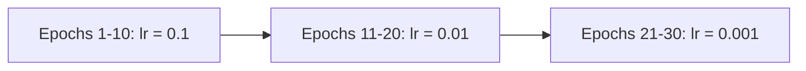
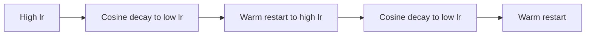

## Learning Rate Scheduling

### Overview

Learning rate scheduling refers to strategies for adjusting the learning rate used in gradient-based optimization over the course of neural network training, rather than keeping it fixed at a single value throughout. The learning rate controls the size of the parameter update taken at each optimization step, and adjusting it over time is a widely used technique intended to improve training stability and final model performance.

### Core Motivation

A learning rate that is too high can cause training to diverge or oscillate without settling near a good solution, while a learning rate that is too low can make training excessively slow or cause it to become stuck in poor local regions of the loss landscape. Learning rate schedules were developed to address the fact that a single fixed learning rate is often not optimal across the entire training process, since the appropriate step size can depend on how far training has progressed.

### Step Decay

Step decay reduces the learning rate by a fixed multiplicative factor at predetermined intervals (e.g., every fixed number of epochs):

$$\eta_t = \eta_0 \cdot \gamma^{\lfloor t / s \rfloor}$$

where $\eta_0$ is the initial learning rate, $\gamma$ is the decay factor (typically less than 1), $s$ is the step size (number of epochs between decays), and $t$ is the current epoch.

flowchart LR
    A["Epochs 1-10: lr = 0.1"] --> B["Epochs 11-20: lr = 0.01"]
    B --> C["Epochs 21-30: lr = 0.001 (svg_diagram)"]



### Exponential Decay

Exponential decay reduces the learning rate continuously (rather than in discrete steps) according to:

$$\eta_t = \eta_0 \cdot e^{-\lambda t}$$

where $\lambda$ is a decay rate hyperparameter. This produces a smoother, continuous reduction compared to the discrete jumps of step decay.

### Cosine Annealing

Cosine annealing decreases the learning rate following a cosine curve, starting at the initial learning rate and decreasing smoothly to a minimum value (often zero) over a specified number of steps or epochs:

$$\eta_t = \eta_{\min} + \frac{1}{2}(\eta_0 - \eta_{\min})\left(1 + \cos\left(\frac{t}{T}\pi\right)\right)$$

where $T$ is the total number of steps or epochs over which annealing occurs. This schedule decreases the learning rate slowly at first, more rapidly through the middle of training, and slowly again as it approaches the minimum value.

### Cosine Annealing with Warm Restarts

This variant periodically resets the learning rate back to a higher value (a "warm restart") after each cosine annealing cycle completes, rather than annealing only once across the entire training run. [Inference] This is reasoned in the paper proposing this technique to allow the optimizer to escape sharp local minima it may have settled into, by periodically reintroducing a larger step size, though I cannot independently verify this mechanism's effect on any specific model or dataset without direct testing. [Unverified] Disclaimer: this behavior is not guaranteed to improve results in every specific case, and actual results may vary.

flowchart LR
    A["High lr"] --> B["Cosine decay to low lr"]
    B --> C["Warm restart to high lr (svg_diagram)"]
    C --> D["Cosine decay to low lr"]
    D --> E["Warm restart"]



### Learning Rate Warmup

Learning rate warmup gradually increases the learning rate from a small initial value up to the target learning rate over a specified number of initial steps or epochs, before any decay schedule begins. A common linear warmup formulation is:

$$\eta_t = \eta_{\text{target}} \cdot \frac{t}{t_{\text{warmup}}}, \quad t \leq t_{\text{warmup}}$$

[Inference] Warmup is reasoned in the literature, particularly in the context of training Transformer-based models, to help stabilize training in the early stages, when model parameters are still close to their random initialization and large gradient updates are more likely to cause instability. I do not have access to a comprehensive, up-to-date benchmark confirming the exact magnitude of this stabilization effect across all architectures and tasks, so this should be treated as a commonly cited rationale rather than a confirmed universal finding. [Unverified] Disclaimer: this is not something I can guarantee generalizes to every specific model or training setup, and actual results may vary.

### Reduce on Plateau

This adaptive scheduling approach monitors a chosen metric (commonly validation loss) and reduces the learning rate by a specified factor when that metric stops improving for a specified number of epochs (the "patience" parameter). Unlike step decay or cosine annealing, this schedule is reactive to observed training progress rather than following a predetermined schedule based purely on epoch or step count.

### Cyclical Learning Rates

Cyclical learning rate schedules vary the learning rate cyclically between a lower and upper bound over the course of training, rather than monotonically decreasing it. [Inference] This is reasoned in the paper proposing this technique to potentially provide some of the benefits associated with periodically escaping poor regions of the loss landscape, similar in spirit to the reasoning behind cosine annealing with warm restarts, though the two techniques differ in the specific shape of the cycle used. I cannot independently verify the comparative effectiveness of cyclical learning rates versus other scheduling approaches for any specific model or dataset without a specific benchmark. [Unverified] Disclaimer: this is not something I can confirm generalizes to any specific case, and actual results may vary.

### Practical Example (PyTorch-style pseudocode)

```python
import torch
import torch.optim as optim

model = torch.nn.Linear(10, 1)
optimizer = optim.SGD(model.parameters(), lr=0.1)

step_scheduler = optim.lr_scheduler.StepLR(optimizer, step_size=10, gamma=0.1)

cosine_scheduler = optim.lr_scheduler.CosineAnnealingLR(optimizer, T_max=50)

plateau_scheduler = optim.lr_scheduler.ReduceLROnPlateau(optimizer, mode='min', factor=0.1, patience=5)

for epoch in range(num_epochs):
    train_one_epoch(model, optimizer)
    val_loss = validate(model)

    step_scheduler.step()
    plateau_scheduler.step(val_loss)
```

I cannot verify the exact default hyperparameter values or internal implementation details of these scheduler classes across every version of every deep learning framework without consulting that version's specific documentation directly. [Unverified] Disclaimer: the general behavior described here reflects standard, widely documented scheduling conventions, but checking current framework documentation is advisable for version-specific details.

### Relationship to Adaptive Optimizers

Adaptive optimizers such as Adam maintain per-parameter learning rate adjustments internally, based on estimates of gradient magnitude and variance. [Inference] Using an explicit learning rate schedule on top of an adaptive optimizer is reasoned in common practice to still provide benefit, since the schedule operates on the base or global learning rate that scales all the per-parameter adaptive adjustments, rather than replacing the need for a schedule entirely. I do not have access to a comprehensive, up-to-date benchmark confirming the exact degree of additional benefit this combination provides across a broad and current range of architectures and tasks. [Unverified] Disclaimer: this is not something I can guarantee generalizes to any specific model or optimizer combination, and actual results may vary.

### Comparison of Common Scheduling Strategies

| Strategy | Adjustment Pattern | Reactive or Predetermined |
|---|---|---|
| Step Decay | Discrete drops at fixed intervals | Predetermined |
| Exponential Decay | Smooth continuous decrease | Predetermined |
| Cosine Annealing | Smooth curve to a minimum | Predetermined |
| Cosine Annealing with Warm Restarts | Repeated cosine cycles with resets | Predetermined |
| Warmup | Gradual increase at the start of training | Predetermined |
| Reduce on Plateau | Decrease triggered by stalled metric improvement | Reactive |
| Cyclical Learning Rates | Repeated oscillation between bounds | Predetermined |

I cannot verify a general ranking of these strategies by effectiveness, since [Inference] the literature commonly describes the appropriate choice of schedule as being dependent on the specific architecture, dataset, optimizer, and task being addressed. [Unverified] Disclaimer: this is not something I can confirm generalizes to any specific case, and actual results may vary.

### Choosing a Schedule in Practice

[Speculation] It is possible that certain schedule types are more commonly paired with certain architectures in current practice (for example, cosine annealing or warmup schedules being frequently mentioned alongside Transformer-based model training in published work), but I do not have access to a comprehensive, up-to-date survey confirming the current prevalence of specific scheduler choices across the field as a whole. This is a reasoned impression on my part rather than a confirmed statistical finding, and I cannot verify this holds as a general rule. [Unverified] Disclaimer: this is not something I can guarantee, and consulting current, task-specific literature or established baselines for a specific architecture is advisable when selecting a schedule.

### Common Applications

- **Image classification training**: Step decay and cosine annealing are commonly referenced in published training recipes for convolutional neural network architectures.
- **Transformer and large language model training**: Warmup followed by decay (such as linear decay or cosine decay) is commonly referenced in published training recipes for these architectures.
- **Fine-tuning pretrained models**: Smaller learning rates combined with schedules such as linear decay are commonly used to avoid large, destabilizing updates to pretrained weights.

### Limitations

- I cannot verify that any specific learning rate schedule will produce better final model performance than a fixed learning rate for any particular model and dataset combination, since [Inference] the relative benefit is reasoned in the literature to depend on the specific training setup, and this is not something I can confirm without direct experimentation for that specific case. [Unverified] Disclaimer: this behavior is not guaranteed, and actual results may vary.
- Selecting appropriate schedule hyperparameters (decay rate, step size, warmup duration, patience) generally requires experimentation specific to the task at hand; [Speculation] it is possible that poorly chosen schedule hyperparameters could perform worse than a well-tuned fixed learning rate in some cases, though I cannot confirm this claim against a specific benchmark and this is a reasoned expectation rather than a confirmed finding.
- I do not have access to a comprehensive, up-to-date benchmark confirming which specific scheduling strategy is currently considered best practice across all model types and training regimes, since reported comparisons vary by study, architecture, and task, and this remains an active area of practical experimentation in the field.

**Disclaimer**: Statements in this document regarding the effectiveness of specific learning rate schedules, their comparative performance, and their interaction with model architectures or optimizers reflect patterns and theoretical rationales reported in the deep learning training literature. I do not have access to a comprehensive, up-to-date, independently verified benchmark confirming these effects for every specific implementation, architecture, or dataset. This behavior is not guaranteed, and actual results may vary based on the specific problem, hyperparameters, and implementation used.

### **Related Topics**

- Gradient Descent Optimization Algorithms (SGD, Adam, RMSprop) in depth
- Learning Rate Warmup in Transformer training
- Hyperparameter Tuning and Search Strategies
- Batch Size and its interaction with learning rate
- Loss Landscape Geometry and Local Minima
- Early Stopping and validation-based training control
- One-Cycle Learning Rate Policy