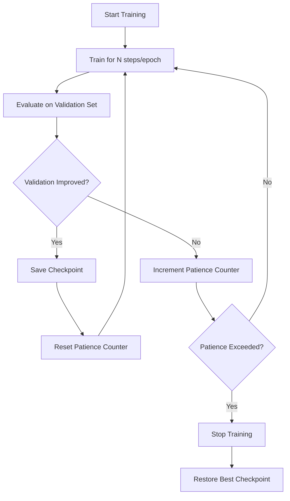

## Early Stopping Strategies

Early stopping is a regularization technique that halts training before a model fully converges on the training set, using performance on a held-out validation set as the signal to stop. It is one of the most widely used forms of implicit regularization in machine learning, particularly in iterative optimization methods such as gradient descent and its variants.

### Core Idea

During training, a model's error on the training set typically decreases monotonically as optimization progresses. Validation error, however, tends to decrease initially and then increase once the model begins overfitting — fitting noise or idiosyncrasies specific to the training data rather than generalizable patterns. Early stopping monitors validation performance and stops training at (or near) the point where validation error is minimized, rather than continuing until training error is minimized.

This behavior — training loss continuing to fall while validation loss rises — is a standard, well-documented pattern in supervised learning and is the basis for early stopping as a technique.

Here is a diagram showing the typical relationship between training and validation loss over training epochs:

<svg xmlns="http://www.w3.org/2000/svg" viewBox="0 0 700 420">
  <text x="350" y="30" font-size="18" font-weight="bold" text-anchor="middle" fill="#1a1a1a">Training vs Validation Loss (svg_diagram)</text>
  
  <line x1="70" y1="360" x2="650" y2="360" stroke="#333" stroke-width="2" />
  <line x1="70" y1="360" x2="70" y2="60" stroke="#333" stroke-width="2" />
  
  <text x="360" y="400" font-size="14" text-anchor="middle" fill="#333">Training Epochs</text>
  <text x="30" y="210" font-size="14" text-anchor="middle" fill="#333" transform="rotate(-90 30 210)">Loss</text>
  
  <path d="M 90 100 Q 200 300, 630 345" stroke="#2166ac" stroke-width="3" fill="none" />
  <text x="600" y="335" font-size="13" fill="#2166ac" font-weight="bold">Training Loss</text>
  
  <path d="M 90 120 Q 250 260, 350 240 Q 450 230, 630 150" stroke="#d6604d" stroke-width="3" fill="none" />
  <text x="600" y="145" font-size="13" fill="#d6604d" font-weight="bold">Validation Loss</text>
  
  <line x1="350" y1="70" x2="350" y2="360" stroke="#666" stroke-width="2" stroke-dasharray="6,4" />
  <text x="355" y="85" font-size="13" fill="#666" font-weight="bold">Optimal Stop Point</text>
  
  <circle cx="350" cy="240" r="6" fill="#d6604d" />
</svg>

### Why Overfitting Occurs During Training

As an iterative optimizer updates model parameters, the effective capacity of the model — in terms of how closely it can fit the training data — tends to increase with the number of updates. This is a documented phenomenon in the context of gradient-based learning: models with high nominal capacity (e.g., deep neural networks) do not use their full capacity from the first iteration; instead, they progressively fit more complex functions as training proceeds.

Early stopping exploits this progression by treating the number of training iterations itself as a hyperparameter to be tuned, effectively constraining the model's functional complexity.

### Basic Algorithm

A standard early stopping procedure follows this pattern:

1. Split data into training, validation, and (optionally) test sets.
2. Train the model for one epoch or iteration.
3. Evaluate the model on the validation set.
4. If validation performance improves, save the current model state (checkpoint).
5. If validation performance fails to improve for a specified number of consecutive evaluations (the **patience** parameter), stop training.
6. Restore the model to the checkpoint with the best validation performance.



### Key Hyperparameters

**Patience**
The number of epochs or evaluation steps to wait without improvement before stopping. A small patience value stops training aggressively and risks stopping at a local fluctuation rather than genuine convergence. A large patience value allows more thorough search but increases computation and risks overfitting before the stopping condition triggers.

**Minimum Delta (min_delta)**
A threshold specifying the smallest change in the monitored metric that qualifies as an "improvement." This prevents the patience counter from resetting due to negligible fluctuations. [Inference] Appropriate values for min_delta are dataset- and metric-dependent, and no universal default value is established in the literature; practitioners typically tune this empirically.

**Monitored Metric**
Commonly validation loss, but can also be validation accuracy, F1 score, or any task-relevant metric. The choice of metric should align with the actual deployment objective — optimizing for the wrong metric can produce a model that stops at a suboptimal point relative to the true goal.

**Restore Best Weights**
A setting that determines whether, upon stopping, the model reverts to the parameters from the best-performing checkpoint (rather than the parameters from the final iteration where stopping was triggered). This is standard practice, since the final few iterations before stopping typically involve degraded validation performance by definition.

### Mathematical Framing

Early stopping can be understood as implicitly constraining the parameter search to a region near the initialization point. For a model trained via gradient descent with learning rate $\eta$, and stopped after $T$ iterations, the effective hypothesis space explored is bounded relative to full convergence.

A commonly cited theoretical connection is between early stopping and L2 regularization (weight decay) in the case of linear models optimized via gradient descent. For a quadratic loss surface, stopping at iteration $T$ has been shown, under specific simplifying assumptions, to behave similarly to L2 regularization with a regularization strength inversely related to $T$ and the learning rate:

$$
\lambda \approx \frac{1}{\eta T}
$$

[Unverified] This precise equivalence holds under idealized assumptions (e.g., quadratic loss, specific initialization) that may not generalize to arbitrary deep, non-convex architectures. Treat this as a theoretical intuition rather than a guarantee applicable to all model types.

### Practical Implementation Example (PyTorch-style pseudocode)

```python
best_val_loss = float('inf')
patience = 5
min_delta = 0.001
patience_counter = 0
best_model_state = None

for epoch in range(max_epochs):
    train_one_epoch(model, train_loader, optimizer)
    val_loss = evaluate(model, val_loader)

    if val_loss < best_val_loss - min_delta:
        best_val_loss = val_loss
        best_model_state = copy.deepcopy(model.state_dict())
        patience_counter = 0
    else:
        patience_counter += 1

    if patience_counter >= patience:
        print(f"Early stopping triggered at epoch {epoch}")
        break

model.load_state_dict(best_model_state)
```

This pattern reflects standard, documented usage of early stopping as implemented in common frameworks (e.g., Keras' `EarlyStopping` callback, PyTorch Lightning's `EarlyStopping` callback). [Inference] Exact default parameter values and internal behavior differ across framework versions, so specific defaults should be checked against the relevant framework's current documentation rather than assumed from general description here.

### Interaction with Learning Rate Schedules

Early stopping is often combined with learning rate scheduling (e.g., reducing learning rate on plateau). Care must be taken to distinguish a temporary plateau — which a learning rate reduction might resolve — from genuine overfitting, since stopping too early in the presence of a learning rate schedule can prevent the model from reaching a subsequently improved validation performance after a rate reduction. Some practitioners couple patience for early stopping with a longer patience for learning rate reduction, so the schedule has a chance to unstick the model before stopping is triggered.

### Common Pitfalls

**Noisy Validation Metrics**
If the validation set is small, validation loss can fluctuate significantly between epochs, causing early stopping to trigger prematurely on noise rather than genuine overfitting. Using a moving average of the validation metric, or increasing patience, are common mitigations.

**Validation Set Leakage into Model Selection**
Repeatedly using the same validation set to determine stopping points across many experiments introduces a form of indirect overfitting to the validation set itself, since the stopping decision becomes tuned to that specific data. A separate test set, untouched during any stopping or tuning decisions, is standard practice for obtaining an unbiased final performance estimate.

**Interaction with Batch Size and Data Order**
[Inference] Because stochastic gradient-based training introduces run-to-run variance from batch sampling and initialization, the specific epoch at which early stopping triggers can vary between runs even with identical hyperparameters. This is a reasoned expectation based on the stochastic nature of the optimization process, not a claim verified against a specific empirical study cited here.

**Too Aggressive Patience**
Setting patience too low relative to the natural noise level of the validation metric can stop training well before the model has reached its best achievable generalization performance.

### Early Stopping vs. Other Regularization Techniques

| Technique | Mechanism | When Applied |
|---|---|---|
| Early Stopping | Halts optimization before convergence | During training |
| L2 Regularization (Weight Decay) | Penalizes large weight magnitudes in the loss function | Throughout training, via loss function |
| Dropout | Randomly deactivates units during forward passes | During training, per batch |
| Data Augmentation | Increases effective training data diversity | Before/during training |

Early stopping differs from the other techniques listed in that it does not modify the loss function or model architecture; it only affects the duration of optimization. It is commonly used in conjunction with, rather than as a replacement for, other regularization methods.

### Related Topics

- L2 regularization and weight decay mechanics
- Dropout and its variants (e.g., DropConnect, spatial dropout)
- Learning rate scheduling strategies (step decay, cosine annealing, reduce-on-plateau)
- Cross-validation and its relationship to hold-out validation sets
- Bias-variance tradeoff in model capacity selection
- Checkpointing strategies for large-scale model training