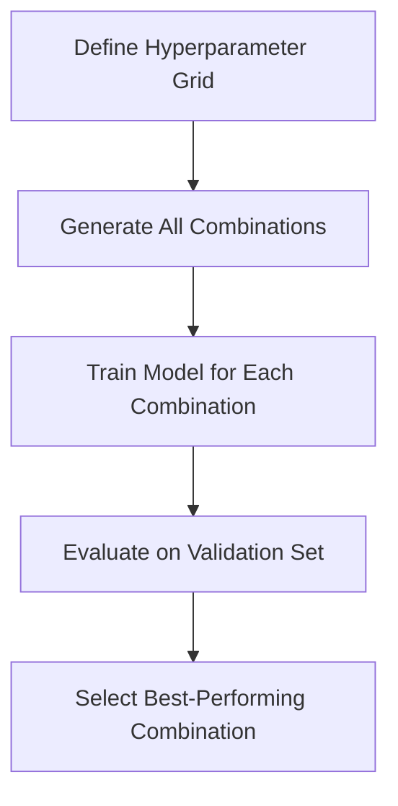
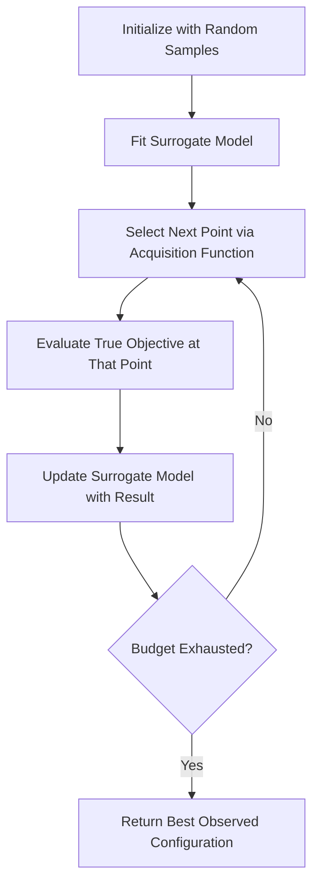

## Hyperparameter Tuning Methods

Hyperparameter tuning is the process of selecting the configuration values that govern a model's learning process — values not learned from data directly but set prior to or during training, such as learning rate, regularization strength, tree depth, or number of layers. The choice of tuning method affects both the quality of the final model and the computational cost of finding it.

### What Distinguishes Hyperparameters from Parameters

Parameters (e.g., neural network weights, linear regression coefficients) are learned by the optimization algorithm from training data. Hyperparameters (e.g., learning rate, batch size, number of estimators, regularization coefficient $\lambda$) are set before training begins and control how that learning process behaves. Choosing hyperparameters well often has a substantial effect on final model performance, which is why systematic tuning methods are used rather than relying solely on default values or manual guesswork.

### Search Space Definition

Before any tuning method is applied, a search space must be defined: the set of hyperparameters to tune and the range or distribution of values each can take. This can include:

- **Continuous ranges** (e.g., learning rate between $10^{-5}$ and $10^{-1}$, often searched on a log scale)
- **Discrete/integer ranges** (e.g., number of layers from 1 to 10)
- **Categorical choices** (e.g., activation function: ReLU, tanh, sigmoid)
- **Conditional hyperparameters** (e.g., "dropout rate" is only relevant if "use_dropout" is True)

The structure of this search space directly affects which tuning method is practical or efficient.

### Grid Search

Grid search evaluates every combination of hyperparameter values from a predefined discrete set. For example, if learning rate $\in \{0.001, 0.01, 0.1\}$ and batch size $\in \{16, 32, 64\}$, grid search evaluates all $3 \times 3 = 9$ combinations.

**Key Points**
- Exhaustive and deterministic: guaranteed to evaluate every specified combination.
- Computational cost grows exponentially with the number of hyperparameters (the "curse of dimensionality"), making it impractical for more than a small number of hyperparameters.
- Wastes computation on unimportant hyperparameters, since it allocates equal resolution to every dimension regardless of that dimension's actual effect on performance.



### Random Search

Random search samples hyperparameter combinations randomly from the defined search space (typically from specified distributions), rather than evaluating a fixed grid.

**Key Points**
- For a fixed computational budget, random search often finds better-performing configurations than grid search, particularly when only a few hyperparameters substantially affect performance — a finding associated with Bergstra and Bengio's 2012 analysis of random vs. grid search.
- Does not guarantee coverage of any specific combination but tends to explore the space more efficiently in high dimensions.
- Easy to parallelize, since each sampled configuration can be evaluated independently.

[Inference] The degree of advantage random search holds over grid search depends on the actual structure of the hyperparameter response surface for a given problem — how many hyperparameters materially affect performance and how they interact. This is a reasoned expectation based on the underlying logic of the method, not a guarantee that applies uniformly across all model types and datasets.

### Bayesian Optimization

Bayesian optimization builds a probabilistic surrogate model (commonly a Gaussian Process, though tree-based surrogates such as those in Tree-structured Parzen Estimator methods are also used) of the relationship between hyperparameters and validation performance. It uses this surrogate model to select the next hyperparameter combination to evaluate, balancing:

- **Exploration**: sampling in regions of the search space with high uncertainty.
- **Exploitation**: sampling near previously observed good results.

An **acquisition function** (e.g., Expected Improvement, Upper Confidence Bound) formalizes this tradeoff to select the next candidate point.

**Key Points**
- Generally more sample-efficient than grid or random search — it typically requires fewer total evaluations to reach a comparable or better result, because each new evaluation is chosen based on prior evaluation outcomes rather than independently.
- Sequential by nature, which limits straightforward parallelization compared to random search, though batch/parallel variants of Bayesian optimization exist.
- More complex to implement and reason about than grid or random search; typically used via libraries such as `scikit-optimize`, `Optuna`, `Hyperopt`, or `Ax`.



### Hyperband and Successive Halving

Hyperband and Successive Halving are resource-allocation strategies designed to speed up hyperparameter search by allocating limited resources (e.g., training epochs, data subset size) to a large number of configurations initially, then progressively allocating more resources only to the most promising configurations.

**Successive Halving procedure:**
1. Start with $n$ configurations, each given a small resource budget.
2. Evaluate all $n$ configurations.
3. Keep the top fraction (e.g., top half), discard the rest.
4. Double (or otherwise increase) the resource budget for the survivors.
5. Repeat until one or a small number of configurations remain.

Hyperband extends this by running Successive Halving with multiple different initial resource allocations, addressing the tradeoff between exploring many configurations briefly versus fewer configurations for longer.

[Unverified] Whether Hyperband outperforms Bayesian optimization on a specific task depends on the cost structure of that task (e.g., whether partial training is a reliable proxy for full-training performance) and is not something that can be asserted as universally true.

### Population-Based Training (PBT)

Population-Based Training trains a population of models in parallel, periodically comparing their performance. Poorly performing members have their hyperparameters and weights replaced (a process often called "exploit") by copying from better-performing members, followed by random perturbation of those hyperparameters (a process often called "explore"). This allows hyperparameters to change dynamically over the course of training rather than remaining fixed.

**Key Points**
- Suited to settings where hyperparameters may need to vary over the course of training (e.g., learning rate schedules discovered adaptively rather than pre-specified).
- Requires infrastructure to run and manage a population of models concurrently, which increases implementation and computational complexity.
- Originally introduced by DeepMind researchers (Jaderberg et al., 2017); this is a citable, documented origin rather than an inference.

### Gradient-Based Hyperparameter Optimization

For certain differentiable hyperparameters, it is possible to compute or approximate gradients of the validation loss with respect to the hyperparameters themselves, and update them via gradient descent alongside model parameters. This approach is less commonly used in practice than the methods above, and is generally restricted to hyperparameters that can be made differentiable within the training computation graph (e.g., some regularization coefficients).

[Unverified] The practical adoption rate of gradient-based hyperparameter optimization relative to Bayesian optimization or random search across the industry is not something this response can confirm; adoption levels are not consistently tracked in a way that would support a specific comparative claim.

### Comparison Table

| Method | Sample Efficiency | Parallelizable | Handles High Dimensions | Complexity to Implement |
|---|---|---|---|---|
| Grid Search | Low | Yes | Poor | Low |
| Random Search | Moderate | Yes | Moderate | Low |
| Bayesian Optimization | High | Limited (sequential) | Moderate | Moderate–High |
| Hyperband / Successive Halving | Moderate–High | Yes | Moderate | Moderate |
| Population-Based Training | High (for dynamic schedules) | Yes (requires infrastructure) | Moderate | High |

[Inference] The relative rankings in this table reflect the general reasoning underlying each method's design rather than a specific benchmark comparison across all possible tasks; actual relative performance depends on the specific problem, search space, and computational budget involved.

### Practical Example: Random Search with scikit-learn

```python
from sklearn.model_selection import RandomizedSearchCV
from sklearn.ensemble import RandomForestClassifier
from scipy.stats import randint

param_distributions = {
    'n_estimators': randint(50, 500),
    'max_depth': randint(3, 20),
    'min_samples_split': randint(2, 20),
}

search = RandomizedSearchCV(
    estimator=RandomForestClassifier(),
    param_distributions=param_distributions,
    n_iter=50,
    cv=5,
    scoring='accuracy',
    random_state=42
)

search.fit(X_train, y_train)
print(search.best_params_)
```

This reflects standard, documented usage of `RandomizedSearchCV` as implemented in scikit-learn. [Inference] Exact default behaviors and parameter names may differ across scikit-learn versions, so current documentation should be consulted for a specific installed version rather than relying on this description alone.

### Practical Considerations for Choosing a Method

- **Small search spaces (1–3 hyperparameters), cheap evaluations**: Grid search is often tractable and simple to reason about.
- **Larger search spaces, moderate evaluation cost**: Random search is a reasonable default baseline before investing in more complex methods.
- **Expensive evaluations (e.g., large neural network training runs)**: Bayesian optimization or Hyperband-style methods are generally preferred to reduce the total number of full training runs needed.
- **Hyperparameters that should adapt during training**: Population-Based Training is suited to this case specifically.

[Inference] These are general heuristics reasoned from the properties of each method, not a fixed rule that applies identically to every dataset or architecture. Actual method choice in practice is often guided by empirical experimentation on the specific problem at hand.

### Cross-Validation's Role in Tuning

Regardless of the search method chosen, hyperparameter evaluation typically relies on cross-validation (or a held-out validation set) rather than test-set performance, to avoid tuning hyperparameters in a way that overfits to the final evaluation data. Using the test set only once, after all tuning decisions are finalized, is standard practice for obtaining an unbiased estimate of generalization performance.

### Related Topics

- Cross-validation strategies (k-fold, stratified, nested cross-validation)
- AutoML frameworks and neural architecture search
- Learning rate scheduling as a related but distinct tuning problem
- Regularization techniques (L1/L2, dropout, early stopping)
- Bias-variance tradeoff in model selection
- Computational budget allocation for large-scale experimentation