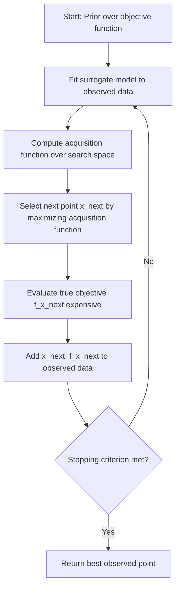

## Bayesian Optimization

### Overview

Bayesian optimization is a sequential, model-based strategy for optimizing expensive, black-box objective functions. In machine learning, it is most commonly applied to hyperparameter tuning, where each evaluation of the objective function (e.g., training a model and measuring validation accuracy) is computationally costly. Rather than exhaustively searching the hyperparameter space (as in grid search) or sampling it randomly, Bayesian optimization builds a probabilistic model of the objective function and uses that model to decide where to sample next.

The core idea is to treat the unknown function $f(x)$ — for example, validation loss as a function of hyperparameters $x$ — as a random function, and to update beliefs about it as observations accumulate.

### Why Use It Over Grid or Random Search

**Key Points**

- Grid search scales poorly: the number of evaluations grows exponentially with the number of hyperparameters.
- Random search is more efficient than grid search in high dimensions but still does not use information from past evaluations to guide future ones.
- Bayesian optimization uses the history of evaluated points to model the objective function's shape, focusing evaluations on regions likely to contain the optimum.
- It is particularly suited to settings where function evaluations are expensive (e.g., training deep neural networks), since it typically requires fewer evaluations to reach a good solution than uninformed search methods.

[Inference] The degree of efficiency gain over random search depends heavily on the smoothness of the objective function, the dimensionality of the search space, and the choice of surrogate model and acquisition function; no universal speedup factor can be stated without benchmarking on the specific problem.

### Core Components

Bayesian optimization consists of two main components working in a loop: a **surrogate model** and an **acquisition function**.



#### Surrogate Model

The surrogate model approximates the true objective function based on observations gathered so far. The most common choice is a **Gaussian Process (GP)**, which models the objective as a distribution over functions, characterized by a mean function $m(x)$ and a covariance (kernel) function $k(x, x')$:

$$f(x) \sim \mathcal{GP}(m(x), k(x, x'))$$

Given observed points $X = \{x_1, \dots, x_n\}$ with values $y = \{y_1, \dots, y_n\}$, the GP posterior at a new point $x^*$ is Gaussian, with a closed-form mean and variance derived from the kernel matrix. This posterior gives both a prediction and an uncertainty estimate at every point in the search space, which is essential for the next step.

Other surrogate models used in practice include:

- **Random Forests** (used in SMAC), which handle categorical and conditional hyperparameters more naturally than GPs.
- **Tree-structured Parzen Estimators (TPE)**, used in libraries like Hyperopt and Optuna, which model $p(x \mid y)$ and $p(y)$ separately rather than modeling $p(y \mid x)$ directly.

#### Acquisition Function

The acquisition function uses the surrogate model's predictions (mean and uncertainty) to score candidate points, balancing **exploration** (sampling uncertain regions) against **exploitation** (sampling near known good points). The point maximizing the acquisition function is chosen as the next evaluation.

Common acquisition functions:

**Expected Improvement (EI)**

$$EI(x) = \mathbb{E}\left[\max(f(x) - f(x^+), 0)\right]$$

where $f(x^+)$ is the best value observed so far. EI has a closed-form expression under Gaussian assumptions and is the most widely used acquisition function in practice.

**Probability of Improvement (PI)**

$$PI(x) = P\left(f(x) \geq f(x^+) + \xi\right)$$

where $\xi$ is a small parameter encouraging exploration.

**Upper Confidence Bound (UCB)**

$$UCB(x) = \mu(x) + \kappa \sigma(x)$$

where $\mu(x)$ and $\sigma(x)$ are the surrogate's predicted mean and standard deviation at $x$, and $\kappa$ controls the exploration-exploitation trade-off.

### Step-by-Step Process

1. Define a prior over the objective function (typically via a GP with a chosen kernel, such as Matérn or RBF).
2. Select an initial set of points, often via random sampling or a space-filling design like Latin Hypercube Sampling, and evaluate the true objective at these points.
3. Fit the surrogate model to the observed data.
4. Optimize the acquisition function to select the next candidate point.
5. Evaluate the true objective function at that point.
6. Update the surrogate model with the new observation.
7. Repeat steps 3–6 until a stopping criterion is met (e.g., budget of evaluations exhausted, or acquisition values fall below a threshold).

### Example: Hyperparameter Tuning

Consider tuning two hyperparameters of a gradient boosting model: learning rate ($\eta$) and maximum tree depth ($d$). The objective is validation log-loss, which is expensive because each evaluation requires a full training run.

**Example**

```python
from skopt import gp_minimize
from skopt.space import Real, Integer

search_space = [
    Real(1e-4, 1e-1, prior='log-uniform', name='learning_rate'),
    Integer(2, 10, name='max_depth')
]

def objective(params):
    learning_rate, max_depth = params
    model = train_gbm(learning_rate=learning_rate, max_depth=max_depth)
    return evaluate_validation_loss(model)  # lower is better

result = gp_minimize(
    func=objective,
    dimensions=search_space,
    n_calls=30,
    n_initial_points=10,
    acq_func='EI',
    random_state=42
)

print("Best parameters:", result.x)
print("Best validation loss:", result.fun)
```

This uses `scikit-optimize`'s `gp_minimize`, which fits a Gaussian Process surrogate and uses Expected Improvement as the acquisition function. The `n_initial_points` parameter controls how many random evaluations are used to seed the surrogate model before switching to model-guided sampling.

[Inference] Whether 30 total evaluations is sufficient depends on the smoothness of the loss surface and the dimensionality of the search space; for higher-dimensional hyperparameter spaces, more evaluations are generally needed, though the exact number cannot be stated without empirical testing on the specific problem.

### Illustration: Surrogate Model Fitting Process

<svg xmlns="http://www.w3.org/2000/svg" viewBox="0 0 700 420">
<text x="350" y="25" text-anchor="middle" font-size="16" font-weight="bold" fill="#1a1a1a">Gaussian Process Surrogate with Uncertainty (svg_diagram)</text>
<line x1="60" y1="350" x2="650" y2="350" stroke="#333" stroke-width="2" />
<line x1="60" y1="350" x2="60" y2="60" stroke="#333" stroke-width="2" />
<text x="355" y="390" text-anchor="middle" font-size="13" fill="#333">Hyperparameter value (x)</text>
<text x="25" y="205" text-anchor="middle" font-size="13" fill="#333" transform="rotate(-90 25 205)">Objective f(x)</text>

<path d="M 60 300 Q 150 280, 200 260 Q 280 220, 320 150 Q 360 100, 400 130 Q 450 180, 500 200 Q 570 230, 650 210" fill="none" stroke="#999" stroke-width="1.5" stroke-dasharray="4,4" />

<path d="M 60 260 Q 150 250, 200 235 Q 280 200, 320 140 Q 360 100, 400 120 Q 450 160, 500 175 Q 570 195, 650 180 L 650 240 Q 570 265, 500 225 Q 450 200, 400 140 Q 360 100, 320 160 Q 280 240, 200 285 Q 150 310, 60 340 Z" fill="`#4a90d9`" fill-opacity="0.18" stroke="none" />

<path d="M 60 280 Q 150 265, 200 248 Q 280 210, 320 145 Q 360 100, 400 125 Q 450 170, 500 188 Q 570 213, 650 195" fill="none" stroke="`#2c5f9e`" stroke-width="2.5" />

<circle cx="150" cy="270" r="5" fill="#d94a4a" />
<circle cx="230" cy="215" r="5" fill="#d94a4a" />
<circle cx="330" cy="145" r="5" fill="#d94a4a" />
<circle cx="420" cy="140" r="5" fill="#d94a4a" />
<circle cx="540" cy="195" r="5" fill="#d94a4a" />
<circle cx="380" cy="102" r="6" fill="#2c5f9e" stroke="#fff" stroke-width="1" />
<text x="380" y="90" text-anchor="middle" font-size="11" fill="#2c5f9e">next sample</text>
<rect x="480" y="60" width="15" height="15" fill="#d94a4a" />
<text x="500" y="72" font-size="12" fill="#333">Observed points</text>
<rect x="480" y="82" width="15" height="4" fill="#2c5f9e" />
<text x="500" y="90" font-size="12" fill="#333">Posterior mean</text>
<rect x="480" y="100" width="15" height="15" fill="#4a90d9" fill-opacity="0.3" />
<text x="500" y="112" font-size="12" fill="#333">Uncertainty band</text>
</svg>

The shaded band represents the GP's predicted uncertainty. The acquisition function tends to favor points where this band is wide (unexplored regions) combined with a favorable predicted mean, which is why the next sample point in this illustration falls near the peak of the estimated function rather than exactly at a previously observed point.

### Comparison with Other Hyperparameter Search Methods

| Method | Uses past evaluations | Handles conditional/categorical params | Parallelizable | Typical sample efficiency |
| --- | --- | --- | --- | --- |
| Grid Search | No | Yes | Fully | Low |
| Random Search | No | Yes | Fully | Moderate |
| Bayesian Optimization (GP-based) | Yes | Limited (continuous spaces preferred) | Partially, with modifications | High |
| TPE (Hyperopt/Optuna) | Yes | Yes | Partially | High |
| Population-based / Evolutionary | Yes (implicitly) | Yes | Fully | Moderate to High |

[Inference] "High" sample efficiency here refers to a general tendency observed across many published benchmarking studies in the hyperparameter optimization literature, not a fixed, universal ranking. Relative performance depends on the specific search space, objective function landscape, and implementation details, and can vary between problems.

### Limitations

- **Scalability with dimensionality**: Standard GP-based Bayesian optimization tends to degrade in performance as the number of hyperparameters grows, commonly beyond roughly 15–20 dimensions. [Unverified] The exact dimensionality threshold at which performance degrades is implementation- and problem-dependent, and no single universal cutoff is established across all use cases.
- **Computational cost of the surrogate itself**: Fitting a GP scales as $O(n^3)$ with the number of observations $n$, due to the need to invert the covariance matrix, which limits practicality when many evaluations are needed.
- **Sequential nature**: Classic Bayesian optimization proposes one point at a time, which does not naturally parallelize; batch variants (e.g., batch EI, Kriging Believer) exist to address this but add complexity.
- **Sensitivity to kernel and prior choices**: The choice of kernel function and its hyperparameters can influence the quality of the surrogate model, and a poor choice may lead to slow convergence. [Inference] This sensitivity is a widely discussed property of GP-based methods in the optimization literature, though the practical magnitude of impact varies by application and is not something that can be quantified in general terms.

### Common Libraries and Tools

- **scikit-optimize (`skopt`)**: Lightweight, GP-based Bayesian optimization, integrates with scikit-learn-style workflows.
- **Optuna**: Uses TPE by default; supports pruning of unpromising trials and distributed optimization.
- **Hyperopt**: One of the earlier widely used TPE-based libraries.
- **GPyOpt / BoTorch**: More flexible, research-oriented libraries; BoTorch is built on PyTorch and supports advanced acquisition functions and batch optimization.
- **Ax (by Meta)**: Built on BoTorch, provides a higher-level API for adaptive experimentation, including Bayesian optimization.

Behavior, default settings, and performance characteristics of these libraries may change across versions. [Unverified] Specific version-dependent defaults (such as default kernel choice or default number of initial points) should be checked against the current documentation of each library rather than assumed from general descriptions.

### Conclusion

Bayesian optimization provides a principled, sample-efficient approach to optimizing expensive black-box functions by combining a probabilistic surrogate model with an acquisition function that balances exploration and exploitation. It is widely used for hyperparameter tuning in machine learning, particularly when function evaluations are costly, though its effectiveness depends on the dimensionality of the search space, the smoothness of the objective, and the appropriateness of the surrogate model chosen for the problem.

### Related Topics

- Tree-structured Parzen Estimators (TPE) and their relationship to Bayesian optimization
- Multi-fidelity optimization methods (e.g., Hyperband, BOHB)
- Gaussian Process kernels and their effect on surrogate modeling
- Batch and parallel Bayesian optimization strategies
- Neural Architecture Search (NAS) using Bayesian methods
- Acquisition function variants: Entropy Search, Knowledge Gradient
- Comparison of Bayesian optimization with population-based training