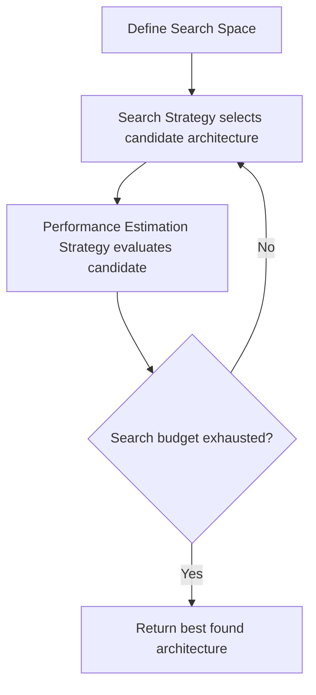

## Neural Architecture Search

### Overview

Neural Architecture Search (NAS) is a set of techniques for automating the design of neural network architectures, replacing manual, trial-and-error architecture engineering with a search process. A NAS system typically consists of three components: a **search space** (the set of possible architectures), a **search strategy** (the algorithm used to explore that space), and a **performance estimation strategy** (the method used to evaluate how good a candidate architecture is).

### Motivation

**Key Points**

- Manually designing neural network architectures requires substantial domain expertise and iterative experimentation.
- NAS aims to find architectures that match or exceed hand-designed ones on a given task, sometimes with fewer parameters or lower computational cost.
- Well-known NAS-derived architectures include NASNet, AmoebaNet, and EfficientNet, which were reported in their original publications to achieve competitive results on benchmarks such as ImageNet.

I cannot verify current state-of-the-art benchmark rankings, as these change frequently and any specific numeric comparison I provided from memory could be outdated. If you need current benchmark standings, that would require checking an up-to-date source such as Papers with Code.

### Core Components



#### Search Space

The search space defines what architectures are representable. Common formulations:

- **Chain-structured space**: a sequence of layers, each chosen from a set of operations (e.g., convolution, pooling), with hyperparameters like kernel size and stride.
- **Cell-based space**: a small repeating unit ("cell") is searched, then stacked multiple times to form the full network. This was used in NASNet. [Inference] Cell-based search spaces are commonly described in the literature as reducing the size of the search space relative to searching the full network topology directly, though the degree of reduction is architecture- and implementation-specific.
- **Hierarchical search space**: allows composition of motifs at multiple levels of granularity.

#### Search Strategy

The search strategy is the algorithm that proposes candidate architectures. Major categories:

**Reinforcement Learning (RL)**

An RL controller (often an RNN) generates architecture descriptions as a sequence of decisions. The controller is trained using a reward signal derived from the validation performance of the generated architecture, typically via policy gradient methods such as REINFORCE.

$$J(\theta) = \mathbb{E}_{a \sim \pi_\theta}[R(a)]$$

where $\pi_\theta$ is the controller's policy, $a$ is a sampled architecture, and $R(a)$ is the reward (e.g., validation accuracy).

**Evolutionary Algorithms**

A population of architectures is maintained and evolved over generations using operations such as mutation (e.g., adding/removing a layer) and selection (e.g., tournament selection, where weaker architectures are discarded). AmoebaNet is an example that used evolutionary search.

**Gradient-Based Methods (e.g., DARTS)**

DARTS (Differentiable Architecture Search) relaxes the discrete search space into a continuous one by representing the choice of operation at each edge as a weighted (softmax) combination of candidate operations, allowing architecture parameters to be optimized via gradient descent alongside network weights.

$$\bar{o}^{(i,j)}(x) = \sum_{o \in \mathcal{O}} \frac{\exp(\alpha_o^{(i,j)})}{\sum_{o' \in \mathcal{O}} \exp(\alpha_{o'}^{(i,j)})} \, o(x)$$

where $\alpha_o^{(i,j)}$ are the architecture parameters for operation $o$ on edge $(i,j)$, and $\mathcal{O}$ is the set of candidate operations.

[Inference] Gradient-based methods such as DARTS are generally described in the literature as being more computationally efficient than RL-based or evolutionary approaches, because they avoid training many discrete candidate architectures from scratch. I cannot verify the exact magnitude of this efficiency difference for any specific setup without benchmarking, as it depends on hardware, dataset, and implementation.

**Bayesian Optimization**

As covered in the prior topic, Bayesian optimization can also be applied to NAS, typically over a lower-dimensional encoding of the architecture space, since the raw architecture space is usually too large and discrete for standard Gaussian Process kernels to handle efficiently.

#### Performance Estimation Strategy

Because fully training each candidate architecture is computationally expensive, several shortcuts are used:

- **Lower fidelity estimates**: training for fewer epochs, on a subset of data, or with reduced image resolution, then using that partial result as a proxy signal.
- **Weight sharing**: candidate architectures share weights within a larger "supernet," avoiding training each candidate from scratch. This is the mechanism underlying DARTS and ENAS (Efficient Neural Architecture Search).
- **Learning curve extrapolation**: predicting final performance from early training progress.
- **Surrogate performance predictors**: training a model to predict architecture performance directly from its structural encoding, without full training.

I do not have access to information confirming which specific performance estimation method is most widely used in current production NAS pipelines, as this is an evolving area and would require checking recent literature.

### Example: Simplified DARTS-Style Cell Search (Conceptual)

**Example**

```python
import torch
import torch.nn as nn
import torch.nn.functional as F

class MixedOp(nn.Module):
    def __init__(self, candidate_ops):
        super().__init__()
        self.ops = nn.ModuleList(candidate_ops)
        self.alpha = nn.Parameter(torch.randn(len(candidate_ops)))

    def forward(self, x):
        weights = F.softmax(self.alpha, dim=0)
        return sum(w * op(x) for w, op in zip(weights, self.ops))

candidate_ops = [
    nn.Conv2d(16, 16, kernel_size=3, padding=1),
    nn.Conv2d(16, 16, kernel_size=5, padding=2),
    nn.MaxPool2d(kernel_size=3, stride=1, padding=1),
    nn.Identity()
]

cell_edge = MixedOp(candidate_ops)
x = torch.randn(1, 16, 32, 32)
output = cell_edge(x)
```

This code illustrates the core DARTS mechanism: each edge in the cell computes a weighted sum over candidate operations, with weights (`alpha`) learned via gradient descent. This is a simplified illustration, not a complete DARTS implementation; the full method includes bilevel optimization between architecture parameters and network weights, which is not shown here.

### Illustration: NAS Search Loop

<svg xmlns="http://www.w3.org/2000/svg" viewBox="0 0 700 380">
<text x="350" y="25" text-anchor="middle" font-size="16" font-weight="bold" fill="#1a1a1a">NAS Search Loop Components (svg_diagram)</text>
<rect x="40" y="60" width="180" height="70" rx="8" fill="#e8f0fb" stroke="#2c5f9e" stroke-width="2" />
<text x="130" y="90" text-anchor="middle" font-size="13" font-weight="bold" fill="#2c5f9e">Search Space</text>
<text x="130" y="110" text-anchor="middle" font-size="11" fill="#333">Chain / Cell-based /</text>
<text x="130" y="124" text-anchor="middle" font-size="11" fill="#333">Hierarchical</text>
<rect x="260" y="60" width="180" height="70" rx="8" fill="#fbeee8" stroke="#d9724a" stroke-width="2" />
<text x="350" y="90" text-anchor="middle" font-size="13" font-weight="bold" fill="#d9724a">Search Strategy</text>
<text x="350" y="110" text-anchor="middle" font-size="11" fill="#333">RL / Evolutionary /</text>
<text x="350" y="124" text-anchor="middle" font-size="11" fill="#333">Gradient-based / Bayesian</text>
<rect x="480" y="60" width="180" height="70" rx="8" fill="#eafbe8" stroke="#4a9e5f" stroke-width="2" />
<text x="570" y="90" text-anchor="middle" font-size="13" font-weight="bold" fill="#4a9e5f">Performance Estimation</text>
<text x="570" y="110" text-anchor="middle" font-size="11" fill="#333">Weight sharing / Low</text>
<text x="570" y="124" text-anchor="middle" font-size="11" fill="#333">fidelity / Extrapolation</text>
<line x1="220" y1="95" x2="255" y2="95" stroke="#333" stroke-width="2" marker-end="url(#arrow)" />
<line x1="440" y1="95" x2="475" y2="95" stroke="#333" stroke-width="2" marker-end="url(#arrow)" />
<path d="M 570 130 L 570 220 L 130 220 L 130 135" fill="none" stroke="#666" stroke-width="2" stroke-dasharray="5,3" marker-end="url(#arrow)" />
<text x="350" y="240" text-anchor="middle" font-size="12" fill="#666">Feedback: performance signal refines next candidate selection</text>
</svg>

### Comparison of Search Strategies

| Strategy | Relative compute cost | Discrete or continuous space | Notable example |
| --- | --- | --- | --- |
| Reinforcement Learning | High | Discrete | NASNet |
| Evolutionary | High | Discrete | AmoebaNet |
| Gradient-based (DARTS) | Lower | Relaxed to continuous | DARTS |
| Bayesian Optimization | Moderate | Typically low-dim encoding | Various research systems |

[Inference] The "relative compute cost" column reflects general characterizations found in NAS literature comparing method families, not measured benchmarks on a specific hardware setup. I cannot verify exact cost figures without a specific controlled comparison.

### Limitations

- **Computational cost**: Early NAS methods (e.g., the original NASNet approach) were reported in their source publications to require substantial GPU-time budgets. [Unverified] I cannot verify specific GPU-hour figures without checking the original paper directly, and citing a number from memory risks inaccuracy.
- **Search space bias**: The design of the search space itself encodes strong human assumptions about what a "good" architecture looks like, which constrains what NAS can discover.
- **Reproducibility concerns**: [Speculation] Some NAS methods, particularly early weight-sharing approaches, have been discussed in follow-up literature as potentially sensitive to random seed and hyperparameter settings in ways that can make reported results difficult to reproduce exactly. This is a characterization I cannot fully verify without reviewing the specific reproducibility studies in question.
- **Transferability**: An architecture found optimal for one dataset or task does not necessarily transfer optimally to another; this is a widely acknowledged limitation but the extent of the effect is task-dependent and cannot be generalized into a single figure.

### Common Frameworks and Tools

- **NNI (Neural Network Intelligence)**: Microsoft's toolkit supporting multiple NAS algorithms.
- **AutoKeras**: Provides a higher-level, more accessible interface for NAS built on Keras.
- **DARTS (original implementation)**: Reference implementation from the original paper.
- **Optuna / Ray Tune**: General hyperparameter/architecture search frameworks that can be adapted for NAS-style search.

I do not have access to confirmed, current information about which of these tools is most actively maintained as of today; framework activity and maturity change over time and should be checked directly against each project's repository.

### Conclusion

Neural Architecture Search automates architecture design by combining a defined search space, a search strategy (RL, evolutionary, gradient-based, or Bayesian), and a performance estimation method to manage computational cost. Gradient-based approaches such as DARTS are commonly presented in the literature as reducing search cost relative to earlier RL- and evolutionary-based methods, though I cannot verify exact efficiency figures without a specific controlled benchmark, and reported results across NAS methods should be treated as dependent on the specific experimental setup used.

### Related Topics

- Weight-sharing and one-shot NAS methods (ENAS, single-path one-shot NAS)
- Hardware-aware NAS (optimizing for latency or energy on target devices)
- Multi-objective NAS (balancing accuracy against model size or FLOPs)
- Zero-cost proxies for architecture performance estimation
- Transformer architecture search
- Relationship between NAS and AutoML more broadly