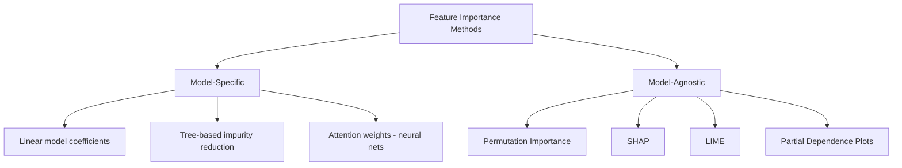

## Feature Importance Methods

### Overview

Feature importance methods quantify the contribution of individual input features to a model's predictions. These methods serve multiple purposes: model interpretation, feature selection, debugging unexpected model behavior, and communicating model logic to stakeholders. Feature importance techniques are broadly divided into **model-specific** methods (tied to a particular algorithm's internal structure) and **model-agnostic** methods (applicable to any trained model, treating it as a black box).

### Categories of Methods



### Model-Specific Methods

#### Linear Model Coefficients

For linear and logistic regression, the magnitude of a standardized coefficient $\beta_i$ is often used as a direct indicator of feature importance, since the model's prediction is a weighted linear combination of features:

$$\hat{y} = \beta_0 + \sum_{i=1}^{n} \beta_i x_i$$

**Key Points**

- Coefficients must be computed on standardized (zero mean, unit variance) features for direct magnitude comparison between features measured on different scales.
- This method only reflects linear relationships between a feature and the target; it does not capture nonlinear effects or interactions between features.
- Coefficient magnitude does not by itself establish causal importance, only association within the fitted model.

#### Tree-Based Impurity Reduction

For decision trees and ensembles (Random Forest, Gradient Boosting), importance is commonly computed as the total reduction in impurity (e.g., Gini impurity or variance) attributable to splits on a given feature, summed across all trees and weighted by the number of samples each split affects.

$$\text{Importance}(x_j) = \sum_{t \in T} \sum_{s \in S_t, \, \text{split on } x_j} p(s) \cdot \Delta i(s)$$

where $T$ is the set of trees, $S_t$ is the set of splits in tree $t$, $p(s)$ is the proportion of samples reaching split $s$, and $\Delta i(s)$ is the impurity decrease at that split.

[Inference] Impurity-based importance is generally described in the literature as biased toward high-cardinality features (those with many unique values), because such features offer more possible split points and therefore more opportunities to reduce impurity by chance. I cannot verify the precise magnitude of this bias for any specific dataset without direct testing on that dataset.

#### Attention Weights (Neural Networks)

In attention-based architectures (e.g., Transformers), attention weights are sometimes interpreted as indicating which input tokens or features the model "focuses on" when producing an output.

[Speculation] Whether attention weights reliably reflect genuine feature importance, as opposed to being an artifact of the architecture's internal computation, is a matter of ongoing debate in the research community. I cannot verify a settled conclusion on this question, and this should not be treated as a resolved fact.

### Model-Agnostic Methods

#### Permutation Importance

Permutation importance measures the drop in model performance when a single feature's values are randomly shuffled, breaking its relationship with the target while preserving the marginal distribution of that feature.

**Procedure:**

1. Train the model and record baseline performance (e.g., accuracy, $R^2$) on a held-out set.
2. For each feature $x_j$: shuffle the values of $x_j$ across the dataset, keeping all other features fixed.
3. Recompute model performance on the shuffled dataset.
4. Importance of $x_j$ is the difference between baseline and shuffled performance.

$$\text{Importance}(x_j) = \text{Score}_{\text{baseline}} - \text{Score}_{\text{shuffled}(x_j)}$$

**Example**

```python
from sklearn.inspection import permutation_importance
from sklearn.ensemble import RandomForestClassifier

model = RandomForestClassifier(random_state=42)
model.fit(X_train, y_train)

result = permutation_importance(
    model, X_test, y_test,
    n_repeats=10,
    random_state=42,
    scoring='accuracy'
)

for i in result.importances_mean.argsort()[::-1]:
    print(f"{feature_names[i]}: {result.importances_mean[i]:.4f} +/- {result.importances_std[i]:.4f}")
```

This uses scikit-learn's `permutation_importance` function, which repeats the shuffling process `n_repeats` times per feature and reports the mean and standard deviation of the resulting importance scores.

[Inference] Permutation importance is generally considered less biased toward high-cardinality features than impurity-based importance, since it operates on held-out data rather than training-time split statistics. I cannot verify this holds in every configuration or dataset without direct comparison.

[Unverified] Permutation importance can produce misleading results when features are highly correlated, because shuffling one correlated feature while leaving others intact may not represent a realistic input pattern, and the model may compensate using the correlated feature. The exact severity of this effect is dataset- and model-dependent, and I cannot verify how significant this effect is without testing on the specific correlated features involved.

#### SHAP (SHapley Additive exPlanations)

SHAP assigns each feature a contribution value for a specific prediction, based on Shapley values from cooperative game theory. The SHAP value for feature $i$ represents its average marginal contribution across all possible orderings (coalitions) of features:

$$\phi_i = \sum_{S \subseteq F \setminus \{i\}} \frac{|S|!(|F|-|S|-1)!}{|F|!} \left[ f(S \cup \{i\}) - f(S) \right]$$

where $F$ is the full set of features, $S$ is a subset excluding feature $i$, and $f(S)$ is the model's prediction using only features in $S$.

**Key Points**

- SHAP values satisfy several theoretical properties derived from game theory: efficiency (contributions sum to the difference between the prediction and the baseline/expected value), symmetry, and additivity.
- Exact computation of Shapley values is combinatorial and computationally expensive for large feature sets; practical implementations use approximations.
- `TreeSHAP` is a specific algorithm designed for tree-based models that computes exact SHAP values in polynomial time rather than using sampling-based approximation, as documented in the original SHAP paper by Lundberg and Lee.

**Example**

```python
import shap

explainer = shap.TreeExplainer(model)
shap_values = explainer.shap_values(X_test)

shap.summary_plot(shap_values, X_test, feature_names=feature_names)
```

This uses the `shap` library's `TreeExplainer`, which is optimized for tree-based models such as Random Forest and XGBoost.

#### LIME (Local Interpretable Model-agnostic Explanations)

LIME explains an individual prediction by fitting a simple, interpretable model (typically linear) to samples generated in the local neighborhood of that prediction, weighted by proximity to the original instance.

**Procedure:**

1. Select the instance to explain.
2. Generate perturbed samples around that instance.
3. Obtain the black-box model's predictions for each perturbed sample.
4. Fit a weighted linear (or other interpretable) model to these perturbed samples, weighting by proximity to the original instance.
5. Use the coefficients of this local surrogate model as the explanation.

[Inference] LIME's explanations are local approximations and are generally described in the original literature as not necessarily representative of the model's global behavior; a feature deemed important for one instance may not carry the same importance elsewhere in the input space. This characterization follows from the method's stated design and is not itself an empirical claim I have separately verified.

#### Partial Dependence Plots (PDP) and Individual Conditional Expectation (ICE)

PDPs show the marginal effect of one or two features on the predicted outcome, averaged over the distribution of all other features:

$$\hat{f}_j(x_j) = \frac{1}{n} \sum_{i=1}^{n} \hat{f}(x_j, x_{i, -j})$$

where $x_{i,-j}$ denotes the values of all features other than $j$ for instance $i$.

ICE plots show this same relationship but for individual instances rather than averaged, which can reveal heterogeneous effects that a PDP's averaging would obscure.

[Unverified] PDPs are commonly described as assuming feature independence, since averaging over the joint distribution of other features can produce unrealistic feature combinations when features are correlated. I cannot verify the practical impact of this assumption for any specific dataset without direct testing.

### Illustration: Local vs. Global Explanation Scope

<svg xmlns="http://www.w3.org/2000/svg" viewBox="0 0 700 380">
<text x="350" y="25" text-anchor="middle" font-size="16" font-weight="bold" fill="#1a1a1a">Explanation Scope: Global vs Local Methods (svg_diagram)</text>
<rect x="60" y="60" width="280" height="260" rx="10" fill="#e8f0fb" stroke="#2c5f9e" stroke-width="2" />
<text x="200" y="90" text-anchor="middle" font-size="14" font-weight="bold" fill="#2c5f9e">Global Methods</text>
<text x="200" y="115" text-anchor="middle" font-size="11" fill="#333">Describe overall model behavior</text>
<rect x="90" y="140" width="220" height="35" rx="5" fill="#fff" stroke="#2c5f9e" />
<text x="200" y="162" text-anchor="middle" font-size="12" fill="#333">Tree Impurity Importance</text>
<rect x="90" y="185" width="220" height="35" rx="5" fill="#fff" stroke="#2c5f9e" />
<text x="200" y="207" text-anchor="middle" font-size="12" fill="#333">Permutation Importance</text>
<rect x="90" y="230" width="220" height="35" rx="5" fill="#fff" stroke="#2c5f9e" />
<text x="200" y="252" text-anchor="middle" font-size="12" fill="#333">Partial Dependence Plot</text>
<rect x="90" y="275" width="220" height="35" rx="5" fill="#fff" stroke="#2c5f9e" />
<text x="200" y="297" text-anchor="middle" font-size="12" fill="#333">SHAP (aggregated)</text>
<rect x="360" y="60" width="280" height="260" rx="10" fill="#fbeee8" stroke="#d9724a" stroke-width="2" />
<text x="500" y="90" text-anchor="middle" font-size="14" font-weight="bold" fill="#d9724a">Local Methods</text>
<text x="500" y="115" text-anchor="middle" font-size="11" fill="#333">Explain single predictions</text>
<rect x="390" y="140" width="220" height="35" rx="5" fill="#fff" stroke="#d9724a" />
<text x="500" y="162" text-anchor="middle" font-size="12" fill="#333">LIME</text>
<rect x="390" y="185" width="220" height="35" rx="5" fill="#fff" stroke="#d9724a" />
<text x="500" y="207" text-anchor="middle" font-size="12" fill="#333">SHAP (per-instance)</text>
<rect x="390" y="230" width="220" height="35" rx="5" fill="#fff" stroke="#d9724a" />
<text x="500" y="252" text-anchor="middle" font-size="12" fill="#333">ICE Plot (single curve)</text>
</svg>

### Comparison Table

| Method | Scope | Model type | Handles feature interactions | Computational cost |
| --- | --- | --- | --- | --- |
| Linear coefficients | Global | Linear models only | No | Low |
| Tree impurity | Global | Tree-based only | Partially | Low |
| Permutation Importance | Global | Any | Partially | Moderate |
| PDP / ICE | Global / Local | Any | Limited (PDP), yes (ICE per-instance) | Moderate |
| LIME | Local | Any | Limited (within local linear fit) | Moderate |
| SHAP | Local (aggregable to global) | Any (exact for trees via TreeSHAP) | Yes | High (exact), Moderate (approximate) |

[Inference] The "computational cost" column reflects general characterizations found in the literature comparing these method families, not measured runtime benchmarks on a specific dataset or hardware configuration. I cannot verify exact runtime figures without a controlled comparison.

### Limitations Across Methods

- Correlated features can distort importance scores across nearly all methods discussed here, since importance attributed to one feature may partly reflect information carried by a correlated feature. [Inference] This is a commonly cited limitation in the interpretability literature, though the magnitude of distortion depends on the correlation structure of the specific dataset and cannot be generalized into a single figure.
- Feature importance reflects association with model output, not necessarily a causal relationship with the underlying target variable in the real world.
- [Speculation] Some researchers have raised concerns that explanation methods such as LIME and SHAP can be manipulated to obscure a model's actual reliance on sensitive or problematic features, particularly in adversarial settings. I cannot verify the extent to which this is a practical concern outside of the specific research settings in which it has been studied.

### Conclusion

Feature importance methods range from simple model-specific measures, such as linear coefficients and tree impurity reduction, to more general model-agnostic techniques like permutation importance, SHAP, and LIME. Each method carries different assumptions and trade-offs regarding computational cost, sensitivity to correlated features, and whether it explains global model behavior or a single prediction. Selection of a method should be guided by the type of model being interpreted, the intended audience for the explanation, and whether a global or local view of the model's behavior is needed.

### Related Topics

- Shapley value theory and its foundations in cooperative game theory
- Counterfactual explanations as an alternative interpretability approach
- Fairness auditing using feature importance and explanation methods
- Interpretability trade-offs between model complexity and explainability
- Accumulated Local Effects (ALE) plots as an alternative to PDP under correlated features
- Explainability regulations and their relationship to model interpretability techniques