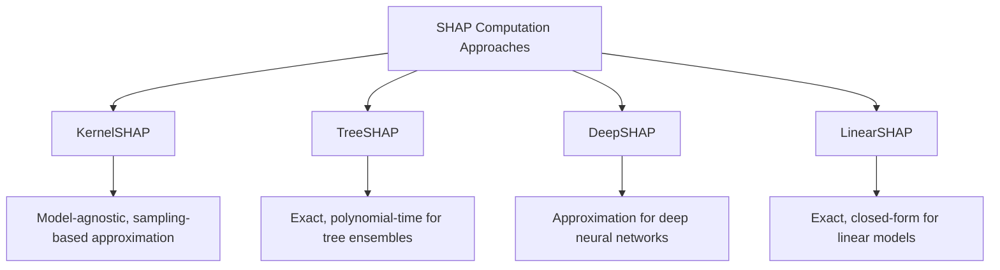

## SHAP Values

### Overview

SHAP (SHapley Additive exPlanations) is a model-agnostic framework for explaining individual predictions by attributing a contribution value to each input feature. It is grounded in Shapley values, a concept from cooperative game theory originally developed to fairly distribute a total payoff among players based on their marginal contributions across all possible coalitions.

### Theoretical Foundation

In the SHAP framework, a model's prediction is treated as the "payoff," and features are treated as "players" cooperating to produce that payoff. The SHAP value for feature $i$ is defined as:

$$\phi_i = \sum_{S \subseteq F \setminus \{i\}} \frac{|S|!\,(|F|-|S|-1)!}{|F|!} \left[ f(S \cup \{i\}) - f(S) \right]$$

where:

- $F$ is the full set of features
- $S$ is a subset of features excluding feature $i$
- $f(S)$ is the model's expected prediction using only the features in $S$
- The fraction is a weighting term accounting for all possible orderings in which feature $i$ could be added to a coalition

This formula computes the average marginal contribution of feature $i$ across every possible subset of the other features, weighted so that all orderings are treated fairly.

### Key Theoretical Properties

**Key Points**

- **Efficiency**: The sum of all SHAP values for an instance, plus a baseline value (the expected model output over the training/background dataset), equals the model's actual output for that instance: $\sum_i \phi_i + \phi_0 = f(x)$.
- **Symmetry**: If two features contribute equally to every possible coalition, they receive equal SHAP values.
- **Dummy (Null) Property**: A feature that does not change the prediction in any coalition receives a SHAP value of zero.
- **Additivity**: For models composed of an ensemble (e.g., averaged trees), the SHAP values of the ensemble equal the sum of the SHAP values of the individual models.

These four properties are the defining axioms of Shapley value allocation as established in cooperative game theory, and their application to model explanation was formalized in the paper "A Unified Approach to Interpreting Model Predictions" by Lundberg and Lee (2017).

### Computational Approaches

Exact computation of Shapley values requires evaluating $f(S)$ for every possible subset $S$ of features, which scales as $O(2^{|F|})$. This is computationally intractable for models with more than a small number of features. Several approximation and specialized algorithms address this:



#### KernelSHAP

KernelSHAP approximates Shapley values using a weighted linear regression over sampled feature coalitions, applicable to any black-box model. Because it relies on sampling rather than exhaustive enumeration, its output is an approximation rather than the exact Shapley value.

#### TreeSHAP

TreeSHAP is an algorithm specifically designed for tree-based models (decision trees, random forests, gradient boosted trees) that computes exact SHAP values in polynomial time by exploiting the tree structure, rather than relying on sampling. This is described in Lundberg, Erion, and Lee's paper "Consistent Individualized Feature Attribution for Tree Ensembles."

#### DeepSHAP

DeepSHAP is an approximation method adapted for deep neural networks, combining ideas from the DeepLIFT method with Shapley value concepts to propagate contributions through network layers.

#### LinearSHAP

For linear models, SHAP values can be computed in closed form directly from the model's coefficients and feature values, without approximation.

I cannot verify the current relative computational performance (e.g., exact runtime speedup) of these methods against each other outside of what is reported in their originating papers, and any such comparison would depend on the specific model size, dataset, and hardware used.

### Practical Example

**Example**

```python
import shap
import xgboost as xgb

model = xgb.XGBClassifier()
model.fit(X_train, y_train)

explainer = shap.TreeExplainer(model)
shap_values = explainer.shap_values(X_test)

shap.summary_plot(shap_values, X_test, feature_names=feature_names)

shap.force_plot(
    explainer.expected_value,
    shap_values[0],
    X_test.iloc[0],
    feature_names=feature_names
)
```

This code uses the `shap` library's `TreeExplainer`, which applies the TreeSHAP algorithm for tree-based models such as XGBoost. `explainer.expected_value` corresponds to the baseline value $\phi_0$ in the SHAP formula, and `shap_values[0]` provides the per-feature contributions for the first test instance. This describes the documented API behavior of the `shap` library; behavior may differ across library versions, and I cannot verify behavior for versions I have not directly inspected.

### Interpreting SHAP Output

**Output**

For a single prediction, SHAP output typically consists of:

- A baseline value $\phi_0$ (the average model output over a background dataset)
- A signed contribution value $\phi_i$ for each feature, indicating how much that feature pushed the prediction above or below the baseline
- The property that $\phi_0 + \sum_i \phi_i$ equals the model's actual prediction for that instance

A force plot visualizes this as features pushing the prediction higher (typically shown in one color) or lower (typically shown in another color) relative to the baseline.

### Illustration: SHAP Value Decomposition for a Single Prediction

<svg xmlns="http://www.w3.org/2000/svg" viewBox="0 0 700 320">
<text x="350" y="25" text-anchor="middle" font-size="16" font-weight="bold" fill="#1a1a1a">SHAP Additive Decomposition (svg_diagram)</text>
<line x1="60" y1="260" x2="640" y2="260" stroke="#333" stroke-width="2" />
<rect x="60" y="230" width="100" height="30" fill="#8a8a8a" />
<text x="110" y="250" text-anchor="middle" font-size="11" fill="#fff">Baseline φ0</text>
<rect x="160" y="200" width="90" height="30" fill="#4a90d9" />
<text x="205" y="220" text-anchor="middle" font-size="10" fill="#fff">+Feature A</text>
<rect x="250" y="170" width="70" height="30" fill="#4a90d9" />
<text x="285" y="190" text-anchor="middle" font-size="10" fill="#fff">+Feature B</text>
<rect x="320" y="200" width="60" height="30" fill="#d9724a" />
<text x="350" y="220" text-anchor="middle" font-size="10" fill="#fff">-Feature C</text>
<rect x="380" y="150" width="80" height="30" fill="#4a90d9" />
<text x="420" y="170" text-anchor="middle" font-size="10" fill="#fff">+Feature D</text>
<rect x="460" y="150" width="100" height="30" fill="#2c5f9e" />
<text x="510" y="170" text-anchor="middle" font-size="10" fill="#fff">f(x) Final</text>

<text x="110" y="285" text-anchor="middle" font-size="11" fill="#333">Expected value</text>

<text x="510" y="285" text-anchor="middle" font-size="11" fill="#333">Actual prediction</text>

<rect x="480" y="60" width="15" height="15" fill="#4a90d9" />
<text x="500" y="72" font-size="11" fill="#333">Positive contribution</text>
<rect x="480" y="82" width="15" height="15" fill="#d9724a" />
<text x="500" y="94" font-size="11" fill="#333">Negative contribution</text>
</svg>

This is a conceptual illustration of the additive decomposition property, not output copied from an actual SHAP visualization; exact visual styling of real SHAP force plots may differ, and I cannot verify the precise rendering across all versions of the `shap` library.

### Limitations

- [Inference] Exact Shapley value computation is combinatorially expensive, which is why approximation methods such as KernelSHAP are used in practice; this follows directly from the $O(2^{|F|})$ complexity of the defining formula and is a mathematical property rather than an empirical claim.
- [Unverified] SHAP values can be affected by feature correlation, since the definition involves evaluating the model on feature subsets that may include unrealistic combinations when features are dependent on one another. I cannot verify the practical magnitude of this effect for any specific dataset without direct testing.
- [Speculation] Some researchers have raised concerns that SHAP explanations could potentially be manipulated in adversarial settings to obscure a model's reliance on certain features. I cannot verify how significant this concern is in practical deployment settings outside of the specific research contexts in which it has been studied, and this should not be treated as an established, general vulnerability of all SHAP-based systems.
- [Unverified] Interpretation of SHAP values as a complete causal explanation of model behavior is not supported by the method's underlying theory; SHAP values reflect associative attribution within the fitted model, not a verified causal relationship with the real-world target variable.

### Conclusion

SHAP values provide a theoretically grounded method for attributing individual predictions to input features, based on the Shapley value framework from cooperative game theory. [Inference] The method's four defining properties (efficiency, symmetry, dummy, additivity) are why SHAP is often presented in the interpretability literature as more theoretically consistent than some alternative explanation methods, though I cannot verify comparative claims about "better" explanations in a general sense, as this depends on the specific evaluation criteria and use case being considered. Practical use requires choosing an appropriate computation method (KernelSHAP, TreeSHAP, DeepSHAP, or LinearSHAP) depending on the underlying model type, and results should be interpreted as associative attributions within the fitted model rather than verified causal explanations.

### Related Topics

- Shapley value axioms and their origin in cooperative game theory
- Comparison of SHAP and LIME for local model explanation
- SHAP interaction values for capturing pairwise feature effects
- Global feature importance via aggregated SHAP values
- Limitations of explanation methods under correlated features (see also Accumulated Local Effects)
- Causal inference methods as a complement to associative feature attribution