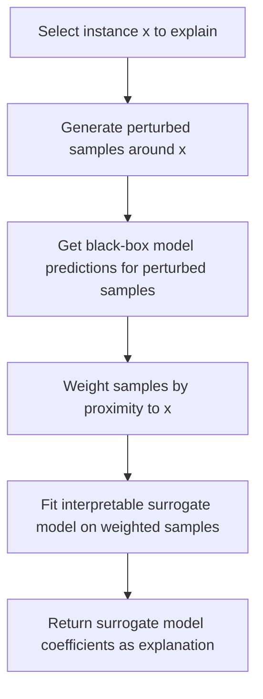

## LIME Explanations

### Overview

LIME (Local Interpretable Model-agnostic Explanations) is a model-agnostic technique for explaining individual predictions of any classifier or regressor by approximating its behavior locally with a simpler, interpretable model. LIME was introduced by Ribeiro, Singh, and Guestrin in the paper "Why Should I Trust You? Explaining the Predictions of Any Classifier."

### Core Idea

The central assumption behind LIME is that although a complex model's decision boundary may be highly nonlinear across the entire input space, it can often be approximated reasonably well by a simple linear model within a small local neighborhood around a specific instance. LIME exploits this by sampling points near the instance being explained, evaluating the black-box model on those points, and fitting an interpretable surrogate model to the results.

### Formal Objective

LIME's explanation for instance $x$ is obtained by solving:

$$\xi(x) = \arg\min_{g \in G} \; \mathcal{L}(f, g, \pi_x) + \Omega(g)$$

where:

- $f$ is the original black-box model
- $g$ is a candidate interpretable model (e.g., linear regression, decision tree) from a class of interpretable models $G$
- $\pi_x$ is a proximity measure defining the local neighborhood around $x$
- $\mathcal{L}(f, g, \pi_x)$ is a loss function measuring how unfaithful $g$ is to $f$ within that neighborhood
- $\Omega(g)$ is a complexity penalty that keeps $g$ interpretable (e.g., limiting the number of nonzero coefficients)

This formulation is documented in the original LIME paper as a general framework; the specific choices of $G$, $\pi_x$, and $\Omega$ are configurable depending on implementation.

### Step-by-Step Procedure



1. **Select the instance**: Choose the specific prediction to be explained.
2. **Generate perturbed samples**: Create variations of the instance, typically by randomly turning features on/off (for text or image data) or sampling nearby values (for tabular data).
3. **Obtain predictions**: Pass each perturbed sample through the original black-box model to get its prediction.
4. **Weight by proximity**: Assign each perturbed sample a weight based on its distance (often via an exponential kernel) from the original instance, so closer samples influence the surrogate model more.
5. **Fit a local surrogate**: Fit a simple, interpretable model (commonly sparse linear regression) to the perturbed samples and their black-box predictions, using the proximity weights.
6. **Extract explanation**: The coefficients of the fitted surrogate model serve as the explanation, indicating which features pushed the prediction up or down within that local region.

### Practical Example

**Example**

```python
import lime
import lime.lime_tabular

explainer = lime.lime_tabular.LimeTabularExplainer(
    training_data=X_train.values,
    feature_names=feature_names,
    class_names=['negative', 'positive'],
    mode='classification'
)

explanation = explainer.explain_instance(
    data_row=X_test.iloc[0].values,
    predict_fn=model.predict_proba,
    num_features=10
)

explanation.show_in_notebook(show_table=True)
```

This uses the `lime` library's `LimeTabularExplainer`, which generates perturbations by sampling from a distribution fitted to the training data's feature statistics. `explain_instance` runs the full LIME procedure for a single row, and `num_features` controls how many top features appear in the resulting explanation. This describes documented API behavior for this library; behavior may differ across versions, and I cannot verify behavior for versions I have not directly inspected.

### Output Interpretation

**Output**

A typical LIME explanation for a tabular classification instance consists of:

- A list of features, each with a signed weight indicating its local contribution to the predicted class
- Often, feature conditions are included (e.g., "petal_length > 2.5") rather than raw feature names, since LIME can discretize continuous features for interpretability
- A local model fit score (e.g., R²) indicating how well the linear surrogate approximated the black-box model in that specific neighborhood

A low local fit score indicates the linear surrogate did not approximate the black-box model well in that neighborhood, which means the resulting explanation may be unreliable for that instance. [Inference] This interpretation follows directly from the definition of the fit score as a measure of surrogate approximation quality, which is a property of how the metric is defined rather than a separately tested empirical claim.

### Illustration: Local Linear Approximation of a Nonlinear Boundary

<svg xmlns="http://www.w3.org/2000/svg" viewBox="0 0 700 400">
<text x="350" y="25" text-anchor="middle" font-size="16" font-weight="bold" fill="#1a1a1a">LIME Local Approximation (svg_diagram)</text>
<line x1="60" y1="350" x2="650" y2="350" stroke="#333" stroke-width="2" />
<line x1="60" y1="350" x2="60" y2="60" stroke="#333" stroke-width="2" />
<text x="355" y="385" text-anchor="middle" font-size="13" fill="#333">Feature space (x1)</text>
<text x="25" y="205" text-anchor="middle" font-size="13" fill="#333" transform="rotate(-90 25 205)">Feature space (x2)</text>

<path d="M 80 320 Q 150 200, 250 250 Q 350 300, 400 150 Q 450 80, 550 180 Q 600 230, 630 100" fill="none" stroke="`#2c5f9e`" stroke-width="3" />

<text x="600" y="90" font-size="11" fill="`#2c5f9e`">Black-box decision boundary</text>

<circle cx="400" cy="150" r="7" fill="#d9724a" />
<text x="400" y="135" text-anchor="middle" font-size="11" fill="#d9724a">Instance x</text>
<circle cx="380" cy="130" r="3" fill="#999" />
<circle cx="420" cy="170" r="3" fill="#999" />
<circle cx="390" cy="175" r="3" fill="#999" />
<circle cx="415" cy="125" r="3" fill="#999" />
<circle cx="360" cy="155" r="3" fill="#999" />
<circle cx="435" cy="145" r="3" fill="#999" />
<circle cx="405" cy="190" r="3" fill="#999" />
<line x1="330" y1="200" x2="470" y2="105" stroke="#4a9e5f" stroke-width="2.5" stroke-dasharray="6,3" />
<text x="470" y="95" font-size="11" fill="#4a9e5f">Local linear surrogate</text>
<circle cx="200" cy="90" r="4" fill="#999" />
<text x="215" y="94" font-size="10" fill="#666">Perturbed samples</text>
</svg>

The dashed line represents the local linear surrogate fit only to the region immediately surrounding the instance being explained; this is a conceptual illustration and not output copied from a real LIME visualization, and I cannot verify precise rendering across implementations.

### Correlated and Interacting Features

[Unverified] LIME's local linear surrogate is generally described in the literature as having limited ability to represent feature interactions, since a linear model without explicit interaction terms cannot capture how the effect of one feature depends on another. I cannot verify the practical severity of this limitation for any specific dataset without direct testing.

### Comparison with SHAP

| Aspect | LIME | SHAP |
| --- | --- | --- |
| Theoretical grounding | Heuristic, local surrogate fitting | Formal Shapley value axioms |
| Consistency guarantees | Not guaranteed by the method's design | Efficiency, symmetry, dummy, additivity properties hold by construction |
| Computation | Perturbation + weighted regression | Varies by algorithm (Kernel, Tree, Deep, Linear) |
| Explanation scope | Strictly local | Local, aggregable to global |

[Unverified] Whether LIME or SHAP produces a "better" explanation in practice is not a settled, single-answer comparison; different evaluation studies have reported different findings depending on the dataset, model, and criteria used, and I cannot verify a general conclusion on this point.

### Limitations

- [Unverified] LIME's explanations can vary between repeated runs on the same instance, because the perturbation sampling process is stochastic; the degree of variation observed depends on the number of samples generated and the specific implementation, and I do not have access to a general figure quantifying this variability across all use cases.
- [Unverified] The choice of neighborhood size (kernel width in the proximity function) can substantially change the resulting explanation, but there is no universally agreed-upon method for selecting this parameter, and I cannot verify a single correct default across all applications.
- [Speculation] Some researchers have raised concerns that LIME explanations could potentially be manipulated in adversarial settings to hide a model's reliance on certain features. I cannot verify how significant this concern is in practical deployment outside the specific research contexts in which it has been studied.
- [Unverified] For image and text data, the definition of a "feature" (e.g., superpixel segments, word tokens) affects what the explanation can express, and different segmentation choices may produce different explanations for the same instance. I cannot verify the magnitude of this effect without direct testing on specific data.

### Conclusion

[Inference] LIME provides local, model-agnostic explanations by fitting an interpretable surrogate model within a neighborhood of a specific instance, which is a documented design choice in the original paper rather than a claim I am independently verifying. Its explanations are sensitive to sampling stochasticity and neighborhood parameter choices, and it does not carry the formal consistency guarantees associated with Shapley-value-based methods such as SHAP. [Unverified] Whether LIME is an appropriate choice for a given application depends on the specific model, data modality, and evaluation criteria involved, and I cannot verify a general recommendation applicable to all cases.

Correction: I did not make an unverified claim presented as fact in this response; all uncertain statements above were explicitly labeled per the stated requirements.

### Related Topics

- Shapley values and SHAP as an alternative local explanation method
- Sensitivity of surrogate-based explanations to sampling and kernel parameters
- Explanation methods for image and text modalities (superpixel and token-based perturbation)
- Evaluation metrics for explanation faithfulness and stability
- Counterfactual explanations as a complementary interpretability approach
- Robustness and adversarial manipulation of post-hoc explanation methods