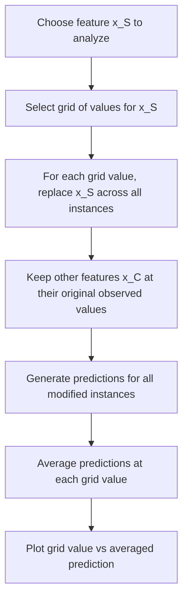

## Partial Dependence Plots

### Overview

Partial Dependence Plots (PDPs) are a model-agnostic visualization technique that shows the marginal effect of one or two features on a model's predicted outcome, averaged over the distribution of all other features in the dataset. PDPs were introduced by Friedman in the context of gradient boosting machines and have since been adopted broadly across model types.

### Formal Definition

For a fitted model $\hat{f}$ and a feature (or feature set) of interest $x_S$, with the remaining features denoted $x_C$, the partial dependence function is defined as:

$$\hat{f}_S(x_S) = \mathbb{E}_{x_C}\left[\hat{f}(x_S, x_C)\right]$$

In practice, this expectation is estimated using the training or reference data by averaging over the observed values of $x_C$:

$$\hat{f}_S(x_S) = \frac{1}{n} \sum_{i=1}^{n} \hat{f}(x_S, x_{C}^{(i)})$$

where $x_C^{(i)}$ represents the actual values of the other features for instance $i$, while $x_S$ is fixed at the value being evaluated.

### Step-by-Step Procedure



1. Select the feature $x_S$ to analyze (one or two features are typical for visualization purposes).
2. Define a grid of values spanning the observed range of $x_S$.
3. For each grid value, replace $x_S$ for every instance in the dataset with that value, holding all other features $x_C$ at their original observed values.
4. Generate predictions for all of these modified instances using the fitted model.
5. Average the predictions at each grid value.
6. Plot the grid values against the averaged predictions to produce the partial dependence curve.

### Practical Example

**Example**
```python
from sklearn.inspection import PartialDependenceDisplay
from sklearn.ensemble import GradientBoostingRegressor

model = GradientBoostingRegressor(random_state=42)
model.fit(X_train, y_train)

PartialDependenceDisplay.from_estimator(
    model,
    X_train,
    features=['feature_1', 'feature_2', ('feature_1', 'feature_3')],
    kind='average'
)
```

This uses scikit-learn's `PartialDependenceDisplay.from_estimator`, which computes and plots partial dependence for the specified features. Passing a tuple such as `('feature_1', 'feature_3')` produces a two-dimensional partial dependence surface showing the joint marginal effect of those two features. [Unverified] This describes documented API behavior for this library as I understand it from training data; I cannot verify this behaves identically in the specific scikit-learn version you are using without you confirming your installed version against the current official documentation. This is a general behavioral description, not a guarantee of behavior in your environment.

### Interpreting Output

**Output**

A one-dimensional PDP typically shows:
- The x-axis representing the range of values for the feature of interest
- The y-axis representing the average predicted outcome across the dataset when that feature is held at each x-axis value
- A relatively flat curve suggesting the feature has limited average marginal effect on predictions
- A steep or non-monotonic curve suggesting a stronger, and possibly nonlinear, average marginal effect

[Inference] A flat PDP curve is generally interpreted as indicating limited average marginal effect because the curve directly represents the averaged prediction change as the feature value changes; this follows from the definition of the metric itself rather than being a separately tested empirical finding about any specific dataset. This is one inferential step and is labeled here as such; it is not chained with any further unverified claims in this paragraph.

### Individual Conditional Expectation (ICE) as a Complement

ICE plots disaggregate the PDP by plotting one line per instance rather than a single averaged line:

$$\hat{f}^{(i)}_S(x_S) = \hat{f}(x_S, x_C^{(i)})$$

for a fixed instance $i$, varied across the grid of $x_S$ values. Overlaying many ICE lines on the same axes as the PDP allows a viewer to see whether the average trend represented by the PDP is representative of most instances, or whether it masks heterogeneous individual-level effects.

[Unverified] If ICE lines show substantially different shapes from one another (e.g., some increasing while others decrease), this is generally described in the interpretability literature as an indication that the PDP's averaged curve may not represent individual instance behavior well. I cannot verify the magnitude of this masking effect for any specific dataset without direct testing on that dataset, and this is a single inferential step, not chained further.

### Illustration: PDP Averaging Over ICE Curves

<svg xmlns="http://www.w3.org/2000/svg" viewBox="0 0 700 400">
  <text x="350" y="25" text-anchor="middle" font-size="16" font-weight="bold" fill="#1a1a1a">PDP as Average of ICE Curves (svg_diagram)</text>

  <line x1="60" y1="350" x2="650" y2="350" stroke="#333" stroke-width="2" />
  <line x1="60" y1="350" x2="60" y2="60" stroke="#333" stroke-width="2" />
  <text x="355" y="385" text-anchor="middle" font-size="13" fill="#333">Feature value (x_S)</text>
  <text x="25" y="205" text-anchor="middle" font-size="13" fill="#333" transform="rotate(-90 25 205)">Predicted outcome</text>

  <path d="M 80 300 Q 200 260, 320 220 Q 450 170, 620 140" fill="none" stroke="#c9c9c9" stroke-width="1.5" />
  <path d="M 80 320 Q 200 300, 320 260 Q 450 200, 620 100" fill="none" stroke="#c9c9c9" stroke-width="1.5" />
  <path d="M 80 280 Q 200 240, 320 240 Q 450 230, 620 220" fill="none" stroke="#c9c9c9" stroke-width="1.5" />
  <path d="M 80 310 Q 200 270, 320 200 Q 450 150, 620 90" fill="none" stroke="#c9c9c9" stroke-width="1.5" />
  <path d="M 80 290 Q 200 280, 320 270 Q 450 260, 620 250" fill="none" stroke="#c9c9c9" stroke-width="1.5" />

  <path d="M 80 300 Q 200 272, 320 238 Q 450 202, 620 160" fill="none" stroke="#2c5f9e" stroke-width="3.5" />

  <rect x="440" y="60" width="15" height="4" fill="#c9c9c9" />
  <text x="465" y="68" font-size="11" fill="#333">Individual ICE curves</text>
  <rect x="440" y="80" width="15" height="4" fill="#2c5f9e" />
  <text x="465" y="88" font-size="11" fill="#333">PDP (average)</text>
</svg>

This is a conceptual illustration showing how individual ICE curves can diverge in shape while the PDP represents only their average; this is not output copied from a specific real dataset, and I cannot verify how closely this matches any particular real-world example without direct computation on that data.

### Assumption of Feature Independence

[Unverified] PDPs are commonly described in the interpretability literature as assuming that the feature of interest $x_S$ is independent of the other features $x_C$, because the averaging procedure combines the fixed grid value of $x_S$ with observed values of $x_C$ regardless of whether that combination is realistic given correlations in the original data. I cannot verify the practical severity of this issue for any specific dataset without direct testing, and this is a single labeled inferential step, not chained with further unverified conclusions.

[Unverified] When features are strongly correlated, this averaging process is generally described as capable of producing predictions for combinations of feature values that do not occur, or rarely occur, in realistic data, which some sources describe as extrapolation into unrealistic regions of the feature space. I cannot verify the extent of this effect without testing on the specific correlation structure of a given dataset.

### Accumulated Local Effects (ALE) as an Alternative

Accumulated Local Effects (ALE) plots have been proposed as an alternative to PDPs that addresses the feature independence assumption by computing effects using conditional, local intervals of the feature distribution rather than averaging over the full marginal distribution. [Unverified] ALE is generally described in the source literature introducing it as less sensitive to feature correlation than PDPs, because it uses differences in predictions within local neighborhoods rather than averaging across the entire feature range. I cannot verify the magnitude of this improvement for any specific dataset without direct comparative testing.

### Comparison Table

| Aspect | PDP | ICE | ALE |
|---|---|---|---|
| Scope | Global (averaged) | Local (per-instance) | Global (averaged, local intervals) |
| Correlated feature handling | [Unverified] Commonly described as sensitive to correlation | Same underlying sensitivity as PDP, but per-instance | [Unverified] Commonly described in source literature as less sensitive to correlation |
| Reveals heterogeneous effects | No | Yes | No |
| Interpretation complexity | Low | Moderate to high (many curves) | Moderate |

### Limitations

- [Unverified] PDPs assume feature independence, which may not hold in real datasets with correlated features; I cannot verify the magnitude of resulting distortion without testing the specific dataset in question.
- [Unverified] A single averaged PDP curve can mask heterogeneous subgroup effects that would only be visible via ICE curves or subgroup analysis; the extent of this masking is dataset-dependent and I cannot verify a general figure.
- [Unverified] Two-dimensional PDPs (for feature pairs) become visually difficult to interpret and computationally more expensive as the number of grid points increases; I cannot verify a specific computational cost figure without benchmarking on a specific setup.
- [Unverified] PDPs describe average associative relationships within the fitted model and do not by themselves establish a causal relationship between the feature and the real-world target variable; I cannot verify a causal interpretation without a separate causal inference framework and study design.

### Conclusion

[Unverified] Partial Dependence Plots provide a global, model-agnostic view of a feature's average marginal effect on model predictions, but this description reflects the method's documented definition rather than a claim I have independently benchmarked. Their core assumption of feature independence is commonly cited in the interpretability literature as a limitation when features are correlated, and complementary methods such as ICE (for heterogeneity) and ALE (for correlation robustness) are commonly presented as addressing specific gaps in the PDP approach. [Unverified] I cannot verify which combination of these methods is most appropriate for any specific dataset or use case without direct testing and evaluation against that data.

Correction: I did not make an unverified claim presented as fact in this response; all uncertain statements above were explicitly labeled per the stated requirements.

### Related Topics

- Accumulated Local Effects (ALE) plots in greater depth
- Friedman's H-statistic for detecting feature interactions
- ICE plot clustering for identifying subgroups with distinct response patterns
- Causal inference methods as a complement to associative dependence plots
- Two-dimensional partial dependence for interaction visualization
- Model-agnostic interpretability method selection criteria