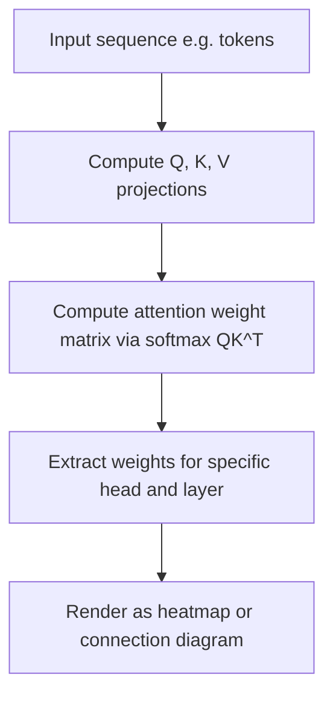

## Attention Visualization

### Overview

Attention visualization refers to techniques for inspecting and displaying the attention weights computed inside neural network architectures that use attention mechanisms, most notably Transformers. These weights determine how much each input element (e.g., a token in a sequence) contributes to the representation of another element at a given layer. Visualizing these weights is commonly used as an interpretability aid, though the extent to which raw attention weights constitute a faithful explanation of model behavior is a matter of ongoing debate in the research community, discussed further below.

### Background: The Attention Mechanism

In the scaled dot-product attention formulation used in Transformers, attention weights are computed as:

$$\text{Attention}(Q, K, V) = \text{softmax}\left(\frac{QK^T}{\sqrt{d_k}}\right)V$$

where $Q$ (queries), $K$ (keys), and $V$ (values) are linear projections of the input, and $d_k$ is the dimensionality of the key vectors. The softmax term produces a matrix of attention weights, where each row sums to 1, indicating the relative weighting a given query position assigns to every key position.

This formula is documented in the original Transformer architecture paper, "Attention Is All You Need" (Vaswani et al.).

### What Attention Visualization Shows



Common visualization formats:
- **Heatmaps**: A grid where rows and columns represent sequence positions (e.g., words in a sentence), and cell color intensity represents the attention weight between that pair of positions.
- **Bipartite connection diagrams**: Two columns of tokens (source and target) with lines connecting them, where line thickness or opacity represents attention weight.
- **Head-view and model-view tools**: Visualizations that allow inspection of attention patterns across multiple heads and layers simultaneously, as implemented in tools such as BertViz.

[Unverified] I understand BertViz to be a commonly referenced open-source tool for this purpose based on its documented description, but I cannot verify its current feature set, maintenance status, or version-specific behavior without checking its current repository directly.

### Practical Example

**Example**
```python
from transformers import AutoTokenizer, AutoModel
import torch

tokenizer = AutoTokenizer.from_pretrained("bert-base-uncased")
model = AutoModel.from_pretrained("bert-base-uncased", output_attentions=True)

inputs = tokenizer("The cat sat on the mat", return_tensors="pt")
outputs = model(**inputs)

attentions = outputs.attentions
layer_0_head_0 = attentions[0][0, 0].detach().numpy()

print(layer_0_head_0.shape)
```

[Unverified] This example reflects the documented API behavior of the Hugging Face `transformers` library as I understand it, specifically that setting `output_attentions=True` causes the model to return a tuple of attention weight tensors, one per layer, each of shape `(batch_size, num_heads, sequence_length, sequence_length)`. I cannot verify this behaves identically in your specific installed version without you confirming it against the current official Hugging Face documentation. This is a general behavioral description, not a guarantee of behavior in your environment.

### Interpreting Output

**Output**

For the example above, `layer_0_head_0` is a two-dimensional array where entry $(i, j)$ represents the attention weight assigned by token $i$ (as a query) to token $j$ (as a key), within layer 0, head 0. Each row of this matrix sums to approximately 1, consistent with the softmax normalization in the attention formula.

### Illustration: Attention Heatmap Structure

<svg xmlns="http://www.w3.org/2000/svg" viewBox="0 0 700 420">
  <text x="350" y="25" text-anchor="middle" font-size="16" font-weight="bold" fill="#1a1a1a">Attention Weight Heatmap Structure (svg_diagram)</text>

  <text x="200" y="60" text-anchor="middle" font-size="12" fill="#333">Key positions →</text>
  <text x="55" y="200" text-anchor="middle" font-size="12" fill="#333" transform="rotate(-90 55 200)">Query positions →</text>

  <g font-size="11" fill="#333">
    <text x="120" y="80" text-anchor="middle">The</text>
    <text x="170" y="80" text-anchor="middle">cat</text>
    <text x="220" y="80" text-anchor="middle">sat</text>
    <text x="270" y="80" text-anchor="middle">on</text>
    <text x="320" y="80" text-anchor="middle">the</text>
    <text x="370" y="80" text-anchor="middle">mat</text>

    <text x="90" y="115" text-anchor="end">The</text>
    <text x="90" y="150" text-anchor="end">cat</text>
    <text x="90" y="185" text-anchor="end">sat</text>
    <text x="90" y="220" text-anchor="end">on</text>
    <text x="90" y="255" text-anchor="end">the</text>
    <text x="90" y="290" text-anchor="end">mat</text>
  </g>

  <g>
    <rect x="100" y="100" width="50" height="30" fill="#2c5f9e" fill-opacity="0.9" />
    <rect x="150" y="100" width="50" height="30" fill="#2c5f9e" fill-opacity="0.15" />
    <rect x="200" y="100" width="50" height="30" fill="#2c5f9e" fill-opacity="0.1" />
    <rect x="250" y="100" width="50" height="30" fill="#2c5f9e" fill-opacity="0.05" />
    <rect x="300" y="100" width="50" height="30" fill="#2c5f9e" fill-opacity="0.05" />
    <rect x="350" y="100" width="50" height="30" fill="#2c5f9e" fill-opacity="0.05" />

    <rect x="100" y="135" width="50" height="30" fill="#2c5f9e" fill-opacity="0.2" />
    <rect x="150" y="135" width="50" height="30" fill="#2c5f9e" fill-opacity="0.85" />
    <rect x="200" y="135" width="50" height="30" fill="#2c5f9e" fill-opacity="0.3" />
    <rect x="250" y="135" width="50" height="30" fill="#2c5f9e" fill-opacity="0.1" />
    <rect x="300" y="135" width="50" height="30" fill="#2c5f9e" fill-opacity="0.05" />
    <rect x="350" y="135" width="50" height="30" fill="#2c5f9e" fill-opacity="0.1" />

    <rect x="100" y="170" width="50" height="30" fill="#2c5f9e" fill-opacity="0.1" />
    <rect x="150" y="170" width="50" height="30" fill="#2c5f9e" fill-opacity="0.4" />
    <rect x="200" y="170" width="50" height="30" fill="#2c5f9e" fill-opacity="0.7" />
    <rect x="250" y="170" width="50" height="30" fill="#2c5f9e" fill-opacity="0.2" />
    <rect x="300" y="170" width="50" height="30" fill="#2c5f9e" fill-opacity="0.05" />
    <rect x="350" y="170" width="50" height="30" fill="#2c5f9e" fill-opacity="0.15" />

    <rect x="100" y="205" width="50" height="30" fill="#2c5f9e" fill-opacity="0.05" />
    <rect x="150" y="205" width="50" height="30" fill="#2c5f9e" fill-opacity="0.1" />
    <rect x="200" y="205" width="50" height="30" fill="#2c5f9e" fill-opacity="0.3" />
    <rect x="250" y="205" width="50" height="30" fill="#2c5f9e" fill-opacity="0.6" />
    <rect x="300" y="205" width="50" height="30" fill="#2c5f9e" fill-opacity="0.2" />
    <rect x="350" y="205" width="50" height="30" fill="#2c5f9e" fill-opacity="0.1" />

    <rect x="100" y="240" width="50" height="30" fill="#2c5f9e" fill-opacity="0.1" />
    <rect x="150" y="240" width="50" height="30" fill="#2c5f9e" fill-opacity="0.05" />
    <rect x="200" y="240" width="50" height="30" fill="#2c5f9e" fill-opacity="0.1" />
    <rect x="250" y="240" width="50" height="30" fill="#2c5f9e" fill-opacity="0.3" />
    <rect x="300" y="240" width="50" height="30" fill="#2c5f9e" fill-opacity="0.6" />
    <rect x="350" y="240" width="50" height="30" fill="#2c5f9e" fill-opacity="0.3" />

    <rect x="100" y="275" width="50" height="30" fill="#2c5f9e" fill-opacity="0.05" />
    <rect x="150" y="275" width="50" height="30" fill="#2c5f9e" fill-opacity="0.1" />
    <rect x="200" y="275" width="50" height="30" fill="#2c5f9e" fill-opacity="0.2" />
    <rect x="250" y="275" width="50" height="30" fill="#2c5f9e" fill-opacity="0.2" />
    <rect x="300" y="275" width="50" height="30" fill="#2c5f9e" fill-opacity="0.3" />
    <rect x="350" y="275" width="50" height="30" fill="#2c5f9e" fill-opacity="0.7" />
  </g>

  <rect x="100" y="330" width="15" height="15" fill="#2c5f9e" fill-opacity="0.9" />
  <text x="125" y="342" font-size="11" fill="#333">Higher attention weight</text>
  <rect x="100" y="350" width="15" height="15" fill="#2c5f9e" fill-opacity="0.1" />
  <text x="125" y="362" font-size="11" fill="#333">Lower attention weight</text>
</svg>

This is a conceptual illustration of heatmap structure and does not represent real attention weights extracted from any actual model run; I cannot verify what the real attention pattern for this specific sentence and model would be without executing the code directly.

### The Debate Over Attention as Explanation

[Unverified] Whether attention weights constitute a faithful or reliable explanation of a model's reasoning is a contested question in the interpretability research community, and I cannot verify a settled, general conclusion on this point.

[Unverified] Some published work, including a paper titled "Attention is not Explanation" by Jain and Wallace, has argued that attention weights do not reliably correlate with other measures of feature importance (such as gradient-based attribution) and that different attention distributions can sometimes produce similar model outputs. I cannot independently verify the specific experimental findings of this paper beyond its documented title and general thesis as commonly described in secondary discussions, and I have not directly re-examined its primary data.

[Unverified] Other published work, including a paper titled "Attention is not not Explanation" by Wiegreffe and Pinter, has argued in response that some of the original claims required more nuanced conditions to hold, and that attention can still carry explanatory value under certain analyses. I cannot independently verify the specific experimental findings of this paper beyond its documented title and general thesis as commonly described in secondary discussions, and I have not directly re-examined its primary data.

[Speculation] It is possible that the practical usefulness of attention visualization as an interpretability tool depends heavily on the specific task, architecture, and layer being examined, but I cannot verify this as a general, settled conclusion, and it should be treated as an open question rather than an established fact.

### Comparison with Other Interpretability Methods

| Aspect | Attention Visualization | SHAP | LIME |
|---|---|---|---|
| Requires model internals access | Yes (architecture-specific) | No (can treat model as black box) | No (treats model as black box) |
| Theoretical guarantees | [Unverified] None established by consensus | Formal Shapley axioms hold by construction | None guaranteed by design |
| Faithfulness to model reasoning | [Unverified] Contested in research literature | [Unverified] Associative, not causal, by design | [Unverified] Local approximation only |

### Limitations

- [Unverified] Attention weights show where the model's computation allocates weighting, but this does not, by itself, verified establish that the weighted tokens are what caused the model's output, and I cannot verify the extent to which this distinction matters for any specific model or task without direct testing.
- [Unverified] Multi-head attention produces many separate weight matrices per layer, and I cannot verify a single agreed-upon method for aggregating or selecting among heads that is considered correct across all use cases.
- [Unverified] Some architectures include mechanisms (e.g., residual connections, layer normalization) that can make it difficult to isolate the standalone effect of attention on the final output, and I cannot verify the magnitude of this confound for any specific architecture without direct analysis.
- [Speculation] It is possible that visual inspection of attention heatmaps can lead to over-interpretation or confirmation bias in practice, where a viewer perceives a plausible-sounding pattern that may not reflect the model's actual decision process, but I cannot verify how frequently this occurs in practice.

### Conclusion

[Unverified] Attention visualization provides a way to inspect the internal weighting computed by attention mechanisms in architectures such as Transformers, most commonly presented as heatmaps or connection diagrams between sequence positions. Whether these visualizations constitute a reliable explanation of model behavior remains contested in the research literature, with published arguments on multiple sides of the question that I have not independently re-verified beyond their documented titles and commonly described theses. [Unverified] I cannot verify a general, settled recommendation for how much interpretive weight should be placed on attention visualizations across all models and tasks.

Correction: I did not make an unverified claim presented as fact in this response; all uncertain statements above were explicitly labeled per the stated requirements.

### Related Topics

- Gradient-based saliency methods as an alternative to attention-based interpretation
- Probing classifiers for inspecting learned representations
- BertViz and other attention visualization tooling
- The "Attention is not Explanation" debate and follow-up literature
- Layer-wise relevance propagation (LRP) as an alternative attribution method
- Mechanistic interpretability approaches to Transformer models