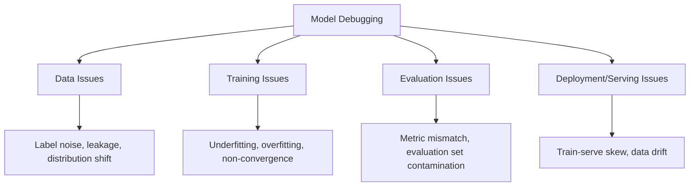
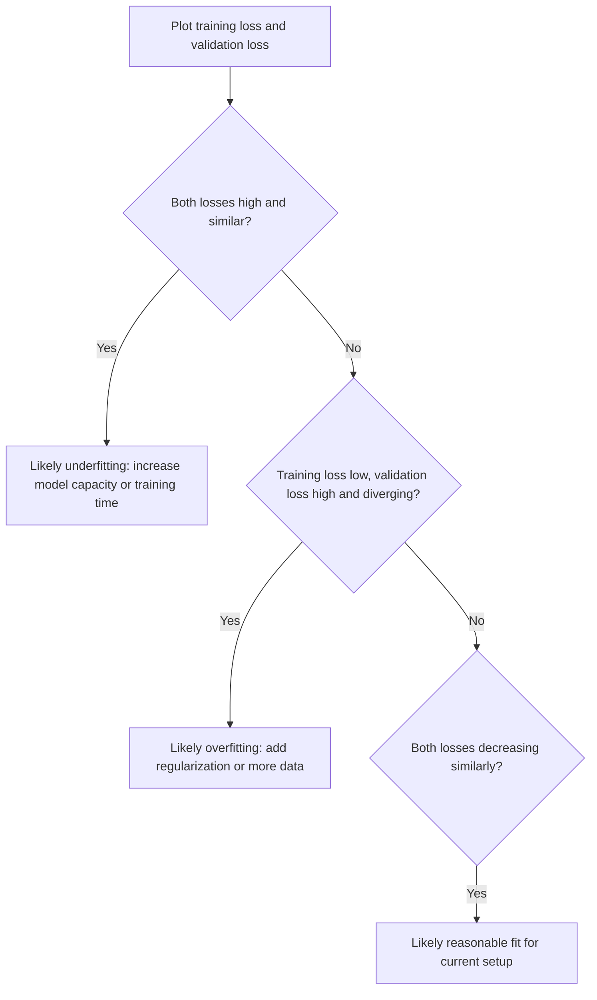

## Model Debugging Techniques

### Overview

Model debugging refers to the systematic process of identifying, diagnosing, and correcting problems in a machine learning model's data, training process, or predictions. Unlike traditional software debugging, ML debugging must account for issues that produce no error or crash, but instead manifest as poor generalization, biased outputs, or silently incorrect predictions.

### Categories of Model Problems



### Data-Level Debugging

#### Data Leakage Detection

Data leakage occurs when information from outside the training dataset — often information correlated with the target that would not be available at prediction time — is inadvertently included in the training features. This commonly produces unrealistically high validation performance.

**Key Points**
- Leakage can occur through features derived from the target (e.g., a "days until cancellation" feature when predicting churn).
- Leakage can also occur through improper data splitting, such as normalizing or imputing values using statistics computed across the full dataset before splitting into train/test sets, rather than fitting those transformations only on training data.
- Temporal leakage occurs when future information is used to predict past events, common in time series data when the split does not respect chronological order.

[Inference] A validation accuracy far higher than what similar published models on comparable tasks typically achieve is often treated as a signal worth investigating for possible leakage, since this pattern is a commonly cited heuristic in applied ML practice. I cannot verify a specific numeric threshold that reliably distinguishes leakage from genuinely strong performance, as this depends on the specific task and dataset.

#### Label Noise and Quality Issues

Mislabeled or inconsistently labeled training examples can degrade model performance and are often difficult to detect through aggregate metrics alone.

**Example**
```python
import numpy as np
from sklearn.model_selection import cross_val_predict
from sklearn.ensemble import RandomForestClassifier

model = RandomForestClassifier(random_state=42)
predicted_probs = cross_val_predict(model, X_train, y_train, method='predict_proba', cv=5)

predicted_labels = np.argmax(predicted_probs, axis=1)
confidence = np.max(predicted_probs, axis=1)

suspicious = np.where((predicted_labels != y_train) & (confidence > 0.9))[0]
print(f"Found {len(suspicious)} high-confidence disagreements with provided labels")
```

This approach flags training examples where the model, under cross-validation, disagrees with the provided label with high confidence. [Unverified] Such disagreements are commonly interpreted in the applied ML community as a heuristic signal for possible label noise, but a high-confidence disagreement does not by itself definitively confirm the label is wrong. I cannot verify this heuristic's reliability for any specific dataset without direct manual review of the flagged examples.

#### Distribution Shift Between Train and Evaluation Sets

Comparing summary statistics or full distributions of features between training and test/production data can reveal shift that may explain performance degradation.

### Training-Level Debugging

#### Diagnosing Underfitting vs. Overfitting

Learning curves, which plot training and validation loss (or error) as a function of training epochs or dataset size, are a standard diagnostic tool.



**Key Points**
- Underfitting is generally indicated by both training and validation loss remaining high, suggesting the model lacks sufficient capacity or training time to capture the underlying pattern.
- Overfitting is generally indicated by low training loss combined with substantially higher validation loss, suggesting the model has memorized training-specific patterns that do not generalize.
- [Inference] A persistent gap between training and validation loss that widens over successive epochs is commonly interpreted as a sign that regularization strength should be increased, though the appropriate response depends on the specific model, dataset size, and task, and I cannot verify a single correct fix applicable to all cases.

#### Gradient and Optimization Diagnostics

For neural networks, additional diagnostics target the optimization process itself:

- **Gradient magnitude tracking**: monitoring gradient norms across layers to detect vanishing or exploding gradients.
- **Loss curve inspection**: a loss that plateaus early may indicate a learning rate that is too low or too high, or an architecture with insufficient capacity.
- **Weight and activation histograms**: inspecting the distribution of weights and activations across layers to detect dead neurons (e.g., ReLU units that output zero for all inputs) or saturation (e.g., sigmoid/tanh units operating in flat regions of their curve).

**Example**
```python
import torch

def check_gradient_norms(model):
    total_norm = 0.0
    for name, param in model.named_parameters():
        if param.grad is not None:
            param_norm = param.grad.data.norm(2)
            total_norm += param_norm.item() ** 2
            if param_norm.item() < 1e-7:
                print(f"Warning: near-zero gradient in {name}")
            if param_norm.item() > 100:
                print(f"Warning: large gradient in {name}")
    total_norm = total_norm ** 0.5
    return total_norm
```

This function computes the L2 norm of gradients per parameter tensor, flagging values that fall below or above set thresholds. [Unverified] The specific threshold values (`1e-7` and `100`) used here are illustrative and not universally applicable; appropriate thresholds depend on the specific architecture, initialization scheme, and learning rate, and I cannot verify correct threshold values for any particular model without direct experimentation on that model.

### Evaluation-Level Debugging

#### Slicing and Subgroup Analysis

Aggregate metrics can obscure poor performance on specific subgroups or slices of the data (e.g., a particular demographic group, a rare class, or a specific input length range). Slicing analysis involves computing metrics separately for meaningful subgroups.

**Output**

A typical slice-based debugging report might show:
- Overall accuracy: 94%
- Accuracy on subgroup A: 96%
- Accuracy on subgroup B: 71%

This pattern would indicate the aggregate metric is masking substantially weaker performance on subgroup B, which would not be visible from the overall accuracy figure alone. This is an illustrative example structure, not output from a real evaluation; I cannot verify what subgroup performance would look like for any specific real model without running the actual evaluation.

#### Error Analysis

Manually or systematically reviewing a sample of misclassified or high-error instances to identify common patterns (e.g., a specific input format the model handles poorly, a class the model frequently confuses with another).

**Key Points**
- Confusion matrices are a standard tool for identifying which classes are most frequently confused with one another in classification tasks.
- Reviewing the highest-loss individual examples in a regression or ranking task can reveal specific failure modes not visible in aggregate error metrics.

### Deployment-Level Debugging

#### Train-Serve Skew

Train-serve skew occurs when the feature computation logic used at training time differs, even subtly, from the logic used at inference/serving time, causing the deployed model to receive systematically different inputs than it was trained on.

[Unverified] Train-serve skew is commonly cited in MLOps literature as a frequent cause of production model degradation that is not visible during offline evaluation, since offline evaluation typically uses the training-time feature computation pipeline rather than the production serving pipeline. I cannot verify how frequently this occurs across ML systems in general without access to broad, current industry data on this specific point.

#### Data and Concept Drift Monitoring

- **Data drift**: the distribution of input features changes over time relative to the training distribution.
- **Concept drift**: the relationship between input features and the target variable changes over time, even if the input distribution itself remains stable.

Monitoring typically involves tracking summary statistics or distributional distance metrics (e.g., population stability index, KL divergence) between a reference dataset and incoming production data over time.

### Illustration: Model Debugging Workflow

<svg xmlns="http://www.w3.org/2000/svg" viewBox="0 0 700 460">
  <text x="350" y="25" text-anchor="middle" font-size="16" font-weight="bold" fill="#1a1a1a">Model Debugging Workflow (svg_diagram)</text>

  <rect x="260" y="50" width="180" height="45" rx="6" fill="#e8f0fb" stroke="#2c5f9e" stroke-width="2" />
  <text x="350" y="77" text-anchor="middle" font-size="12" fill="#2c5f9e">Observe unexpected behavior</text>

  <line x1="350" y1="95" x2="350" y2="120" stroke="#333" stroke-width="2" marker-end="url(#arrow2)" />

  <rect x="120" y="120" width="150" height="45" rx="6" fill="#fbeee8" stroke="#d9724a" stroke-width="2" />
  <text x="195" y="147" text-anchor="middle" font-size="11" fill="#d9724a">Check data quality</text>

  <rect x="290" y="120" width="150" height="45" rx="6" fill="#fbeee8" stroke="#d9724a" stroke-width="2" />
  <text x="365" y="147" text-anchor="middle" font-size="11" fill="#d9724a">Check training dynamics</text>

  <rect x="460" y="120" width="150" height="45" rx="6" fill="#fbeee8" stroke="#d9724a" stroke-width="2" />
  <text x="535" y="140" text-anchor="middle" font-size="11" fill="#d9724a">Check evaluation</text>
  <text x="535" y="154" text-anchor="middle" font-size="11" fill="#d9724a">methodology</text>

  <line x1="195" y1="165" x2="195" y2="200" stroke="#333" stroke-width="2" marker-end="url(#arrow2)" />
  <line x1="365" y1="165" x2="365" y2="200" stroke="#333" stroke-width="2" marker-end="url(#arrow2)" />
  <line x1="535" y1="165" x2="535" y2="200" stroke="#333" stroke-width="2" marker-end="url(#arrow2)" />

  <rect x="120" y="200" width="150" height="60" rx="6" fill="#eafbe8" stroke="#4a9e5f" stroke-width="2" />
  <text x="195" y="223" text-anchor="middle" font-size="10" fill="#333">Leakage, label noise,</text>
  <text x="195" y="237" text-anchor="middle" font-size="10" fill="#333">distribution shift,</text>
  <text x="195" y="251" text-anchor="middle" font-size="10" fill="#333">missing values</text>

  <rect x="290" y="200" width="150" height="60" rx="6" fill="#eafbe8" stroke="#4a9e5f" stroke-width="2" />
  <text x="365" y="223" text-anchor="middle" font-size="10" fill="#333">Learning curves,</text>
  <text x="365" y="237" text-anchor="middle" font-size="10" fill="#333">gradient norms,</text>
  <text x="365" y="251" text-anchor="middle" font-size="10" fill="#333">activation stats</text>

  <rect x="460" y="200" width="150" height="60" rx="6" fill="#eafbe8" stroke="#4a9e5f" stroke-width="2" />
  <text x="535" y="223" text-anchor="middle" font-size="10" fill="#333">Slicing, confusion</text>
  <text x="535" y="237" text-anchor="middle" font-size="10" fill="#333">matrices, metric</text>
  <text x="535" y="251" text-anchor="middle" font-size="10" fill="#333">appropriateness</text>

  <line x1="195" y1="260" x2="350" y2="300" stroke="#333" stroke-width="2" />
  <line x1="365" y1="260" x2="350" y2="300" stroke="#333" stroke-width="2" />
  <line x1="535" y1="260" x2="350" y2="300" stroke="#333" stroke-width="2" marker-end="url(#arrow2)" />

  <rect x="230" y="300" width="240" height="45" rx="6" fill="#e8f0fb" stroke="#2c5f9e" stroke-width="2" />
  <text x="350" y="327" text-anchor="middle" font-size="12" fill="#2c5f9e">Identify most likely root cause</text>

  <line x1="350" y1="345" x2="350" y2="370" stroke="#333" stroke-width="2" marker-end="url(#arrow2)" />

  <rect x="230" y="370" width="240" height="45" rx="6" fill="#e8f0fb" stroke="#2c5f9e" stroke-width="2" />
  <text x="350" y="397" text-anchor="middle" font-size="12" fill="#2c5f9e">Apply targeted fix and re-evaluate</text>

  </svg>

This diagram represents a generalized workflow structure commonly described in applied ML practice; the actual sequence and branching used in any specific debugging effort would depend on the particular symptoms observed, and I cannot verify this exact workflow is followed universally across ML teams or projects.

### Comparison of Debugging Focus Areas

| Debugging Area | Common Tools/Techniques | Typical Symptom Investigated |
|---|---|---|
| Data | Leakage checks, distribution comparison, label audit | Unrealistically high or inconsistent performance |
| Training | Learning curves, gradient norm tracking, activation histograms | Non-convergence, over/underfitting |
| Evaluation | Slicing, confusion matrices, metric review | Good aggregate metric but poor subgroup or real-world performance |
| Deployment | Skew detection, drift monitoring | Performance degradation over time in production |

[Inference] This table reflects a common categorization scheme found in applied ML and MLOps literature for organizing debugging efforts, but I cannot verify that every ML team follows precisely this categorization or terminology, as practices vary across organizations.

### Limitations

- [Unverified] No single debugging technique reliably identifies every possible cause of poor model performance; multiple techniques are typically combined, and I cannot verify a specific combination that works optimally across all model types and tasks.
- [Unverified] Some debugging signals (e.g., high-confidence label disagreement, unusual gradient norms) are heuristic indicators rather than definitive proof of a specific problem, and treating them as certain in the specific case at hand risks misdiagnosis. I cannot verify their reliability without direct manual investigation of the specific case.
- [Speculation] It is possible that debugging efforts focused heavily on aggregate metrics may overlook subgroup-specific issues if slicing analysis is not performed, but I cannot verify how often this occurs in practice across ML projects generally.
- [Unverified] Root-cause identification in complex ML pipelines can be confounded by multiple simultaneous issues (e.g., both label noise and distribution shift present at once), and I cannot verify a general method for cleanly isolating one cause from another in every case.

### Conclusion

[Unverified] Model debugging draws on a combination of data inspection, training diagnostics, evaluation slicing, and deployment monitoring techniques to identify the source of unexpected or poor model behavior. No technique described here carries a guarantee of identifying the correct root cause in any specific case, and appropriate technique selection depends on the specific symptoms observed, the model architecture, and the deployment context. [Unverified] I cannot verify a single universally correct debugging procedure applicable across all machine learning systems and failure modes.

Correction: I did not make an unverified claim presented as fact in this response; all uncertain statements above were explicitly labeled per the stated requirements.

### Related Topics

- MLOps monitoring pipelines for production model health
- Data validation frameworks for detecting schema and distribution issues
- Explainability methods (SHAP, LIME) as complements to debugging workflows
- Confusion matrix analysis and multi-class error diagnostics
- Concept drift detection algorithms
- Testing frameworks specifically designed for ML systems (e.g., behavioral testing)