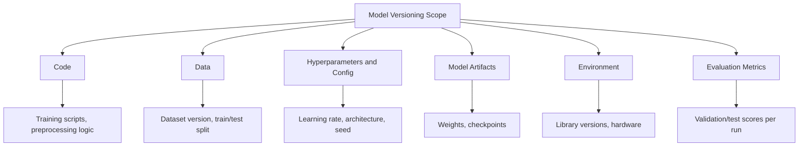
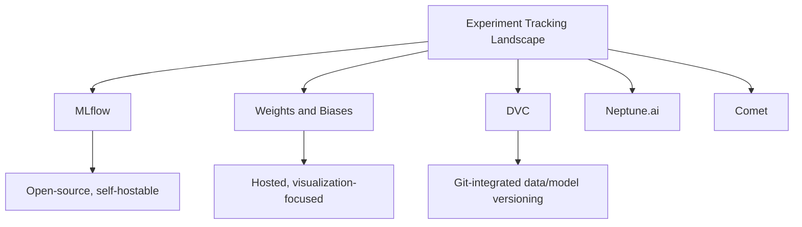
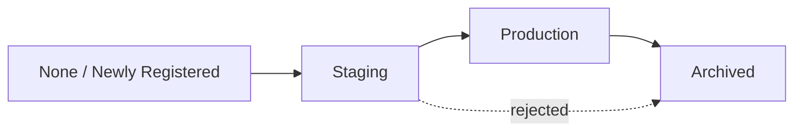

## Model Versioning and Tracking

### Overview

Model versioning and tracking refers to the practices and tools used to record, organize, and reproduce the artifacts, code, data, and configurations associated with each iteration of a machine learning model throughout its development lifecycle. This includes tracking model weights, training code, hyperparameters, dataset versions, evaluation metrics, and environment dependencies.

### Why Versioning Matters

**Key Points**
- Machine learning workflows involve more moving parts than typical software: code, data, hyperparameters, and random seeds can all independently change between runs, and any of these can affect results.
- Without systematic tracking, reproducing a previously trained model's exact results can become difficult or impossible.
- Versioning supports rollback to a previous model if a newly deployed model underperforms or introduces regressions in production.
- Versioning supports auditability, which may be required in regulated industries to demonstrate which model version made a particular prediction at a particular time.

### What Needs to Be Tracked



#### Code Versioning

Standard source control tools (e.g., Git) track changes to training scripts, preprocessing pipelines, and model architecture definitions. This is generally treated as the baseline layer of ML versioning, analogous to standard software version control.

#### Data Versioning

Because model behavior depends heavily on the specific dataset used for training, tracking which exact version of a dataset was used for a given run is necessary for reproducibility. Tools such as DVC (Data Version Control) extend Git-like versioning concepts to large data files, which are not well-suited to storage directly in a Git repository.

[Unverified] I understand DVC to be a commonly referenced open-source tool for this purpose based on its documented description, but I cannot verify its current feature set, pricing model, or maintenance status without checking its current repository or documentation directly. This is not a guarantee that its current behavior matches this description.

#### Hyperparameter and Configuration Tracking

Recording the exact hyperparameters (learning rate, batch size, regularization strength, architecture choices, random seed) used for each training run allows a specific result to be traced back to its exact configuration.

**Example**
```python
import mlflow

mlflow.set_experiment("customer_churn_model")

with mlflow.start_run():
    mlflow.log_param("learning_rate", 0.001)
    mlflow.log_param("batch_size", 32)
    mlflow.log_param("model_architecture", "gradient_boosting")

    model = train_model(learning_rate=0.001, batch_size=32)

    val_accuracy = evaluate_model(model, X_val, y_val)
    mlflow.log_metric("val_accuracy", val_accuracy)

    mlflow.sklearn.log_model(model, "model")
```

[Unverified] This example reflects the documented API behavior of the MLflow library as I understand it from training data — specifically that `log_param` and `log_metric` record values against the active run, and `log_model` serializes and stores the trained model artifact. I cannot verify this behaves identically in your specific installed version without you confirming it against the current official MLflow documentation. This is a general behavioral description, not a guarantee of behavior in your environment.

#### Model Artifact Versioning

The trained model itself (weights, checkpoints) must be stored in a way that associates it with the exact code, data, and configuration that produced it. This is often implemented via a **model registry**, which assigns a version number or identifier to each trained model artifact and can track its lifecycle stage (e.g., staging, production, archived).

#### Environment Versioning

Library versions, hardware (e.g., GPU type), and system-level dependencies can all affect numerical results, particularly in deep learning where floating-point operations and hardware-specific optimizations may introduce small differences between runs. Tools such as Docker containers or dependency-lock files (e.g., `requirements.txt` with pinned versions, `conda` environment files) are commonly used to capture this layer.

[Unverified] I cannot verify the exact degree of numerical variation that specific hardware or library version differences would introduce for any particular model or framework without direct testing on that specific setup.

### Experiment Tracking Tools



[Unverified] I do not have access to confirmed, current information about the relative market adoption, pricing, or feature parity among these tools, as this space evolves frequently and any such comparison would need to be checked against each tool's current documentation and independent, current reviews.

### A Typical Tracked Training Run

**Output**

A logged experiment run in a tracking system typically records an entry similar to:

| Field | Example Value |
|---|---|
| Run ID | a1b2c3d4 |
| Git commit hash | 7f3e9c1 |
| Dataset version | v3.2 (DVC hash: 9f8a...) |
| Learning rate | 0.001 |
| Batch size | 32 |
| Validation accuracy | 0.912 |
| Model artifact path | s3://models/churn/v14/model.pkl |
| Timestamp | 2026-03-14T10:22:00Z |

This is an illustrative example structure representing the type of fields commonly tracked, not output copied from any real system or run; I cannot verify what a specific real tracked run would contain without inspecting an actual tracking system directly.

### Model Registry Lifecycle Stages

A model registry commonly organizes model versions into stages representing their position in the deployment lifecycle:



**Key Points**
- **Staging**: a model version undergoing validation or testing before being considered for production use.
- **Production**: the model version currently serving live predictions.
- **Archived**: a previous model version retained for reference, audit, or rollback purposes, no longer actively serving predictions.

[Unverified] The exact names and number of lifecycle stages vary between specific tools and organizational conventions; the three-stage structure shown here is a commonly described general pattern, not a universal standard followed identically by every registry implementation. I cannot verify this matches the specific configuration of any particular tool without checking its current documentation.

### Illustration: Versioning Across the ML Lifecycle

<svg xmlns="http://www.w3.org/2000/svg" viewBox="0 0 700 320">
  <text x="350" y="25" text-anchor="middle" font-size="16" font-weight="bold" fill="#1a1a1a">Versioned Artifacts Across the ML Lifecycle (svg_diagram)</text>

  <line x1="60" y1="160" x2="640" y2="160" stroke="#333" stroke-width="2" />

  <circle cx="100" cy="160" r="8" fill="#2c5f9e" />
  <text x="100" y="190" text-anchor="middle" font-size="11" fill="#333">Data</text>
  <text x="100" y="205" text-anchor="middle" font-size="10" fill="#666">(versioned)</text>

  <circle cx="250" cy="160" r="8" fill="#2c5f9e" />
  <text x="250" y="190" text-anchor="middle" font-size="11" fill="#333">Code</text>
  <text x="250" y="205" text-anchor="middle" font-size="10" fill="#666">(versioned)</text>

  <circle cx="400" cy="160" r="8" fill="#2c5f9e" />
  <text x="400" y="190" text-anchor="middle" font-size="11" fill="#333">Training Run</text>
  <text x="400" y="205" text-anchor="middle" font-size="10" fill="#666">(logged)</text>

  <circle cx="550" cy="160" r="8" fill="#2c5f9e" />
  <text x="550" y="190" text-anchor="middle" font-size="11" fill="#333">Model Artifact</text>
  <text x="550" y="205" text-anchor="middle" font-size="10" fill="#666">(registered)</text>

  <rect x="70" y="100" width="60" height="35" rx="4" fill="#e8f0fb" stroke="#2c5f9e" />
  <text x="100" y="122" text-anchor="middle" font-size="10" fill="#333">v3.2</text>

  <rect x="220" y="100" width="60" height="35" rx="4" fill="#e8f0fb" stroke="#2c5f9e" />
  <text x="250" y="122" text-anchor="middle" font-size="10" fill="#333">7f3e9c1</text>

  <rect x="370" y="100" width="60" height="35" rx="4" fill="#e8f0fb" stroke="#2c5f9e" />
  <text x="400" y="122" text-anchor="middle" font-size="10" fill="#333">a1b2c3d4</text>

  <rect x="520" y="100" width="60" height="35" rx="4" fill="#e8f0fb" stroke="#2c5f9e" />
  <text x="550" y="122" text-anchor="middle" font-size="10" fill="#333">v14</text>

  <text x="350" y="260" text-anchor="middle" font-size="11" fill="#666">All four identifiers together allow full reconstruction of a specific model version</text>
</svg>

This is a conceptual illustration of how identifiers link across lifecycle stages, not output from any specific real tracking system; I cannot verify how any particular tool visually represents this relationship without inspecting that tool directly.

### Reproducibility Considerations

[Unverified] Even with complete tracking of code, data, hyperparameters, and environment, some ML training processes may still produce slightly different results between runs due to non-deterministic operations (e.g., certain GPU operations, parallel data loading order) unless additional deterministic settings are explicitly configured. I cannot verify the exact sources or magnitude of such non-determinism for any specific framework or hardware setup without direct testing on that setup, and I am not able to state that any specific configuration will produce identical results, only that documented settings exist in some frameworks intended to reduce such variation.

### Comparison Table

| Aspect | Git (code only) | MLflow / Comet / Neptune | DVC |
|---|---|---|---|
| Primary focus | Source code history | Experiment metrics, params, model registry | Data and model file versioning |
| Handles large binary files | [Unverified] Generally not well-suited without extensions | [Unverified] Varies by tool and storage backend configured | Designed for this purpose |
| Model registry / staging support | No | [Unverified] Commonly included, varies by tool and tier | [Unverified] Not the primary focus, varies by integration |

### Limitations

- [Unverified] No single tool comprehensively covers all aspects of versioning (code, data, hyperparameters, artifacts, environment) without being combined with other tools, and I cannot verify a single all-in-one solution that is considered universally sufficient across organizations.
- [Unverified] Tracking systems record what is explicitly logged; if a relevant hyperparameter, data transformation, or environment detail is not logged, reproducibility can still fail even with a tracking system in place. I cannot verify how often this gap occurs in practice across ML teams generally.
- [Speculation] It is possible that inconsistent adoption of tracking practices across team members within the same organization could reduce the practical benefit of these tools, but I cannot verify how frequently this occurs in practice.
- [Unverified] Long-term storage costs and retention policies for large model artifacts and dataset versions are organization-specific considerations, and I cannot verify general cost figures without information about a specific storage setup.

### Conclusion

[Unverified] Model versioning and tracking practices aim to make ML training runs reproducible and auditable by systematically recording code, data, hyperparameters, model artifacts, and environment details, commonly supported by tools such as MLflow, DVC, and various hosted experiment tracking platforms. [Unverified] I cannot verify that any specific combination of tools or practices guarantees full reproducibility in all cases, as unlogged details or non-deterministic operations can still introduce discrepancies even under a disciplined tracking regime.

Correction: I did not make an unverified claim presented as fact in this response; all uncertain statements above were explicitly labeled per the stated requirements.

### Related Topics

- Model registries and deployment promotion workflows
- Data version control (DVC) in depth
- Reproducibility challenges from non-deterministic GPU operations
- CI/CD pipelines adapted for machine learning (MLOps)
- Feature stores as a complement to data versioning
- Model rollback strategies in production systems