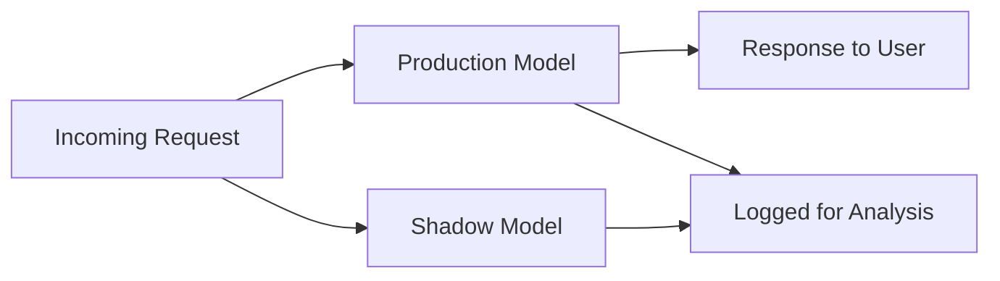
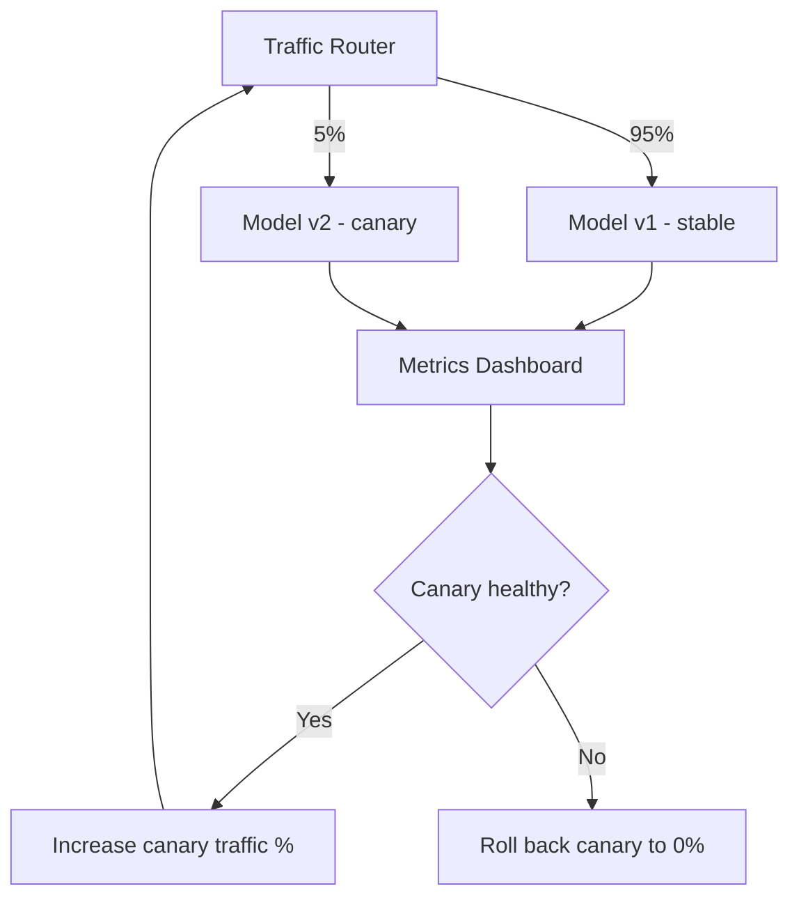

## Model Deployment Strategies

### What Deployment Strategy Addresses

Getting a trained model into production is not a single event — it's a transition that carries risk: the model might underperform on live traffic in ways offline evaluation didn't catch, infrastructure might not handle production load, or a regression might only surface after real users are affected. Deployment strategies are patterns for managing that risk while shipping updates.

**Key Points**

- The central tension is velocity vs. safety: shipping fast enables iteration, but insufficiently guarded rollouts risk user-facing failures
- Most strategies work by controlling *how much traffic* a new model version sees and *how quickly* that exposure grows
- Deployment strategy is distinct from serving infrastructure (how a model responds to requests) — strategy governs the rollout process, serving governs the runtime

### Deployment Patterns

#### Shadow Deployment (Shadow Mode)

The new model runs alongside the current production model, receiving a copy of live traffic, but its predictions are logged rather than served to users. This allows comparison of the new model's behavior against production traffic without any user-facing risk.

- **Strength**: zero user-facing risk; real traffic patterns instead of synthetic test data
- **Limitation**: doubles inference compute cost; cannot evaluate metrics that depend on user reaction (e.g., click-through) since shadow predictions are never actually shown

#### Canary Deployment

A small percentage of traffic (e.g., 1–5%) is routed to the new model version while the majority continues to the current version. If metrics on the canary slice remain healthy over a monitoring window, traffic is gradually increased until the new version handles 100%.

- **Strength**: limits blast radius of a bad model; issues are caught on a small fraction of users
- **Limitation**: requires infrastructure capable of traffic splitting and requires well-defined health metrics with alerting thresholds

#### Blue-Green Deployment

Two complete, identical production environments exist: "blue" (current) and "green" (new). Traffic is switched from blue to green all at once (or the reverse, on rollback), rather than gradually.

- **Strength**: instant rollback — simply switch the router back to blue; no gradual-exposure complexity
- **Limitation**: requires running two full production environments simultaneously, which doubles infrastructure cost during the transition; does not catch issues that only manifest gradually or at scale (a canary's gradual ramp can surface load-dependent bugs that an instant cutover won't)

#### A/B Testing (Champion/Challenger)

Traffic is split between two (or more) model versions, typically for a longer duration than a canary, with the explicit goal of statistically comparing business or model-quality metrics — not just checking for regressions, but determining which model is genuinely better.

- **Strength**: produces statistically grounded evidence for which model to keep, not just "did it break"
- **Limitation**: requires sufficient traffic volume for statistical power; requires care in experiment design (randomization unit, guardrail metrics, duration) to avoid invalid conclusions

$$n \approx \frac{2\left(z_{\alpha/2} + z_{\beta}\right)^2 \sigma^2}{\delta^2}$$

[Unverified] The specific sample-size formula and required assumptions (variance homogeneity, independence of observations) depend on the metric type and experiment design; this is illustrative of the general relationship between effect size, variance, and required sample size rather than a plug-and-play formula for every metric.

#### Rolling Deployment

Instances running the old model version are replaced incrementally with instances running the new version, one batch at a time, until all instances are updated. Common in container-orchestrated environments (e.g., Kubernetes rolling updates).

- **Strength**: no need to double total infrastructure (unlike blue-green); built into many orchestration platforms by default
- **Limitation**: rollback is not instant — reverting means rolling forward again with the old version; brief windows exist where both versions serve traffic simultaneously, which requires both versions to be compatible with the same input/output contract

#### Feature Flag–Gated Deployment

The new model is deployed to production infrastructure but access is controlled by a feature flag, allowing enablement per user segment, percentage rollout, or instant kill-switch — independent of the code/infrastructure deployment itself.

- **Strength**: decouples deployment (getting code running) from release (exposing it to users); enables targeting specific user segments (e.g., internal users first, then a geographic region)
- **Limitation**: adds a dependency on a feature-flagging system and requires the serving code to support runtime branching between model versions

### Comparison Table

| Strategy | Rollback Speed | Infra Cost | Primary Use Case |
| --- | --- | --- | --- |
| Shadow | N/A (never live) | High (2x compute) | Pre-launch validation |
| Canary | Fast (reduce %) | Moderate | Gradual, monitored rollout |
| Blue-Green | Instant | High (2x environments) | Fast, safe full cutover |
| A/B Test | Fast (stop test) | Moderate | Statistical model comparison |
| Rolling | Slow (redeploy) | Low | Standard incremental update |
| Feature Flag | Instant | Low–Moderate | Segment targeting, kill-switch |

### Monitoring During Rollout

Every strategy above depends on having the right signals to decide whether to proceed, pause, or roll back.

#### Guardrail Metrics

Metrics that, if they degrade beyond a threshold, trigger an automatic or manual rollback — regardless of whether the primary metric being optimized looks good. Examples: latency percentiles (p95/p99), error rate, memory usage.

#### Model Quality Metrics

Prediction-level signals: accuracy, calibration, distributional statistics of outputs. These often require ground-truth labels that may only arrive after a delay (e.g., did the user actually convert), which is a key difference from guardrail metrics that are available immediately.

#### Business Metrics

Downstream outcomes the model is meant to influence: revenue, conversion rate, user engagement. These carry the highest signal for real-world impact but the longest measurement latency and the most confounding factors.

<svg xmlns="http://www.w3.org/2000/svg" viewBox="0 0 850 320">
\<style\>
.box { fill: #f5f5f5; stroke: #333; stroke-width: 1.5; }
.accent { fill: #e8eef7; stroke: #2c5aa0; stroke-width: 1.5; }
.warn { fill: #fbe9e7; stroke: #b71c1c; stroke-width: 1.5; }
.label { font-family: sans-serif; font-size: 13px; fill: #222; }
.title { font-family: sans-serif; font-size: 14px; font-weight: bold; fill: #111; }
.arrow { stroke: #444; stroke-width: 1.5; marker-end: url(#arrowhead2); fill: none; }
\</style\>
<text x="230" y="24" class="title">Rollout Decision Loop (svg_diagram)</text>
<rect x="30" y="60" width="170" height="60" class="accent" rx="4" />
<text x="45" y="85" class="label">Deploy to</text>
<text x="45" y="103" class="label">small traffic slice</text>
<rect x="260" y="60" width="170" height="60" class="box" rx="4" />
<text x="275" y="85" class="label">Collect guardrail</text>
<text x="275" y="103" class="label">+ quality metrics</text>
<rect x="490" y="60" width="140" height="60" class="box" rx="4" />
<text x="505" y="85" class="label">Compare vs.</text>
<text x="505" y="103" class="label">baseline / SLA</text>
<rect x="670" y="20" width="150" height="55" class="accent" rx="4" />
<text x="685" y="42" class="label">Increase traffic</text>
<text x="685" y="60" class="label">percentage</text>
<rect x="670" y="100" width="150" height="55" class="warn" rx="4" />
<text x="685" y="122" class="label">Roll back /</text>
<text x="685" y="140" class="label">halt rollout</text>
<path d="M200,90 L260,90" class="arrow" />
<path d="M430,90 L490,90" class="arrow" />
<path d="M630,80 L670,55" class="arrow" />
<path d="M630,100 L670,120" class="arrow" />
<path d="M745,20 L745,-5" class="arrow" stroke-dasharray="0" />
</svg>

### Rollback Mechanisms

- **Traffic-based rollback**: reduce the new version's traffic share to zero (canary, feature flag)
- **Version-based rollback**: redeploy the previous container image/artifact (rolling, blue-green)
- **Automated rollback triggers**: guardrail metric breaches automatically halt or reverse a rollout without waiting for human intervention — commonly implemented via monitoring system alerts wired into the deployment pipeline
- [Inference] Automated rollback is generally considered a best practice for high-traffic, latency-sensitive systems, since human response time can be slower than the damage window during a bad rollout, though the specific automation thresholds are context-dependent and not universally standardized

### Interaction With Model Serving Architecture

Deployment strategy choice interacts with how models are actually served:

- **Multi-model serving** (e.g., multiple model versions loaded in the same serving process) simplifies canary/A-B splitting since routing happens at the request layer
- **Single-model-per-instance serving** aligns naturally with rolling or blue-green strategies, where whole instances are swapped
- Stateless model servers make all these strategies easier; stateful serving (e.g., models with online-updated state) complicates rollback since state may not be trivially reversible

### Common Pitfalls

- Treating deployment as a single "flip the switch" event rather than a monitored process with defined success/failure criteria set before rollout begins
- Using canary traffic percentages too small to reach statistical significance on the metric that actually matters, leading to false confidence
- Ignoring skew between offline evaluation data and live traffic distribution — a model can pass all offline tests and still fail in production due to data drift
- Failing to define rollback criteria and ownership in advance, causing rollout decisions to be made reactively under pressure
- Not accounting for stateful side effects (e.g., writes to a database, cached predictions) that a rollback cannot cleanly undo

**Related Topics**

- Model serving architectures (batch vs. real-time/online inference)
- Data and concept drift detection in production
- Model monitoring and observability (logging, alerting, dashboards)
- Feature stores and online/offline feature parity
- CI/CD pipelines for machine learning (Continuous Training)
- Rollback and incident response playbooks for ML systems
- Statistical experiment design for A/B testing (power analysis, guardrail metrics)