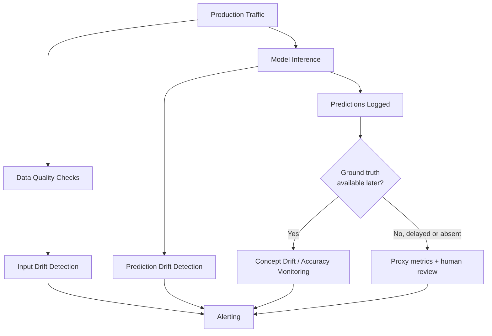

## Model Monitoring in Production

### What Production Monitoring Addresses

A model that passed offline evaluation and cleared a careful rollout can still degrade silently over time. Unlike traditional software, where a bug typically produces an error, ML systems can fail *quietly* — continuing to return confident, well-formed predictions that are simply wrong, because the world the model was trained on has shifted. Monitoring exists to catch that silent failure mode.

**Key Points**

- ML monitoring extends traditional software monitoring (uptime, latency, errors) with model-specific signals: input data quality, prediction distributions, and downstream outcome quality
- The central challenge is that "correctness" often can't be measured directly in real time — ground truth labels frequently arrive late or not at all
- Monitoring is what makes deployment strategies (canary, A/B, etc.) actionable; without metrics to watch, a rollout has no decision criteria

### Categories of Signals to Monitor

#### System / Infrastructure Metrics

Standard operational signals, largely unchanged from traditional software monitoring: request latency (p50/p95/p99), throughput, error rate, CPU/GPU utilization, memory consumption. These are necessary but not sufficient for ML systems — a model can be fast, error-free, and still wrong.

#### Data Quality Metrics

Checks on the input data itself, applied before it ever reaches the model: missing values, schema violations (wrong type, out-of-range values), unexpected categorical values, sudden changes in feature cardinality. These catch upstream pipeline failures that would otherwise silently corrupt predictions.

#### Input Drift (Data/Covariate Drift)

Measures whether the distribution of incoming feature data has shifted relative to the training distribution. A model trained on one distribution is not guaranteed to generalize well once the input distribution moves.

$$D_{\text{drift}} = \text{distance}\left(P_{\text{train}}(X), P_{\text{live}}(X)\right)$$

Common distance measures include population stability index (PSI), Kolmogorov–Smirnov statistic (for continuous features), and Jensen-Shannon divergence.

#### Prediction Drift

Measures whether the distribution of the model's *outputs* has shifted, independent of whether ground truth is available. A sudden shift in predicted class proportions, or in the mean/variance of a regression output, is often an early warning sign even before labels arrive to confirm an accuracy drop.

#### Concept Drift

The relationship between inputs and the true target has changed — the same input now maps to a different correct output than it did at training time. This is distinct from data drift: input distributions can be stable while the underlying relationship shifts (e.g., customer behavior changing due to a market event), or inputs can drift while the input-output relationship stays intact.

#### Model Quality Metrics (With Ground Truth)

Once true labels become available — sometimes instantly, sometimes after days or weeks (e.g., loan default, churn) — standard supervised metrics (accuracy, precision/recall, RMSE, calibration) can be computed against live predictions. The delay between prediction and label availability is often called the **feedback loop latency**, and it fundamentally limits how quickly quality regressions can be confirmed.

#### Business / Outcome Metrics

The downstream metrics the model is ultimately meant to move — conversion rate, fraud losses avoided, user engagement. These carry the strongest real-world signal but the most confounding factors and typically the longest measurement delay.

### Comparison of Monitoring Signal Types

| Signal Type | Requires Ground Truth | Typical Latency | Catches |
| --- | --- | --- | --- |
| System metrics | No | Real-time | Infra failures, latency spikes |
| Data quality | No | Real-time | Upstream pipeline breakage |
| Input drift | No | Near real-time | Distribution shift before it affects users |
| Prediction drift | No | Near real-time | Model behavior change, proxy for quality drop |
| Model quality | Yes | Delayed (hours–months) | Confirmed accuracy/error changes |
| Business metrics | Indirectly | Delayed, often longest | Real-world impact, ROI |

### Handling Delayed or Missing Ground Truth

Because labels are often unavailable in real time, production monitoring relies heavily on proxy signals that don't require them:

- **Drift-based proxies**: input and prediction drift as early warning signals, on the reasoning that significant drift correlates with eventual quality degradation even before it's confirmed
- **Confidence/uncertainty monitoring**: tracking the model's own confidence scores or predictive uncertainty over time; a drop in average confidence can precede a measurable accuracy drop
- **Human-in-the-loop sampling**: routing a small, possibly stratified sample of predictions to human reviewers for labeling, trading cost for a faster (though partial) ground-truth signal
- **Weak/delayed labels from business events**: using downstream signals that arrive faster than the "true" label as an interim proxy (e.g., using cart abandonment as an early proxy before full purchase-conversion data is in)

[Inference] Teams often combine several of these proxies rather than relying on one, since each has different latency and reliability trade-offs, though the specific combination used is highly dependent on the domain and what signals are actually available.

### Segmentation and Slice-Based Monitoring

Aggregate metrics can look healthy while specific subgroups degrade badly — a common failure mode is a model that performs well on average but poorly on a minority segment (a particular geography, device type, or demographic slice). Slice-based monitoring computes metrics separately per segment rather than only in aggregate, which is important both for catching localized regressions and for fairness-related concerns.

<svg xmlns="http://www.w3.org/2000/svg" viewBox="0 0 850 300">
\<style\>
.box { fill: #f5f5f5; stroke: #333; stroke-width: 1.5; }
.accent { fill: #e8eef7; stroke: #2c5aa0; stroke-width: 1.5; }
.warn { fill: #fbe9e7; stroke: #b71c1c; stroke-width: 1.5; }
.label { font-family: sans-serif; font-size: 13px; fill: #222; }
.title { font-family: sans-serif; font-size: 14px; font-weight: bold; fill: #111; }
\</style\>
<text x="230" y="24" class="title">Aggregate vs. Slice-Level Accuracy (svg_diagram)</text>
<rect x="40" y="60" width="740" height="40" class="accent" rx="4" />
<text x="55" y="85" class="label">Aggregate accuracy: 94% — looks healthy</text>
<rect x="40" y="140" width="230" height="50" class="box" rx="4" />
<text x="55" y="162" class="label">Segment A (70% of traffic)</text>
<text x="55" y="180" class="label">Accuracy: 97%</text>
<rect x="300" y="140" width="230" height="50" class="box" rx="4" />
<text x="315" y="162" class="label">Segment B (25% of traffic)</text>
<text x="315" y="180" class="label">Accuracy: 93%</text>
<rect x="560" y="140" width="230" height="50" class="warn" rx="4" />
<text x="575" y="162" class="label">Segment C (5% of traffic)</text>
<text x="575" y="180" class="label">Accuracy: 61%</text>

<text x="40" y="230" class="label">Aggregate metrics mask the Segment C regression — only visible when sliced.</text>

</svg>

### Alerting Design

Effective alerting balances sensitivity against alert fatigue:

- **Static thresholds**: fixed bounds on a metric (e.g., error rate > 2%); simple but require domain knowledge to set well and can be brittle to seasonal patterns
- **Statistical/anomaly-based thresholds**: alert when a metric deviates significantly from its own historical distribution (e.g., z-score or rolling-window based), adapting better to metrics with natural variance
- **Multi-signal correlation**: requiring multiple related signals to fire together before paging a human, reducing false positives from any single noisy metric
- **Severity tiering**: distinguishing automatically-actionable alerts (e.g., trigger automated rollback) from advisory alerts that queue for human review

### Tooling Landscape

Production ML monitoring is served by a mix of general observability tools adapted for ML and ML-specific platforms:

- **General observability** (Prometheus/Grafana, Datadog) — well-suited to system metrics, often extended with custom exporters for model-specific metrics
- **ML-specific monitoring platforms** (Evidently AI, WhyLabs, Arize, Fiddler) — purpose-built for drift detection, data quality checks, and slice-based analysis, often with pre-built statistical tests for distribution comparison
- **Logging/tracing infrastructure** — capturing raw predictions and inputs for later analysis, retraining datasets, and audit/compliance needs

### Common Pitfalls

- Monitoring only aggregate metrics and missing slice-level degradation affecting a minority of traffic
- Treating the absence of an error as evidence the model is working correctly, when the model may simply be silently wrong
- Setting static alert thresholds without accounting for legitimate seasonal or cyclical variation, causing alert fatigue that leads teams to ignore real signals
- Not closing the loop between monitoring and retraining — detecting drift without a defined process for what happens next
- Conflating input drift with concept drift, leading to the wrong remediation (e.g., retraining on new data when the actual problem is a changed input-output relationship that new data alone won't fix)

**Related Topics**

- Data and concept drift detection methods in depth (PSI, KS-test, ADWIN, DDM)
- Model retraining triggers and continuous training pipelines
- Feature stores and online/offline feature consistency
- Fairness and bias monitoring in production models
- Incident response and rollback procedures for ML systems
- Explainability tools for debugging production predictions (SHAP, LIME in a monitoring context)