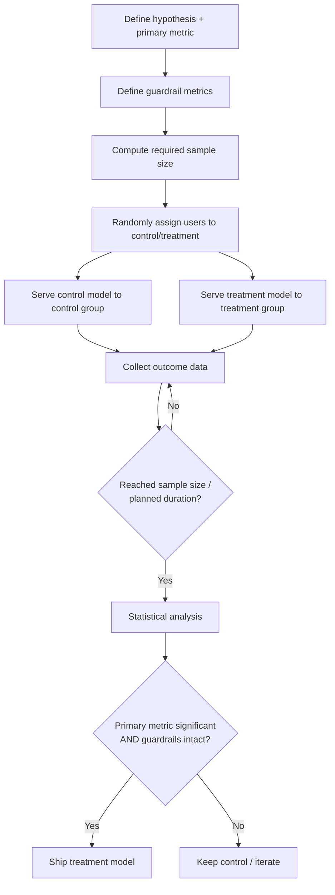
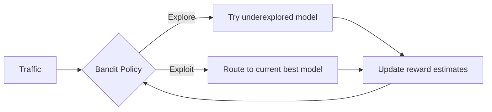

## A/B Testing for Models

### What Model A/B Testing Addresses

Offline evaluation metrics (accuracy, AUC, RMSE on a held-out test set) are proxies for what actually matters: does the model improve real-world outcomes when exposed to live users? A/B testing closes that gap by comparing model versions under live traffic with a statistically rigorous framework, rather than relying on offline metrics alone or informal before/after comparisons that confound the model change with other concurrent changes (seasonality, other product changes, external events).

**Key Points**

- A/B testing is a controlled experiment: users are randomly assigned to a control (existing model) or treatment (new model) group, and outcomes are compared
- Randomization is what allows a causal claim ("the new model *caused* the metric change") rather than a merely correlational one
- This differs from a canary deployment in intent: canaries primarily check for *regressions/safety*, while A/B tests are designed to determine which version is genuinely *better*, usually run longer with more rigorous statistical design

### Core Experimental Design Concepts

#### Randomization Unit

The entity being randomly assigned to control or treatment — typically the user, but sometimes a session, request, or account, depending on what unit of consistency the experiment needs. Choosing the wrong unit can invalidate results: if a user's individual requests are randomized independently, they might see inconsistent experiences across a session, contaminating the comparison.

#### Hypothesis and Primary Metric

Before launching, the specific claim being tested should be stated explicitly — e.g., "the new recommendation model increases click-through rate by at least 2%" — along with the single primary metric that will determine success. Defining this in advance prevents post-hoc metric shopping, where analysts search through many metrics until one shows significance by chance.

#### Guardrail Metrics

Secondary metrics that must not regress even if the primary metric improves — latency, error rate, unsubscribe rate, or other metrics representing acceptable-cost boundaries. A model that improves the primary metric while silently degrading a guardrail metric is not a clean win.

#### Statistical Significance and Power

$$p\text{-value} < \alpha \implies \text{reject the null hypothesis (no difference between versions)}$$

- **Significance level ($\alpha$)**: the threshold probability of a false positive (concluding there's a difference when there isn't), commonly set at 0.05
- **Statistical power ($1-\beta$)**: the probability of detecting a true effect when one exists, commonly targeted at 0.8
- **Minimum detectable effect (MDE)**: the smallest effect size the experiment is designed to reliably detect; smaller MDEs require larger sample sizes

$$n \approx \frac{2\left(z_{\alpha/2} + z_{\beta}\right)^2 \sigma^2}{\delta^2}$$

[Unverified] This sample-size relationship assumes a continuous metric with roughly normal sampling distribution; binary/rate metrics, ratio metrics, and metrics with heavy-tailed distributions typically require different variance estimation and sometimes different formulas entirely — consult the specific test's assumptions before applying this directly.

### Experiment Workflow

### Common Pitfalls in Experimental Design

#### Peeking / Optional Stopping

Repeatedly checking results and stopping as soon as significance is reached inflates the false positive rate beyond the nominal $\alpha$, because each additional look is another chance for noise to appear significant. Fixed-horizon testing (deciding sample size/duration in advance and not stopping early) or sequential testing methods designed for repeated looks (e.g., alpha-spending approaches) address this.

#### Novelty and Primacy Effects

Users may react differently to a new model simply because it's new (novelty effect, often fading over time) or may take time to adjust their behavior to it (primacy effect, where the true effect only appears after an adjustment period). Both can bias short experiments in either direction relative to steady-state impact.

#### Network Effects and Interference (SUTVA Violations)

Standard A/B analysis assumes one user's assigned treatment doesn't affect another user's outcome (the Stable Unit Treatment Value Assumption). This breaks down in networked or marketplace settings — e.g., a recommendation model change for some sellers can affect the outcomes of other sellers competing for the same buyer attention, even those in the control group.

#### Sample Ratio Mismatch (SRM)

If the actual observed split between control and treatment deviates significantly from the intended split (e.g., intended 50/50 but observed 47/53), this signals a bug in the randomization or logging pipeline, and any metric comparison from that experiment should be treated as untrustworthy until the mismatch is understood.

#### Multiple Comparisons

Testing many metrics or many variants simultaneously increases the chance that at least one shows a "significant" result purely by chance. Correction methods (e.g., Bonferroni correction) or designating a single primary metric in advance help control this.

### Comparison: A/B Testing vs. Related Deployment Techniques

| Approach | Primary Goal | Typical Duration | Statistical Rigor |
| --- | --- | --- | --- |
| Shadow deployment | Validate behavior, no user exposure | Short–medium | Low (no live comparison) |
| Canary | Catch regressions/safety issues | Short | Low–moderate (monitoring, not hypothesis testing) |
| A/B test | Determine which version is better | Medium–long | High (formal hypothesis testing) |
| Multi-armed bandit | Maximize reward while learning | Ongoing | Moderate (adaptive, not fixed-sample) |

### Multi-Armed Bandits as an Alternative

Rather than a fixed-allocation experiment run to a predetermined sample size, bandit algorithms (e.g., epsilon-greedy, Thompson sampling, UCB) adaptively shift traffic toward the better-performing model *during* the experiment, trading some statistical rigor for reduced "regret" (cost of exposing users to the worse option).

- **A/B testing** favors clean causal inference and is easier to reason about statistically, at the cost of exposing a fixed fraction of users to a potentially worse model for the full experiment duration
- **Bandits** favor minimizing cost during the learning process, at the cost of more complex statistical analysis and less straightforward significance testing

<svg xmlns="http://www.w3.org/2000/svg" viewBox="0 0 850 300">
\<style\>
.box { fill: #f5f5f5; stroke: #333; stroke-width: 1.5; }
.accent { fill: #e8eef7; stroke: #2c5aa0; stroke-width: 1.5; }
.label { font-family: sans-serif; font-size: 13px; fill: #222; }
.title { font-family: sans-serif; font-size: 14px; font-weight: bold; fill: #111; }
.axis { stroke: #666; stroke-width: 1.5; }
\</style\>
<text x="220" y="24" class="title">Fixed A/B Split vs. Bandit Allocation Over Time (svg_diagram)</text>
<line x1="60" y1="60" x2="60" y2="220" class="axis" />
<line x1="60" y1="220" x2="380" y2="220" class="axis" />
<text x="150" y="240" class="label">Time (A/B test)</text>
<rect x="80" y="80" width="120" height="60" class="box" />
<text x="90" y="105" class="label">Control 50%</text>
<rect x="80" y="140" width="120" height="60" class="accent" />
<text x="90" y="165" class="label">Treatment 50%</text>
<rect x="220" y="80" width="120" height="60" class="box" />
<text x="230" y="105" class="label">Control 50%</text>
<rect x="220" y="140" width="120" height="60" class="accent" />
<text x="230" y="165" class="label">Treatment 50%</text>
<line x1="470" y1="60" x2="470" y2="220" class="axis" />
<line x1="470" y1="220" x2="790" y2="220" class="axis" />
<text x="560" y="240" class="label">Time (bandit)</text>
<rect x="490" y="80" width="120" height="60" class="box" />
<text x="500" y="105" class="label">Control 50%</text>
<rect x="490" y="140" width="120" height="60" class="accent" />
<text x="500" y="165" class="label">Treatment 50%</text>
<rect x="630" y="60" width="120" height="30" class="box" />
<text x="640" y="80" class="label">Control 20%</text>
<rect x="630" y="90" width="120" height="110" class="accent" />
<text x="640" y="150" class="label">Treatment 80%</text>
</svg>

### Practical Considerations for ML-Specific A/B Tests

- **Latency-sensitive metric collection**: since model inference and outcome logging both need to happen without added latency, instrumentation is often built into the serving layer rather than bolted on afterward
- **Long-term vs. short-term metric divergence**: a model change can show short-term metric improvement (e.g., engagement) that doesn't hold up long-term (e.g., due to habituation or user fatigue), motivating longer-running or holdout-based experiments for high-stakes changes
- **Interaction with existing experiments**: when multiple experiments run concurrently, interaction effects between them can confound results unless the experimentation platform tracks overlapping assignments
- [Inference] Teams operating at lower traffic volumes often lean more heavily on guardrail-based canary monitoring than formal A/B tests, simply because reaching adequate statistical power for smaller effect sizes can take impractically long at low traffic — though the specific threshold where this trade-off applies depends on the metric's variance and the effect size being tested

### Common Pitfalls

- Stopping an experiment early upon seeing significance without correcting for repeated peeking
- Choosing a primary metric only after seeing preliminary results, rather than pre-registering it
- Ignoring sample ratio mismatch as a data quality signal, treating a broken experiment's results as valid
- Applying standard A/B analysis in settings with meaningful network effects, producing misleading conclusions about the "isolated" effect of the treatment
- Running an experiment for too short a duration to capture novelty decay or delayed behavioral adjustment

**Related Topics**

- Multi-armed bandit algorithms in depth (Thompson sampling, UCB, contextual bandits)
- Statistical power analysis and sample size calculation for different metric types
- Sequential testing and always-valid p-values
- Causal inference methods for observational (non-randomized) evaluation
- Deployment strategies (canary, blue-green, shadow deployment)
- Experiment tracking and metadata management for A/B test provenance