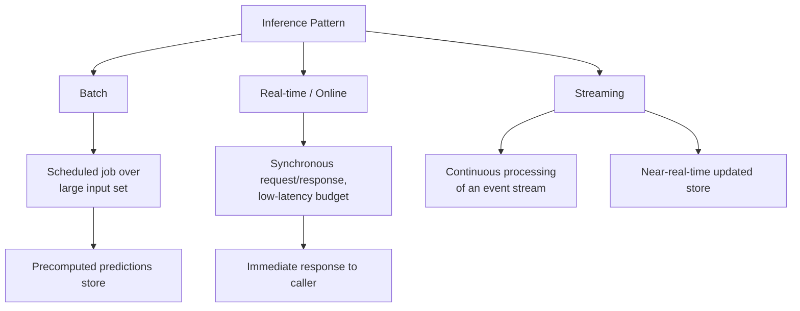

## Model Serving Infrastructure

### What Serving Infrastructure Addresses

A trained model is just a set of weights on disk until something wraps it in a runtime that can accept inputs and return predictions reliably, at scale, and within latency budgets. Serving infrastructure is that runtime layer — it turns a static artifact into a live, queryable system, and its design choices shape everything downstream: what deployment strategies are feasible, what monitoring is possible, and what latency/cost trade-offs are available.

**Key Points**

- Serving is distinct from training infrastructure: training optimizes for throughput over large batches, while serving typically optimizes for latency, often on single or small-batch requests
- The core design axis is *batch vs. real-time* inference, which cascades into nearly every other infrastructure decision
- Serving infrastructure must handle concerns training doesn't: request routing, autoscaling under variable load, model loading/unloading, and graceful degradation under failure

### Batch vs. Real-Time (Online) Inference

#### Batch Inference

Predictions are computed on a large set of inputs at once, on a schedule (e.g., nightly), with results stored for later retrieval. There is no live request/response cycle — a downstream system reads precomputed predictions from a database or file store.

- **Strength**: high throughput, efficient use of hardware (large batches maximize GPU utilization), simpler infrastructure (no need for always-on low-latency serving)
- **Limitation**: predictions are only as fresh as the last batch run; unsuitable for use cases requiring a response to input that doesn't yet exist at batch time (e.g., a live user query)

#### Real-Time (Online) Inference

Predictions are computed on demand, in response to individual requests, typically within a latency budget of milliseconds to low seconds.

- **Strength**: predictions reflect the exact current input; necessary for interactive applications (search ranking, fraud detection at transaction time, chat)
- **Limitation**: harder to achieve high hardware utilization on small/single requests; requires always-on infrastructure with its own availability and scaling concerns

#### Near-Real-Time / Streaming Inference

A middle ground: predictions are computed continuously as new data arrives via a stream (e.g., Kafka), rather than on a fixed batch schedule or synchronously per request. Useful when freshness matters but a synchronous request/response isn't required.



### Serving Architecture Patterns

#### Model-as-a-Service (Dedicated Serving Endpoint)

The model is deployed behind a dedicated API endpoint (REST/gRPC), often using a purpose-built serving framework (TensorFlow Serving, TorchServe, NVIDIA Triton Inference Server, KServe). The application calls this endpoint like any other microservice.

```python
# Example: a minimal FastAPI wrapper around a model,
# illustrative of the pattern rather than a production-grade server
from fastapi import FastAPI
import joblib

app = FastAPI()
model = joblib.load("model.pkl")

@app.post("/predict")
def predict(features: dict):
    x = preprocess(features)
    prediction = model.predict([x])
    return {"prediction": prediction.tolist()}
```

[Unverified] A hand-rolled wrapper like this is common for simple models or prototypes, but production deployments at scale typically rely on dedicated serving frameworks that add batching, GPU scheduling, and protocol optimizations a basic wrapper doesn't provide — the right choice depends heavily on traffic volume, latency requirements, and team operational capacity.

#### Embedded / In-Process Serving

The model is loaded directly into the application process rather than called over the network — eliminating network hop latency at the cost of coupling the model's lifecycle (loading, memory footprint, dependency versions) to the application's.

- **Strength**: lowest possible latency (no network call); simpler deployment topology
- **Limitation**: scaling the model independently from the application is harder; large models can bloat application memory footprint; updating the model requires redeploying the application

#### Sidecar Pattern

The model runs in a separate container alongside the main application container within the same pod (common in Kubernetes), communicating over localhost — a middle ground between embedded and fully separate services.

#### Serverless Inference

The model is deployed as a function that scales to zero when idle and spins up on demand (e.g., AWS Lambda, cloud-provider serverless inference offerings). Well suited to sporadic or unpredictable traffic.

- **Strength**: no cost when idle; automatic scaling without manual capacity planning
- **Limitation**: cold-start latency when scaling from zero can be significant, especially for large models; execution time and resource limits imposed by the serverless platform can constrain model size or complexity

### Comparison of Serving Patterns

| Pattern | Latency | Scaling Independence | Operational Complexity |
| --- | --- | --- | --- |
| Batch | N/A (precomputed) | N/A | Low |
| Dedicated endpoint | Low–moderate | High | Moderate–high |
| Embedded | Lowest | Low | Low |
| Sidecar | Low | Moderate | Moderate |
| Serverless | Variable (cold starts) | High (automatic) | Low–moderate |

### Key Infrastructure Concerns

#### Latency Budget and Batching

Serving frameworks often use **dynamic batching** — briefly holding incoming requests to group them into a batch before running inference, improving hardware utilization at the cost of a small added latency. The batching window size is a direct trade-off between throughput and per-request latency.

$$\text{effective latency} \approx \text{batch wait time} + \text{inference time}(\text{batch size})$$

#### Autoscaling

Serving infrastructure needs to scale replica count with traffic. For GPU-backed serving, this is complicated by longer instance startup times (loading large model weights onto a GPU can take seconds to minutes), which can make reactive autoscaling too slow to respond to sudden traffic spikes — predictive or pre-warmed scaling strategies are often used to compensate.

#### Model Loading and Versioning at Runtime

Serving frameworks typically support hot-swapping model versions without downtime — loading a new version into memory, validating it, then atomically switching traffic to it while unloading the old version. This capability underlies canary and blue-green deployment strategies at the infrastructure level.

#### Hardware Acceleration and Optimization

- **Quantization**: reducing numerical precision of model weights (e.g., FP32 → INT8) to reduce memory footprint and increase inference speed, typically with some accuracy trade-off
- **Model compilation/optimization**: tools like ONNX Runtime, TensorRT, or `torch.compile` transform a trained model into an optimized execution graph for the target hardware
- **Hardware choice**: CPU inference is often sufficient and cheaper for small models or low-throughput needs; GPU (or specialized accelerators like TPUs) becomes valuable for large models or high-throughput requirements

<svg xmlns="http://www.w3.org/2000/svg" viewBox="0 0 850 320">
\<style\>
.box { fill: #f5f5f5; stroke: #333; stroke-width: 1.5; }
.accent { fill: #e8eef7; stroke: #2c5aa0; stroke-width: 1.5; }
.label { font-family: sans-serif; font-size: 13px; fill: #222; }
.title { font-family: sans-serif; font-size: 14px; font-weight: bold; fill: #111; }
.arrow { stroke: #444; stroke-width: 1.5; marker-end: url(#arrowhead3); fill: none; }
\</style\>
<text x="230" y="24" class="title">Real-Time Serving Request Path (svg_diagram)</text>
<rect x="30" y="130" width="120" height="60" class="box" rx="4" />
<text x="45" y="155" class="label">Client</text>
<text x="45" y="173" class="label">Request</text>
<rect x="220" y="130" width="130" height="60" class="box" rx="4" />
<text x="235" y="155" class="label">Load Balancer /</text>
<text x="235" y="173" class="label">Router</text>
<rect x="420" y="60" width="150" height="60" class="accent" rx="4" />
<text x="435" y="85" class="label">Model Replica 1</text>
<text x="435" y="103" class="label">(GPU/CPU)</text>
<rect x="420" y="140" width="150" height="60" class="accent" rx="4" />
<text x="435" y="165" class="label">Model Replica 2</text>
<text x="435" y="183" class="label">(GPU/CPU)</text>
<rect x="420" y="220" width="150" height="60" class="accent" rx="4" />
<text x="435" y="245" class="label">Model Replica N</text>
<text x="435" y="263" class="label">(GPU/CPU)</text>
<rect x="640" y="130" width="150" height="60" class="box" rx="4" />
<text x="655" y="155" class="label">Response to</text>
<text x="655" y="173" class="label">Client</text>
<path d="M150,160 L220,160" class="arrow" />
<path d="M350,150 L420,100" class="arrow" />
<path d="M350,160 L420,170" class="arrow" />
<path d="M350,170 L420,240" class="arrow" />
<path d="M570,100 L640,150" class="arrow" />
<path d="M570,170 L640,165" class="arrow" />
<path d="M570,240 L640,180" class="arrow" />
</svg>

### Multi-Model and Multi-Tenant Serving

Production systems often serve many models from shared infrastructure rather than one model per deployment, to improve resource utilization:

- **Model multiplexing**: a single serving process hosts multiple models, routing each request to the correct one based on a model identifier
- **GPU sharing**: techniques like NVIDIA MIG (Multi-Instance GPU) or time-slicing allow multiple models to share a single GPU rather than each requiring a dedicated one
- **Cold vs. warm models**: infrequently used models may be kept unloaded ("cold") and loaded on demand, trading occasional cold-start latency for reduced idle resource cost

### Interaction With Deployment and Monitoring

Serving infrastructure is the substrate that deployment strategies and monitoring operate on:

- Traffic-splitting deployment strategies (canary, A/B) require the serving/routing layer to support percentage-based or rule-based request routing to different model versions
- Monitoring requires the serving layer to expose or log the signals needed (latency, input/output data, replica health) rather than treating the model as an opaque black box
- Rollback speed is bounded by how quickly the serving layer can redirect traffic or swap loaded model versions

### Common Pitfalls

- Choosing real-time serving for a use case that batch inference would handle more cheaply and simply, when strict freshness isn't actually required
- Underestimating cold-start latency for GPU-backed or serverless serving, leading to timeout errors during traffic spikes or scale-from-zero events
- Coupling application and model lifecycles too tightly (embedded serving) in a context where independent model updates and scaling are actually needed
- Not accounting for the latency cost of dynamic batching windows when defining strict low-latency SLAs
- Treating the serving layer as a black box in monitoring, losing visibility into per-replica health, load distribution, and version-specific performance

**Related Topics**

- Model optimization techniques (quantization, pruning, distillation) for serving efficiency
- Feature stores and online/offline feature parity for real-time serving
- Deployment strategies (canary, blue-green, shadow, A/B testing)
- Model monitoring and observability in production
- Hardware acceleration frameworks (ONNX Runtime, TensorRT, Triton Inference Server)
- Autoscaling strategies for GPU-backed inference workloads