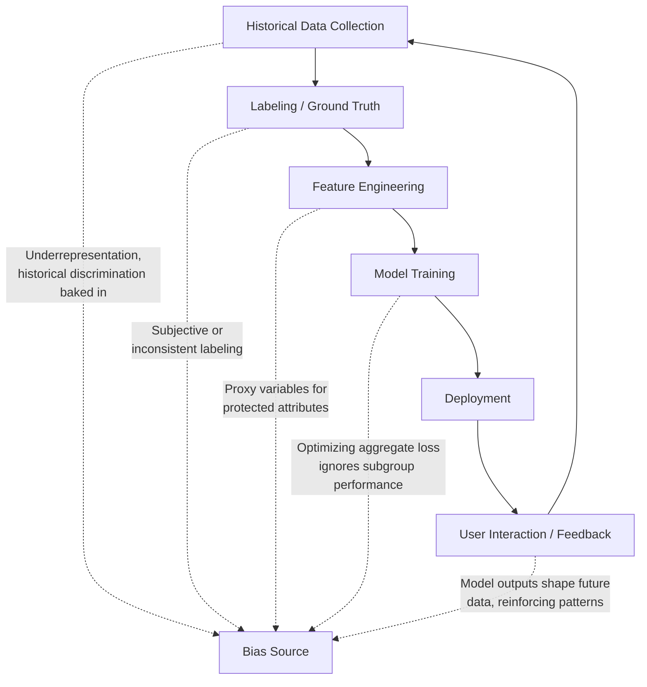

## Bias Detection and Mitigation

### What Bias in ML Systems Refers To

A model can achieve strong aggregate performance while systematically producing worse outcomes for specific subgroups — defined by attributes like race, gender, age, or other characteristics. This is distinct from random error: it's a *consistent, directional* disparity in how the model treats different groups, and it can originate at any stage of the ML pipeline, not just in the model itself.

**Key Points**

- Bias can enter through data collection, labeling, feature engineering, model training, or deployment/feedback loops — it is not solely a modeling problem
- There is no single universal definition of "fairness" — different fairness criteria can be mathematically incompatible with one another, meaning satisfying one often means violating another
- Bias detection and mitigation is as much a socio-technical and domain-judgment problem as a statistical one; the appropriate fairness criterion depends on context, stakeholders, and the specific harms being guarded against

### Where Bias Enters the Pipeline

#### Historical / Sampling Bias

Training data reflects historical inequities or underrepresents certain groups, so the model learns and perpetuates those patterns even without any explicit reference to a protected attribute.

#### Labeling Bias

Ground-truth labels themselves can encode human bias — for example, subjective quality ratings or enforcement decisions that were made inconsistently across groups historically.

#### Proxy Variables

Features that are not explicitly a protected attribute (race, gender, etc.) but are strongly correlated with one — zip code correlating with race, or certain purchase patterns correlating with gender — can allow a model to effectively use the protected attribute indirectly even when it's excluded from the feature set.

#### Feedback Loops

A deployed model's outputs can shape the future data it's trained on — e.g., a model that under-recommends a group receives less engagement data from that group, reinforcing the original disparity in subsequent retraining cycles.

### Fairness Definitions and Metrics

There isn't one metric called "fairness" — there are several formal definitions, often in tension with each other.

#### Demographic Parity (Statistical Parity)

Requires the positive prediction rate to be equal across groups, regardless of the true outcome rate in each group.

$$P(\hat{Y}=1 \mid A=a) = P(\hat{Y}=1 \mid A=b)$$

#### Equalized Odds

Requires the true positive rate and false positive rate to be equal across groups — a stricter, outcome-aware criterion than demographic parity.

$$P(\hat{Y}=1 \mid Y=y, A=a) = P(\hat{Y}=1 \mid Y=y, A=b) \quad \forall y \in \{0,1\}$$

#### Equal Opportunity

A relaxation of equalized odds requiring only the true positive rate to be equal across groups — focused specifically on ensuring qualified individuals from every group have an equal chance of a positive outcome.

#### Predictive Parity (Calibration Within Groups)

Requires that, among individuals a model predicts positively, the actual positive rate is the same across groups — i.e., the model's confidence means the same thing regardless of group membership.

#### The Impossibility Result

[Unverified — mathematically well-established but worth flagging as a named result rather than an opinion] Under most realistic conditions where base rates differ between groups, it is mathematically impossible to simultaneously satisfy demographic parity, equalized odds, and predictive parity. This is a proven incompatibility (commonly discussed in fairness literature following analyses of criminal justice risk-scoring tools), not merely a practical difficulty — choosing a fairness criterion inherently means prioritizing certain notions of fairness over others.

### Comparison of Fairness Criteria

| Criterion | Focuses On | Ignores | Appropriate When |
| --- | --- | --- | --- |
| Demographic parity | Equal positive rate across groups | True outcome differences | Equal outcomes are the explicit goal (e.g., equal opportunity in hiring exposure) |
| Equalized odds | Equal TPR and FPR across groups | Nothing re: error type, but requires knowing true outcomes | Errors of both types matter equally across groups |
| Equal opportunity | Equal TPR (qualified individuals) | False positive disparities | Missing qualified individuals is the primary harm to avoid |
| Predictive parity | Consistent meaning of a positive prediction | Differences in who gets flagged | Downstream decisions rely on prediction confidence being comparable |

### Bias Detection Techniques

#### Subgroup Performance Analysis (Slice-Based Evaluation)

Computing standard metrics (accuracy, precision, recall, calibration) separately for each relevant subgroup rather than only in aggregate — the same slicing technique used in production monitoring, applied here specifically along protected or sensitive attribute lines.

#### Disparate Impact Analysis

Comparing the selection/positive-prediction rate ratio between groups against a reference threshold (commonly the "80% rule" used in some legal/regulatory contexts as a rule-of-thumb screening threshold, not a definitive legal determination).

$$\text{Disparate Impact Ratio} = \frac{P(\hat{Y}=1 \mid A=\text{disadvantaged group})}{P(\hat{Y}=1 \mid A=\text{advantaged group})}$$

#### Counterfactual Fairness Testing

Checking whether a prediction changes when only a protected attribute (or its proxies) is altered while holding other relevant factors constant — probing whether the model's decision is causally sensitive to group membership.

#### Explainability-Based Auditing

Using feature attribution methods (SHAP, LIME) to inspect whether protected attributes or their proxies carry disproportionate weight in individual predictions, even when the model wasn't explicitly trained on those attributes.

### Mitigation Strategies by Pipeline Stage

<svg xmlns="http://www.w3.org/2000/svg" viewBox="0 0 850 260">
\<style\>
.box { fill: #f5f5f5; stroke: #333; stroke-width: 1.5; }
.accent { fill: #e8eef7; stroke: #2c5aa0; stroke-width: 1.5; }
.label { font-family: sans-serif; font-size: 12.5px; fill: #222; }
.title { font-family: sans-serif; font-size: 14px; font-weight: bold; fill: #111; }
\</style\>
<text x="220" y="24" class="title">Mitigation Points Across the Pipeline (svg_diagram)</text>
<rect x="30" y="60" width="220" height="140" class="accent" rx="4" />
<text x="45" y="85" class="label">Pre-processing</text>
<text x="45" y="108" class="label">- Reweighing samples</text>
<text x="45" y="128" class="label">- Resampling underrepresented</text>
<text x="45" y="148" class="label"> groups</text>
<text x="45" y="168" class="label">- Removing/transforming</text>
<text x="45" y="188" class="label"> proxy features</text>
<rect x="290" y="60" width="220" height="140" class="box" rx="4" />
<text x="305" y="85" class="label">In-processing</text>
<text x="305" y="108" class="label">- Fairness constraints</text>
<text x="305" y="128" class="label"> added to loss function</text>
<text x="305" y="148" class="label">- Adversarial debiasing</text>
<text x="305" y="168" class="label">- Regularization toward</text>
<text x="305" y="188" class="label"> parity metrics</text>
<rect x="550" y="60" width="220" height="140" class="accent" rx="4" />
<text x="565" y="85" class="label">Post-processing</text>
<text x="565" y="108" class="label">- Group-specific</text>
<text x="565" y="128" class="label"> decision thresholds</text>
<text x="565" y="148" class="label">- Calibration adjustment</text>
<text x="565" y="168" class="label"> per group</text>
<text x="565" y="188" class="label">- Reject-option classification</text>
</svg>

#### Pre-Processing Approaches

Modify the training data before model training: reweighing examples to balance influence across groups, resampling to correct representation imbalances, or transforming features to reduce correlation with protected attributes.

#### In-Processing Approaches

Modify the training objective itself: adding a fairness constraint or penalty term to the loss function, or using adversarial debiasing, where a secondary model tries to predict the protected attribute from the main model's representations, and the main model is trained to make that adversarial task fail.

$$\mathcal{L}_{\text{total}} = \mathcal{L}_{\text{task}} + \lambda \cdot \mathcal{L}_{\text{fairness penalty}}$$

#### Post-Processing Approaches

Modify predictions after training without retraining the model: applying different decision thresholds per group to equalize a chosen metric, or recalibrating output probabilities per group.

[Inference] Post-processing approaches are often attractive when retraining is costly or the model is a third-party/black-box system, since they don't require access to training internals — though they can raise their own concerns, such as whether applying different thresholds by group is legally or ethically acceptable in a given jurisdiction and context, which is a policy question as much as a technical one.

### Trade-offs and Limitations

- Improving one fairness metric can worsen another (per the impossibility result above), so mitigation requires an explicit, justified choice of which criterion matters most for the specific application
- Mitigation techniques can trade off against overall accuracy — the size of this trade-off varies significantly by dataset and technique and should not be assumed to be negligible or large by default
- Removing a protected attribute from the feature set ("fairness through unawareness") is frequently insufficient on its own because proxy variables can reconstruct the same signal
- Bias metrics computed on one population/time period may not generalize if the deployment population or context shifts, meaning bias auditing needs to be an ongoing monitoring concern rather than a one-time pre-launch check

### Common Pitfalls

- Assuming that excluding a protected attribute from training data is sufficient to prevent biased outcomes, without checking for proxy variables
- Optimizing for a single fairness metric without recognizing that it necessarily trades off against other valid fairness definitions
- Auditing for bias only before launch, rather than continuously in production, missing bias that emerges from feedback loops or population drift
- Treating disparate impact ratio thresholds (like the "80% rule") as a definitive pass/fail legal determination rather than a screening heuristic — actual legal and regulatory standards vary by jurisdiction and domain
- Applying mitigation without domain and stakeholder input, reducing a socio-technical decision to a purely statistical optimization problem

**Related Topics**

- Explainability and interpretability methods (SHAP, LIME, counterfactual explanations)
- Slice-based model monitoring in production
- Data collection and labeling practices for representative datasets
- Regulatory and legal frameworks for algorithmic fairness (domain- and jurisdiction-specific)
- Adversarial robustness and its relationship to fairness
- Responsible AI governance and model documentation (model cards, datasheets for datasets)