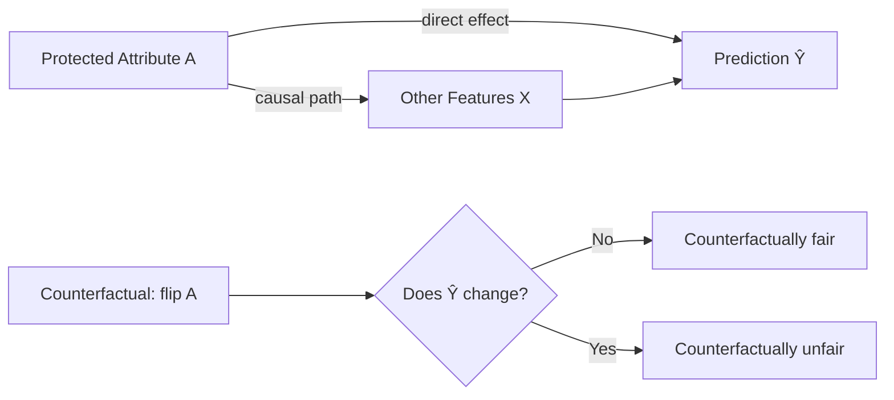

## Fairness Metrics

### Scope of This Topic

Where the prior discussion covered *where bias enters a pipeline* and *how to mitigate it*, this topic goes deeper on the metrics layer itself: how each fairness metric is formally defined, how it behaves statistically, how it's estimated from data, and how practitioners choose among them.

**Key Points**

- Fairness metrics fall into three broad families: group fairness (parity across groups), individual fairness (similar individuals treated similarly), and counterfactual fairness (causal invariance to protected attributes)
- Nearly all group fairness metrics are defined as constraints on a confusion matrix, computed separately per group
- Metric choice is inseparable from the confusion-matrix trade-off familiar from binary classification (precision vs. recall), just sliced by subgroup rather than aggregated

### The Shared Statistical Basis: Group-Wise Confusion Matrices

Most group fairness metrics reduce to comparing entries of a confusion matrix computed separately for each group $A=a$ and $A=b$.

|  | Predicted Positive | Predicted Negative |
| --- | --- | --- |
| Actual Positive | True Positive (TP) | False Negative (FN) |
| Actual Negative | False Positive (FP) | True Negative (TN) |

From this, the standard rates are defined per group:

$$\text{TPR} = \frac{TP}{TP+FN}, \quad \text{FPR} = \frac{FP}{FP+TN}, \quad \text{PPV} = \frac{TP}{TP+FP}$$

Each fairness definition below is essentially a statement about which of these rates must match across groups.

### Group Fairness Metrics in Detail

#### Demographic Parity Difference / Ratio

$$\Delta_{DP} = P(\hat{Y}=1 \mid A=a) - P(\hat{Y}=1 \mid A=b)$$

Often reported as a difference (target: near 0) or a ratio (target: near 1, related to the disparate impact ratio). This metric ignores the true label entirely — it only asks whether the model predicts positively at similar rates, regardless of whether that's actually correct for each group.

#### Equalized Odds Difference

$$\Delta_{EO} = \max\left(\left|\text{TPR}_a - \text{TPR}_b\right|,\ \left|\text{FPR}_a - \text{FPR}_b\right|\right)$$

Takes the worse of the two gaps (TPR or FPR) as the summary statistic — a common convention in fairness toolkits, though some implementations report both components separately rather than collapsing to a max.

#### Equal Opportunity Difference

$$\Delta_{EOpp} = \text{TPR}_a - \text{TPR}_b$$

A single-sided version of equalized odds, focused only on the true positive rate gap — relevant when the primary harm being guarded against is qualified individuals being missed, rather than false positives.

#### Predictive Parity / Calibration Difference

$$\Delta_{PP} = \text{PPV}_a - \text{PPV}_b$$

Sometimes extended to **calibration within groups**, checking that predicted probabilities correspond to actual outcome frequencies consistently across groups at every probability level, not just at the binary decision threshold:

$$P(Y=1 \mid \hat{P}=p, A=a) = P(Y=1 \mid \hat{P}=p, A=b) \quad \forall p \in [0,1]$$

#### Treatment Equality

$$\text{Treatment Equality} = \frac{FN_a}{FP_a} \; \text{vs.} \; \frac{FN_b}{FP_b}$$

Compares the *ratio* of false negatives to false positives across groups, rather than each rate individually — relevant in contexts where the relative cost of the two error types matters (e.g., risk assessment tools).

### Individual Fairness

Distinct from group fairness, individual fairness asks that similar individuals receive similar predictions, formalized as a Lipschitz-style constraint:

$$d_{\text{output}}\left(\hat{Y}(x_1), \hat{Y}(x_2)\right) \leq L \cdot d_{\text{input}}(x_1, x_2)$$

[Unverified] This formulation requires a defined similarity metric $d_{\text{input}}$ between individuals, which itself embeds normative judgments about what "similar" means for a given application — this is a well-known open challenge in applying individual fairness in practice, not a solved implementation detail.

### Counterfactual Fairness

A causal formulation: a prediction is counterfactually fair if it would remain the same in a counterfactual world where an individual's protected attribute were different, holding all else that isn't causally downstream of the protected attribute constant.

This requires a causal model of how the protected attribute influences other features — a stronger and harder-to-satisfy requirement than purely statistical (associational) group fairness metrics, since it depends on causal assumptions that are often not fully verifiable from observational data alone.

### Comparison of Metric Families

| Family | What It Constrains | Requires | Typical Weakness |
| --- | --- | --- | --- |
| Demographic parity | Positive rate equality | Only predictions | Ignores true outcome differences |
| Equalized odds / equal opportunity | Error rate equality | Predictions + true labels | Requires reliable, unbiased labels |
| Predictive parity / calibration | Meaning of a prediction score | Predictions + true labels | Can conflict with equalized odds |
| Individual fairness | Similar treatment for similar individuals | A defined similarity metric | Similarity metric is itself a judgment call |
| Counterfactual fairness | Causal invariance to protected attribute | A causal model | Causal model often unverifiable from data alone |

### Estimation Considerations

#### Sample Size Per Group

Fairness metrics computed on small subgroups have wide confidence intervals, and an observed disparity might reflect sampling noise rather than a genuine effect. Reporting a point estimate without a confidence interval or significance test on subgroup metrics is a common source of both false alarms and false reassurance.

$$\text{SE}(\hat{p}) = \sqrt{\frac{\hat{p}(1-\hat{p})}{n}}$$

Because $n$ is the *subgroup* size, minority groups — often exactly the groups fairness analysis is meant to protect — tend to have the least statistically reliable metric estimates, which is a structural difficulty rather than a fixable data issue in many real deployments.

#### Threshold Sensitivity

Metrics computed from a binary decision (TPR, FPR, PPV) depend on the chosen classification threshold. A model can look fair at one threshold and unfair at another, so a full evaluation typically examines metrics across the range of thresholds (analogous to an ROC curve, but sliced per group) rather than a single operating point.

<svg xmlns="http://www.w3.org/2000/svg" viewBox="0 0 850 300">
\<style\>
.axis { stroke: #444; stroke-width: 1.5; }
.lineA { stroke: #2c5aa0; stroke-width: 2.5; fill: none; }
.lineB { stroke: #b71c1c; stroke-width: 2.5; fill: none; }
.label { font-family: sans-serif; font-size: 13px; fill: #222; }
.title { font-family: sans-serif; font-size: 14px; font-weight: bold; fill: #111; }
\</style\>
<text x="220" y="24" class="title">TPR Gap Across Decision Thresholds (svg_diagram)</text>
<line x1="80" y1="240" x2="780" y2="240" class="axis" />
<line x1="80" y1="240" x2="80" y2="50" class="axis" />
<text x="400" y="275" class="label">Decision Threshold</text>
<text x="30" y="150" class="label" transform="rotate(-90 30 150)">TPR</text>
<path d="M100,80 L250,110 L400,150 L550,190 L700,220" class="lineA" />
<path d="M100,120 L250,130 L400,220 L550,225 L700,228" class="lineB" />
<rect x="600" y="60" width="14" height="14" fill="#2c5aa0" />
<text x="620" y="72" class="label">Group A</text>
<rect x="600" y="85" width="14" height="14" fill="#b71c1c" />
<text x="620" y="97" class="label">Group B</text>

<text x="380" y="175" class="label">Gap widens</text>

<text x="380" y="192" class="label">near this threshold</text>

</svg>

### Toolkits Implementing These Metrics

- **Fairlearn** — provides metric computation, disaggregated dashboards, and both pre-/post-processing mitigation algorithms
- **AIF360 (AI Fairness 360)** — a broad library covering many of the metrics and mitigation techniques above, spanning pre-, in-, and post-processing
- **What-If Tool / TensorFlow Model Analysis** — supports interactive slicing and threshold exploration for fairness inspection

### Common Pitfalls

- Reporting a single aggregate fairness score without disclosing which specific metric was used, since "fair" by one definition can be clearly unfair by another
- Ignoring confidence intervals on subgroup metrics, especially for small subgroups, leading to over- or under-confidence in a disparity finding
- Evaluating fairness at only one classification threshold when the disparity may vary substantially across the threshold range
- Conflating individual fairness or counterfactual fairness claims with group fairness metrics, when they rest on different (and not always compatible) assumptions
- Treating a fairness metric computed at launch as a permanent property of the model, rather than something that needs re-evaluation as the deployment population shifts

**Related Topics**

- Bias detection and mitigation strategies across the ML pipeline
- Causal inference methods underlying counterfactual fairness
- Slice-based model monitoring in production
- Statistical significance testing for subgroup metric comparisons
- Model cards and datasheets for documenting fairness evaluations
- Regulatory frameworks referencing specific fairness metrics by domain