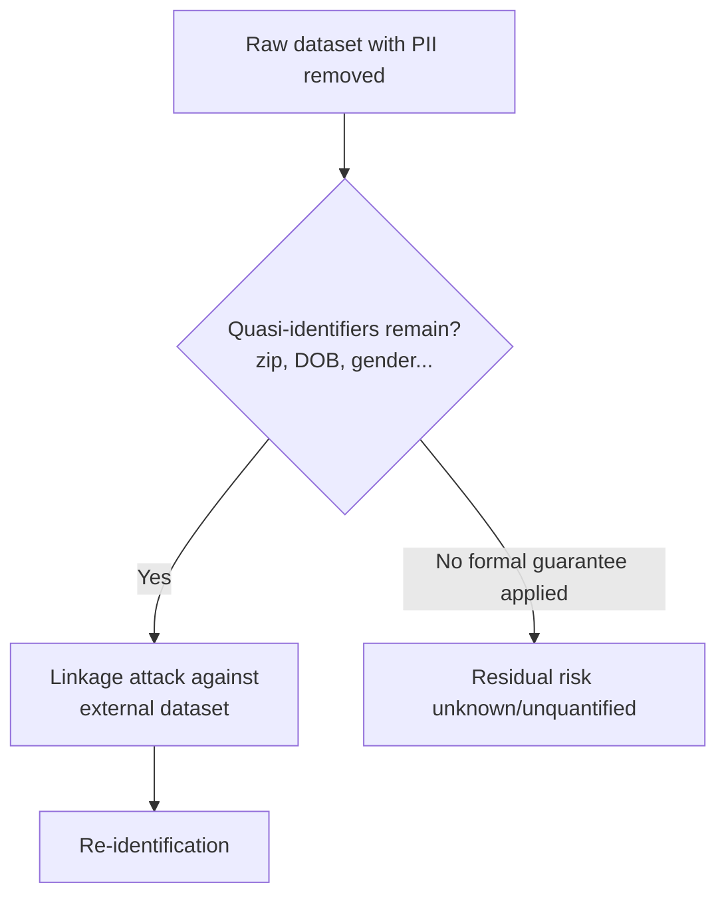
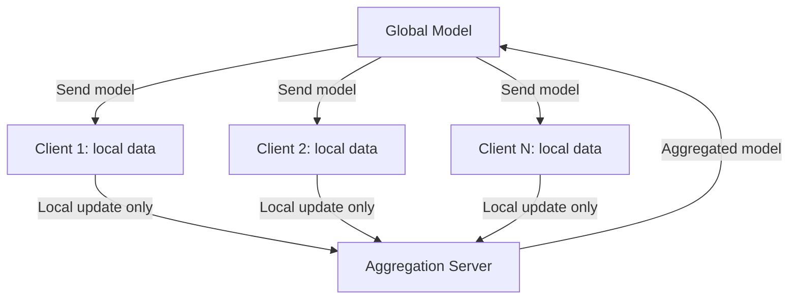

## Privacy-Preserving Techniques

### What Privacy-Preserving ML Addresses

Machine learning systems often train on sensitive data — health records, financial transactions, personal communications — and models can inadvertently leak information about that training data, even when the raw data itself is never directly exposed. Privacy-preserving techniques aim to enable useful model training and inference while formally limiting what an adversary can learn about any individual's data.

**Key Points**

- Privacy risk exists at multiple points: during training (data exposure to whoever trains the model), in the trained model itself (memorization, extraction attacks), and during inference (what a query and its response reveal)
- Formal privacy techniques provide mathematical guarantees, unlike ad hoc approaches (e.g., "we deleted personally identifying columns") which offer no provable protection against re-identification
- There is typically a privacy-utility trade-off: stronger formal privacy guarantees generally come at the cost of reduced model accuracy or increased computational cost

### Why Naive Anonymization Fails

Removing directly identifying fields (name, SSN) from a dataset is often insufficient, because combinations of remaining "quasi-identifying" attributes (zip code, birth date, gender) can uniquely re-identify individuals when cross-referenced with other available datasets. This motivates formal privacy definitions rather than heuristic de-identification.

### Differential Privacy

The most established formal framework. A mechanism is differentially private if its output distribution changes only slightly whether or not any single individual's data is included in the dataset — meaning an observer cannot confidently determine if a specific person's data was used.

$$P(\mathcal{M}(D) \in S) \leq e^{\varepsilon} \cdot P(\mathcal{M}(D') \in S)$$

where $D$ and $D'$ are datasets differing in exactly one individual's record, and $\varepsilon$ (epsilon) is the **privacy budget** — smaller $\varepsilon$ means stronger privacy (less distinguishability) but typically more noise and thus lower utility.

#### Mechanisms for Achieving Differential Privacy

- **Laplace / Gaussian mechanism**: adding calibrated random noise to a query's output, scaled to the query's sensitivity (how much a single record can change the output)
- **DP-SGD (Differentially Private Stochastic Gradient Descent)**: clips per-example gradients to bound individual influence, then adds noise before the gradient update — the standard approach for training deep learning models under differential privacy

$$\tilde{g} = \frac{1}{L}\left(\sum_{i} \text{clip}(g_i, C) + \mathcal{N}(0, \sigma^2 C^2 I)\right)$$

- **Composition**: privacy budgets accumulate across multiple queries/training steps ($\varepsilon$ grows as more operations are performed on the same data), which is why DP-SGD training requires careful accounting (e.g., via the moments accountant or Rényi differential privacy composition) to track total privacy loss over an entire training run

[Unverified] The exact accounting method and resulting $\varepsilon$ for a given training run is highly sensitive to implementation details (clipping norm, noise multiplier, number of steps, batch sampling method), so reported $\varepsilon$ values are not directly comparable across papers or systems without matching methodology.

#### Local vs. Central Differential Privacy

- **Central DP**: a trusted curator holds the raw data and adds noise only when releasing results (e.g., DP-SGD assumes a trusted training server)
- **Local DP**: each individual adds noise to their own data before it ever leaves their device, removing the need to trust a central party, at the cost of requiring more noise (and thus more utility loss) for the same formal guarantee, since no aggregation-time noise reduction is possible

### Federated Learning

Rather than centralizing raw data for training, the model is sent to where the data already lives (e.g., user devices or separate organizational silos), trained locally on each source, and only model updates (not raw data) are sent back and aggregated.

- **Strength**: raw data never leaves its original location, reducing central data-breach exposure and easing some data residency/regulatory constraints
- **Limitation**: model updates themselves can still leak information about the underlying data (motivating combining federated learning with differential privacy or secure aggregation); handling non-identically-distributed data across clients (statistical heterogeneity) complicates convergence; communication cost and client availability introduce their own engineering challenges

[Inference] Federated learning is often positioned as a privacy technique, but on its own it provides data *locality*, not a formal privacy *guarantee* — the common practice of layering differential privacy or secure aggregation on top reflects that federated learning alone doesn't fully close known leakage risks from model updates.

### Secure Multi-Party Computation (SMPC / MPC)

Cryptographic protocols allowing multiple parties to jointly compute a function over their combined inputs without any party revealing its individual input to the others. In ML, this can enable training or inference across data held by different organizations without any party seeing the others' raw data.

- **Strength**: strong cryptographic guarantees; no raw data exposure to any single party, including the computation coordinator
- **Limitation**: substantial computational and communication overhead compared to plaintext computation, which has historically limited its use to smaller-scale or narrowly scoped computations, though this is an active area of efficiency-focused research

### Homomorphic Encryption

Allows computation directly on encrypted data, producing an encrypted result that, when decrypted, matches the result of performing the same computation on the plaintext — enabling a party to run inference (or in some schemes, training) on data it never sees unencrypted.

$$\text{Dec}\left(\text{Enc}(x) \oplus \text{Enc}(y)\right) = x + y$$

- **Fully homomorphic encryption (FHE)** supports arbitrary computation but at significant computational cost; **partially/somewhat homomorphic encryption** supports a limited set of operations more efficiently
- [Unverified] The performance overhead of FHE for realistic deep learning inference workloads has historically been substantial enough to limit production use to narrower or smaller models; this is a fast-moving area and current feasibility should be checked against up-to-date benchmarks rather than assumed static

### Comparison of Techniques

| Technique | Protects Against | Trust Model | Typical Overhead |
| --- | --- | --- | --- |
| Differential privacy | Inference about individual records from outputs | Trusted curator (central) or none (local) | Accuracy loss from added noise |
| Federated learning | Central collection of raw data | Aggregator sees model updates, not raw data | Communication cost, convergence complexity |
| Secure MPC | Any single party seeing others' raw inputs | No single trusted party required | High computation/communication cost |
| Homomorphic encryption | The computing party seeing plaintext data | Computing party sees only ciphertext | High computational cost (esp. FHE) |

### Model-Level Privacy Risks

Beyond training-time protections, the trained model itself can leak information:

#### Membership Inference Attacks

An adversary attempts to determine whether a specific individual's data was part of the training set, often by exploiting the model's tendency to be more confident on training examples than unseen ones.

#### Model Inversion / Data Extraction Attacks

An adversary attempts to reconstruct approximate training examples from the model itself, particularly a risk for models that memorize rare or unique training examples (a documented concern for large language models trained on web-scale data containing incidentally sensitive information).

#### Mitigations at the Model Level

- Differential privacy during training directly bounds membership inference and extraction risk, since the formal guarantee limits how much any single training example can influence the model
- Regularization and reduced overfitting generally reduce (but do not eliminate, and provide no formal guarantee against) memorization-based leakage
- Output filtering/rate limiting can reduce the practical feasibility of extraction attacks that require many queries, without addressing the underlying memorization

### Practical Trade-offs

- **Privacy budget selection ($\varepsilon$)**: choosing $\varepsilon$ requires balancing formal privacy strength against acceptable utility loss; there is no universally "correct" value, and appropriate choice is domain- and regulation-dependent
- **Regulatory alignment**: techniques like differential privacy and federated learning are often discussed in the context of regulations (e.g., data minimization principles), but formal privacy techniques and specific legal compliance are related, not identical — a system can be differentially private without automatically satisfying every applicable legal requirement, and vice versa
- **Combining techniques**: production privacy-preserving systems often layer multiple techniques (e.g., federated learning with secure aggregation and differential privacy) rather than relying on any single one, since each addresses different threat models

### Common Pitfalls

- Treating basic anonymization (removing direct identifiers) as sufficient privacy protection, without considering quasi-identifier re-identification risk
- Reporting a differential privacy $\varepsilon$ value without matching accounting methodology, making it non-comparable to other reported values
- Assuming federated learning alone fully protects privacy, without addressing update-leakage risk
- Ignoring privacy budget composition across multiple training runs or queries on the same underlying data, leading to cumulative privacy loss exceeding the intended guarantee
- Treating privacy-preserving technique adoption as automatically equivalent to regulatory compliance, without separately verifying legal requirements

**Related Topics**

- Membership inference and model extraction attack techniques in depth
- Federated learning system design (client selection, non-IID data handling, communication efficiency)
- Regulatory frameworks intersecting with ML privacy (data minimization, right to erasure)
- Secure aggregation protocols for federated learning
- Fairness and bias considerations when applying differential privacy (utility loss is not always distributed evenly across subgroups)
- Adversarial robustness and its relationship to privacy attacks