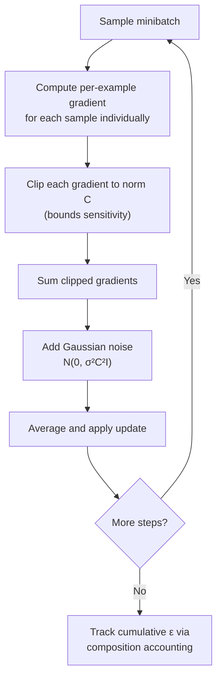

## Differential Privacy

### Scope of This Topic

Where the prior discussion introduced differential privacy as one technique among several, this topic goes deeper: the formal definitions and their variants, the mechanism design theory behind achieving them, composition mathematics, and the practical engineering of DP-SGD.

**Key Points**

- Differential privacy is a property of an algorithm (a mechanism), not of a dataset or a model — the same dataset can be processed by both DP and non-DP mechanisms
- The guarantee is about *indistinguishability*: an adversary observing the output cannot confidently tell whether any single individual's data was included
- Nearly all practical DP systems trade off three quantities against each other: privacy ($\varepsilon$, $\delta$), utility (accuracy), and the amount of data available

### Formal Definition

#### Pure ($\varepsilon$-) Differential Privacy

A randomized mechanism $\mathcal{M}$ satisfies $\varepsilon$-differential privacy if, for all pairs of datasets $D, D'$ differing in exactly one record (neighboring datasets), and for all measurable output sets $S$:

$$P(\mathcal{M}(D) \in S) \leq e^{\varepsilon} \cdot P(\mathcal{M}(D') \in S)$$

Smaller $\varepsilon$ means the output distributions for $D$ and $D'$ must be closer together, making it harder to infer which dataset produced a given output — and therefore harder to infer whether any specific individual's record was present.

#### Approximate ($(\varepsilon, \delta)$-) Differential Privacy

A relaxation allowing the guarantee to fail with small probability $\delta$:

$$P(\mathcal{M}(D) \in S) \leq e^{\varepsilon} \cdot P(\mathcal{M}(D') \in S) + \delta$$

$\delta$ is typically chosen to be very small (e.g., smaller than $1/n$ for dataset size $n$), representing a negligible probability of a stronger-than-intended privacy loss. Nearly all practical deep learning DP systems (including standard DP-SGD) use this relaxed $(\varepsilon, \delta)$ form rather than pure $\varepsilon$-DP, because achieving pure DP for complex mechanisms like Gaussian noise addition is either impossible or requires substantially more noise.

### Sensitivity: The Basis for Calibrating Noise

The amount of noise a mechanism needs depends on how much a single record can change the true (non-private) output — the **sensitivity** of the underlying query or function.

$$\Delta f = \max_{D, D' \text{ neighboring}} \left\| f(D) - f(D') \right\|$$

- **$L_1$ sensitivity** is used to calibrate the Laplace mechanism
- **$L_2$ sensitivity** is used to calibrate the Gaussian mechanism

Higher sensitivity requires more noise to achieve the same $\varepsilon$, which is why techniques like gradient clipping (bounding each example's contribution) are essential in DP-SGD — clipping directly controls sensitivity.

### Core Mechanisms

#### Laplace Mechanism

Adds noise drawn from a Laplace distribution, scaled to $L_1$ sensitivity divided by $\varepsilon$:

$$\mathcal{M}(D) = f(D) + \text{Lap}\left(\frac{\Delta f}{\varepsilon}\right)$$

Achieves pure $\varepsilon$-DP. Well suited to simple aggregate queries (counts, sums, means) but less commonly used directly for training deep models.

#### Gaussian Mechanism

Adds noise drawn from a Gaussian distribution, scaled to $L_2$ sensitivity and calibrated for a target $(\varepsilon, \delta)$:

$$\mathcal{M}(D) = f(D) + \mathcal{N}(0, \sigma^2), \qquad \sigma \geq \frac{\Delta f \sqrt{2 \ln(1.25/\delta)}}{\varepsilon}$$

Achieves $(\varepsilon,\delta)$-DP rather than pure $\varepsilon$-DP; this is the mechanism underlying DP-SGD's per-step noise addition.

#### Exponential Mechanism

For queries that don't return a numeric value (e.g., selecting the "best" item from a discrete set), the exponential mechanism samples an output with probability proportional to a utility score, scaled by sensitivity and $\varepsilon$ — allowing DP guarantees for non-numeric outputs like model selection or discrete choices.

$$P(\text{output} = r) \propto \exp\left(\frac{\varepsilon \cdot u(D, r)}{2\Delta u}\right)$$

### DP-SGD in Detail

The critical departure from standard SGD is computing **per-example** gradients (rather than only the aggregate minibatch gradient) so each individual example's contribution can be clipped before aggregation — this per-example computation is often the dominant source of DP-SGD's additional computational and memory overhead relative to standard training.

$$\tilde{g}_t = \frac{1}{L}\left(\sum_{i=1}^{L} \text{clip}(g_i, C) + \mathcal{N}(0, \sigma^2 C^2 I)\right), \quad \text{clip}(g, C) = g \cdot \min\left(1, \frac{C}{\|g\|_2}\right)$$

- **Clipping norm ($C$)**: bounds each example's influence on the update; too small distorts gradient signal, too large requires more noise for the same privacy guarantee
- **Noise multiplier ($\sigma$)**: directly controls the privacy-utility trade-off — higher $\sigma$ means stronger privacy, more training instability/slower convergence
- **Batch/sample size**: larger batches average out noise more effectively per step, which is why DP-SGD often benefits from larger batch sizes than non-private training would typically use for the same task

### Composition: Why Privacy Budget Accumulates

Each DP-SGD training step is itself a private mechanism, and training involves many steps applied to the same underlying dataset. Composition theorems describe how the total privacy loss accumulates across repeated mechanism applications.

#### Basic (Sequential) Composition

$$\varepsilon_{\text{total}} = \sum_{i=1}^{k} \varepsilon_i, \qquad \delta_{\text{total}} = \sum_{i=1}^{k} \delta_i$$

This naive summation is provably correct but overly pessimistic for many-step training — it would imply an impractically large $\varepsilon$ after thousands of SGD steps.

#### Advanced Composition and the Moments Accountant

Tighter accounting methods — the moments accountant, and more recently approaches based on Rényi differential privacy (RDP) — exploit the specific structure of repeated Gaussian mechanism application (with subsampling, since each minibatch is a random subset of the full dataset) to give substantially tighter bounds than naive summation.

$$\varepsilon_{\text{total}} = O\left(q\sqrt{k \ln(1/\delta)} / \sigma\right)$$

where $q$ is the sampling rate (batch size / dataset size) and $k$ is the number of steps. [Unverified] The exact constants and precise form of this bound depend on which accounting method is used (moments accountant vs. RDP-based vs. newer PRV accountants); this expression illustrates the asymptotic relationship rather than a formula to apply directly without consulting the specific accounting library's implementation.

### Comparison of Composition Methods

| Method | Tightness | Typical Use |
| --- | --- | --- |
| Basic/sequential composition | Loose | Simple analyses, small step counts |
| Advanced composition | Moderate | General-purpose, fewer assumptions |
| Moments accountant | Tight | Standard for DP-SGD (original TensorFlow Privacy approach) |
| RDP-based accounting | Tight, often tightest available | Common in modern DP libraries (Opacus, TF Privacy) |

### Practical Implementation Considerations

- **Hyperparameter sensitivity**: DP-trained models are often more sensitive to learning rate, clipping norm, and batch size choices than non-private counterparts, because noise interacts with these in ways that can destabilize training if poorly tuned
- **Utility gap by task and data size**: [Inference] the accuracy gap between DP and non-DP training tends to be more pronounced on smaller datasets or more complex tasks, since a fixed noise level has proportionally more impact when there's less data or signal to average over — though the exact magnitude of this gap is highly dependent on the specific task, architecture, and privacy budget chosen, and shouldn't be assumed to follow a fixed pattern across domains
- **Per-example gradient computation cost**: standard automatic differentiation frameworks compute only aggregate gradients efficiently by default; libraries like Opacus (PyTorch) and TensorFlow Privacy provide optimized per-example gradient computation to make DP-SGD practical at scale
- **Choosing $\varepsilon$**: there is no universal standard for "acceptable" $\varepsilon$; published deployments have used values ranging from below 1 (strong privacy, often significant utility cost) to double digits (weaker formal guarantee, better utility) depending on context, and the appropriate choice is a domain-specific policy decision, not a purely technical one

### Common Pitfalls

- Confusing the noise multiplier $\sigma$ with the final reported $\varepsilon$ — the relationship between them depends on composition over the full training run, not a single step
- Applying basic sequential composition to a many-step training run, producing a dramatically overstated (and practically unusable) privacy loss estimate compared to tighter accounting methods
- Reporting an $\varepsilon$ value without specifying $\delta$, the accounting method used, and the threat model (what counts as a "neighboring dataset") — these details materially change what the number means
- Assuming DP guarantees transfer automatically to downstream uses of a trained model (e.g., fine-tuning, distillation) without separately accounting for privacy loss introduced at that stage
- Treating a small reported $\varepsilon$ as an absolute guarantee against all privacy risks, when DP specifically bounds membership-style inference and does not address every conceivable privacy harm (e.g., aggregate statistical inferences about a group as a whole)

**Related Topics**

- Federated learning and its combination with differential privacy
- Membership inference and model extraction attacks
- Composition accounting methods in depth (Rényi DP, PRV accountants)
- Secure aggregation as a complement to DP in distributed settings
- Privacy-utility trade-off measurement and reporting practices
- DP implementation libraries (Opacus, TensorFlow Privacy, OpenDP)