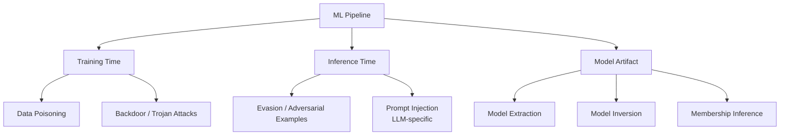
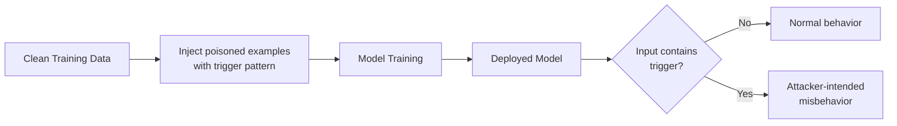

## Model Security and Adversarial Attacks

### What Model Security Addresses

ML systems introduce an attack surface that traditional software security doesn't fully cover: the model's learned decision boundary itself can be probed, manipulated, and exploited, independent of any conventional software vulnerability. An attacker doesn't need to breach infrastructure to cause harm — carefully crafted inputs or access to training data can be enough.

**Key Points**

- Attacks target different stages: training time (poisoning), inference time (evasion/adversarial examples), and the model artifact itself (extraction, inversion)
- Many attacks exploit the same property that makes deep learning powerful — high-dimensional, non-linear decision boundaries — since small, imperceptible input perturbations can cross a boundary the model wasn't robustly trained to defend
- Robustness to these attacks is a separate objective from accuracy on clean data, and improving one has often been observed to come at some cost to the other, though the size and inevitability of that trade-off remains an active research question

### Threat Taxonomy by Attack Surface

### Adversarial Examples (Evasion Attacks)

Inputs deliberately perturbed — often imperceptibly to a human — to cause a model to misclassify, while the true/intended label remains obvious to a human observer. The classic illustration is an image with added, humanly-imperceptible noise causing a classifier to confidently predict the wrong class.

#### Formal Objective

$$x_{\text{adv}} = x + \delta, \quad \text{subject to} \quad \|\delta\|_p \leq \epsilon, \quad f(x_{\text{adv}}) \neq f(x)$$

The perturbation $\delta$ is constrained by a norm bound (commonly $L_\infty$, $L_2$, or $L_0$) intended to keep the change small/imperceptible, while still flipping the model's prediction.

#### Fast Gradient Sign Method (FGSM)

One of the earliest and simplest attack methods — perturbs the input in the direction that increases loss, scaled by a fixed step size:

$$x_{\text{adv}} = x + \epsilon \cdot \text{sign}\left(\nabla_x \mathcal{L}(\theta, x, y)\right)$$

#### Projected Gradient Descent (PGD)

An iterative, stronger extension of FGSM: takes multiple small gradient steps, projecting back into the allowed perturbation region after each step, generally producing more effective adversarial examples than the single-step FGSM.

$$x_{\text{adv}}^{t+1} = \Pi_{\epsilon}\left(x_{\text{adv}}^{t} + \alpha \cdot \text{sign}\left(\nabla_x \mathcal{L}(\theta, x_{\text{adv}}^{t}, y)\right)\right)$$

#### White-Box vs. Black-Box Attacks

- **White-box**: attacker has full access to model architecture and parameters, enabling direct gradient-based attacks like FGSM/PGD
- **Black-box**: attacker can only query the model and observe outputs, requiring techniques like transferability (crafting adversarial examples on a substitute model and hoping they transfer) or query-based gradient estimation
- [Inference] Black-box attacks are generally considered harder and more query-intensive than white-box attacks, though certain transferability-based and query-efficient methods have narrowed this gap substantially in various documented settings, so black-box access should not be assumed to be a strong practical defense on its own

### Data Poisoning Attacks

The attacker manipulates training data (directly, or via a data source the model will be trained/fine-tuned on) to degrade overall performance or induce specific, targeted behavior.

#### Availability Poisoning

Aims to broadly degrade model performance by injecting mislabeled or corrupted examples, making the model less useful overall — a relatively "blunt" attack that's often easier to detect via unusual accuracy drops.

#### Targeted / Backdoor Poisoning

Aims to implant a specific behavior triggered only under particular conditions (e.g., a specific pixel pattern, phrase, or trigger), while the model behaves normally otherwise — making this class of attack significantly harder to detect through standard validation, since aggregate accuracy on clean data remains unaffected.

### Model Extraction (Model Stealing)

An attacker queries a deployed model (often through a public API) and uses the input-output pairs to train a substitute model that approximates the original — potentially stealing intellectual property or creating a surrogate for crafting further black-box attacks.

- Query budget, output granularity (full probability distribution vs. top-1 label only), and the substitute model's architecture all affect extraction fidelity
- Rate limiting, output rounding/truncation, and query pattern monitoring are common mitigations, though determined attackers can sometimes work around simple versions of these defenses

### Model Inversion and Membership Inference

Covered in depth under privacy-preserving techniques, these are also security concerns from an attack-surface perspective: model inversion attempts to reconstruct approximate training examples, and membership inference attempts to determine whether specific data was used in training — both representing information leakage through the model itself rather than through infrastructure.

### Defense Strategies

#### Adversarial Training

Explicitly including adversarial examples (often PGD-generated) in the training process, so the model learns to classify them correctly rather than only clean examples.

$$\min_\theta \; \mathbb{E}_{(x,y)}\left[\max_{\|\delta\|_p \leq \epsilon} \mathcal{L}(\theta, x+\delta, y)\right]$$

This min-max formulation — minimizing loss against the *worst-case* perturbation within the allowed budget — is the standard theoretical framing, though solving the inner maximization exactly is generally intractable, so practical adversarial training uses an approximate inner solver (commonly PGD with a bounded number of steps).

- **Strength**: currently among the most empirically robust defenses against the specific attack types included in training
- **Limitation**: robustness often doesn't generalize well to attack types or perturbation budgets not seen during training; commonly observed to reduce clean-data accuracy to some degree, and is more computationally expensive than standard training (each training step requires generating adversarial examples first)

#### Input Preprocessing / Sanitization

Techniques like input transformation (compression, smoothing, randomized resizing) attempt to disrupt adversarial perturbations before they reach the model. [Unverified] Many preprocessing-only defenses proposed in earlier literature were later shown to be circumventable by an adaptive attacker aware of the specific defense, so preprocessing alone is generally not treated as a strong standalone defense in current practice — it's more often used as one layer among several.

#### Certified Defenses

Provide a formal, provable guarantee that no perturbation within a bounded norm can change the model's prediction for a given input, rather than only empirical robustness against known attack methods. Techniques include randomized smoothing and interval bound propagation.

- **Strength**: the guarantee holds against *any* attack within the certified bound, not just the specific attacks tested against
- **Limitation**: certified robustness bounds are often more conservative (smaller guaranteed radius) than the empirical robustness observed against specific known attacks, and computing certificates can be computationally expensive, especially for larger models

#### Poisoning Defenses

- **Data provenance and validation**: tracking data sources and applying anomaly detection on training data before it's used
- **Robust training methods**: techniques designed to be less sensitive to a small fraction of corrupted training examples (e.g., robust loss functions, outlier-resistant aggregation in federated settings)
- **Trigger detection**: post-hoc analysis techniques attempting to detect whether a trained model contains a backdoor, generally an active and still-evolving area given the difficulty of the underlying detection problem

### Comparison of Attack Types

| Attack | Stage | Attacker Needs | Primary Goal |
| --- | --- | --- | --- |
| Adversarial example (evasion) | Inference | Query access (black-box) or gradients (white-box) | Cause misclassification on a specific input |
| Data poisoning | Training | Ability to inject/influence training data | Degrade performance or implant backdoor |
| Model extraction | Inference (repeated) | Query access, budget for many queries | Steal model functionality/IP |
| Model inversion | Post-training | Query or gradient access | Reconstruct training data |
| Membership inference | Post-training | Query access, often shadow models | Determine if a record was in training data |

### LLM-Specific Attack Surfaces

Large language models introduce additional attack patterns distinct from classical adversarial examples:

- **Prompt injection**: crafting input text that causes a model to disregard its intended instructions or system prompt in favor of attacker-supplied instructions embedded in the input
- **Jailbreaking**: adversarially crafted prompts intended to bypass a model's safety training/guidelines
- **Data extraction via prompting**: attempting to elicit memorized training data (which may include sensitive or copyrighted content) through carefully constructed prompts

[Inference] These LLM-specific attack surfaces are generally treated as a related but distinct research area from classical adversarial robustness (gradient-based perturbations), since the attack vector (natural language instructions) and the underlying vulnerability mechanisms differ substantially from pixel-level perturbation attacks — though both fall under the broader umbrella of model security.

### Common Pitfalls

- Evaluating robustness only against the specific attack method used during defense development, missing adaptive attacks specifically designed to circumvent that defense
- Treating high clean-data accuracy as evidence of security, when backdoor-poisoned models can maintain normal clean accuracy while harboring targeted misbehavior
- Assuming black-box deployment (no exposed model internals) is a sufficient defense, when query-based and transfer-based attacks have repeatedly demonstrated black-box vulnerability in practice
- Deploying an unpublished/untested proprietary defense without validating it against adaptive, defense-aware attackers, a pattern that has historically led to defenses being broken shortly after publication
- Conflating adversarial robustness with general model reliability — a model can be adversarially robust within a defined perturbation budget while still failing on natural distribution shift or edge cases outside that budget

**Related Topics**

- Privacy-preserving techniques (membership inference, model inversion in depth)
- Data poisoning defenses and training data provenance
- Certified robustness methods (randomized smoothing, interval bound propagation)
- LLM-specific safety and red-teaming practices
- Model monitoring for detecting anomalous query patterns (extraction attempt detection)
- Explainability methods as a tool for auditing model behavior and detecting backdoors