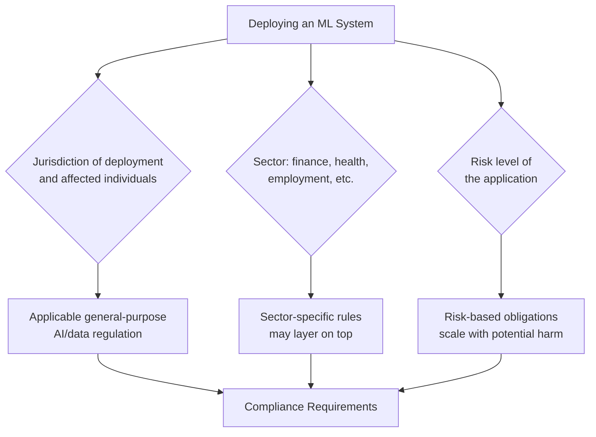
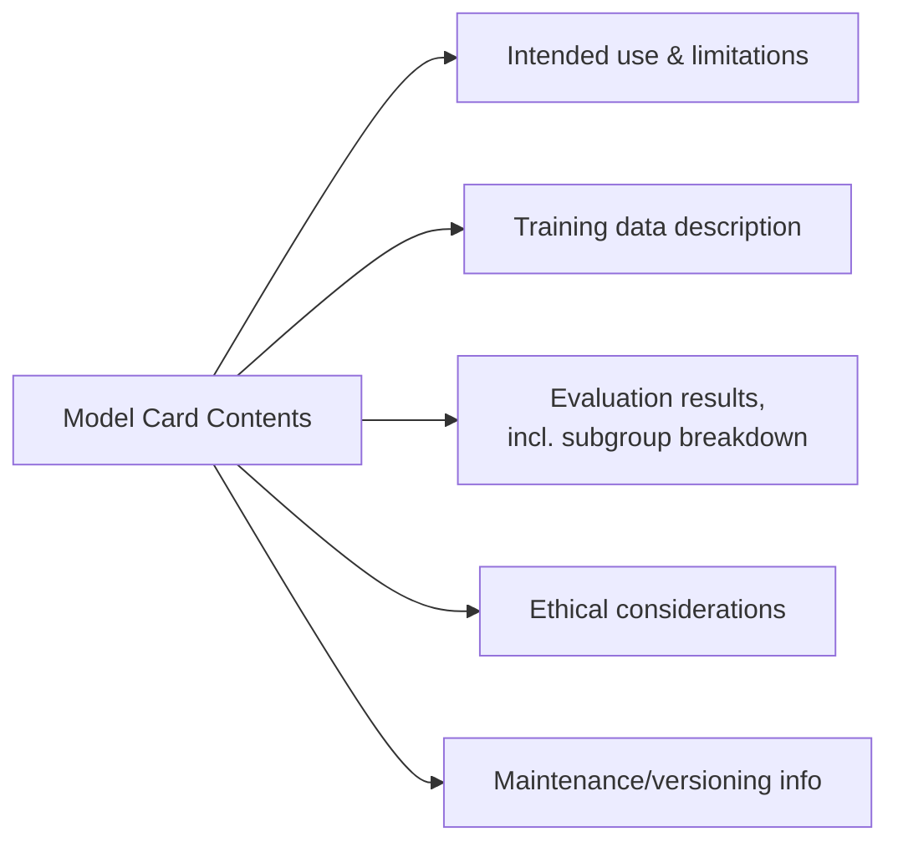

## Regulatory Considerations

### What ML Regulation Addresses

As machine learning systems increasingly make or inform consequential decisions — lending, hiring, medical diagnosis, content moderation — legal and regulatory frameworks have developed to govern how these systems can be built, deployed, and audited. Unlike the technical topics covered so far, this is fundamentally a legal and policy domain, not a purely engineering one, and requirements vary significantly by jurisdiction, industry, and use case.

**Key Points**

- Regulation in this space is fragmented and jurisdiction-specific — there is no single global standard, and requirements can differ substantially between regions and sectors
- Many frameworks focus on *risk-based* obligations, where the required compliance burden scales with the potential harm of the system's application, rather than imposing uniform rules on all ML systems
- Technical practices covered elsewhere in this material (fairness metrics, privacy-preserving techniques, monitoring, explainability) are frequently the practical *means* by which regulatory obligations get satisfied, even when a regulation itself doesn't mandate a specific technique
- [Unverified] This overview describes general categories and mechanisms that commonly appear in ML-related regulation; specific legal obligations depend on current law in the applicable jurisdiction and should be verified against authoritative legal sources or counsel rather than treated as a substitute for legal advice

### Why This Is Difficult to Cover Generically

Regulatory requirements depend on several intersecting factors: the jurisdiction(s) where a system is deployed or where affected individuals reside, the sector (finance, healthcare, employment, criminal justice each often have sector-specific rules), and the specific application's risk classification. Because this content is version-controlled to a knowledge cutoff and law changes frequently, this section focuses on recurring structural *patterns* across frameworks rather than asserting the current status of any specific law — always verify current requirements against primary legal sources for a specific jurisdiction and use case.

### Recurring Structural Patterns Across Frameworks

#### Risk-Based Tiering

Many modern AI/ML regulatory approaches classify systems by risk level (e.g., minimal, limited, high, unacceptable risk) and impose obligations proportional to that tier — a system used for entertainment recommendations typically faces lighter obligations than one used for credit decisions or medical diagnosis. High-risk classifications commonly trigger requirements around documentation, testing, human oversight, and post-market monitoring.

#### Data Protection and Privacy Law

General data protection regulation (governing collection, processing, and storage of personal data) frequently applies to ML systems because training and inference both involve processing personal data. Recurring concepts across many data protection regimes include:

- **Purpose limitation**: data collected for one purpose generally cannot be freely repurposed for unrelated model training without additional basis
- **Data minimization**: collecting and retaining only data necessary for the stated purpose
- **Rights of access, correction, and erasure**: individuals often have rights to know what data is held about them, correct it, or request deletion — the last of which raises distinct technical challenges for trained models (see "machine unlearning" below)
- **Automated decision-making provisions**: some frameworks grant individuals rights specifically around decisions made solely by automated means, such as a right to human review or an explanation

#### Sector-Specific Regulation

Certain sectors have long-standing regulatory regimes that predate modern ML but apply directly to it:

- **Financial services**: rules around credit decisioning, adverse action notices, and model risk management frequently require that automated lending/credit models be explainable and non-discriminatory to a degree that satisfies existing anti-discrimination and consumer protection law
- **Healthcare**: medical device and clinical decision-support regulation often applies to ML systems used in diagnosis or treatment recommendations, with validation and approval processes that predate but now extend to ML-based tools
- **Employment**: hiring and employment-decision tools face scrutiny under existing anti-discrimination employment law, with some jurisdictions adding ML/AI-specific disclosure or audit requirements on top

#### Transparency and Disclosure Obligations

Recurring requirements across frameworks include disclosing when an individual is interacting with or being evaluated by an automated system, and in some cases providing an explanation of the factors driving a significant automated decision — which connects directly to the explainability techniques (SHAP, LIME, counterfactual explanations) covered elsewhere in this material as practical tools for satisfying such requirements.

#### Documentation and Audit Requirements

Higher-risk applications frequently require maintained documentation of the system's design, training data characteristics, testing/validation results, and known limitations — conceptually similar to "model cards" and "datasheets for datasets," which have moved from being a research-community best practice toward being referenced as a practical compliance mechanism in some regulatory contexts.

### Comparison of Regulatory Mechanisms

| Mechanism | What It Requires | Connects To (Technical Practice) |
| --- | --- | --- |
| Risk-based tiering | Obligations scale with application risk | Risk assessment, use-case classification |
| Data protection/privacy law | Lawful basis, minimization, individual rights | Differential privacy, federated learning, data governance |
| Automated decision-making rights | Explanation, human review options | Explainability methods (SHAP, LIME) |
| Anti-discrimination provisions | Non-discriminatory outcomes | Fairness metrics and bias mitigation |
| Documentation/audit requirements | Maintained records of design and testing | Model cards, datasheets, experiment tracking |
| Sector-specific rules | Domain-appropriate validation/approval | Domain-specific evaluation protocols |

### Machine Unlearning

A distinct technical challenge motivated substantially by data-erasure rights: if an individual requests their data be deleted, and that data was used to train a model, simply deleting the raw data doesn't remove its influence from the already-trained model's parameters. Machine unlearning research addresses how to remove a specific data point's influence from a trained model without full retraining from scratch.

$$\theta_{\text{unlearned}} \approx \arg\min_\theta \; \mathcal{L}\left(\theta; D \setminus \{x_i\}\right)$$

[Unverified] Exact/provable unlearning (producing a model statistically indistinguishable from one that never saw the deleted example) is generally more expensive than approximate unlearning methods, and the maturity, guarantees, and computational cost of unlearning techniques vary substantially by method and are an active research area — practical deployments should not assume a given unlearning technique satisfies a specific legal deletion requirement without separate verification.

### Model Cards and Datasheets as Compliance Artifacts

Structured documentation formats — describing a model's intended use, training data characteristics, evaluation results (including subgroup/fairness evaluation), and known limitations — that originated as a research and transparency best practice but are increasingly referenced as a practical way to satisfy documentation-oriented regulatory obligations.

### Auditing and Impact Assessments

Some frameworks require or encourage a formal assessment process before or during deployment of higher-risk systems — commonly structured around identifying potential harms, evaluating mitigations, and documenting the assessment for accountability purposes. These assessments frequently draw directly on the technical evaluation practices covered elsewhere in this material: fairness metric computation, adversarial robustness testing, privacy risk evaluation, and monitoring plan design.

### Practical Considerations for Technical Teams

- **Regulatory requirements should inform technical design, not only be retrofitted after deployment** — e.g., if explainability will be legally required for a use case, an inherently interpretable model or an explainability pipeline should be part of the design from the start rather than bolted on later
- **Documentation discipline pays compliance dividends** — experiment tracking, model registries, and monitoring logs (covered earlier in this material) double as an audit trail if maintained consistently, which is often far cheaper than reconstructing that history after the fact when an audit or incident occurs
- **Cross-functional collaboration is typically necessary** — legal, compliance, and technical teams generally need to work together, since neither a purely legal reading nor a purely technical implementation alone reliably satisfies real-world regulatory obligations
- [Inference] Because this area evolves quickly and varies by jurisdiction, teams operating in regulated industries or across multiple jurisdictions often maintain an ongoing relationship with legal counsel specializing in this area rather than treating compliance as a one-time technical checklist, though the appropriate level of ongoing engagement depends heavily on the specific risk profile and scale of deployment

### Common Pitfalls

- Treating regulatory compliance as a final checklist applied after a model is built, rather than a design consideration from the start
- Assuming a technique that provides a *formal* guarantee (e.g., differential privacy, a fairness metric) automatically satisfies a *legal* requirement, when the two are related but not identical — legal sufficiency requires separate verification
- Underestimating jurisdictional scope — a system can be subject to a jurisdiction's rules based on where affected individuals are located, not only where the system is developed or hosted
- Neglecting documentation until an audit or incident forces reconstruction of decisions after the fact, when contemporaneous records are both easier to produce and more credible
- Treating "regulatory considerations" as static — frameworks in this space have been changing relatively rapidly, and content describing "current" requirements can become outdated faster than more stable technical material

**Related Topics**

- Fairness metrics and bias mitigation as compliance-supporting practices
- Explainability and interpretability methods (SHAP, LIME, counterfactual explanations)
- Privacy-preserving techniques and data protection law intersections
- Model cards and datasheets for datasets in depth
- Machine unlearning techniques and their guarantees
- AI governance frameworks and organizational risk management processes