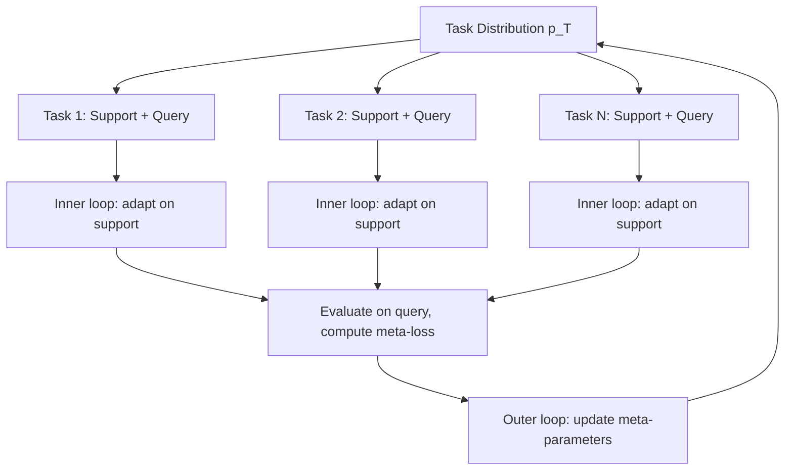
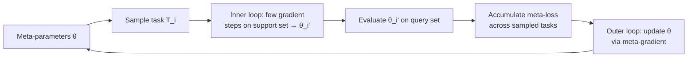

## Meta-Learning Approaches

### What Meta-Learning Addresses

Standard supervised learning trains a model to perform one task well, typically requiring substantial task-specific data. Meta-learning — often summarized as "learning to learn" — instead trains a model (or a learning procedure) across many tasks so that it can adapt quickly to a *new* task using only a small amount of data, or in some formulations, no additional training at all.

**Key Points**

- The core shift is from optimizing for performance on one task to optimizing for *fast adaptability* across a distribution of tasks
- Meta-learning operates on two nested levels: an inner loop that adapts to a specific task, and an outer loop that improves how well/quickly that adaptation happens
- Few-shot learning is the most common evaluation setting for meta-learning, but the two terms aren't strictly synonymous — few-shot learning is a problem setting, meta-learning is one family of approaches to it

### The Meta-Learning Problem Setup

#### Task Distribution

Instead of a single dataset, meta-learning assumes access to a distribution of tasks $p(\mathcal{T})$, where each task $\mathcal{T}_i$ has its own small training set (**support set**) and evaluation set (**query set**). The model is meta-trained across many sampled tasks so it generalizes not to new examples of a fixed task, but to entirely new tasks drawn from a similar distribution.

#### N-Way K-Shot Classification

The standard benchmark framing for few-shot meta-learning: each task presents $N$ classes with only $K$ labeled examples per class (the support set), and the model must classify new query examples into one of those $N$ classes. Common configurations include 5-way 1-shot and 5-way 5-shot.

$$\text{Support set size} = N \times K$$

### Families of Meta-Learning Approaches

#### Metric-Based (Metric Learning) Approaches

Learn an embedding space where examples from the same class are close together and examples from different classes are far apart, then classify new examples by comparing them to support examples in that learned space — no task-specific gradient updates needed at adaptation time.

**Prototypical Networks**: compute a "prototype" for each class as the mean embedding of its support examples, then classify query examples by nearest prototype.

$$c_k = \frac{1}{|S_k|}\sum_{(x_i,y_i) \in S_k} f_\phi(x_i), \qquad \hat{y} = \arg\min_k \; d\left(f_\phi(x_{\text{query}}), c_k\right)$$

**Matching Networks**: use an attention mechanism over the support set to weight each support example's contribution to the query's classification, rather than collapsing each class to a single prototype.

**Siamese Networks**: learn a similarity function between pairs of examples, trained so that same-class pairs score high similarity and different-class pairs score low similarity — one of the earlier metric-learning approaches to few-shot classification.

#### Optimization-Based Approaches

Learn an initialization (or an optimization procedure) specifically such that a small number of gradient steps on a new task's support set produces good performance — the inner loop is literal gradient descent, and the outer loop optimizes what that gradient descent starts from.

**Model-Agnostic Meta-Learning (MAML)**: perhaps the most influential optimization-based method. Learns initial parameters $\theta$ such that one or a few gradient steps on any new task's support set yield a model that performs well on that task's query set.

$$\theta_i' = \theta - \alpha \nabla_\theta \mathcal{L}_{\mathcal{T}_i}(\theta) \qquad \text{(inner loop, task-specific adaptation)}$$

$$\theta \leftarrow \theta - \beta \nabla_\theta \sum_{\mathcal{T}_i} \mathcal{L}_{\mathcal{T}_i}(\theta_i') \qquad \text{(outer loop, meta-update)}$$

The outer-loop gradient requires differentiating *through* the inner-loop update — a gradient of a gradient — which is computationally expensive (requiring second-order derivatives) in the original formulation.

**First-Order MAML (FOMAML) / Reptile**: approximations that avoid computing the full second-order gradient, trading some theoretical fidelity for significantly reduced computational cost. [Unverified] The empirical performance gap between first-order approximations and full MAML varies by task and has been reported as small in several benchmark settings, but this shouldn't be assumed to hold universally across all task types and architectures without direct comparison.

#### Model-Based (Black-Box) Approaches

Use an architecture with internal memory or recurrent state that directly implements the adaptation process as a forward pass — rather than adaptation being explicit gradient descent, it's whatever the network learns to do with its memory/state when conditioned on the support set.

**Memory-Augmented Neural Networks**: use external memory (e.g., an attention-addressable memory bank) that the network reads from and writes to as it processes the support set, effectively learning to "store" task-relevant information for use on the query set.

**Meta-learning with RNNs/Transformers**: the support set is processed sequentially (or via attention, in transformer-based variants) and the model's hidden state or context implicitly encodes the adapted "knowledge" needed to classify query examples, without explicit parameter updates.

### Comparison of Approach Families

| Family | Adaptation Mechanism | Adaptation Cost at Test Time | Representative Method |
| --- | --- | --- | --- |
| Metric-based | Nearest-neighbor/similarity in learned embedding space | Very low (no gradient steps) | Prototypical Networks, Matching Networks |
| Optimization-based | Explicit gradient descent from a learned initialization | Low–moderate (a few gradient steps) | MAML, Reptile |
| Model-based | Forward pass through memory/recurrent architecture | Low (single forward pass) | Memory-augmented networks, sequence models |

### In-Context Learning as a Related Phenomenon

Large language models exhibit a behavior often discussed alongside meta-learning: given a few examples of a task within the prompt itself (no gradient updates at all), the model can perform the task on new inputs. This resembles model-based meta-learning's "adapt via forward pass" property, though it emerges from large-scale pretraining on diverse data/tasks rather than an explicitly designed meta-learning objective.

[Inference] Whether in-context learning should be considered a form of meta-learning, an emergent related phenomenon, or a distinct mechanism is a matter of ongoing discussion in the literature rather than a settled classification — the mechanisms underlying it are still an active area of research, and this material should not be read as asserting a definitive resolution to that question.

### Applications

- **Few-shot image classification**: the original and most common benchmark domain for meta-learning research (e.g., Omniglot, miniImageNet benchmarks)
- **Robotics and reinforcement learning**: meta-learning an initialization or policy that adapts quickly to new environments/tasks with limited interaction data, valuable when real-world data collection (e.g., physical robot trials) is expensive
- **Hyperparameter and architecture adaptation**: meta-learning approaches have also been applied to learning good hyperparameter initialization strategies or architecture search strategies across related tasks
- **Personalization**: adapting a shared base model quickly to individual users' small amounts of data, framed as a few-shot task per user

### Practical Considerations and Limitations

- **Task distribution assumption**: meta-learning's benefit depends on the new task being drawn from a distribution similar to the meta-training tasks; performance on tasks substantially different from the meta-training distribution is not guaranteed and often degrades
- **Computational cost of meta-training**: optimization-based methods like full MAML require computing gradients through gradients, which is substantially more expensive per meta-training step than standard supervised training
- **Evaluation protocol sensitivity**: few-shot benchmark results have historically been sensitive to evaluation protocol details (exact episode sampling, backbone architecture, data augmentation), which has motivated calls in the research community for more standardized and careful comparison practices
- **Relationship to transfer learning and fine-tuning**: meta-learning and standard pretraining-then-fine-tuning both aim to leverage prior tasks for new-task efficiency, but differ in that meta-learning explicitly optimizes for fast adaptability as the training objective, rather than adaptability being an incidental property of a model trained for a single broad objective

### Common Pitfalls

- Assuming meta-learning will outperform simple transfer learning/fine-tuning by default, when the relative advantage depends heavily on task similarity, data regime, and the specific benchmark — this should be empirically verified rather than assumed
- Overfitting to the meta-training task distribution, producing a model that adapts well to tasks resembling meta-training tasks but poorly to genuinely novel ones
- Underestimating the computational cost of second-order optimization-based methods when planning meta-training infrastructure
- Conflating "few-shot learning" (a problem setting) with "meta-learning" (one family of solutions), when few-shot performance can also be achieved via other means (e.g., strong pretrained representations with simple fine-tuning)
- Not accounting for evaluation protocol differences when comparing reported few-shot benchmark results across papers

**Related Topics**

- Transfer learning and fine-tuning strategies as an alternative/complementary approach
- In-context learning mechanisms in large language models
- Few-shot benchmark datasets and evaluation protocol standardization
- Reinforcement learning applications of meta-learning (meta-RL)
- Neural architecture search and its relationship to meta-learning
- Continual/lifelong learning and its relationship to fast task adaptation