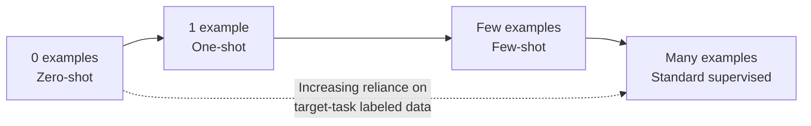
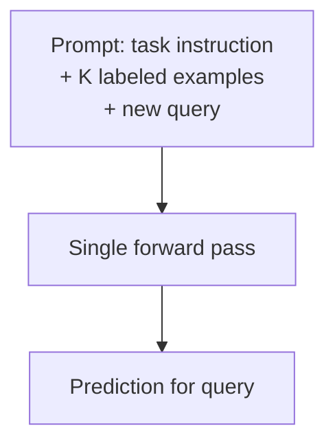

## Few-Shot Learning

### Scope of This Topic

Few-shot learning is a **problem setting**: given only a handful of labeled examples per class (or per task), produce a model that generalizes well. Meta-learning is one major family of *solutions* to this problem, but not the only one — this topic covers the setting itself and the full solution landscape, including non-meta-learning approaches like transfer learning and pretrained-representation methods.

**Key Points**

- The defining constraint is data scarcity at the target-task level — typically 1 to a few dozen labeled examples per class, far below what standard supervised learning needs
- Solutions broadly split into two strategies: learn a good adaptation *procedure* in advance (meta-learning), or learn a good *representation* in advance and adapt it cheaply (transfer learning, pretraining-based approaches)
- Modern practice increasingly favors large pretrained models with lightweight adaptation over purpose-built meta-learning architectures, particularly outside academic benchmark settings

### Formal Problem Setting

#### N-Way K-Shot Episodes

The standard evaluation framing: a task ("episode") presents $N$ classes with $K$ labeled examples each (the **support set**), and the model must classify unlabeled **query set** examples into one of the $N$ classes.

$$\text{Support set size} = N \times K, \qquad \text{typically } K \in \{1, 5\}$$

#### Zero-Shot, One-Shot, Few-Shot: A Spectrum

| Setting | Labeled Examples per Class | Typical Mechanism |
| --- | --- | --- |
| Zero-shot | 0 | Rely entirely on prior knowledge / auxiliary information (e.g., class descriptions, pretrained semantic knowledge) |
| One-shot | 1 | Metric-based comparison or strong prior representation |
| Few-shot | ~2–20 | Metric-based, optimization-based, or lightweight fine-tuning |
| Low-data regime (not "few-shot" by convention) | Dozens–hundreds | Standard fine-tuning with regularization |

### Solution Strategy 1: Meta-Learning

Covered in depth separately — metric-based (Prototypical Networks, Matching Networks), optimization-based (MAML, Reptile), and model-based (memory-augmented networks) approaches all explicitly train across a distribution of tasks so the resulting model or procedure adapts efficiently to a new few-shot task.

### Solution Strategy 2: Transfer Learning and Pretrained Representations

Rather than meta-training across many small tasks, this strategy pretrains a model on a large, general-purpose dataset (not structured as few-shot episodes at all), then adapts the resulting representation to the few-shot target task.

#### Feature Extraction (Frozen Backbone)

The pretrained model's earlier layers are frozen and used purely as a feature extractor; only a small classifier head (sometimes as simple as a nearest-centroid or logistic regression) is fit on the few available labeled examples.

$$\hat{y} = g_\psi\left(f_\theta(x)\right), \quad \theta \text{ frozen}, \quad \psi \text{ fit on few-shot data}$$

- **Strength**: minimal risk of overfitting the few-shot data, since only a small number of parameters ($\psi$) are actually being learned on it
- **Limitation**: performance is bounded by how well the frozen representation already separates the target classes — if the pretraining distribution is too dissimilar from the target task, no amount of head-fitting compensates

#### Fine-Tuning

Some or all of the pretrained model's parameters are updated on the few-shot data, typically with a small learning rate and often only the later layers, to avoid catastrophically overfitting or destroying useful pretrained representations with so little data.

[Inference] Full fine-tuning on genuinely tiny datasets (single-digit examples per class) is generally considered more overfitting-prone than frozen-feature or lightweight-adapter approaches, which is part of why techniques like linear probing or parameter-efficient fine-tuning are commonly preferred in the lowest-data regimes — though the right choice depends on how similar the target task is to the pretraining distribution and how many parameters are actually being updated.

#### Parameter-Efficient Fine-Tuning (PEFT)

Techniques like adapters, LoRA (low-rank adaptation), or prompt/prefix tuning update only a small number of additional or restructured parameters rather than the full model, reducing overfitting risk on small target datasets while retaining most of the pretrained model's knowledge.

$$W' = W + \Delta W, \qquad \Delta W = BA, \quad B \in \mathbb{R}^{d \times r}, A \in \mathbb{R}^{r \times d}, \quad r \ll d$$

### Solution Strategy 3: In-Context Learning (Prompting)

For large language models specifically, few-shot examples can be placed directly in the input prompt, with no gradient-based parameter updates at all — the model conditions its output on the provided examples via its forward pass alone.

- **Strength**: no training/fine-tuning infrastructure needed at all; extremely fast to apply to a new task
- **Limitation**: performance is highly sensitive to example selection, ordering, and prompt formatting; effectiveness depends heavily on the base model's pretraining and scale, and doesn't persist as a reusable parameter update — every new session requires the examples again unless separately incorporated into the model or a retrieval system

### Solution Strategy 4: Data Augmentation and Synthetic Data

Rather than changing the learning algorithm, this strategy expands the effective size of the few-shot dataset itself:

- **Traditional augmentation**: task-appropriate transformations (image rotation/cropping, text paraphrasing) applied to the few available examples to synthesize additional training variety
- **Generative augmentation**: using a generative model to synthesize additional plausible examples of the target classes, which introduces its own risk of the generative model's biases or errors propagating into the few-shot training set
- **Hallucination/feature-space augmentation**: generating synthetic examples directly in a learned feature space rather than raw input space, sometimes combined with meta-learning approaches

### Comparison of Strategies

| Strategy | Requires Meta-Training | Adaptation Cost | Best Suited When |
| --- | --- | --- | --- |
| Meta-learning | Yes (across task distribution) | Low at test time | Many related tasks available for meta-training |
| Frozen-feature transfer | No | Very low (fit small head) | Strong general-purpose pretrained representation available |
| Fine-tuning / PEFT | No | Low–moderate | Some capacity to update parameters without overfitting |
| In-context learning | No | None (no parameter updates) | Large pretrained LLM available, task expressible in prompt |
| Data augmentation | Optional (combinable with others) | Depends on paired strategy | Domain has well-understood valid transformations |

### Evaluation Considerations Specific to Few-Shot Settings

#### High Variance Across Episodes

Because each evaluation episode uses only a handful of examples, performance can vary substantially depending on which specific examples were sampled into the support set — reported results are typically averaged over many randomly sampled episodes, and single-episode performance should not be treated as representative.

#### Benchmark Sensitivity

[Unverified] Reported few-shot results have historically been sensitive to details like backbone architecture, exact augmentation pipeline, and episode sampling protocol — this has motivated calls in the research community for more standardized comparison practices, and cross-paper comparisons should be treated cautiously unless methodology is closely matched.

#### Domain Shift Between Pretraining and Target Task

A recurring practical concern for both meta-learning and transfer-learning strategies: few-shot performance tends to degrade when the target task's data distribution differs substantially from what the model was pretrained/meta-trained on, since there's too little target-task data to compensate for a poor starting representation.

<svg xmlns="http://www.w3.org/2000/svg" viewBox="0 0 850 280">
\<style\>
.box { fill: #f5f5f5; stroke: #333; stroke-width: 1.5; }
.accent { fill: #e8eef7; stroke: #2c5aa0; stroke-width: 1.5; }
.warn { fill: #fbe9e7; stroke: #b71c1c; stroke-width: 1.5; }
.label { font-family: sans-serif; font-size: 13px; fill: #222; }
.title { font-family: sans-serif; font-size: 14px; font-weight: bold; fill: #111; }
\</style\>
<text x="220" y="24" class="title">Domain Similarity and Few-Shot Performance (svg_diagram)</text>
<rect x="40" y="60" width="230" height="70" class="accent" rx="4" />
<text x="55" y="88" class="label">Target task similar to</text>
<text x="55" y="108" class="label">pretraining distribution</text>
<rect x="310" y="60" width="230" height="70" class="box" rx="4" />
<text x="325" y="88" class="label">Moderate domain</text>
<text x="325" y="108" class="label">shift</text>
<rect x="580" y="60" width="230" height="70" class="warn" rx="4" />
<text x="595" y="88" class="label">Large domain shift</text>
<text x="595" y="108" class="label">from pretraining</text>

<text x="55" y="165" class="label">Few-shot adaptation:</text>

<text x="55" y="185" class="label">generally reliable</text>

<text x="325" y="165" class="label">Few-shot adaptation:</text>

<text x="325" y="185" class="label">degraded, more variable</text>

<text x="595" y="165" class="label">Few-shot adaptation:</text>

<text x="595" y="185" class="label">often insufficient alone</text>

<text x="40" y="240" class="label">Directionality is a general tendency observed across many studies, not a guaranteed rule for every model/task pair.</text>

</svg>

### Common Pitfalls

- Assuming a meta-learning-specific architecture is necessary, when a strong pretrained model with a simple frozen-feature classifier often matches or exceeds specialized meta-learning methods in many practical settings
- Evaluating on too few episodes, producing unreliable performance estimates given the inherently high variance of few-shot evaluation
- Applying standard fine-tuning learning rates/schedules (tuned for large datasets) directly to few-shot data, often leading to rapid overfitting
- Ignoring domain shift between the pretraining/meta-training distribution and the actual target task when selecting a base model or method
- Treating in-context learning results as a fixed capability rather than something sensitive to prompt design, example selection, and ordering

**Related Topics**

- Meta-learning approaches in depth (metric-based, optimization-based, model-based)
- Transfer learning and pretraining strategies more broadly
- Parameter-efficient fine-tuning methods (LoRA, adapters, prompt tuning)
- In-context learning mechanisms in large language models
- Data augmentation techniques by domain (vision, text, tabular)
- Zero-shot learning and its reliance on auxiliary semantic information